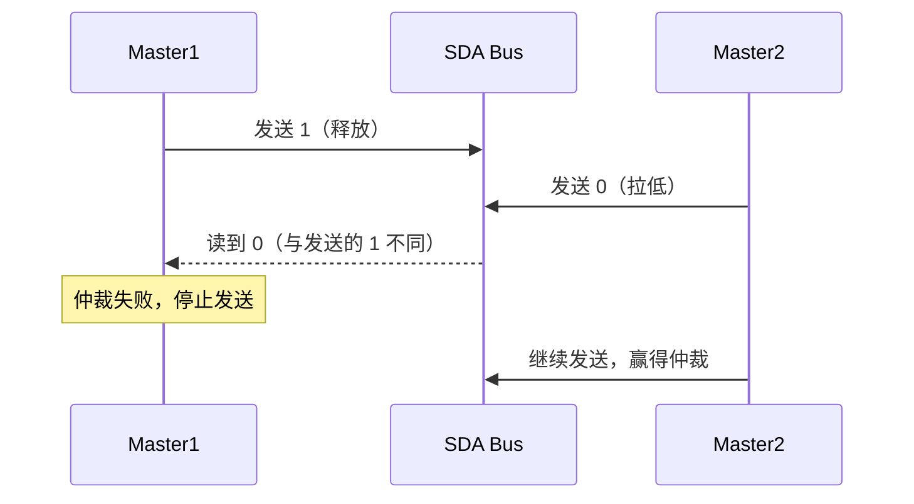

# I2C 基础认知与物理层

<span class="badge-b">[B]</span> <span class="badge-i">[I]</span>

---

### 为什么需要 I2C

嵌入式系统中，<span class="red">传感器、EEPROM、RTC</span> 等外设数量动辄十几个。<br>
如果每个外设都用独立的数据+时钟线连接主控，引脚资源很快耗尽。<br>
SPI 虽快但每条从设备独占一条 CS 线，布线复杂。<br>

I2C（Inter-Integrated Circuit，集成电路互连总线）用 **两条线** 连接 **多个设备**，<br>
节省引脚、简化 PCB 走线，是低速外设通信的首选方案。<br>

类比：会议室举手发言——<br>
会议室里只有一个话筒（SDA），所有人共用；<br>
主持人（主设备）点名，参会者（从设备）举手回应，秩序井然。<br>
没有话筒系统时，每两人对话需要一条专线（点对点），布线爆炸；<br>
有了话筒系统，所有人共用一条线，按需发言。<br>

---

### 两线架构：SDA 与 SCL

| 信号线 | 全称 | 方向 | 作用 |
|--------|------|------|------|
| SDA | Serial Data | 双向 | 传输数据 |
| SCL | Serial Clock | 主→从 | 提供同步时钟 |

<span class="green">开漏输出（Open-Drain）</span>是 I2C 的核心电气机制。<br>
设备只能将线拉低，不能主动拉高；高电平靠外部上拉电阻实现。<br>
这种设计让多设备可以安全共用一条线——任何设备拉低，整条线就是低。<br>

与推挽输出（Push-Pull）对比：推挽是 CMOS 驱动的典型方式，<br>
输出高时 PMOS 导通，输出低时 NMOS 导通，驱动能力强，<br>
但两个推挽输出若电平相反会直接短路。开漏避免了这一风险。<br>

```c
// 开漏输出等效电路示意（伪代码）
void sda_write(uint8_t bit) {
    if (bit) {
        GPIO_SetMode(SDA, INPUT);      // 释放总线，由上拉电阻拉高
    } else {
        GPIO_SetMode(SDA, OUTPUT_OD);  // 开漏拉低
        GPIO_Write(SDA, 0);
    }
}
```

<span class="blue">关键认知：开漏 + 上拉 = 天然的多设备"线与"逻辑。
</span><br>

---

### 上拉电阻计算与线与逻辑

上拉电阻取值直接影响信号完整性和功耗。<br>
阻值太小 → 上升沿过陡、总线电流大；阻值太大 → 上升沿过慢、达不到 VIH。<br>

计算公式（经验法则）：<br>
Rmax = tr / (0.8473 × Cb)，Rmin = (VDD − VOLmax) / IOL<br>
其中 tr 是允许的最大上升时间，Cb 是总线电容，IOL 是灌电流能力。<br>

典型取值：

| 速度模式 | 典型 Rp | 总线电容上限 | 上升时间要求 |
|----------|---------|--------------|--------------|
| Standard 100kHz | 4.7kΩ | 400pF | 1000ns |
| Fast 400kHz | 1.5kΩ~2.2kΩ | 400pF | 300ns |
| Fast+ 1MHz | 1kΩ | 100pF | 120ns |
| HS 3.4MHz | 外部电流源 | 100pF | 40ns |

实际工程中，总线电容 Cb 包含导线电容（约 1pF/cm）、焊盘电容、<br>
设备引脚电容（通常 10~50pF/引脚）。一条总线上挂 8 个设备，<br>
PCB 走线 20cm，Cb 轻松达到 200~300pF。<br>

<span class="red">线与逻辑（Wired-AND）</span>是 I2C 仲裁的基础：<br>
多主设备同时驱动总线时，只要有一个设备输出 0，总线就是 0。<br>
发送方每发一位都回读总线，若读到与自己发送的不一致，即丢失仲裁。<br>



<span class="blue">易错点：线与逻辑意味着总线永远取所有设备输出的"与"结果，<br>
因此不能有一个设备推挽输出高电平，否则与开漏拉低者冲突。</span><br>

---

### 速度模式对比

I2C 经历了多次速率升级，不同模式对硬件要求递增：<br>

| 模式 | 速率 | 应用年代 | 关键要求 |
|------|------|----------|----------|
| Standard-mode (Sm) | 100 kbit/s | 1982 | 基础，所有设备必须支持 |
| Fast-mode (Fm) | 400 kbit/s | 1992 | 主流，大多数传感器 |
| Fast-mode Plus (Fm+) | 1 Mbit/s | 2006 | 需要更小的上拉电阻 |
| High-speed mode (Hs) | 3.4 Mbit/s | 2000 | 电流源上拉、专用协议 |
| Ultra Fast-mode (UFm) | 5 Mbit/s | 2012 | 推挽输出、单向传输 |

<span class="blue">选型提示：多数传感器支持 400kHz，1MHz 需要确认从设备手册。<br>
3.4MHz 的 Hs 模式需要主设备发送 Hs 主机码切换协议，极少用于通用传感器。</span><br>

Hs 模式的特殊之处在于：进入 Hs 前需要在 Fm 速率下发送 8 位的 Hs 主机码（0000 1XXX），<br>
然后切换到电流源上拉驱动，SDA 和 SCL 的上升时间被大幅压缩。<br>
退出 Hs 时通过 STOP 条件回到 Fm 模式。<br>

---

### 与 SPI/UART 的选型对比

| 维度 | I2C | SPI | UART |
|------|-----|-----|------|
| 信号线 | 2根（SDA+SCL） | 4根+（SCK+MOSI+MISO+nCS） | 2根（TX+RX） |
| 速率 | ~3.4 Mbps | ~50+ Mbps | ~3 Mbps |
| 拓扑 | 多主多从 | 单主多从 | 点对点 |
| 寻址 | 7/10位地址 | 片选线 | 无 |
| 全双工 | 否（半双工） | 是 | 是 |
| 硬件复杂度 | 简单（开漏+上拉） | 中等（推挽+时序） | 简单 |
| 流控 | 无（靠ACK/clock stretch） | 无 | RTS/CTS 可选 |
| 典型场景 | 传感器、EEPROM、RTC | Flash、显示屏、ADC | 调试串口、GPS |

<span class="red">选型决策</span>：引脚紧张、多从设备、低速 → I2C；<br>
带宽优先、大数据量、点对点 → SPI；<br>
远距离、异步通信、调试口 → UART。<br>

如果系统中既有 I2C 又有 SPI 外设，<br>
通常把需要频繁中断上报数据的传感器放 I2C（节省 CS 线），<br>
把需要高速流式传输的 Flash/显示屏放 SPI。<br>

---

### 电气特性容限

I2C 总线在不同电压域下兼容，容限定义如下：<br>

| 参数 | 最小值 | 最大值 | 说明 |
|------|--------|--------|------|
| VIL（输入低电平） | -0.5V | 0.3×VDD | 低于此值被识别为 0 |
| VIH（输入高电平） | 0.7×VDD | VDD+0.5V | 高于此值被识别为 1 |
| VOL（输出低电平） | - | 0.4V | IOL=3mA 时 |
| IOL（输出灌电流） | 3mA (Sm/Fm) | 20mA (Fm+) | 驱动能力 |
| 总线电容 Cb | - | 400pF | 影响上升时间 |
| 噪声容限 | 0.1×VDD | - | 高低电平阈值间距 |

<span class="blue">易错点：3.3V 主控接 5V 从设备时，若从设备的 VIL 为 0.3×5V=1.5V，<br>
主控输出 3.3V 高电平足够；但反接可能有问题。</span><br>

电压转换方案：<br>
- 单向：电阻分压（3.3V→5V 不需要，5V→3.3V 用分压）<br>
- 双向：专用电平转换芯片（PCA9306、TXS0108E）或 MOSFET 方案<br>

<span class="purple">扩展阅读：NXP 的 AN10441 详细论述了不同电压域 I2C 总线的电平转换设计。</span><br>

---

**学习路径提示**：<br>
- <span class="badge-b">[B]</span> 读者：理解 I2C = "两根线连多个设备"，开漏+上拉是它的灵魂。<br>
- <span class="badge-i">[I]</span> 读者：关注速度与上拉电阻的匹配关系，以及跨电压域兼容性。
