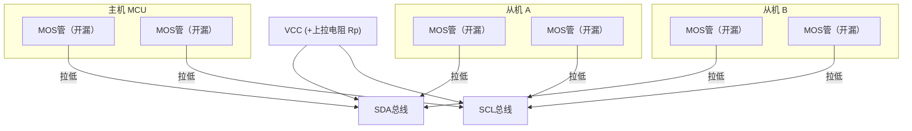
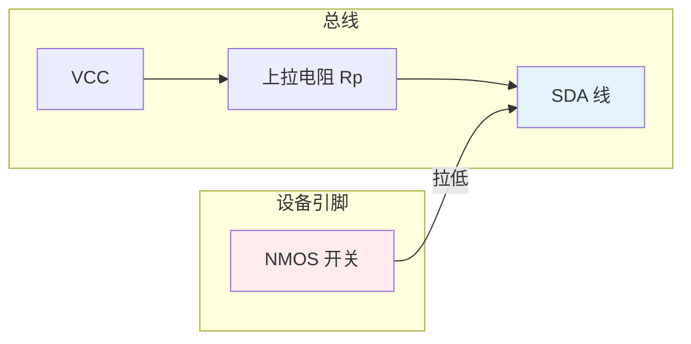

# I2C是什么——基础定义与演进脉络

---

## 核心定义

<span class="red">I2C（Inter-Integrated Circuit）</span> 是 Philips 于 1982 年推出的**同步串行总线协议**，采用**两线开漏架构**，通过 SDA（数据线）和 SCL（时钟线）实现多主多从通信。

<br>

### 两线信号定义

| 信号名 | 全称 | 方向 | 功能一句话 |
|--------|------|------|-----------|
| SDA | Serial Data | 双向 | 数据收发，开漏驱动 |
| SCL | Serial Clock | 双向 | 同步时钟，主机产生 |

<br>



<br>

<span class="blue">开漏驱动的本质：所有设备的 SDA/SCL 引脚内部都是开漏 MOS 管，只能拉低或释放。总线高电平由上拉电阻提供，低电平由任一设备拉低决定。这实现了**线与（Wired-AND）**逻辑——所有设备输出的 AND 结果呈现在总线上。</span>

<br>

---

## 与 SPI 的核心差异

<span class="red">I2C 和 SPI 是嵌入式系统中两种最基础的串行总线</span>，理解它们的差异是正确选型的前提。

<br>

| 维度 | I2C | SPI |
|------|-----|-----|
| 线数 | **2（SDA + SCL）** | 4（SCK + MOSI + MISO + CS） |
| 通信方式 | **半双工**（SDA 分时收发） | 全双工（MOSI/MISO 同时收发） |
| 设备选择 | **地址仲裁**（7/10-bit） | 片选线 CS 直接选中 |
| 驱动方式 | **开漏输出 + 外部上拉** | 推挽输出，无需上拉 |
| 速率等级 | **100K/400K/1Mbps** | 数 Mbps 至百 Mbps |
| 拓扑 | **多主多从总线** | 一主多从星型 |
| 应答机制 | **每字节 ACK/NACK** | 无硬件 ACK |
| 标准维护 | **NXP（原 Philips）** | 无官方标准组织 |

<br>

<span class="blue">类比：I2C 如同"公交车系统"——所有乘客（设备）共用同一条线路（SDA），通过报站（地址）区分目的地，司机（主机）统一调度；SPI 如同"专线出租车"——每辆出租车独占一条道路（CS 专线），双向同时行驶（全双工），速度快但道路多。</span>

<br>

<span class="blue">关键差异：I2C 用 2 根线解决了多设备互联问题，代价是速率受限（开漏 RC 延迟）；SPI 用 4 根线换取全双工高速，但无法直接多主仲裁。I2C 的 ACK 机制和地址模型使它在传感器网络中不可替代。</span>

<br>

---

## 诞生的历史背景

### <span class="orange"><strong>1. 为什么 Philips 需要 I2C：电视机的内部互联困境</strong></span>

1980 年代的电视机内部有 100 多个芯片需要互联：调谐器、音量控制、频道存储、遥控器解码等。当时的解决方案是并行总线或点对点连线。

<br>

并行总线的问题：

- 8-bit 数据 + 地址 + 控制 = 20+ 根线
- PCB 走线密集，手工焊接良率低
- 引脚有限的消费级芯片无法承受

<br>

Philips 的电视工程师 <span class="green">Alberto Ciribini</span> 和 <span class="green">Wouter van der Bussche</span> 在 1982 年提出 I2C：用 2 根线替代 20 根线。

<br>

I2C 的设计哲学极其简洁：

- **开漏驱动**：所有设备只拉低不推高，天然实现线与仲裁
- **同步时钟**：SCL 统一节拍，无需波特率协商
- **地址模型**：7-bit 地址区分 128 个设备，无需额外片选线
- **应答机制**：每字节后 ACK 确认，保证传输可靠性

<br>

### <span class="orange"><strong>2. 为什么 Motorola 没有选择 I2C：SPI 的竞争路线</strong></span>

Motorola 在同期设计 68HC11 时选择了自研 SPI。两条路线的根本分歧在于**目标场景**：

<br>

- I2C 面向"通用控制总线"——多设备、低速、省引脚、即插即用
- SPI 面向"高速数据总线"——点对点、高速、协议极简、硬件简单

<br>

Philips 的取舍被历史验证：I2C 在传感器网络中统治地位稳固，SPI 在 Flash 存储场景中不可替代。两者不是替代关系，而是互补关系。

<br>

### <span class="orange"><strong>3. 演进里程碑</strong></span>

| 年代 | 里程碑 | 意义 |
|------|--------|------|
| 1982 | Philips 定义 I2C | 两线事实标准诞生，原始速率 100kHz |
| 1992 | I2C Fast-mode | 速率提升至 400kHz，满足更多传感器需求 |
| 2007 | I2C FM+ | 速率提升至 1MHz，上拉驱动能力增强 |
| 2012 | I2C 10-bit 地址扩展 | 解决 7-bit 地址池耗尽问题 |
| 2016 | MIPI I3C 发布 | I2C 的现代化继任者，向后兼容 |
| 2020+ | I3C 生态成熟 | 手机传感器阵列全面转向 I3C |

<br>

<span class="blue">历史结论：I2C 的生命力来自"极简"——2 根线、开漏驱动、地址模型，这些设计在 40 年后的传感器网络中仍然是最佳平衡。但 1MHz 的速率上限和静态上拉功耗，也催生了 I3C 的变革需求。</span>

<br>

---

## 电气层：开漏驱动与上拉电阻

### <span class="orange"><strong>1. 开漏驱动的物理原理</strong></span>

<span class="red">开漏（Open-Drain）</span>是 I2C 最核心的电气特征。

<br>



<br>

开漏驱动的两种状态：

- **输出 0**：NMOS 导通，将 SDA 拉到地（~0V）
- **输出 1**：NMOS 截止，释放 SDA，由上拉电阻 Rp 拉到 VCC

<br>

<span class="blue">关键特性：多个设备的 NMOS 并联时，只要有一个导通，总线就是低电平。这正是"线与"的物理基础，也是多主仲裁的物理前提。</span>

<br>

### <span class="orange"><strong>2. 上拉电阻的精确计算</strong></span>

上拉电阻不是随意选择的，它直接决定总线的速度和功耗。

<br>

**I2C 电气参数表（标准模式/快速模式/FM+）：**

| 参数 | 标准模式 | 快速模式 | FM+ | 单位 |
|------|---------|---------|-----|------|
| 最高速率 | 100 | 400 | 1000 | kHz |
| 最大总线电容 Cb | 400 | 400 | 550 | pF |
| 上升时间 tr(max) | 1000 | 300 | 120 | ns |
| 下降时间 tf(max) | 300 | 300 | 120 | ns |
| 低电平输出电流 IOL | 3 | 3 | 20 | mA |
| 低电平输出电压 VOL(max) | 0.4 | 0.4 | 0.4 | V |
| 高电平输入电压 VIH(min) | 0.7VCC | 0.7VCC | 0.7VCC | V |

<br>

**上拉电阻范围计算：**

```
Rp(min) = (VCC - VOL(max)) / IOL
        = (3.3V - 0.4V) / 3mA
        ≈ 970Ω

Rp(max) = tr(max) / (0.8473 × Cb)
        = 300ns / (0.8473 × 400pF)    /* 快速模式 */
        ≈ 885Ω
```

<br>

<span class="blue">实际工程中，快速模式常用 <span class="red">1.5kΩ ~ 4.7kΩ</span>，FM+ 因 IOL 提升至 20mA，可用 <span class="red">0.5kΩ ~ 2kΩ</span>。总线电容越大（设备越多、走线越长），Rp 需越小以维持上升时间。</span>

<br>

---

## 速率模式与兼容性

### <span class="orange"><strong>1. 三种标准速率模式</strong></span>

| 模式 | 速率 | 应用场景 | 上拉电阻典型值 |
|------|------|---------|--------------|
| Standard-mode (SM) | 100 kHz | EEPROM、RTC、低速传感器 | 4.7kΩ ~ 10kΩ |
| Fast-mode (FM) | 400 kHz | 温度传感器、加速度计 | 1.5kΩ ~ 4.7kΩ |
| Fast-mode Plus (FM+) | 1 MHz | 高速 ADC、OLED 控制器 | 0.5kΩ ~ 2kΩ |

<br>

<span class="blue">速率不是越快越好。FM+ 需要更强的驱动能力和更小的总线电容，在高速模式下走线长度和设备数量都受限。标准模式的 100kHz 足以满足大多数温度/压力传感器的刷新需求。</span>

<br>

### <span class="orange"><strong>2. 总线电容与走线长度估算</strong></span>

```
总线电容 = 设备输入电容之和 + 走线电容 + 焊盘/过孔电容

典型值：
- 单个设备输入电容：~10pF
- PCB 走线：~2pF/cm
- 400pF 上限 → 理论最大走线长度 ≈ 200cm（无设备时）
- 实际工程中：10 个设备 + 10cm 走线 ≈ 120pF，安全余量充足
```

<br>

---

## 本章小结

<br>

| 概念 | 一句话总结 |
|------|-----------|
| I2C | Philips 1982 年两线同步串行总线，SDA+SCL，开漏驱动 |
| 开漏驱动 | 只能拉低不能推高，多个设备并联实现线与逻辑 |
| 上拉电阻 | Rp(min) 由 IOL 决定，Rp(max) 由 tr 和 Cb 决定 |
| 标准模式 | 100kHz，4.7kΩ~10kΩ，总线电容≤400pF |
| 快速模式 | 400kHz，1.5kΩ~4.7kΩ，tr≤300ns |
| FM+ | 1MHz，0.5kΩ~2kΩ，IOL 提升至 20mA |
| 7-bit 地址 | 0x03~0x77 可用，0x00 广播，0x78~0x7F 10-bit 标志 |
| 多主多从 | 同一总线可挂多个 Master 和最多 127 个 Slave |
| 1982 起源 | 电视机内部芯片互联的降本方案 |
| 2016 继任 | MIPI I3C 向后兼容，速率提升至 12.5MHz |

<br>

---

## 练习

1. 某 I2C 总线挂 8 个设备（每个 Ci=10pF），PCB 走线 15cm（2pF/cm），总线电容是多少？若 VCC=3.3V、IOL=3mA，计算 Rp 的取值范围（快速模式 400kHz，tr≤300ns）。

2. 为什么 I2C 使用开漏驱动而不是推挽驱动？如果两个设备同时输出"高"会怎样？

3. 对比 I2C 和 SPI 在"GPIO 极度受限（只剩 3 根线）"场景下的选型优劣。从引脚数、速率、多设备支持三个维度分析。
