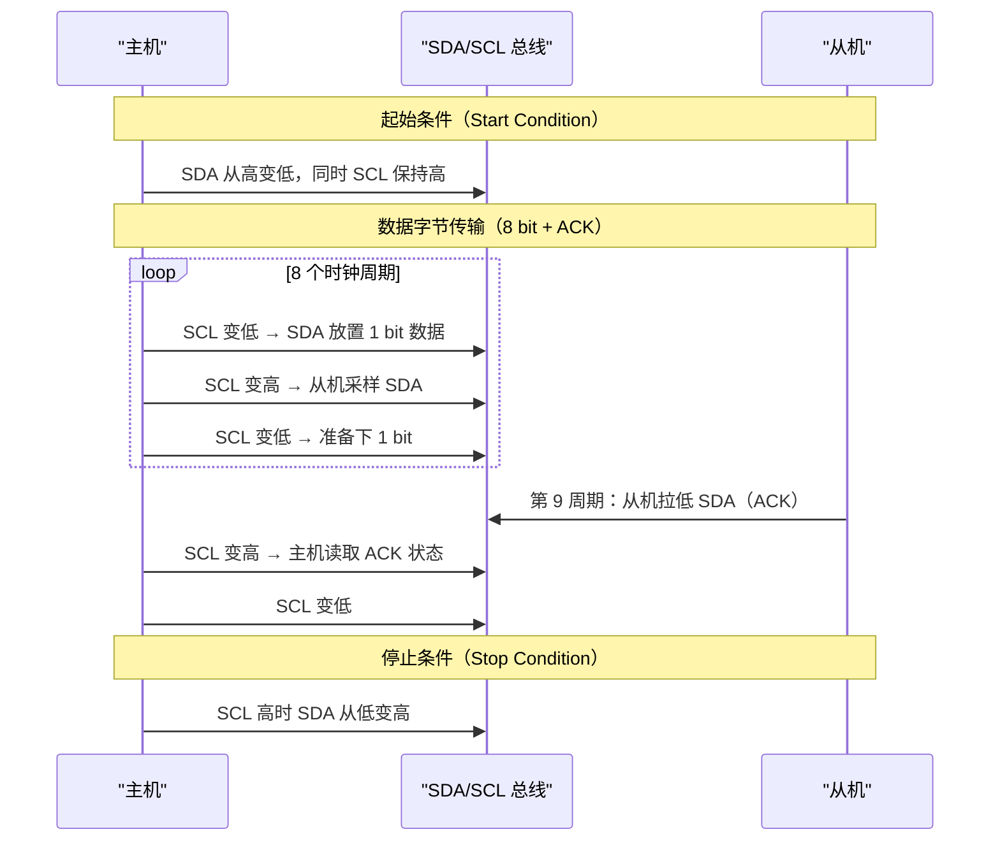
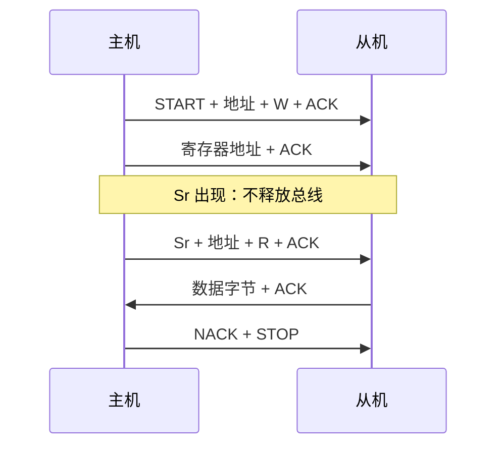
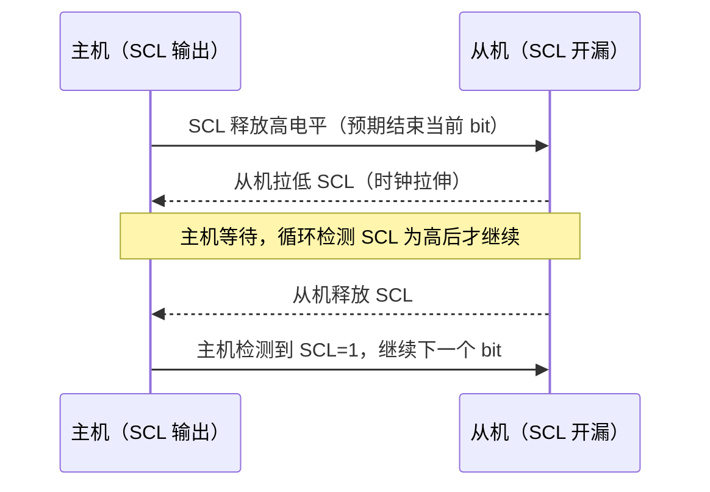

# I2C怎么工作——时序、起始停止与ACK机制

---

## 核心时序模型

<span class="red">I2C 时序</span> 由 5 种核心信号状态构成：起始条件（S）、数据位传输、ACK/NACK、重复起始（Sr）、停止条件（P）。所有状态都围绕 SCL 的高低电平周期展开。

<br>



<br>

<span class="blue">类比：I2C 时序如同"交响乐团指挥的节拍"——SCL 是指挥棒（节拍），SDA 是乐谱（数据）。每个音符（bit）必须在指挥棒下拍时（SCL 高）保持稳定，不能在挥棒过程中（SCL 低到高的跳变期间）更换音符。</span>

<br>

---

## 起始条件与停止条件：总线的边界标记

### <span class="orange"><strong>1. 起始条件（S）：主机夺取总线</strong></span>

<span class="red">起始条件</span> 是每次 I2C 传输的唯一入口。

<br>

**电气定义：**

```
SCL 为高电平期间，SDA 从高电平跳变为低电平

     SDA: ──────┐     └────────────────────────
               │     │
     SCL: ─────┼─────┼─────────────────────────
               │     │
              SCL=1  SDA 下降沿 = 起始
```

<br>

**关键规则：**

- 起始条件只能在总线空闲时发起（SCL 和 SDA 均为高）
- 起始条件一旦产生，所有从机进入"地址监听"状态
- 多主场景下，起始条件是仲裁的起点

<br>

### <span class="orange"><strong>2. 停止条件（P）：主机释放总线</strong></span>

<span class="red">停止条件</span> 是每次 I2C 传输的终点。

<br>

**电气定义：**

```
SCL 为高电平期间，SDA 从低电平跳变为高电平

     SDA: ──────────────┐     └───────────────
                       │     │
     SCL: ──────────────┼─────┼───────────────
                       │     │
                      SCL=1  SDA 上升沿 = 停止
```

<br>

**关键规则：**

- 停止条件释放总线，从机返回空闲状态
- 多主场景下，停止条件表示当前主机已放弃总线占有权
- 停止条件后至少 4.7μs（标准模式）或 1.3μs（快速模式）的总线空闲时间，才能发起新的起始

<br>

### <span class="orange"><strong>3. 重复起始（Sr）：不释放总线的方向切换</strong></span>

<span class="red">重复起始（Repeated Start）</span> 时序上与起始条件完全相同，但它出现在一次传输的中间而非开头。

<br>



<br>

**重复起始的核心价值：**

- 在读操作前改变传输方向，而不释放总线
- 避免其他主机在 STOP→START 间隙抢占总线
- 是"写寄存器地址 → 读数据"组合传输的必备机制

<br>

<span class="blue">没有重复起始的代价：写地址后必须 STOP，再重新 START 读。这期间总线空闲，多主场景下可能被其他主机抢占，导致读的不是预期的寄存器。</span>

<br>

---

## 数据位传输：SCL 高期间 SDA 必须稳定

### <span class="orange"><strong>1. 位采样的黄金法则</strong></span>

I2C 数据传输的时序铁律：

<br>

- **SCL 为低时**：SDA 可以变化（准备下一位数据）
- **SCL 为高时**：SDA 必须稳定（从机采样当前位）
- **SCL 高时 SDA 变化**：被解释为起始或停止条件，不是数据

<br>

**一个字节的完整传输：**

```
     SDA: ═══D7══D6══D5══D4══D3══D2══D1══D0══ACK══
     SCL: ─┐  ┌──┐  ┌──┐  ┌──┐  ┌──┐  ┌──┐  ┌──┐  ┌──┐  ┌──┐
           └──┘  └──┘  └──┘  └──┘  └──┘  └──┘  └──┘  └──┘  └──┘
              ↑     ↑     ↑     ↑     ↑     ↑     ↑     ↑     ↑
            SCL上升沿采样时刻：SDA 必须已稳定
```

<br>

**时序参数（快速模式 400kHz）：**

| 参数 | 符号 | 最小值 | 最大值 | 含义 |
|------|------|--------|--------|------|
| SCL 低电平时间 | tLOW | 1.3μs | — | SDA 变化窗口 |
| SCL 高电平时间 | tHIGH | 0.6μs | — | 采样窗口 |
| SDA 建立时间 | tSU;DAT | 100ns | — | SCL 上升沿前 SDA 稳定时间 |
| SDA 保持时间 | tHD;DAT | 0ns | 900ns | SCL 下降沿后 SDA 维持时间 |
| SCL 上升时间 | tR | — | 300ns | 边沿陡度 |
| SCL 下降时间 | tF | — | 300ns | 边沿陡度 |

<br>

<span class="blue">tSU;DAT 是最关键的时序参数：主机在 SCL 变高之前，必须提前至少 100ns 将 SDA 稳定到新值。如果 SDA 在 SCL 上升沿附近还在变化，从机可能采样到错误值。</span>

<br>

---

## ACK/NACK：从机的应答机制

### <span class="orange"><strong>1. ACK 与 NACK 的电气实现</strong></span>

<span class="red">ACK（Acknowledge）</span> 是 I2C 最核心的流控机制。

<br>

每传输 8 bit 数据后，第 9 个时钟周期专门用于应答：

- **ACK**：从机在第 9 个 SCL 高电平期间**拉低 SDA**，表示"数据已收到"
- **NACK**：从机**保持 SDA 高电平**，表示"无法接收"或"传输结束"

<br>

```
ACK 时序：

     SDA: ────D7────D6────...────D0────┐
                                       │ ACK = 0
     SCL: ─┐  ┌──┐  ┌──┐  ...  ┌──┐  ├──┐
           └──┘  └──┘  └──┘      └──┘  └──┘
                                         ↑
                                      第9周期
                                      从机拉低SDA

NACK 时序：

     SDA: ────D7────D6────...────D0──────┐
                                          │ NACK = 1
     SCL: ─┐  ┌──┐  ┌──┐  ...  ┌──┐  ┌───┘
           └──┘  └──┘  └──┘      └──┘  └──┘
                                          ↑
                                       第9周期
                                       SDA保持高
```

<br>

### <span class="orange"><strong>2. ACK 的多重语义</strong></span>

ACK/NACK 的含义取决于传输方向：

| 场景 | ACK 含义 | NACK 含义 |
|------|---------|----------|
| 主机写 → 从机 | 从机已接收数据字节 | 从机无法接收（忙/溢出/地址错） |
| 主机读 ← 从机 | 主机要求继续发送 | 主机停止接收（传输结束） |
| 主机发送地址后 | 该地址存在从机 | 该地址无设备或设备未响应 |

<br>

<span class="blue">读操作时主机发 NACK 的特殊规则：主机读取最后一个字节后必须发 NACK，通知从机"不要再发了"。如果发 ACK，从机会继续发送下一个字节。</span>

<br>

---

## 完整传输时序

### <span class="orange"><strong>1. 主机写从机：地址 + 数据 + ACK 链</strong></span>

```text
主机向地址 0x50 的 EEPROM 写入 1 byte 数据 0xA5：

     SDA: ─┐  └─0──┐  └─1──┐  └─0──┐  └─1──┐  ...  ACK  ─┐  └─A5──┐  ...  ACK  ─┐
           S   0x50地址（0101000 + W=0）       ACK       0xA5数据         ACK
     SCL: ─┼──┐  ┌──┐  ┌──┐  ┌──┐  ┌──┐  ...  ┌──┐  ┌──┼──┐  ┌──┐  ...  ┌──┐  ┌──┼──
           └──┘  └──┘  └──┘  └──┘  └──┘      └──┘  └──┘  └──┘  └──┘      └──┘  └──┘
           ↑                                      ↑                      ↑
        起始                                 地址ACK                   数据ACK
                                                                        STOP

时序分解：
S + (7-bit 地址 0101000 + 1-bit 写方向 0) + ACK + 8-bit 数据 0xA5 + ACK + P
```

<br>

**地址字节格式：**

```
Bit 7   Bit 6   Bit 5   Bit 4   Bit 3   Bit 2   Bit 1   Bit 0
  0      1       0       1       0       0       0       0
  └────── 7-bit 从机地址 ──────┘              │
                                              └─ R/W 方向位
                                              0 = 写，1 = 读
```

<br>

### <span class="orange"><strong>2. 主机读从机：写地址 + 重复起始 + 读数据 + NACK</strong></span>

```text
主机从地址 0x48 的温度传感器读取 2 byte：

S + 0x90 (0x48+W) + ACK + 0x00 (寄存器指针) + ACK
  + Sr + 0x91 (0x48+R) + ACK + DATA_MSB + ACK + DATA_LSB + NACK + P

步骤：
1. START + 写地址 → 告诉从机"我要操作你"
2. 写寄存器指针 0x00 → 告诉从机"读 Temp 寄存器"
3. Sr（重复起始）→ 不释放总线，切换方向
4. 读地址 → 从机开始发送数据
5. MSB 字节 → 主机 ACK（继续读）
6. LSB 字节 → 主机 NACK（结束传输）
7. STOP
```

<br>

---

## 时钟拉伸：从机主动降速

### <span class="orange"><strong>1. 时钟拉伸的物理实现</strong></span>

<span class="red">时钟拉伸（Clock Stretching）</span> 是 I2C 从机通过拉低 SCL 来主动延长总线周期的机制。

<br>



<br>

**合法场景：**

- EEPROM 接收完一页数据后进入内部写入周期，拉低 SCL 拒绝新事务
- 从机 MCU 内部处理跟不上总线速率，临时降速

<br>

**异常场景：**

- 从机固件死锁，中断服务程序未释放 SCL → 主机超时（通常 25ms~35ms）

<br>

---

## 本章小结

<br>

| 概念 | 一句话总结 |
|------|-----------|
| 起始条件 S | SCL 高时 SDA 从高变低，主机夺取总线 |
| 停止条件 P | SCL 高时 SDA 从低变高，主机释放总线 |
| 重复起始 Sr | 不释放总线，直接发起新传输，用于方向切换 |
| ACK | 从机第 9 周期拉低 SDA，表示"已接收" |
| NACK | 从机第 9 周期保持 SDA 高，表示"无法接收"或"结束" |
| SCL 高采样 | SCL 高期间 SDA 必须稳定，变化将被解释为 S/P |
| tSU;DAT | SDA 建立时间≥100ns（快速模式），SCL 上升沿前 SDA 须稳定 |
| 时钟拉伸 | 从机拉低 SCL 延长周期，主机必须等待 |
| 地址字节 | 7-bit 地址 + 1-bit R/W 方向位，MSB First |
| 读操作格式 | 写地址 → 写寄存器指针 → Sr → 读地址 → 读数据 → NACK → P |

<br>

---

## 练习

1. 为什么 I2C 的 ACK 发生在第 9 个时钟周期而不是第 8 个？如果改为 8 位数据+8 位 ACK 会怎样？

2. 画出"主机向 0x68 RTC 写入寄存器 0x00 = 0x12"的完整时序图，标出每个阶段的 SDA 值和 SCL 状态。

3. 某从机正在进行时钟拉伸，SCL 被拉低 15ms。主机应如何处理？如果主机没有时钟拉伸检测逻辑会怎样？
