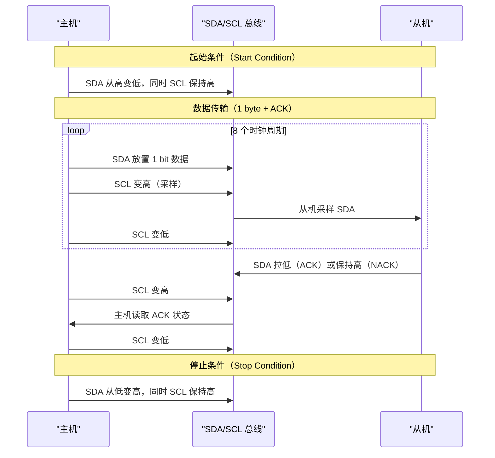

# I2C 时序与起始/停止/ACK [B]

> **本章学习目标**：
> - 理解 <span class="red">I2C 时序</span> 的 5 种核心信号状态
> - 掌握 <span class="red">起始条件（S）与停止条件（P）</span> 的电气实现
> - 了解 ACK/NACK 在从机响应中的关键作用

---

## I2C 时序的 5 种核心状态

---

### <strong>为什么需要严格的时序：总线仲裁的物理基础</strong>

<span class="red">I2C 时序</span>的严格定义源于其<span class="blue">"线与"（Wired-AND）</span>电气特性。

由于 SDA 和 SCL 都是开漏驱动，
<br>
总线状态由所有设备的逻辑<strong>AND</strong>决定：
<br>
* 任一设备拉低 SDA → 总线 SDA = 低
<br>
* 所有设备释放 SDA → 上拉电阻拉高 → 总线 SDA = 高
<br>

<span class="blue">类比：I2C 总线如同"会议室的话筒系统"——只有一个人（设备）能说话（拉低），如果多个人同时说话，总线状态就是"低"（混乱），主持人（仲裁器）需要识别谁先开口。</span>
<br>



---

### <strong>起始条件（S）与停止条件（P）：总线的"开"与"关"</strong>

<span class="red">起始条件</span>和<span class="red">停止条件</span>是 I2C 总线的边界标记：

| 条件 | SDA 变化 | SCL 状态 | 含义 |
| --- | --- | --- | --- |
| 起始（S） | 高 → 低 | 高电平 | 主机夺取总线控制权 |
| 停止（P） | 低 → 高 | 高电平 | 主机释放总线控制权 |
| 重复起始（Sr） | 高 → 低 | 高电平 | 不释放总线，继续新传输 |

```text
起始条件时序：

     SDA: ──────┐     └────────────────────────
               │     │
     SCL: ─────┼─────┼─────────────────────────
               │     │
              SCL=1  SDA 下降沿 = 起始
              
停止条件时序：

     SDA: ──────────────┐     └───────────────
                       │     │
     SCL: ──────────────┼─────┼───────────────
                       │     │
                      SCL=1  SDA 上升沿 = 停止
```

<span class="blue">关键规则：起始和停止条件只能在 SCL 为高时发生 SDA 跳变。数据传输时 SDA 只能在 SCL 为低时变化。</span>
<br>

---

### <strong>ACK/NACK：从机的"收到"与"没收到"</strong>

<span class="red">ACK（Acknowledge）</span>是 I2C 的核心流控机制。

每传输 8 bit 数据后，第 9 个时钟周期用于 ACK：
<br>
* <span class="green">ACK</span>：从机在第 9 个 SCL 高电平期间<strong>拉低 SDA</strong>，表示"数据已收到"
<br>
* <span class="green">NACK</span>：从机<strong>保持 SDA 高电平</strong>，表示"无法接收"或"传输结束"
<br>

```text
ACK 时序：

     SDA: ────╳──D7──╳──D6──╳──...──╳──D0──╳──┐
     数据:      bit7      bit6         bit0      ACK
                                              │
     SCL: ────────┐  ┌──┐  ┌──┐  ...  ┌──┐  ├──┐
                  └──┘  └──┘  └──┘      └──┘  └──┘
                                              ↑
                                           第9周期
                                           SDA=低 = ACK
                                           SDA=高 = NACK
```

<span class="blue">ACK 的多重含义：主机写时从机 ACK 表示"已接收"；主机读时从机 ACK 表示"还有数据"，主机 NACK 表示"停止发送"。</span>
<br>

---

## I2C 数据传输完整时序

---

### <strong>主机写从机：地址 + 数据 + ACK 链</strong>

```text
主机向地址 0x50 的 EEPROM 写入 1 byte 数据 0xA5：

     SDA: ─┐  └─0──┐  └─1──┐  └─0──┐  └─1──┐  ...  ACK  ─┐
           S   0x50地址        0xA5数据              ACK
     SCL: ─┼──┐  ┌──┐  ┌──┐  ┌──┐  ┌──┐  ...  ┌──┐  ┌──┼──
           └──┘  └──┘  └──┘  └──┘  └──┘      └──┘  └──┘
           ↑                                      ↑
        起始                                  停止
        
时序分解：
S + (7-bit 地址 0101000 + 1-bit 写方向 0) + ACK + 8-bit 数据 + ACK + P
```

---

### <strong>主机读从机：写地址 + 重复起始 + 读数据 + NACK</strong>

```text
主机从地址 0x48 的温度传感器读取 2 byte：

S + 0x48(W) + ACK + [内部寄存器地址] + ACK + Sr + 0x48(R) + ACK + DATA_MSB + ACK + DATA_LSB + NACK + P

步骤说明：
1. 发送写命令 + 寄存器地址（告诉从机要读哪个寄存器）
2. 重复起始 Sr（不释放总线）
3. 发送读命令
4. 接收 MSB，主机 ACK（继续接收）
5. 接收 LSB，主机 NACK（传输结束）
6. 停止 P
```

<span class="blue">重复起始（Repeated Start）的关键作用：在读操作前改变传输方向，而不释放总线（避免其他主机抢占）。</span>
<br>

---

## 本章小结

| 概念 | 一句话总结 |
| --- | --- |
| 起始条件 S | SCL 高时 SDA 从高变低，主机夺取总线 |
| 停止条件 P | SCL 高时 SDA 从低变高，主机释放总线 |
| 重复起始 Sr | 不释放总线，直接发起新传输 |
| ACK | 从机拉低 SDA，表示"数据已收到" |
| NACK | 从机保持 SDA 高，表示"无法接收"或"结束" |
| 第9周期 | 每 8 bit 后固定 1 bit ACK/NACK |

---

## 练习

1. 为什么 I2C 的 ACK 发生在第 9 个时钟周期而不是第 8 个？
2. 画出"主机向 0x68 RTC 写入寄存器 0x00 = 0x12"的完整时序图。
3. 如果主机发送地址后从机 NACK，主机应该如何处理？
