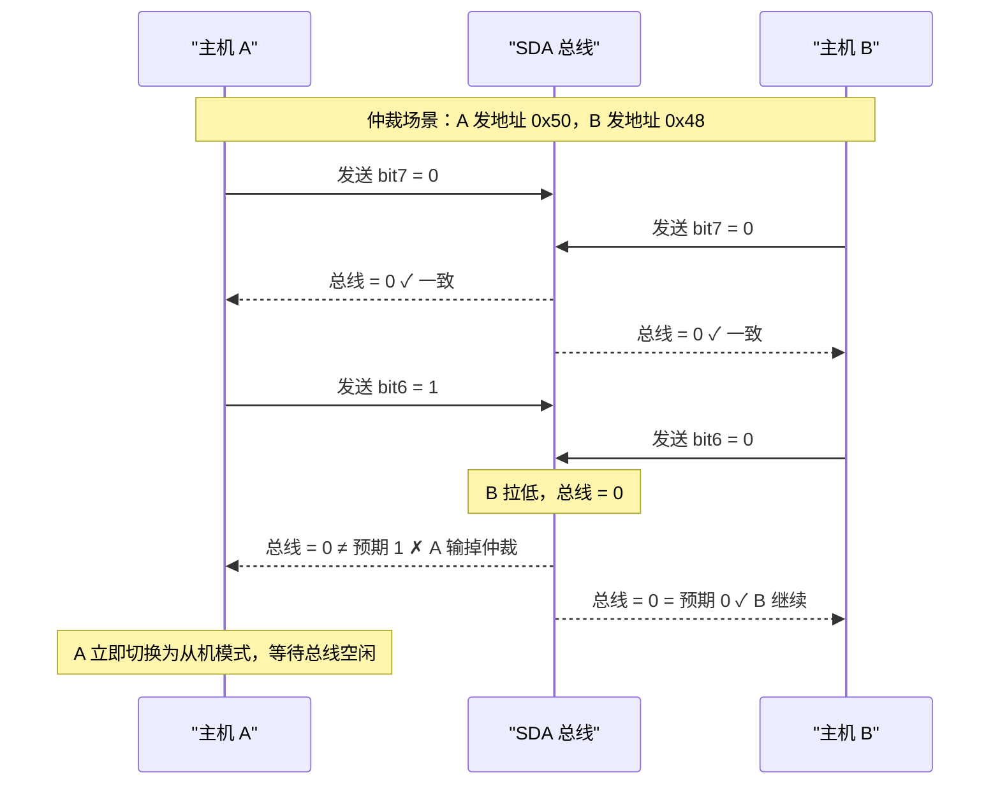
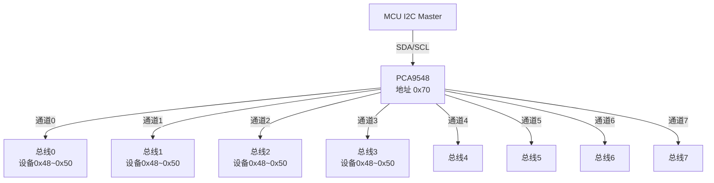

# I2C为什么能仲裁多主——地址模型与线与逻辑

---

## 线与逻辑的物理基础

<span class="red">I2C 的多主仲裁</span>不是软件协议，而是开漏驱动的物理副作用。

<br>

由于 SDA 是开漏 + 上拉，总线电平 = 所有设备输出的逻辑 AND：

- 设备 A 输出 1（释放），设备 B 输出 0（拉低）→ 总线 = 0
- 设备 A 输出 0，设备 B 输出 0 → 总线 = 0
- 设备 A 输出 1，设备 B 输出 1 → 总线 = 1

<br>



<br>

<span class="blue">类比：I2C 仲裁如同"文字接龙比赛"——两个人同时念字，只要有一个字不同，念"0"（开口拉低）的人胜出，因为话筒只能传出一个声音。念"1"（闭嘴释放）的人听到总线不是"1"，就知道自己输了，立刻闭嘴。</span>

<br>

<span class="blue">核心规则：仲裁失败的主机不会破坏正在进行的传输——它立即关闭输出驱动，切换为从机模式，继续监听总线，直到检测到停止条件后再尝试。</span>

<br>

---

## 多主仲裁的逐位比较机制

### <span class="orange"><strong>1. 仲裁窗口：仅地址阶段</strong></span>

I2C 仲裁只在地址传输期间进行。一旦某主机赢得仲裁（完成地址发送且未检测到不一致），它就独占总线直到发送 STOP。

<br>

**仲裁逐位比较表：**

| 周期 | 主机 A 发送 | 主机 B 发送 | 总线实际 | A 检测结果 | B 检测结果 |
|------|------------|------------|---------|-----------|-----------|
| SCL1 | 0 | 0 | 0 | ✓ 一致 | ✓ 一致 |
| SCL2 | 1 | 0 | 0 | ✗ 输，退出 | ✓ 一致 |
| SCL3 | — | 0 | 0 | 从机监听 | ✓ 一致 |
| SCL4 | — | 1 | 1 | 从机监听 | ✓ 一致 |
| ... | — | ... | ... | 从机监听 | 继续发送 |
| STOP | — | — | 高 | 检测到 P，可重试 | 完成传输 |

<br>

### <span class="orange"><strong>2. 仲裁失败的后续行为</strong></span>

仲裁失败的主机必须执行以下动作：

1. **立即关闭 SDA 输出驱动**（停止拉低）
2. **切换为从机模式**（继续监听 SCL/SDA）
3. **等待 STOP 条件**（总线空闲信号）
4. **重新尝试 START**（发起新一轮仲裁）

<br>

---

## 7-bit 地址模型：从静态到扩展

### <span class="orange"><strong>1. 7-bit 地址的位定义</strong></span>

I2C 地址字节格式：

```
Bit 7   Bit 6   Bit 5   Bit 4   Bit 3   Bit 2   Bit 1   Bit 0
  A6     A5      A4      A3      A2      A1      A0      R/W
  └────────────── 7-bit 从机地址 ──────────────┘      │
                                                        └─ 方向位
```

<br>

**地址空间分配：**

| 地址范围 | 用途 | 说明 |
|---------|------|------|
| 0x00 | General Call 广播 | 呼叫所有从机 |
| 0x01 ~ 0x07 | 保留 | CBUS、不同版本保留 |
| 0x08 ~ 0x77 | 可用 7-bit 地址 | 实际可用约 112 个 |
| 0x78 ~ 0x7F | 10-bit 地址标志 | 用于 10-bit 扩展寻址 |

<br>

<span class="blue">注意：0x00 虽然是广播地址，但从机不能回复数据（会冲突）。广播后只能由主机单向发送命令，典型用途是软件复位（0x06）或同步触发采样。</span>

<br>

### <span class="orange"><strong>2. 10-bit 扩展地址</strong></span>

<span class="red">10-bit 地址</span>支持 1024 个设备，通过 2-byte 地址传输实现。

<br>

**传输格式：**

```
Byte 1: [1 1 1 1 0 | A9 | A8 | R/W] + ACK
Byte 2: [A7 A6 A5 A4 A3 A2 A1 A0] + ACK

前 5 bit "11110" 是 10-bit 地址的标志
A9~A0 是实际 10-bit 地址
R/W 是方向位
```

<br>

**向后兼容性原理：**

- 10-bit 地址的第一个字节以 "11110" 开头
- 7-bit 从机不会响应（它们期望地址 MSB 为 0，即 A6=0）
- 只有支持 10-bit 的从机才会识别 "11110" 标志并接收第二字节

<br>

---

## General Call 广播：0x00 的全局唤醒

### <span class="orange"><strong>1. 广播命令的传输结构</strong></span>

```text
General Call 广播时序：

S + 0x00 (写方向) + ACK(所有从机) + 广播数据 + ACK(部分从机) + P
```

<br>

**典型广播命令：**

| 广播数据 | 命令 | 响应从机行为 |
|---------|------|-------------|
| 0x06 | 软件复位 | 所有支持广播的从机执行内部复位 |
| 0x04 | 硬件地址重分配 | 从机进入可编程地址模式 |
| 自定义 | 同步采样触发 | 所有 ADC 同时开始转换 |

<br>

<span class="blue">关键限制：General Call 后从机不能回复数据（多从机同时回复会冲突）。如果主机需要确认，必须随后逐个定向查询状态。</span>

<br>

---

## 地址冲突：从机地址的分配策略

### <span class="orange"><strong>1. 典型地址冲突场景</strong></span>

I2C 从机地址通常由硬件引脚（A2/A1/A0）决定，同型号设备最多 8 个（3 引脚组合）。超过 8 个同型号设备时，地址必然冲突。

<br>

**解决方案：**

| 方案 | 实现方式 | 代价 |
|------|---------|------|
| 物理地址引脚 | A2/A1/A0 接不同电平 | 同型号最多 8 个 |
| 10-bit 地址 | 使用 10-bit 扩展寻址 | 需要设备支持 |
| 多总线隔离 | 使用 I2C 开关/多路复用器 | 增加硬件成本 |
| 软件地址切换 | 通过广播命令动态重分配 | 需要设备支持 |

<br>

### <span class="orange"><strong>2. I2C 开关：PCA9548 的多路复用</strong></span>

<span class="red">PCA9548</span> 是 8 通道 I2C 开关，用 1 个 I2C 地址扩展出 8 条独立总线。

<br>



<br>

**PCA9548 控制方法：**

```c
/* 向 PCA9548 的 Control Register 写入通道掩码 */
uint8_t ch_mask = 0x01;    /* 仅开通通道0 */
i2c_write(0x70, &ch_mask, 1);

/* 此后所有 I2C 事务通过通道0路由 */
lm75_read(0x48);           /* 实际访问总线0上的 LM75 */
```

<br>

<span class="blue">PCA9548 的核心价值：用 1 个地址解决 N 个同型号设备的地址冲突。代价是每次切换通道需要额外的 I2C 写操作，且同一时刻只能有一个通道活跃。</span>

<br>

---

## 本章小结

<br>

| 概念 | 一句话总结 |
|------|-----------|
| 线与仲裁 | 开漏特性使总线=AND，发"1"检测到"0"者输掉仲裁 |
| 仲裁失败 | 主机立即切换为从机模式，等待 STOP 后重试 |
| 仲裁窗口 | 仅在地址阶段仲裁，数据传输阶段无仲裁 |
| 7-bit 地址 | A6~A0 + R/W 位，0x08~0x77 可用，约 112 个 |
| 10-bit 地址 | 2-byte 传输，标志"11110"，支持 1024 设备 |
| General Call | 地址 0x00，广播到所有从机，用于复位/同步 |
| 广播限制 | 从机不能回复数据，只能单向接收 |
| 地址冲突 | 同型号设备超 8 个时，可用 PCA9548 多路复用 |
| PCA9548 | 8 通道 I2C 开关，1 个地址扩展 8 条独立总线 |
| 时钟拉伸 | 从机拉低 SCL 降速，主机必须等待 |

<br>

---

## 练习

1. 设计一个多主 I2C 场景：主机 A 发送地址 0x50，主机 B 发送地址 0x48。逐位画出仲裁过程，标出每个 bit 周期各主机的输出、总线实际值、以及 A/B 的检测状态。

2. 某总线需要挂 12 个同型号温度传感器（基地址 0x48，3 引脚地址扩展）。在不使用 PCA9548 的情况下，能否实现？如果使用 PCA9548，最少需要几片？画出拓扑图。

3. 为什么 10-bit 地址从机不会与 7-bit 地址从机冲突？从位级分析第一个字节的差异。

4. General Call 广播后，如果主机需要确认所有从机是否完成复位，应该如何设计通信流程？
