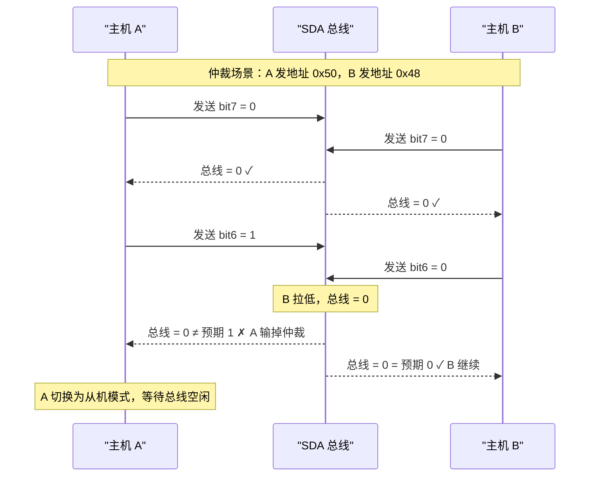

# I2C 地址仲裁与多主模式 [I]

> **本章学习目标**：
> - 理解 <span class="red">I2C 多主仲裁</span> 的"线与"机制
> - 掌握 <span class="red">10-bit 扩展地址</span> 与通用呼叫（General Call）
> - 了解 I2C 在多主传感器网络中的冲突处理

---

## I2C 多主仲裁："线与"的精妙设计

---

### <strong>为什么 I2C 天然支持多主：开漏的副作用</strong>

<span class="red">I2C 的多主支持</span>不是刻意设计，而是开漏驱动的<span class="blue">"副作用"</span>。

由于 SDA 是开漏 + 上拉，
<br>
总线电平 = 所有设备输出的逻辑 AND：
<br>
* 设备 A 输出 1（释放），设备 B 输出 0（拉低）→ 总线 = 0
<br>
* 设备 A 输出 0，设备 B 输出 0 → 总线 = 0
<br>
* 设备 A 输出 1，设备 B 输出 1 → 总线 = 1
<br>

<span class="blue">类比：I2C 仲裁如同"抢话筒"——两个人同时想说话，谁的内容里先出现"0"（拉低），谁就赢得话筒。因为一旦有人拉低，另一个人就算想发"1"也发不出去，只能检测到总线和自己预期不一致，从而主动退让。</span>
<br>



---

### <strong>仲裁的时序细节：逐位比较</strong>

<span class="red">I2C 仲裁</span>在地址传输期间逐位比较：

| 周期 | 主机 A 发送 | 主机 B 发送 | 总线实际 | 结果 |
| --- | --- | --- | --- | --- |
| SCL1 | 0 | 0 | 0 | 平局，继续 |
| SCL2 | 1 | 0 | 0 | A 预期 1 实际 0，A 输掉 |
| SCL3 | - | 0 | 0 | A 已退出，B 继续 |
| ... | - | ... | ... | B 完成传输 |

<span class="blue">关键规则：仲裁失败的主机不会破坏正在进行的传输——它立即切换为从机模式，继续监听总线，直到检测到停止条件后再尝试。</span>
<br>

---

## 10-bit 扩展地址

---

### <strong>为什么需要 10-bit 地址：7-bit 不够用</strong>

<span class="red">7-bit 地址</span>理论上支持 128 个设备（0x00~0x7F），
<br>
但 0x00 是广播地址，部分地址被标准预留：
<br>
* 0x00：General Call 广播
<br>
* 0x01-0x07：CBUS、不同版本保留
<br>
* 0x30-0x37：10-bit 地址标志
<br>
* 0x78-0x7F：10-bit 地址标志
<br>

实际可用 7-bit 地址约 112 个，在复杂传感器网络中可能不够。
<br>

<span class="red">10-bit 地址</span>支持 1024 个设备（0x000~0x3FF），通过 2-byte 地址传输实现：
<br>

```text
10-bit 地址传输格式：

Byte 1: [1 1 1 1 0 | bit9 bit8 | R/W]  + ACK
Byte 2: [bit7 bit6 bit5 bit4 bit3 bit2 bit1 bit0]  + ACK

前 5 bit "11110" 是 10-bit 地址的标志
bit9~bit0 是实际 10-bit 地址
R/W 是方向位
```

<span class="blue">10-bit 地址向后兼容 7-bit：10-bit 地址的第一个字节以 "11110" 开头，7-bit 从机不会响应（它们期望地址以 0 开头），只有 10-bit 从机才会识别。</span>
<br>

---

### <strong>General Call 广播：0x00 的全局唤醒</strong>

<span class="red">General Call（0x00）</span>是 I2C 的广播机制：
<br>
* 主机发送地址 0x00 + 写方向（0）
<br>
* 总线上所有从机都必须 ACK
<br>
* 主机随后发送广播数据
<br>

典型应用：
<br>
* 软件复位命令（0x06）
<br>
* 硬件地址重新分配
<br>
* 同步采样触发（所有 ADC 同时开始转换）
<br>

<span class="blue">注意：General Call 后从机不能回复数据（会冲突），只能接收。</span>
<br>

---

## 本章小结

| 概念 | 一句话总结 |
| --- | --- |
| 多主仲裁 | 开漏"线与"特性，逐位比较，发"1"但检测到"0"者输 |
| 仲裁失败 | 主机立即切换为从机模式，等待总线空闲 |
| 10-bit 地址 | 2-byte 传输，标志 "11110"，支持 1024 设备 |
| General Call | 地址 0x00，广播到所有从机，用于复位/同步 |

---

## 练习

1. 设计一个多主 I2C 场景：2 个 MCU 同时向总线发送数据，画出仲裁过程的时序图。
2. 为什么 10-bit 地址从机不会与 7-bit 地址从机冲突？
3. General Call 广播后，从机为什么不能回复？如果要回复应该怎么设计？
