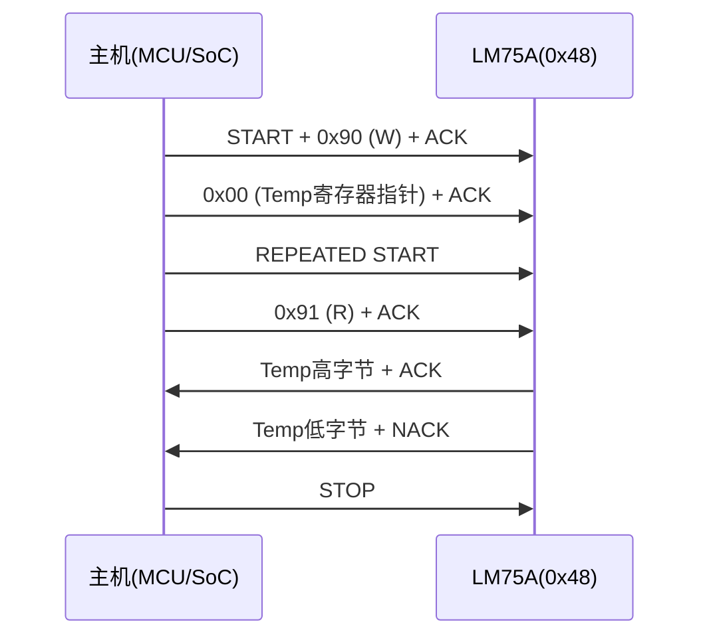
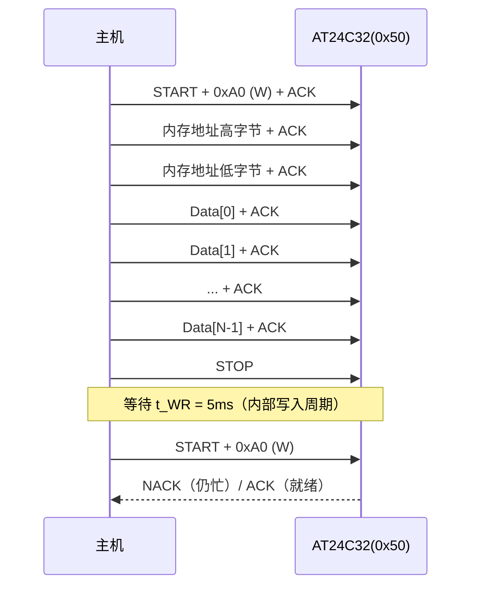

# I2C实战：传感器读写与EEPROM操作

---

## LM75温度传感器深度实战

### <span class="orange"><strong>1. 芯片概述与寄存器映射</strong></span>

<span class="red">LM75</span> 是 NXP/ON Semiconductor 推出的标准 I2C 温度传感器，<span class="green">TCN75</span> 为其引脚兼容的 Microchip 替代型号。

<br>

两者寄存器布局完全一致，可无缝互换。

<br>

**寄存器地址映射表：**

| 寄存器地址 | 名称 | 功能描述 | 读写属性 |
|---------|------|---------|---------|
| 0x00 | Temp | 当前温度值（12位有符号） | 只读 |
| 0x01 | Conf | 配置寄存器（分辨率/关断模式） | 读写 |
| 0x02 | T_HYST | 低温阈值寄存器 | 读写 |
| 0x03 | T_OS | 高温报警阈值寄存器 | 读写 |

<br>

**Temp 寄存器 12-bit 数据格式：**

```
Bit 15  Bit 14  Bit 13  Bit 12  Bit 11  Bit 10  Bit 9   Bit 8   Bit 7~4
  D11     D10     D9      D8      D7      D6      D5      D4      0
  └──────────────── 8-bit 整数部分（有符号）──────────────┘  └─ 4-bit 小数
                                                              0.0625℃/LSB
```

<br>

**温度换算公式：**

```
raw = (buf[0] << 8) | buf[1]
raw >>= 4                           /* 右移4位对齐12位 */
if (raw & 0x800) raw |= 0xF000    /* 符号扩展 */
temp = raw × 0.0625℃
```

<br>

<span class="blue">示例：寄存器值 0x1910 → 右移4位得 0x0191 = 401 → 401 × 0.0625 = 25.0625℃。</span>

<br>

**LM75 的 I2C 从机地址：**

- 基地址为 0x48（A2=A1=A0=GND）
- A2/A1/A0 引脚接 VCC/GND 组合，可扩展至 0x48~0x4F 共 8 个设备

<br>

### <span class="orange"><strong>2. 温度读取的完整 I2C 时序</strong></span>

<span class="red">温度读取</span>需要两步 I2C 事务：写入寄存器指针，再读取温度数据。

<br>



<br>

**步骤解析：**

- **步骤1**：写操作（R/W=0），从机地址后紧跟寄存器指针值 0x00
- **步骤2**：Sr（重复起始），不释放总线，切换为读方向
- **步骤3**：读取 2 字节温度数据，最后主机发 NACK + STOP 终止

<br>

### <span class="orange"><strong>3. Linux i2c-dev 接口与 C 代码</strong></span>

<span class="red">i2c-dev</span> 是 Linux 内核提供的用户态 I2C 访问接口，通过 `/dev/i2c-N` 字符设备暴露总线操作能力。

<br>

**核心 API 结构体：**

```c
#include <linux/i2c.h>
#include <linux/i2c-dev.h>

/* 单个 I2C 消息 */
struct i2c_msg {
    __u16 addr;       /* 7-bit 从机地址 */
    __u16 flags;      /* I2C_M_RD=读, I2C_M_STOP=STOP后自动发送 */
    __u16 len;        /* 数据长度 */
    __u8  *buf;       /* 数据缓冲区 */
};

/* ioctl 封装结构体 */
struct i2c_rdwr_ioctl_data {
    struct i2c_msg *msgs;    /* 消息数组 */
    __u32 nmsgs;             /* 消息数量 */
};
```

<br>

**LM75 温度读取完整代码：**

```c
// 文件：lm75_read.c
#include <stdio.h>
#include <fcntl.h>
#include <unistd.h>
#include <sys/ioctl.h>
#include <linux/i2c.h>
#include <linux/i2c-dev.h>

#define LM75_ADDR   0x48
#define I2C_BUS     "/dev/i2c-1"

float lm75_read_temp(int fd)
{
    struct i2c_msg msgs[2];
    struct i2c_rdwr_ioctl_data xfer;
    unsigned char reg_ptr = 0x00;
    unsigned char buf[2];
    int16_t raw;

    /* 消息1：写寄存器指针 */
    msgs[0].addr  = LM75_ADDR;
    msgs[0].flags = 0;              /* 写方向 */
    msgs[0].len   = 1;
    msgs[0].buf   = &reg_ptr;

    /* 消息2：读2字节温度 */
    msgs[1].addr  = LM75_ADDR;
    msgs[1].flags = I2C_M_RD;       /* 读方向 */
    msgs[1].len   = 2;
    msgs[1].buf   = buf;

    xfer.msgs  = msgs;
    xfer.nmsgs = 2;

    if (ioctl(fd, I2C_RDWR, &xfer) < 0) {
        perror("I2C_RDWR failed");
        return -999.0;
    }

    /* 12位有符号温度：高8位移位，低4位小数 */
    raw = (buf[0] << 8) | buf[1];
    raw >>= 4;                      /* 右移4位对齐12位 */
    if (raw & 0x800)                /* 符号扩展 */
        raw |= 0xF000;

    return (float)raw * 0.0625f;
}

int main(void)
{
    int fd = open(I2C_BUS, O_RDWR);
    if (fd < 0) {
        perror("open i2c-1");
        return 1;
    }

    float temp = lm75_read_temp(fd);
    printf("LM75 Temperature: %.4f °C\n", temp);

    close(fd);
    return 0;
}
```

<br>

<span class="blue">代码关键点：使用 `I2C_RDWR` 一次 ioctl 完成组合传输，避免两次独立 open/close 造成的 START/STOP 间隙。`I2C_M_RD` 标志位定义在 `linux/i2c-dev.h` 中，值为 `0x0001`。</span>

<br>

---

## AT24C EEPROM 页写入机制

### <span class="orange"><strong>1. 存储组织与地址格式</strong></span>

<span class="red">AT24C 系列</span> EEPROM 采用 I2C 接口，容量从 128 字节（AT24C01）到 256Kbit（AT24C256）不等。

<br>

**寻址与页大小对照表：**

| 型号 | 容量 | 设备地址高4位 | 内部地址位宽 | 页大小 | 最大设备数 |
|------|------|--------------|-------------|--------|----------|
| AT24C02 | 256×8 | 1010 | 8 位 | 8 字节 | 8 |
| AT24C32 | 4K×8 | 1010 | 12 位 | 32 字节 | 8 |
| AT24C256 | 32K×8 | 1010 | 15 位 | 64 字节 | 4 |

<br>

**设备地址格式：**

```
Bit 7   Bit 6   Bit 5   Bit 4   Bit 3   Bit 2   Bit 1   Bit 0
  1       0       0       1       0      A2/P2   A1/P1   A0/P0   R/W
  └──────── 固定 ────────┘              └─ 可配置地址位 ─┘     │
                                                              └─ 方向
```

<br>

### <span class="orange"><strong>2. 页写入时序与地址轮询</strong></span>

<span class="red">页写入</span>是 EEPROM 的核心操作，分为三个阶段：启动条件→设备地址+写+ACK→内存地址+ACK→数据字节+ACK→STOP。

<br>



<br>

**页写入的关键限制：**

- 单次写入不能超过页大小（如 AT24C32 为 32 字节）
- 若跨页边界（如地址 0x1F 后写 0x20），内部指针自动回卷至页首 0x00
- 发送 STOP 后，EEPROM 进入内部写入周期，典型 t_WR = 5ms（最大 10ms）
- 写入期间任何 I2C 访问都会收到 NACK

<br>

### <span class="orange"><strong>3. 跨页安全写入的 C 代码</strong></span>

```c
// 文件：at24c_write.c
#include <stdio.h>
#include <fcntl.h>
#include <unistd.h>
#include <sys/ioctl.h>
#include <linux/i2c-dev.h>

#define AT24C_ADDR  0x50
#define PAGE_SIZE   32
#define T_WR_MS     5

/* 等待 EEPROM 写入完成（地址轮询） */
int at24c_poll_ready(int fd)
{
    int retry = 100;
    while (retry-- > 0) {
        if (ioctl(fd, I2C_SLAVE, AT24C_ADDR) >= 0)
            return 0;       /* ACK 收到，设备就绪 */
        usleep(100);        /* 100μs 间隔轮询 */
    }
    return -1;
}

/* 单页写入（不超过 PAGE_SIZE 字节） */
int at24c_page_write(int fd, uint16_t addr,
                     const uint8_t *data, int len)
{
    uint8_t buf[34];        /* 2 字节地址 + 32 字节数据 */
    int page_remain = PAGE_SIZE - (addr % PAGE_SIZE);
    int write_len = (len < page_remain) ? len : page_remain;

    buf[0] = (addr >> 8) & 0xFF;    /* 内存地址高字节 */
    buf[1] = addr & 0xFF;           /* 内存地址低字节 */
    for (int i = 0; i < write_len; i++)
        buf[2 + i] = data[i];

    if (ioctl(fd, I2C_SLAVE, AT24C_ADDR) < 0)
        return -1;

    if (write(fd, buf, 2 + write_len) != 2 + write_len)
        return -1;

    /* STOP 后等待写入周期 */
    usleep(T_WR_MS * 1000);
    return at24c_poll_ready(fd);
}

/* 跨页安全写入 */
int at24c_write(int fd, uint16_t addr,
                const uint8_t *data, int len)
{
    int written = 0;
    while (written < len) {
        int ret = at24c_page_write(fd, addr + written,
                                   data + written, len - written);
        if (ret < 0)
            return -1;
        written += ret;
    }
    return written;
}
```

<br>

<span class="blue">核心逻辑：每次写入前计算当前页剩余空间 `PAGE_SIZE - (addr % PAGE_SIZE)`，避免跨页回卷导致的数据覆盖。写入后等待 5ms，再用地址轮询检测就绪状态。</span>

<br>

---

## i2c-tools：命令行调试利器

### <span class="orange"><strong>1. 安装与总线扫描</strong></span>

<span class="red">i2c-tools</span> 是 Linux 下最基础的 I2C 调试工具集，包含 i2cdetect、i2cget、i2cset、i2cdump 四个核心命令。

<br>

**安装方式：**

```bash
# Debian/Ubuntu
sudo apt-get install i2c-tools

# Buildroot/Yocto
make menuconfig  # 选中 i2c-tools

# 手动交叉编译
wget https://www.kernel.org/pub/software/utils/i2c-tools/i2c-tools-4.3.tar.gz
tar xzf i2c-tools-4.3.tar.gz
cd i2c-tools-4.3
make CC=arm-linux-gnueabihf-gcc
make install
```

<br>

### <span class="orange"><strong>2. i2cdetect：总线扫描与设备发现</strong></span>

扫描指定 I2C 总线上的所有从机地址：

<br>

```bash
# 扫描 i2c-1 总线
$ i2cdetect -y 1
     0  1  2  3  4  5  6  7  8  9  a  b  c  d  e  f
00:          -- -- -- -- -- -- -- -- -- -- -- -- --
10: -- -- -- -- -- -- -- -- -- -- -- -- -- -- -- --
20: -- -- -- -- -- -- -- -- -- -- -- -- -- -- -- --
30: -- -- -- -- -- -- -- -- -- -- -- -- -- -- -- --
40: -- -- -- -- -- -- -- -- 48 -- -- -- -- -- -- --
50: 50 -- -- -- -- -- -- -- -- -- -- -- -- -- -- --
60: -- -- -- -- -- -- -- -- -- -- -- -- -- -- -- --
70: -- -- -- -- -- -- -- --
```

<br>

**输出解读：**

- `48`：地址 0x48 检测到 ACK，LM75 温度传感器在线
- `50`：地址 0x50 检测到 ACK，AT24C32 EEPROM 在线
- `--`：该地址无 ACK 响应，无设备或设备未响应
- `UU`：该地址被内核驱动占用（Reserved）

<br>

### <span class="orange"><strong>3. i2cget：单寄存器读取</strong></span>

```bash
# 读取 LM75 的 Temp 寄存器（0x00），2 字节
$ i2cget -y 1 0x48 0x00 w
0x1910
# 换算：0x1910 >> 4 = 0x0191 = 401 × 0.0625 = 25.0625°C

# 读取 AT24C32 的内存地址 0x0000，单字节
$ i2cget -y 1 0x50 0x0000 i
0xAB
```

<br>

**i2cget 参数说明：**

| 参数 | 含义 |
|------|------|
| `-y` | 自动确认，不提示交互 |
| `1` | I2C 总线号（/dev/i2c-1） |
| `0x48` | 从机地址 |
| `0x00` | 寄存器/内存地址 |
| `w` | 读取 2 字节（word） |
| `i` | 读取 1 字节（byte） |

<br>

### <span class="orange"><strong>4. i2cset：单寄存器写入</strong></span>

```bash
# 向 AT24C32 地址 0x0100 写入 0x55
$ i2cset -y 1 0x50 0x0100 0x55 i

# 配置 LM75 的配置寄存器（0x01）为关断模式
$ i2cset -y 1 0x48 0x01 0x01
```

<br>

### <span class="orange"><strong>5. i2cdump：批量寄存器dump</strong></span>

```bash
# Dump LM75 的全部寄存器（0x00~0x03）
$ i2cdump -y 1 0x48
     0  1  2  3  4  5  6  7  8  9  a  b  c  d  e  f    0123456789abcdef
00: 19 10 XX XX XX XX XX XX XX XX XX XX XX XX XX XX    .1??????????????

# Dump AT24C32 前 256 字节（使用 i2c 模式）
$ i2cdump -y 1 0x50 i
```

<br>

---

## Python smbus2 库实战

### <span class="orange"><strong>1. 库安装与基础用法</strong></span>

<span class="red">smbus2</span> 是 Python 下操作 I2C/SMBus 的现代库，兼容 smbus 接口的同时支持全功能的 i2c_msg。

<br>

```bash
pip install smbus2
```

<br>

### <span class="orange"><strong>2. LM75 读取 + EEPROM 读写完整示例</strong></span>

```python
#!/usr/bin/env python3
from smbus2 import SMBus, i2c_msg
import time

LM75_ADDR = 0x48
EEPROM_ADDR = 0x50
BUS_NUM = 1

def lm75_read_temp(bus):
    """读取 LM75 温度值"""
    msg_w = i2c_msg.write(LM75_ADDR, [0x00])
    msg_r = i2c_msg.read(LM75_ADDR, 2)
    bus.i2c_rdwr(msg_w, msg_r)
    
    data = list(msg_r)
    raw = (data[0] << 8) | data[1]
    raw >>= 4
    if raw & 0x800:
        raw |= 0xF000
    return raw * 0.0625

def eeprom_write_page(bus, addr, data):
    """AT24C32 单页写入"""
    buf = [(addr >> 8) & 0xFF, addr & 0xFF] + list(data)
    msg = i2c_msg.write(EEPROM_ADDR, buf)
    bus.i2c_rdwr(msg)
    time.sleep(0.005)   # t_WR = 5ms

def eeprom_read(bus, addr, length):
    """AT24C32 任意长度读取"""
    msg_w = i2c_msg.write(EEPROM_ADDR,
                          [(addr >> 8) & 0xFF, addr & 0xFF])
    msg_r = i2c_msg.read(EEPROM_ADDR, length)
    bus.i2c_rdwr(msg_w, msg_r)
    return list(msg_r)

if __name__ == '__main__':
    with SMBus(BUS_NUM) as bus:
        temp = lm75_read_temp(bus)
        print(f"LM75 Temperature: {temp:.4f} °C")
        
        eeprom_write_page(bus, 0x0000, b'Hello')
        data = eeprom_read(bus, 0x0000, 5)
        print(f"EEPROM read: {bytes(data)}")
```

<br>

<span class="blue">smbus2 的优势：纯 Python 实现，跨平台兼容，支持组合传输 `i2c_rdwr()` 和 DMA 友好的 `i2c_msg`。`i2c_msg` 的 `write()` 和 `read()` 构造器自动处理地址和方向位。</span>

<br>

---

## 本章小结

<br>

| 概念 | 一句话总结 |
|------|-----------|
| LM75 Temp 寄存器 | 12 位有符号温度值，0.0625℃/LSB，地址 0x00 |
| LM75 地址 | 基地址 0x48，A2/A1/A0 扩展至 0x48~0x4F |
| i2c-dev | Linux 用户态 I2C 接口，ioctl + `struct i2c_msg` |
| I2C_RDWR | 一次 ioctl 完成多消息组合传输 |
| AT24C32 页大小 | 32 字节，超量回卷，STOP 后需 5ms t_WR |
| 地址轮询 | 写入后反复探测 ACK，替代固定延时 |
| i2cdetect | 扫描 0x03~0x77，U=被内核占用，--=无设备 |
| i2cget `w` | 读取 2 字节（word） |
| i2cset `i` | 写入 1 字节（byte） |
| smbus2 | Python I2C 库，`i2c_rdwr()` 支持组合传输 |

<br>

---

## 练习

1. LM75 的 Temp 寄存器值为 `0x0E80`，请计算对应的摄氏温度值（提示：注意符号位和右移对齐）。

2. 向 AT24C32 的地址 `0x001F` 连续写入 40 字节，内部地址指针会如何变化？请画出地址变化序列并标注页边界。

3. 使用 `i2cget` 读取 EEPROM 时，为什么 `i2cget -y 1 0x50 0x0000` 可能返回错误？正确的命令格式是什么？

4. 编写一段 Shell 脚本，每秒读取一次 LM75 温度并输出 CSV 格式（时间戳,温度）。
