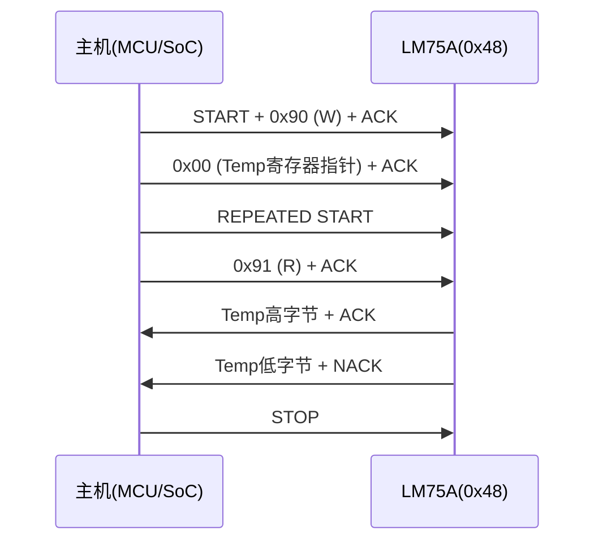
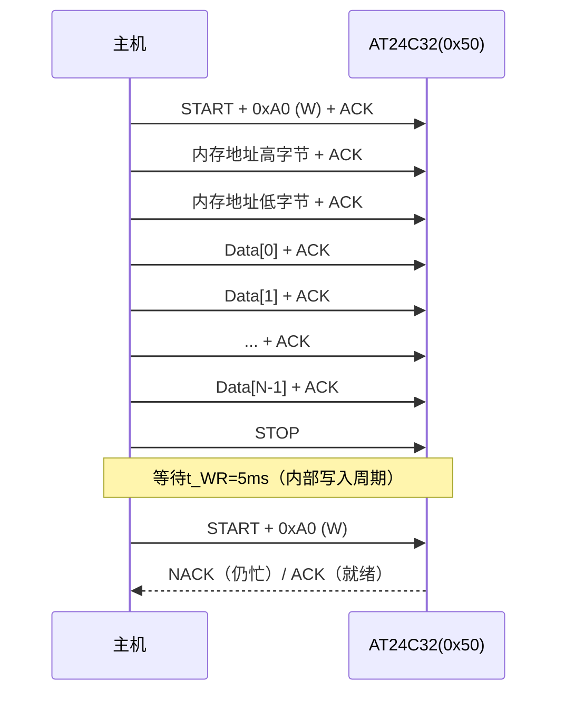

# I2C嵌入式实战：传感器读写 [I]

> **本章学习目标**：
> - 掌握<span class="red">LM75/TCN75</span>温度传感器的I2C寄存器读写时序
> - 理解<span class="red">EEPROM</span>的页写入机制与地址轮询流程
> - 熟练使用<span class="red">i2c-tools</span>套件进行总线扫描与设备调试

---

## 温度传感器：LM75与TCN75的寄存器操作

---

### <strong>LM75/TCN75 硬件架构与寄存器映射</strong>

<span class="red">LM75</span>是NXP/ON Semiconductor推出的标准I2C温度传感器，<br>
<span class="green">TCN75</span>为其引脚兼容的Microchip替代型号。<br>
两者寄存器布局完全一致，可无缝互换。<br>

<span class="blue">核心设计思路：将温度量化结果存入数字寄存器，<br>
主机通过I2C总线周期性轮询读取。</span><br>

**寄存器地址映射表：**

| 寄存器地址 | 名称 | 功能描述 | 读写属性 |
| --- | --- | --- | --- |
| 0x00 | Temp | 当前温度值（12位有符号） | 只读 |
| 0x01 | Conf | 配置寄存器（分辨率/关断模式） | 读写 |
| 0x02 | T_HYST | 低温阈值寄存器 | 读写 |
| 0x03 | T_OS | 高温报警阈值寄存器 | 读写 |

<span class="blue">LM75的I2C从机地址由A2/A1/A0三引脚电平决定，<br>
基地址为0x48，可扩展至0x48~0x4F共8个设备。</span><br>

<span class="green">Temp寄存器</span>的12位数据格式：<br>
高8位为整数部分（有符号），低4位为小数部分（0.0625℃/LSB）。<br>
例如寄存器值 `0x1910` 表示 `25.0625℃`。<br>

---

### <strong>LM75 温度读取的完整I2C时序</strong>

<span class="red">温度读取</span>需要两步I2C事务：<br>
第一步写入寄存器指针（0x00），第二步读取2字节温度数据。<br>



<span class="orange"><strong>1. 指针寄存器预置</strong></span><br>
发送 <span class="green">写操作</span>（R/W=0），从机地址后紧跟寄存器指针值 `0x00`。<br>
此步骤不传输数据，仅设置内部地址指针。<br>

<span class="orange"><strong>2. 重复起始条件</strong></span><br>
在总线不释放的前提下发送 <span class="green">Sr（Repeated START）</span>，<br>
将传输方向切换为读（R/W=1）。<br>
这是I2C标准允许的“组合格式”传输。<br>

<span class="orange"><strong>3. 双字节温度回读</strong></span><br>
主机在SCL低电平期间拉低SDA产生ACK，<br>
通知从机继续发送第二字节。<br>
读取完第二字节后，主机发送 <span class="green">NACK + STOP</span> 终止传输。<br>

---

### <strong>Linux i2c-dev 接口与 C 代码实现</strong>

<span class="red">i2c-dev</span>是Linux内核提供的用户态I2C访问接口，<br>
通过 `/dev/i2c-N` 字符设备暴露总线操作能力。<br>

<span class="blue">i2c-dev的核心API是ioctl系统调用，<br>
使用 `struct i2c_msg` 描述I2C事务，<br>
用 `struct i2c_rdwr_ioctl_data` 封装多消息传输。</span><br>

```c
// 文件：lm75_read.c
// 功能：通过i2c-dev读取LM75温度值
#include <stdio.h>
#include <fcntl.h>
#include <unistd.h>
#include <sys/ioctl.h>
#include <linux/i2c.h>
#include <linux/i2c-dev.h>

#define LM75_ADDR   0x48    /* A2=A1=A0=GND */
#define I2C_BUS     "/dev/i2c-1"

float lm75_read_temp(int fd)
{
    struct i2c_msg msgs[2];
    struct i2c_rdwr_ioctl_data xfer;
    unsigned char reg_ptr = 0x00;
    unsigned char buf[2];
    int16_t raw;

    /* 消息1：写寄存器指针 */
    msgs[0].addr  = LM75_ADDR;
    msgs[0].flags = 0;              /* 写方向 */
    msgs[0].len   = 1;
    msgs[0].buf   = &reg_ptr;

    /* 消息2：读2字节温度 */
    msgs[1].addr  = LM75_ADDR;
    msgs[1].flags = I2C_M_RD;       /* 读方向 */
    msgs[1].len   = 2;
    msgs[1].buf   = buf;

    xfer.msgs  = msgs;
    xfer.nmsgs = 2;

    if (ioctl(fd, I2C_RDWR, &xfer) < 0) {
        perror("I2C_RDWR failed");
        return -999.0;
    }

    /* 12位有符号温度：高8位移位，低4位小数 */
    raw = (buf[0] << 8) | buf[1];
    raw >>= 4;                      /* 右移4位对齐12位 */
    if (raw & 0x800)                /* 符号扩展 */
        raw |= 0xF000;

    return (float)raw * 0.0625f;
}

int main(void)
{
    int fd = open(I2C_BUS, O_RDWR);
    if (fd < 0) {
        perror("open i2c-1");
        return 1;
    }

    float temp = lm75_read_temp(fd);
    printf("LM75 Temperature: %.4f °C\n", temp);

    close(fd);
    return 0;
}
```

<span class="blue">代码关键点：使用 `I2C_RDWR` 一次ioctl完成组合传输，<br>
避免两次独立open/close造成的START/STOP间隙。</span><br>

---

## EEPROM读写：AT24C系列页写入机制

---

### <strong>AT24C02/32/256 的存储组织与地址格式</strong>

<span class="red">AT24C系列</span>EEPROM采用I2C接口，<br>
容量从128字节（AT24C01）到256Kbit（AT24C256）不等。<br>

<span class="blue">EEPROM的寻址方式随容量变化，<br>
这是理解页写入限制的前提。</span><br>

**AT24C系列寻址与页大小对照表：**

| 型号 | 容量 | 设备地址位 | 内部地址位 | 页大小 | 最大设备数 |
| --- | --- | --- | --- | --- | --- |
| AT24C02 | 256×8 | 高4位固定1010 | 8位 | 8字节 | 8 |
| AT24C32 | 4K×8 | 高4位固定1010 | 12位 | 32字节 | 8 |
| AT24C256 | 32K×8 | 高4位固定1010 | 15位 | 64字节 | 4 |

<span class="green">页大小（Page Size）</span>是单次写入操作的最大连续字节数。<br>
例如 <span class="green">AT24C32</span> 的页大小为32字节，<br>
若一次写入超过32字节，内部地址指针会回卷到页首覆盖数据。<br>

---

### <strong>页写入时序与地址轮询</strong>

<span class="red">EEPROM页写入</span>分为三个阶段：<br>
启动条件→设备地址+写+ACK→内存地址+ACK→数据字节+ACK→STOP。<br>



<span class="orange"><strong>1. 写入前导序列</strong></span><br>
发送 <span class="green">写设备地址</span>后，紧跟内存地址（8位或16位，依容量而定）。<br>
内存地址高位在前（MSB First）。<br>

<span class="orange"><strong>2. 连续字节传输</strong></span><br>
每发送一个字节，EEPROM回送 <span class="green">ACK</span> 并递增内部地址指针。<br>
若跨页边界（如页大小32字节，地址0x1F后写0x20），<br>
指针自动回卷至页首 <span class="green">0x00</span>，而非顺序递增到下一页。<br>

<span class="orange"><strong>3. 写入周期与轮询</strong></span><br>
发送 <span class="green">STOP</span> 后，EEPROM进入内部写入周期。<br>
典型 <span class="green">t_WR</span> 时间为5ms（最大10ms）。<br>
期间任何I2C访问都会收到 <span class="green">NACK</span>。<br>
主机可通过反复发送START+设备地址探测ACK状态，<br>
此即<span class="red">地址轮询（Address Polling）</span>机制。<br>

---

### <strong>跨页写入的C代码实现</strong>

```c
// 文件：at24c_write.c
// 功能：AT24C32跨页安全写入
#include <stdio.h>
#include <fcntl.h>
#include <unistd.h>
#include <sys/ioctl.h>
#include <linux/i2c-dev.h>

#define AT24C_ADDR  0x50
#define PAGE_SIZE   32
#define T_WR_MS     5

/* 等待EEPROM写入完成（地址轮询） */
int at24c_poll_ready(int fd)
{
    int retry = 100;
    while (retry-- > 0) {
        if (ioctl(fd, I2C_SLAVE, AT24C_ADDR) >= 0)
            return 0;       /* ACK收到，设备就绪 */
        usleep(100);        /* 100μs间隔轮询 */
    }
    return -1;
}

/* 单页写入（不超过PAGE_SIZE字节） */
int at24c_page_write(int fd, uint16_t addr,
                     const uint8_t *data, int len)
{
    uint8_t buf[34];        /* 2字节地址 + 32字节数据 */
    int page_remain = PAGE_SIZE - (addr % PAGE_SIZE);
    int write_len = (len < page_remain) ? len : page_remain;

    buf[0] = (addr >> 8) & 0xFF;    /* 内存地址高字节 */
    buf[1] = addr & 0xFF;           /* 内存地址低字节 */
    for (int i = 0; i < write_len; i++)
        buf[2 + i] = data[i];

    if (ioctl(fd, I2C_SLAVE, AT24C_ADDR) < 0)
        return -1;

    if (write(fd, buf, 2 + write_len) != 2 + write_len)
        return -1;

    /* STOP后等待写入周期 */
    usleep(T_WR_MS * 1000);
    return at24c_poll_ready(fd);
}

/* 跨页安全写入 */
int at24c_write(int fd, uint16_t addr,
                const uint8_t *data, int len)
{
    int written = 0;
    while (written < len) {
        int ret = at24c_page_write(fd, addr + written,
                                   data + written, len - written);
        if (ret < 0)
            return -1;
        written += (PAGE_SIZE - ((addr + written) % PAGE_SIZE));
    }
    return written;
}
```

<span class="blue">核心逻辑：每次写入前计算当前页剩余空间，<br>
避免跨页回卷导致的数据覆盖。</span><br>

---

## I2C调试工具：i2cdetect/i2cget/i2cset

---

### <strong>i2c-tools 套件安装与总线扫描</strong>

<span class="red">i2c-tools</span>是Linux下最基础的I2C调试工具集，<br>
包含 <span class="green">i2cdetect</span>、<span class="green">i2cget</span>、<span class="green">i2cset</span>、<span class="green">i2cdump</span> 四个核心命令。<br>

**安装方式：**

```bash
# Debian/Ubuntu
sudo apt-get install i2c-tools

# Buildroot/Yocto
make menuconfig  # 选中 i2c-tools

# 手动交叉编译
wget https://www.kernel.org/pub/software/utils/i2c-tools/i2c-tools-4.3.tar.gz
tar xzf i2c-tools-4.3.tar.gz
cd i2c-tools-4.3
make CC=arm-linux-gnueabihf-gcc
make install
```

<span class="orange"><strong>1. i2cdetect：总线扫描与设备发现</strong></span><br>
扫描指定I2C总线上的所有从机地址：<br>

```bash
# 扫描i2c-1总线
$ i2cdetect -y 1
     0  1  2  3  4  5  6  7  8  9  a  b  c  d  e  f
00:          -- -- -- -- -- -- -- -- -- -- -- -- --
10: -- -- -- -- -- -- -- -- -- -- -- -- -- -- -- --
20: -- -- -- -- -- -- -- -- -- -- -- -- -- -- -- --
30: -- -- -- -- -- -- -- -- -- -- -- -- -- -- -- --
40: -- -- -- -- -- -- -- -- 48 -- -- -- -- -- -- --
50: 50 -- -- -- -- -- -- -- -- -- -- -- -- -- -- --
60: -- -- -- -- -- -- -- -- -- -- -- -- -- -- -- --
70: -- -- -- -- -- -- -- --
```

<span class="blue">输出解读：`48` 表示检测到LM75（地址0x48），<br>
`50` 表示检测到AT24C32（地址0x50）。<br>
`--` 表示该地址无ACK响应，即无设备或设备未响应。</span><br>

<span class="orange"><strong>2. i2cget：单寄存器读取</strong></span><br>

```bash
# 读取LM75的Temp寄存器（0x00），2字节
$ i2cget -y 1 0x48 0x00 w
0x1910
# 换算：0x1910 >> 4 = 0x0191 = 401 × 0.0625 = 25.0625°C

# 读取AT24C32的内存地址0x0000，单字节
$ i2cget -y 1 0x50 0x0000 i
0xAB
```

<span class="orange"><strong>3. i2cset：单寄存器写入</strong></span><br>

```bash
# 向AT24C32地址0x0100写入0x55
$ i2cset -y 1 0x50 0x0100 0x55 i

# 配置LM75的配置寄存器（0x01）为关断模式
$ i2cset -y 1 0x48 0x01 0x01
```

---

### <strong>Python smbus2 库实战</strong>

<span class="red">smbus2</span>是Python下操作I2C/SMBus的现代库，<br>
兼容 <span class="green">smbus</span> 接口的同时支持全功能的 <span class="green">i2c_msg</span>。<br>

```python
#!/usr/bin/env python3
# 文件：lm75_read.py
# 功能：Python读取LM75温度 + EEPROM写入

from smbus2 import SMBus, i2c_msg
import time

LM75_ADDR = 0x48
EEPROM_ADDR = 0x50
BUS_NUM = 1

def lm75_read_temp(bus):
    """读取LM75温度值"""
    # 写寄存器指针0x00
    msg_w = i2c_msg.write(LM75_ADDR, [0x00])
    # 读2字节
    msg_r = i2c_msg.read(LM75_ADDR, 2)
    
    bus.i2c_rdwr(msg_w, msg_r)
    
    data = list(msg_r)
    raw = (data[0] << 8) | data[1]
    raw >>= 4
    if raw & 0x800:
        raw |= 0xF000
    return raw * 0.0625

def eeprom_write_page(bus, addr, data):
    """AT24C32单页写入"""
    buf = [(addr >> 8) & 0xFF, addr & 0xFF] + list(data)
    msg = i2c_msg.write(EEPROM_ADDR, buf)
    bus.i2c_rdwr(msg)
    time.sleep(0.005)   # t_WR = 5ms

def eeprom_read(bus, addr, length):
    """AT24C32任意长度读取"""
    msg_w = i2c_msg.write(EEPROM_ADDR,
                          [(addr >> 8) & 0xFF, addr & 0xFF])
    msg_r = i2c_msg.read(EEPROM_ADDR, length)
    bus.i2c_rdwr(msg_w, msg_r)
    return list(msg_r)

if __name__ == '__main__':
    with SMBus(BUS_NUM) as bus:
        # 读取温度
        temp = lm75_read_temp(bus)
        print(f"LM75 Temperature: {temp:.4f} °C")
        
        # 写入EEPROM
        eeprom_write_page(bus, 0x0000, b'Hello')
        
        # 读取回验证
        data = eeprom_read(bus, 0x0000, 5)
        print(f"EEPROM read: {bytes(data)}")
```

<span class="blue">smbus2的优势：纯Python实现，跨平台兼容，<br>
支持组合传输 `i2c_rdwr()` 和DMA友好的 `i2c_msg`。</span><br>

---

### <strong>实战技巧：Shell脚本批量读取</strong>

```bash
#!/bin/bash
# 文件：batch_temp.sh
# 功能：每秒读取一次LM75温度

BUS=1
ADDR=0x48
REG=0x00

echo "Timestamp,Temperature(C)"
while true; do
    RAW=$(i2cget -y $BUS $ADDR $REG w)
    # 提取12位有符号值
    VAL=$(( ($RAW >> 4) & 0x0FFF ))
    if [ $VAL -gt 2047 ]; then
        VAL=$((VAL - 4096))
    fi
    TEMP=$(echo "scale=4; $VAL * 0.0625" | bc)
    echo "$(date '+%H:%M:%S'),$TEMP"
    sleep 1
done
```

---

## 本章小结

| 概念 | 一句话总结 |
| --- | --- |
| LM75 Temp寄存器 | 12位有符号温度值，0.0625℃/LSB，地址0x00 |
| EEPROM页写入 | 受页大小限制，超量回卷，STOP后需5ms t_WR等待 |
| 地址轮询 | 写入后反复探测ACK，替代固定延时 |
| i2c-dev | Linux用户态I2C接口，通过ioctl + i2c_msg操作 |
| i2cdetect | 扫描0x03~0x77地址范围，U表示无法探测 |
| smbus2 | Python I2C库，支持i2c_msg组合传输 |

---

## 练习

1. LM75的Temp寄存器值为 `0x0E80`，请计算对应的摄氏温度值（提示：注意符号位）。
2. 向AT24C32的地址 `0x001F` 连续写入40字节，内部地址指针会如何变化？请画出地址变化序列。
3. 使用 `i2cget` 读取EEPROM时，为什么 `i2cget -y 1 0x50 0x0000` 可能返回错误？正确的命令格式是什么？
