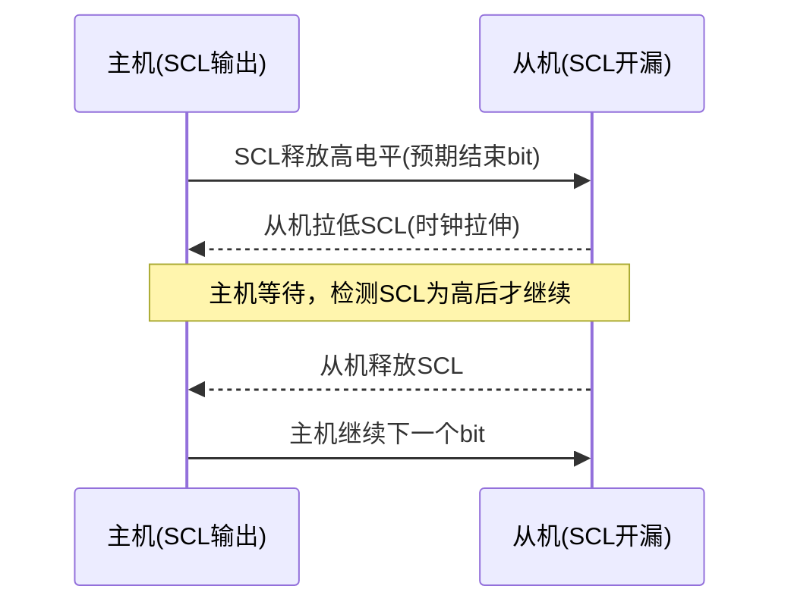

# I2C故障排查与逻辑分析仪 [I]

> **本章学习目标**：
> - 识别<span class="red">ACK缺失</span>、<span class="red">时钟拉伸</span>、<span class="red">总线死锁</span>三种典型I2C故障的波形特征
> - 掌握<span class="red">逻辑分析仪</span>抓取I2C信号的配置方法与数据解码流程
> - 理解Linux内核<span class="red">I2C调试日志</span>的输出级别与过滤技巧

---

## 常见I2C故障：ACK缺失、时钟拉伸与总线死锁

---

### <strong>ACK缺失：从机无响应的排查思路</strong>

<span class="red">ACK缺失</span>是I2C调试中最常见的故障。
<br>
主机发送从机地址后，SDA线在第9个时钟周期仍为高电平，即NACK。
<br>

<span class="blue">ACK缺失的本质：从机未正确接收地址字节，
<br>
或从机处于忙碌/复位/断电状态。</span><br>

**ACK缺失的根因排查表：**

| 排查层级 | 检查项 | 验证方法 |
| --- | --- | --- |
| 硬件连接 | SDA/SCL是否反接 | 万用表通断测试 |
| 硬件连接 | 上拉电阻是否缺失（典型4.7kΩ~10kΩ） | 示波器测量空闲电平 |
| 地址配置 | 从机地址是否匹配A2/A1/A0引脚 | 查阅数据手册核对 |
| 电气时序 | 信号边沿是否过缓（长走线+大电容） | 示波器测量上升沿 |
| 电源状态 | 从机供电是否正常 | 万用表测量VCC |
| 总线占用 | 是否有其他主机锁定总线 | 逻辑分析仪全程抓取 |

<span class="orange"><strong>1. 上拉电阻缺失的典型波形</strong></span><br>
无外部上拉时，SDA/SCL只能被拉低，无法主动拉高。
<br>
波形表现为信号"只有低电平没有高电平"，或高电平仅由弱漏电流维持。
<br>

<span class="orange"><strong>2. 地址配置错误的排查</strong></span><br>
<span class="green">LM75</span>基地址为0x48，若A0接VCC则地址变为0x49。
<br>
主机发送0x48时，A0=VCC的器件不会ACK。
<br>
用 `i2cdetect -y N` 扫描可发现实际响应地址。
<br>

<span class="orange"><strong>3. 电气时序不达标的判定</strong></span><br>
I2C标准模式要求SCL上升时间 < 1000ns。
<br>
过长走线或过多器件并联会导致RC常数过大，
<br>
从机可能错过START检测或位采样窗口。
<br>

---

### <strong>时钟拉伸：从机主动降速的机制与风险</strong>

<span class="red">时钟拉伸（Clock Stretching）</span>是I2C从机通过拉低SCL
<br>
来主动延长总线周期的机制。
<br>

<span class="blue">时钟拉伸的物理本质：从机内部处理速度跟不上总线速率，
<br>
通过占用SCL线强制主机等待。</span><br>



<span class="orange"><strong>1. 合法的时钟拉伸场景</strong></span><br>
<span class="green">EEPROM</span>在接收完一页数据后进入内部写入周期，
<br>
期间从机拉低SCL拒绝新的START，直到Flash擦写完成。
<br>
这是符合I2C规范的正常行为。
<br>

<span class="orange"><strong>2. 异常时钟拉伸：从机固件死锁</strong></span><br>
从机MCU中断服务程序未释放SCL，
<br>
导致SCL被永久拉低。
<br>
主机侧I2C控制器超时（通常25ms~35ms）后报错。
<br>

<span class="orange"><strong>3. 主机侧的时钟拉伸处理</strong></span><br>
Linux内核 <span class="green">i2c-bcm2835</span> 驱动默认开启时钟拉伸支持。
<br>
通过 `timeout-ms` 设备树属性配置最大等待时间。
<br>

```dts
// 设备树：配置I2C超时容忍
&i2c1 {
    clock-frequency = <100000>;
    timeout-ms = <100>;     /* 最大容忍100ms时钟拉伸 */
};
```

---

### <strong>总线死锁：SDA卡死的成因与恢复</strong>

<span class="red">总线死锁（Bus Stuck）</span>指SDA线被某设备永久拉低，
<br>
导致所有I2C事务无法发起START条件。
<br>

<span class="blue">总线死锁的核心特征：SCL正常，SDA恒低，
<br>
发送START条件失败（SDA无法从低到高跳变）。</span><br>

**死锁成因分析表：**

| 成因 | 触发条件 | 恢复方法 |
| --- | --- | --- |
| 从机复位中断 | 从机正在发送数据时主机复位 | 主机发送9个SCL时钟脉冲 |
| 从机异常拉低 | 从机GPIO配置错误或软件bug | 物理复位从机电源 |
| 主从竞争 | 多主机场景下仲裁失败 | 总线复位，重新初始化 |
| 热插拔 | 带电插拔导致信号冲突 | 避免热插拔，或加隔离器 |

<span class="orange"><strong>1. 软件恢复：9时钟脉冲法</strong></span><br>
I2C标准规定：主机可通过发送 <span class="green">9个SCL时钟脉冲</span>，
<br>
让从机完成未完成的发送并释放SDA。
<br>

```c
// 文件：i2c_bus_recovery.c
// 功能：GPIO模拟SCL脉冲恢复死锁SDA
#include <linux/gpio.h>

#define SCL_GPIO    23
#define SDA_GPIO    24

void i2c_bus_recovery(void)
{
    int i;
    
    gpio_direction_output(SCL_GPIO, 1);
    gpio_direction_input(SDA_GPIO);   /* 观察SDA状态 */
    
    if (gpio_get_value(SDA_GPIO) == 0) {
        /* SDA被卡住，发送9个SCL脉冲 */
        for (i = 0; i < 9; i++) {
            gpio_set_value(SCL_GPIO, 0);
            udelay(5);
            gpio_set_value(SCL_GPIO, 1);
            udelay(5);
            if (gpio_get_value(SDA_GPIO) == 1)
                break;   /* 从机已释放SDA */
        }
        /* 发送STOP条件 */
        gpio_set_value(SCL_GPIO, 0);
        udelay(5);
        gpio_direction_output(SDA_GPIO, 0);
        udelay(5);
        gpio_set_value(SCL_GPIO, 1);
        udelay(5);
        gpio_set_value(SDA_GPIO, 1);   /* STOP：SCL高时SDA上升沿 */
    }
}
```

<span class="orange"><strong>2. 硬件防护：I2C缓冲器与隔离器</strong></span><br>
<span class="green">PCA9517</span>是带死锁恢复功能的I2C缓冲器。
<br>
当检测到SDA被卡低超过 <span class="green">75ms</span> 时，
<br>
自动断开连接并发送恢复脉冲。
<br>

---

## 逻辑分析仪抓取与波形解读

---

### <strong>Saleae Logic 配置：I2C协议解码设置</strong>

<span class="red">Saleae Logic</span>是最常用的PC端逻辑分析仪，
<br>
支持实时I2C协议解码与数据分析。
<br>

**硬件连接规范：**

| 逻辑分析仪通道 | 目标信号 | 备注 |
| --- | --- | --- |
| CH0 | SCL | 必须接入，作为时钟基准 |
| CH1 | SDA | 必须接入，作为数据通道 |
| GND | 目标板GND | 共地，否则信号浮空 |

<span class="orange"><strong>1. 采样率设置原则</strong></span><br>
采样率应 ≥ 4倍SCL频率。
<br>
标准模式100kHz需 ≥ 400kS/s，推荐1MS/s以上。
<br>
高速模式400kHz需 ≥ 2MS/s，推荐4MS/s以上。
<br>

<span class="orange"><strong>2. 触发条件配置</strong></span><br>
使用 <span class="green">"SDA下降沿时SCL为高"</span> 作为START条件触发。
<br>
捕获模式选 <span class="green">"Normal"</span>，预触发缓冲设为25%
<br>
以保留触发前总线空闲状态的参考波形。
<br>

<span class="orange"><strong>3. I2C分析器添加</strong></span><br>
在Saleae软件中点击 <span class="green">"Add" → "I2C"</span>，
<br>
指定SCL和SDA对应通道，设置位序为MSB First。
<br>

---

### <strong>正常波形 vs 故障波形对比分析</strong>

<span class="red">正常I2C波形</span>的特征：
<br>
START（SCL高时SDA下降沿）→ 8位数据 → ACK（SDA低）→ ... → STOP。
<br>

**Saleae Logic解码输出示例（正常传输）：**

```text
Time [s],  Packet ID,  Type,   Data
0.001200,  0,          Start
0.001225,  0,          Address, 0x48 (Write)
0.001350,  0,          Data,    0x00
0.001475,  0,          Start
0.001500,  0,          Address, 0x48 (Read)
0.001625,  0,          Data,    0x19
0.001750,  0,          Data,    0x10
0.001875,  0,          NACK
0.001900,  0,          Stop
```

<span class="orange"><strong>1. ACK缺失波形特征</strong></span><br>
第9个SCL周期SDA保持高电平（NACK）。
<br>
Saleae解码器会标注 <span class="green">"NACK"</span>，
<br>
并在后续无STOP情况下可能出现重复START重试。
<br>

<span class="orange"><strong>2. 时钟拉伸波形特征</strong></span><br>
SCL低电平持续时间远超正常bit周期。
<br>
Saleae时标显示SCL低电平宽度 > 100μs（标准模式应约5μs）。
<br>
测量功能可精确量化拉伸时长。
<br>

<span class="orange"><strong>3. 总线死锁波形特征</strong></span><br>
SDA线在整个观测窗口恒为低电平。
<br>
发送START条件失败：SCL高时SDA无法产生上升沿。
<br>
逻辑分析仪无触发响应或触发后仅捕获空闲状态。
<br>

---

### <strong>类比：I2C总线故障与交通堵塞</strong>

<span class="blue">I2C总线故障可类比为道路交通系统的三类问题：</span><br>

| I2C故障 | 交通类比 | 核心特征 |
| --- | --- | --- |
| ACK缺失 | 导航地址错误 | 车辆到达后发现目的地不存在 |
| 时钟拉伸 | 前方道路施工限速 | 后方车辆必须排队等待 |
| 总线死锁 | 十字路口信号灯故障 | 所有方向车辆同时卡住 |

<span class="blue">三类问题的共同点是：总线（道路）资源被阻塞，
<br>
需要准确的诊断工具（逻辑分析仪/交通监控）定位瓶颈点。</span><br>

---

## Linux内核I2C调试与dmesg日志

---

### <strong>内核日志级别与I2C错误码解读</strong>

<span class="red">Linux I2C核心层</span>通过内核日志输出调试信息，
<br>
日志级别从 `KERN_ERR` 到 `KERN_DEBUG` 分层。
<br>

**常见I2C内核错误码表：**

| 错误码 | dmesg输出关键字 | 含义 | 常见根因 |
| --- | --- | --- | --- |
| -ENXIO | "NACK" | 从机无ACK响应 | 地址错误/设备未上电 |
| -ETIMEDOUT | "timeout" | 总线操作超时 | 时钟拉伸过长/死锁 |
| -EBUSY | "bus busy" | 总线被占用 | 多主机竞争或死锁 |
| -EIO | "I/O error" | 通用IO错误 | 信号完整性差 |
| -EAGAIN | "try again" | 暂时性失败 | 从机忙，需重试 |

<span class="orange"><strong>1. 启用I2C调试日志</strong></span><br>
内核编译时开启 <span class="green">CONFIG_I2C_DEBUG_CORE</span> 和 <span class="green">CONFIG_I2C_DEBUG_BUS</span>。
<br>
运行时通过动态调试开关控制输出：
<br>

```bash
# 开启i2c-core的调试日志
$ echo 'file drivers/i2c/i2c-core-base.c +p' > /sys/kernel/debug/dynamic_debug/control

# 开启具体适配器驱动日志
$ echo 'file drivers/i2c/busses/i2c-bcm2835.c +p' > /sys/kernel/debug/dynamic_debug/control
```

<span class="orange"><strong>2. dmesg典型输出解读</strong></span><br>

```bash
$ dmesg | grep i2c
[   12.345] i2c-bcm2835 3f804000.i2c: i2c transfer failed: -121
[   12.346] lm75 1-0048: Failed to read register: -121
[   12.347] i2c-bcm2835 3f804000.i2c: SDA may be stuck, attempting recovery
```

<span class="blue">解读：-121 对应 `-ENXIO`（即NACK），
<br>
`lm75` 驱动读取寄存器失败，
<br>
`i2c-bcm2835` 适配器尝试总线恢复（9时钟脉冲法）。</span><br>

---

### <strong>i2c-tools的调试模式与内核追踪</strong>

<span class="orange"><strong>1. strace跟踪i2cget系统调用</strong></span><br>

```bash
$ strace -e ioctl i2cget -y 1 0x48 0x00 w
ioctl(3, I2C_SLAVE, 0x48)       = 0
ioctl(3, I2C_SMBUS, 0xbe91e3a4) = 0
```

<span class="blue">`I2C_SMBUS` ioctl 的第三个参数是 `struct i2c_smbus_ioctl_data` 指针，
<br>
包含读写方向、寄存器地址、数据长度等信息。</span><br>

<span class="orange"><strong>2. ftrace抓取I2C适配器函数调用</strong></span><br>

```bash
# 启用I2C函数追踪
$ echo i2c_transfer > /sys/kernel/debug/tracing/set_ftrace_filter
$ echo function > /sys/kernel/debug/tracing/current_tracer
$ echo 1 > /sys/kernel/debug/tracing/tracing_on

# 执行I2C操作后查看追踪结果
$ cat /sys/kernel/debug/tracing/trace
# tracer: function
#                              _-----=> irqs-off
#                             / _----=> need-resched
#                            | / _---=> hardirq/softirq
#  i2c-bcm2835-3f8   [000] ...1   12345.670000: i2c_transfer <- __i2c_transfer
#  i2c-bcm2835-3f8   [000] ...1   12345.670010: i2c_transfer: i2c-1: faddr=0x48, nr=2
```

<span class="orange"><strong>3. i2cdetect的扫描原理与调试输出</strong></span><br>
`i2cdetect` 对每个地址执行 "写0字节+STOP" 探测：
<br>

```bash
$ i2cdetect -F 1          # 列出i2c-1支持的功能
$ i2cdetect -q 1          # 快速扫描（跳过BUSY检测）
$ i2cdetect -r 1          # 使用读取扫描（更安全）
```

<span class="blue">`-r` 模式发送START+地址（R）+STOP，
<br>
比默认写模式对设备更安全（不修改任何寄存器）。</span><br>

---

### <strong>历史演进：从示波器到逻辑分析仪</strong>

<span class="red">I2C调试工具</span>经历了三代演进：
<br>

**第一阶段：纯示波器时代（1980s~2000s）**<br>
工程师用双通道示波器观察SCL/SDA波形，
<br>
手动数bit位并查ASCII表解码。
<br>
效率极低，一个ACK缺失问题可能耗时数小时。
<br>

**第二阶段：协议分析仪时代（2000s~2010s）**<br>
专用I2C协议分析仪（如Tektronix、Agilent）
<br>
支持硬件级协议解码，但价格昂贵（$5000+）。
<br>

**第三阶段：PC逻辑分析仪时代（2010s~至今）**<br>
<span class="green">Saleae Logic</span>、<span class="green">DSLogic</span> 等USB逻辑分析仪
<br>
以百元级价格提供10MS/s+采样率和全自动协议解码。
<br>
配合开源软件 <span class="green">PulseView</span>（sigrok项目），
<br>
已成为嵌入式工程师的标准配置。
<br>

---

## 本章小结

| 概念 | 一句话总结 |
| --- | --- |
| ACK缺失 | 从机地址错误/未上电/上拉缺失，波形第9位高电平 |
| 时钟拉伸 | 从机拉低SCL降速，正常行为但过长则异常 |
| 总线死锁 | SDA被永久拉低，需9个SCL脉冲或硬件复位恢复 |
| Saleae Logic | PC逻辑分析仪，配置I2C解码器后自动解析地址和数据 |
| dmesg -121 | `ENXIO`错误码，通常表示NACK/从机无响应 |
| dynamic_debug | 内核动态调试开关，无需重编译即可开启日志 |

---

## 练习

1. 使用Saleae Logic抓取一次失败的I2C读取，描述波形上ACK缺失位置的时标和电平状态。
2. 编写一段Shell命令，通过 `dynamic_debug` 开启 `i2c-bcm2835` 驱动的全部调试日志，并解释输出中 "SDA may be stuck" 的含义。
3. 某设备频繁出现时序错误，逻辑分析仪显示SCL低电平持续时间约15ms。这是正常时钟拉伸还是异常死锁？请说明判断依据和恢复策略。
