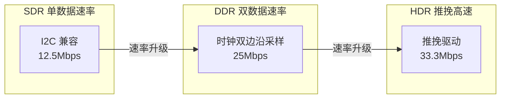

# I2C往哪发展——I3C替代与前沿演进

---

## I2C 的四大瓶颈

I2C 在 40 年的演进中逐渐触碰到物理极限，这四大瓶颈催生了 I3C 的诞生。

 

| 瓶颈 | 表现 | 影响 |
|------|------|------|
| 速率上限 | 开漏驱动 + RC 延迟，理论极限 ~1MHz | 高速传感器（图像、指纹）无法满足 |
| 静态地址 | 7-bit 地址池 112 个可用，同型号最多 8 个 | 手机 20+ 传感器时地址耗尽 |
| 无中断 | 需额外 GPIO 线连接每个传感器的中断输出 | PCB 引脚和走线成本增加 |
| 功耗 | 持续上拉电流，空闲时仍在消耗 | 可穿戴/电池设备续航受限 |

 

类比：I2C 如同"老式居民楼"——每家固定门牌号（静态地址），没有门铃（无中断），楼道灯常亮（持续上拉耗电），电梯速度封顶 1m/s（速率限制）。I3C 如同"智能公寓"——自动分配门牌号（动态地址），支持呼叫系统（带内中断），感应照明（推挽驱动省电），电梯速度 12m/s（速率提升）。

 

---

## MIPI I3C：I2C 的现代化继任者

### <strong>1. I3C 的兼容性设计</strong>

MIPI I3C由 MIPI Alliance 在 2016 年发布（v1.0），核心设计目标是**向后兼容 I2C 的同时实现数量级性能提升**。

 

**I2C vs I3C 全维度对比：**

| 特性 | I2C | I3C |
|------|-----|-----|
| 信号线 | 2（SDA + SCL） | 2（SDA + SCL），完全兼容 |
| 静态地址 | 7-bit，112 可用 | 动态分配，无冲突 |
| 最大速率 | 1 MHz（FM+） | 12.5 MHz SDR / 33.3 Mbps HDR |
| 中断 | 不支持（需额外 GPIO） | 带内中断（IBI） |
| 驱动方式 | 开漏（全时段） | 开漏/推挽自适应 |
| 功耗 | 静态上拉持续耗电 | HDR 推挽仅在翻转时耗电 |
| 热插拔 | 不支持 | 支持（ENTDAA 重新枚举） |
| 多主 | 支持（线与仲裁） | 支持（优先级仲裁） |
| 标准维护 | NXP | MIPI Alliance |

 

兼容性关键：I3C 总线可以混挂 I2C 设备。当主机访问 I2C 设备时，自动降级为开漏时序；访问 I3C 设备时，使用推挽高速模式。这是渐进式升级的核心设计。

 

### <strong>2. I3C 的速度阶梯：SDR → DDR → HDR</strong>

 

| 模式 | 速率 | 电气特性 | I2C 兼容性 |
|------|------|---------|-----------|
| SDR | 12.5 Mbps | 开漏/推挽自适应 | 可混挂 I2C Slave |
| HDR-DDR | ~16.6 Mbps | 推挽，双边沿 | 不兼容 I2C Slave |
| HDR-TSP | ~16.6 Mbps | 三态符号编码 | 不兼容 I2C Slave |
| HDR-DBL | ~33.3 Mbps | 推挽 + Bus Leveling | 不兼容 I2C Slave |

 

---

## 嵌入式总线选型决策框架

### <strong>1. 量化选型对比表</strong>

| 选型维度 | I2C | I3C | SPI | 决策权重 |
|---------|-----|-----|-----|---------|
| 器件成本 | 极低（$0.01~$0.05） | 较高（$0.10~$0.50） | 低（$0.02~$0.10） | 高 |
| 主控支持 | 100% MCU | 仅新型 MPU/MCU | 95% MCU | 中 |
| 最大速率 | 1 Mbps | 33.3 Mbps | 100+ Mbps | 高 |
| 引脚数 | **2** | **2** | 4+ | 高 |
| 多设备 | 127（地址限制） | 理论上无上限 | CS 线数量限制 | 中 |
| 中断支持 | 无（需 GPIO） | IBI（带内） | 无（需 GPIO） | 中 |
| 功耗效率 | 静态耗电 | 动态更优 | 推挽动态 | 中 |
| 标准成熟度 | 40 年积累 | 2017 发布，快速演进 | 事实标准 | 中 |

 

### <strong>2. 明确选 I2C 的场景</strong>

- 成本极度敏感（ pennies matter）
- 速率需求 < 100kbps（低速传感器、EEPROM）
- 主控芯片无 I3C 外设（大量存量 8-bit MCU）
- 供应链要求传统器件（汽车 AEC-Q100 认证周期长）
- 现有产品仅需维护，无重新设计预算

 

### <strong>3. 明确选 I3C 的场景</strong>

- 速率需求 > 1Mbps（图像传感器、高速 ADC）
- 传感器数量 > 16 个（手机、可穿戴设备阵列）
- 需要 In-Band Interrupt 节省 GPIO
- 需要热插拔或动态重配置
- 项目处于早期设计阶段，芯片选型自由

 

### <strong>4. 明确选 SPI 的场景</strong>

- 带宽需求 > 50MB/s（Flash 启动、高分辨率显示屏）
- 点对点通信，无多设备需求
- 全双工同时收发（ADC + DAC 同步）

 

---

## 历史演进与未来趋势

### <strong>1. 嵌入式总线速率演进时间线</strong>

| 年份 | 技术 | 速率 | 电气架构 | 关键突破 |
|------|------|------|---------|---------|
| 1982 | I2C Standard-mode | 100 kHz | 开漏 | 两线节省引脚 |
| 1992 | I2C Fast-mode | 400 kHz | 开漏 | 降额上拉电阻 |
| 2007 | I2C FM+ | 1 MHz | 开漏 | 更强驱动 IC |
| 2016 | MIPI I3C SDR | 12.5 MHz | 推挽 | 放弃开漏限速 |
| 2017 | I3C HDR-DDR | ~16.6 Mbps | 推挽 + 双边沿 | 编码效率提升 |
| 2020 | I3C HDR-DBL | ~33.3 Mbps | 推挽 + 均衡 | 信号完整性补偿 |
| 2024+ | I3C v1.1+ | 待发布 | 持续演进 | 更低功耗、更多 CCC |

 

### <strong>2. 未来趋势</strong>

**片上集成趋势：**

现代 SoC（如 i.MX RT、STM32H7）将 I2C 控制器直接集成到芯片内部，支持 DMA 传输和 FIFO 缓冲。这要求驱动开发从"位操作 GPIO"转向"配置 DMA 描述符"。

 

**传感器融合总线：**

高端手机中，I3C 总线不仅传输传感器数据，还通过 CCC 命令传输传感器融合算法的配置参数。一条总线同时承载数据平面和控制平面。

 

**车载与工业场景：**

I3C 正在向汽车电子扩展。AEC-Q100 认证的 I3C 传感器开始出现，用于车内环境监测（温度、湿度、空气质量）。

 

---

## 本章小结

 

| 概念 | 一句话总结 |
|------|-----------|
| I2C 四大瓶颈 | 速率1MHz封顶、静态地址池耗尽、无中断、持续上拉耗电 |
| I3C 兼容性 | 可混挂 I2C 设备，自动降级为开漏时序 |
| SDR | 12.5Mbps，开漏/推挽自适应，兼容 I2C |
| HDR-DDR | ~16.6Mbps，推挽双边沿，不兼容 I2C |
| HDR-DBL | ~33.3Mbps，Bus Leveling 均衡，需阻抗匹配 |
| IBI | 带内中断，省 GPIO，传感器主动上报 |
| ENTDAA | 动态地址分配，从机上电自动获取地址 |
| 选型 I2C | 成本敏感、低速、存量 MCU、维护项目 |
| 选型 I3C | 高速、多传感器、省 GPIO、新设计 |
| 选型 SPI | 极致带宽（Flash/显示屏）、全双工同步 |
| 车载趋势 | AEC-Q100 I3C 传感器进入汽车电子 |

 

---

## 练习

1. 某可穿戴设备有 6 个传感器（温度、心率、加速度、陀螺仪、气压、血氧），GPIO 只剩 4 根可用。从引脚数、速率、功耗三个维度分析应选 I2C、I3C 还是 SPI。

2. 对比 I2C 和 I3C 在"电池供电、10 个传感器、每秒采样一次"场景下的功耗差异。从静态上拉电流和动态推挽电流两个角度估算。

3. 某现有产品使用 I2C 连接 8 个传感器，现需新增 2 个高速图像传感器（8Mbps 数据率）。给出三种升级方案：纯 I3C、I2C+I3C 双总线、I3C 混挂，分析各自的 BOM 成本、软件改动量和性能。
