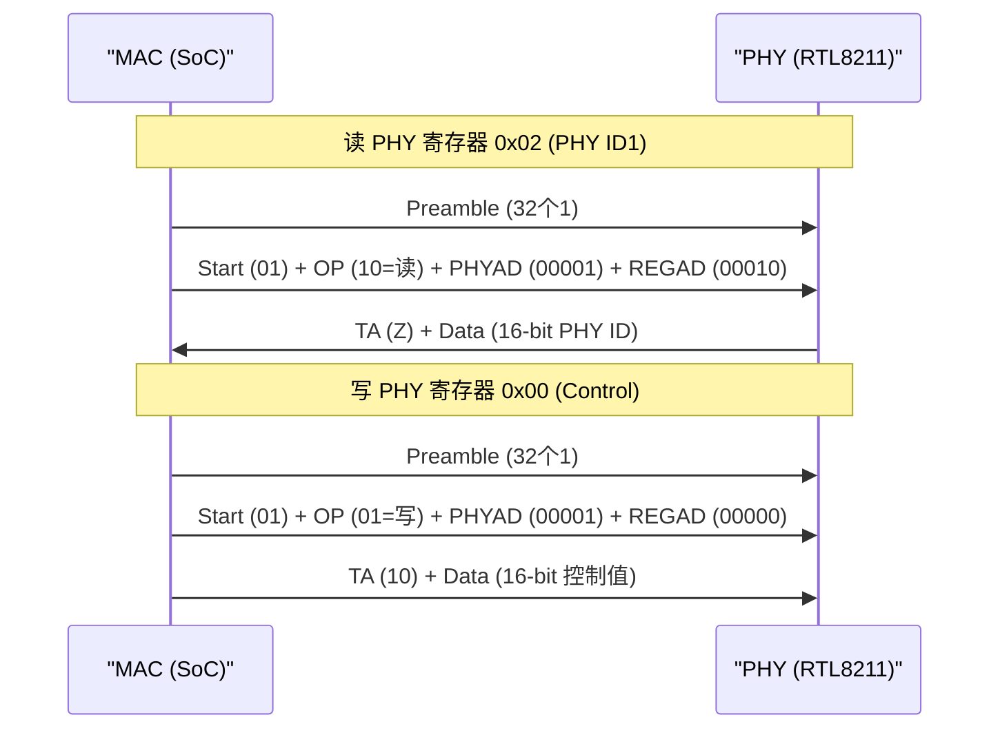

# MDIO 基础认知与 MII 接口 [I]

> **本章学习目标**：
> - 理解 MDIO（Management Data Input/Output）的以太网 PHY 管理定位
> - 掌握 MII/RMII/GMII 接口与 MDIO 的关系
> - 了解 MDIO 在交换机、路由器和工业以太网中的典型应用

---

## MDIO 的诞生：以太网 PHY 管理的标准化

---

### <strong>为什么需要 MDIO：PHY 寄存器的统一访问</strong>

MDIO是 IEEE 802.3 标准的一部分，
 
最早出现在1995 年的 MII（Media Independent Interface）规范中。
 

在 MDIO 出现之前，每个以太网芯片厂商使用私有接口访问 PHY 寄存器：
 
* Intel 用一组 GPIO 模拟 SPI
 
* AMD 用并行地址/数据线
 
* National Semiconductor 用自定义串行协议
 

MDIO 统一了 PHY 管理接口，使操作系统和驱动程序可以通用地控制任何符合 802.3 的 PHY 芯片。
 

类比：MDIO 如同"医院病历系统"——无论哪个科室（PHY 厂商），都用同一套表格（寄存器定义）记录病人信息（链路状态、速率、双工模式）。
 

---

### <strong>MDIO 的信号定义与时序</strong>

MDIO使用 2 根线：
 

| 信号名 | 全称 | 方向 | 说明 |
| --- | --- | --- | --- |
| MDC | Management Data Clock | 主机→PHY | 管理时钟，最高 2.5MHz |
| MDIO | Management Data I/O | 双向 | 数据，开漏驱动 |

MDIO 帧格式：Preamble(32bit 1) + Start(01) + OP(2bit) + PHYAD(5bit) + REGAD(5bit) + TA(2bit) + Data(16bit)。
 

---

### <strong>MII 家族：从 MII 到 RGMII 的演进</strong>

MII是 MAC 层与 PHY 层之间的数据接口，MDIO 是管理接口：
 

| 接口 | 数据线数 | 时钟 | 速率 | 典型应用 |
| --- | --- | --- | --- | --- |
| MII | 16 (4×TX + 4×RX + 控制) | 25MHz | 100Mbps | 早期嵌入式 |
| RMII | 7 (2×TX + 2×RX + 控制) | 50MHz | 100Mbps | 引脚受限的 SoC |
| GMII | 24 (8×TX + 8×RX + 控制) | 125MHz | 1Gbps | 千兆以太网 |
| RGMII | 12 (4×TX + 4×RX + 控制 + 时钟) | 125MHz DDR | 1Gbps | 现代千兆 SoC |
| SGMII | 2 (差分对) | 1.25Gbps 串行 | 1Gbps | 高端交换机 |

MDIO 与 MII 的关系：MDIO 负责"配置和控制"（慢速管理），MII 负责"数据传输"（高速数据）。两者配合完成以太网通信。
 

---

## 本章小结

| 概念 | 一句话总结 |
| --- | --- |
| MDIO | IEEE 802.3 定义的 PHY 管理接口，2 线串行 |
| MDC/MDIO | 管理时钟/数据，类似 I2C 但专用于以太网 |
| MII | MAC-PHY 数据接口，16 线，100Mbps |
| RMII | MII 的精简版，7 线，50MHz |
| GMII/RGMII | 千兆接口，24/12 线 |
| PHY 寄存器 | 标准寄存器 0-31，厂商扩展 32-63 |

---

## 练习

1. 为什么 MDIO 使用开漏驱动？如果 MDC 频率超过 2.5MHz 会怎样？
2. 在 Linux 内核中，如何读取 PHY 的链路状态寄存器（Register 0x01）？
3. 设计一个工业以太网网关：SoC 通过 RGMII 连接 RTL8211 PHY，画出 MDIO + RGMII 的完整接口图。
