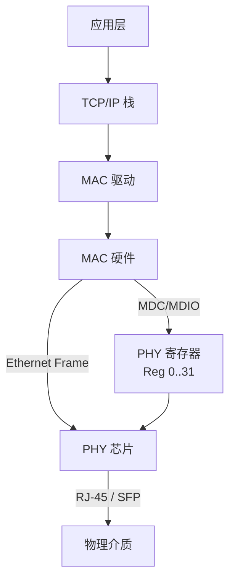

# MDIO是什么——以太网PHY管理总线

<span class="badge-b">[B]</span> <span class="badge-i">[I]</span> <span class="badge-e">[E]</span> <span class="badge-m">[M]</span>

<span class="red">MDIO（Management Data Input/Output）是 IEEE 802.3 定义的以太网 PHY 管理总线。</span><br>
它不传输数据包，只读写 PHY 内部寄存器——就像物业管理处查电表水表，不能用来搬家。<br>
理解 MDIO 的边界（能做什么、不能做什么），是调试以太网的第一步。

---

## 核心定义与价值

<span class="red">MDIO 定义：两根线（MDC + MDIO）组成的串行管理总线，用于 MAC 层读写 PHY 芯片的寄存器。</span>

| 信号 | 方向 | 作用 | 电气特性 |
|------|------|------|----------|
| <span class="green">MDC</span>（Management Data Clock） | MAC → PHY | 提供同步时钟 | ≤ 2.5 MHz，上升沿采样 |
| <span class="green">MDIO</span>（Management Data I/O） | 双向 | 传输管理帧数据 | 开漏/三态，上拉电阻 |

<br>

<span class="blue">MDIO 与数据路径完全分离。</span><br>
即使 MDIO 总线故障，PHY 的数据通道（MII/RGMII/SGMII）仍可正常转发数据包。<br>
只是 MAC 无法读取链路状态、协商速率、配置 LED 等行为。<br>

---

### 类比：物业管理处

想象一栋公寓楼。<br>
住户（PHY）每天正常使用水电（数据包收发）。<br>
物业管理处（MAC）通过一个小窗口（MDIO）查每家的电表读数（寄存器）。<br>
物业不能通过查电表窗口帮住户搬家（传输数据包），那不是它的设计目的。<br>
<span class="blue">MDIO = 查电表水表的专用通道；数据通道 = 搬家用的货梯。</span><br>
两者物理分离、功能独立。

---

## 核心机制原理解析

### <strong>1. MDIO 在以太网分层中的位置</strong>



<br>

<span class="blue">MDIO 属于站管理接口（Station Management Interface, SMI），在 OSI 模型中位于物理层之上、数据链路层之下。</span><br>

---

### <strong>2. Clause 22 vs Clause 45：两代人的对话</strong>

<span class="red">IEEE 802.3 定义了两套 MDIO 帧格式：Clause 22（传统）和 Clause 45（扩展）。</span>

| 特性 | <span class="green">Clause 22</span> | <span class="green">Clause 45</span> |
|------|------------|------------|
| 标准来源 | IEEE 802.3-1995 §22 | IEEE 802.3ae-2002 §45 |
| PHY 地址宽度 | 5 bit（0-31） | 5 bit Port + 5 bit Device |
| 寄存器地址 | 5 bit（0-31） | 16 bit（0-65535） |
| 数据位宽 | 16 bit | 16 bit |
| 帧格式 | Preamble + ST + OP + PHYAD + REGAD + TA + DATA | 扩展前导 + ST + OP + Port + Device + TA + DATA |
| 支持速率 | 10/100/1000BASE-T | 10G/25G/40G/100G |
| Linux 驱动 | `mdio_bus` 原生支持 | `mdio_bus` 扩展支持 |

<br>

<span class="blue">Clause 22 的 32 个寄存器足以管理传统百兆/千兆 PHY；Clause 45 为万兆以上 PHY 的复杂寄存器空间提供扩展。</span><br>
绝大多数嵌入式场景接触的是 Clause 22。<br>

---

### <strong>3. 与 I2C/SPI 的对比</strong>

| 维度 | <span class="green">MDIO</span> | <span class="green">I2C</span> | <span class="green">SPI</span> |
|------|---------|---------|---------|
| 设计目标 | PHY 管理 | 通用外设 | 高速板内 |
| 时钟线 | MDC（MAC 驱动） | SCL（主/从均可） | SCLK（主设备驱动） |
| 数据线 | MDIO（双向） | SDA（双向） | MOSI + MISO |
| 寻址 | PHYAD 5 bit | 7/10 bit 地址 | CS 片选 |
| 速率 | ≤ 2.5 MHz | 100/400 kHz | 可达 MHz~百 MHz |
| 寄存器空间 | 固定 32 个（Clause 22） | 设备自定义 | 设备自定义 |
| 标准化 | IEEE 802.3 强标准 | Philips 标准，较灵活 | de-facto |

<br>

<span class="blue">MDIO 的核心差异化：专为 PHY 寄存器访问设计，寄存器语义标准化（Reg 0 = Control，Reg 1 = Status）。</span><br>
不像 I2C 的寄存器语义完全由厂商自定义。<br>

---

## 技术教学与实战

### <strong>MDIO 在设备树中的描述</strong>

```dts
mdio {
    compatible = "snps,dwmac-mdio";
    #address-cells = <1>;
    #size-cells = <0>;

    ethernet-phy@0 {
        reg = <0>;              // PHYAD = 0
        phy-handle = <&phy0>;
    };
};
```

<span class="green">reg = <0></span> 设置 PHY 地址。<br>
若设备树地址与 PHY 芯片硬件引脚（PHYAD[4:0]）不匹配，通信将完全失败。<br>

---

## 嵌入式专属实战场景

### <strong>场景：确认 PHY 地址</strong>

新板卡网口不亮，排查 MDIO：<br>

1. 查看 PHY 芯片 datasheet，确认 PHYAD 引脚电平（如 PHYAD0=0, PHYAD1=1 → 地址 = 2）<br>
2. 核对设备树 `reg` 值是否与硬件一致<br>
3. `dmesg | grep mdio` 查看 probe 结果<br>
4. 用 `mdio-tools` 扫描地址 0-31 确认 PHY 响应<br>

---

## 历史演进与前沿

| 年代 | 标准 | 意义 |
|------|------|------|
| 1995 | Clause 22 | 百兆以太网 PHY 管理标准化 |
| 2002 | Clause 45 | 万兆 PHY 寄存器扩展 |
| 2010s | RGMII/SGMII | 数据通道缩线，MDIO 保留 |
| 2020+ | 车载以太网 | MDIO 管理 100BASE-T1 PHY |

<span class="purple">扩展阅读：IEEE 802.3-2018 §22 / §45 完整帧格式与时序规范。</span><br>

---

## 本章小结

| 主题 | 要点 |
|------|------|
| MDIO 定义 | MDC（时钟 ≤2.5MHz）+ MDIO（双向数据），管理 PHY 寄存器 |
| 与数据分离 | MDIO 故障不影响数据转发，仅无法读写寄存器 |
| Clause 22 | 5-bit PHYAD + 5-bit REGAD，32 寄存器，百兆/千兆 |
| Clause 45 | 扩展 16-bit 地址，支持万兆+ PHY |
| 与 I2C/SPI | 专为 PHY 设计，寄存器语义标准化 |
| 调试关键 | 确认 PHY 地址、设备树匹配、probe 日志 |

---

## 练习

1. MDIO 为什么不承载以太网数据包？这种分离设计有什么好处？
2. Clause 22 和 Clause 45 的主要差异是什么？什么场景必须切到 Clause 45？
3. 若 PHY 芯片的 PHYAD[2:0] = 101，设备树应如何配置 `reg`？
4. 对比 MDIO 与 I2C 在寄存器语义标准化上的差异，这对驱动开发有什么影响？
