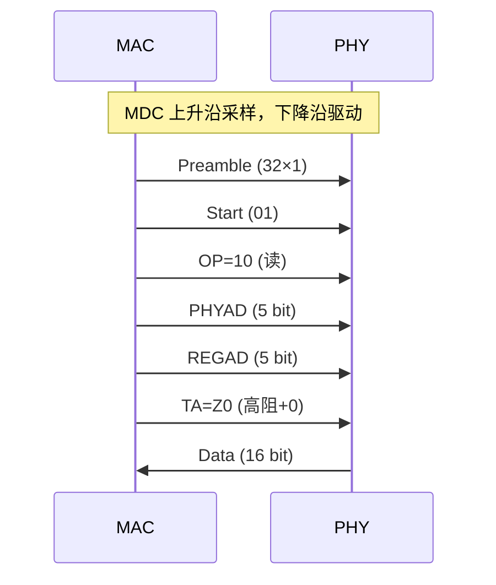

<span class="badge-i">[I]</span><span class="badge-e">[E]</span>

# MDIO 寄存器读写与 PHY 探测

<span class="red">Clause 22 帧格式定义了 Preamble、Start、OP、PHYAD、REGAD、TA、Data 等字段，精确到每一位的编码规则是 MDIO 通信的底层基础。</span>

---

### 为什么需要 MDIO

以太网 PHY 芯片包含大量可配置寄存器——自协商使能、速率选择、环回测试、LED 控制等。<br>
<span class="red">如果没有统一的管理接口</span>，每个厂商都需要私有的 GPIO 序列来配置 PHY，驱动开发沦为重复的体力活。<br>
MDIO（Management Data Input/Output）作为 IEEE 802.3 标准的一部分，用 **两根线（MDC 时钟 + MDIO 数据）** 统一了所有 PHY 的寄存器访问方式，<br>
使 MAC 层驱动可以通用地探测、配置和监控任何兼容 PHY。


## Clause 22 帧格式

<span class="red">一次完整的 MDIO 读写包含 64 个时钟周期：32 位前导码 + 2 位起始码 + 2 位操作码 + 5 位 PHY 地址 + 5 位寄存器地址 + 2 位周转时间 + 16 位数据。</span>

### 字段级位图

```
Preamble    Start    OP      PHYAD    REGAD    TA      Data
[31:0]      [33:32]  [35:34] [40:36]  [45:41]  [47:46] [63:48]

值： 32×1     01       读=10  0-31     0-31     读=Z0   16 bit
                        写=01                    写=10
```

| 字段 | 位宽 | 值 | 说明 |
|------|------|----|------|
| Preamble | 32 bit | 全 1 | 同步时钟，可选缩短 |
| Start | 2 bit | 01 | 帧起始标记 |
| OP | 2 bit | 10=读, 01=写 | 操作类型 |
| PHYAD | 5 bit | 0-31 | PHY 地址 |
| REGAD | 5 bit | 0-31 | 寄存器地址 |
| TA | 2 bit | 读=Z0, 写=10 | 周转时间 |
| Data | 16 bit | - | 寄存器值 |

### 读操作时序



TA 阶段第一 bit 为高阻（Z），PHY 接管总线；第二 bit PHY 驱动为 0。MAC 在 TA 后采样 16 位数据。

### 写操作时序

写操作的 TA 阶段为 10（MAC 驱动），无高阻切换，因为数据由 MAC 发送。写操作后 PHY 在下一个 MDC 周期开始处理写入值。

---

## 寄存器读写操作

<span class="red">读写 PHY 寄存器是诊断链路问题的第一步，Linux 提供 mdio-tools 和 ethtool 两种用户空间工具。</span>

### mdio-tools

```bash
# 读取 PHY 地址 1 的寄存器 0（Control）
$ mdio bus0 1 0
0x1140

# 写入寄存器 0，强制 100M 全双工
$ mdio bus0 1 0 0x2100

# 读取所有寄存器
$ mdio bus0 1
```

### ethtool -m 输出解读

```bash
# 命令说明
$ ethtool -m eth0
	Settings for eth0:
		Supported ports: [ TP MII ]
		Supported link modes:   10baseT/Half 10baseT/Full
		                        100baseT/Half 100baseT/Full
		                        1000baseT/Full
		Advertised link modes:  1000baseT/Full
		Speed: 1000Mb/s
		Duplex: Full
		Auto-negotiation: on
		Link detected: yes
```

| 字段 | 含义 |
|------|------|
| Speed | 当前协商速率 |
| Duplex | 双工模式 |
| Auto-negotiation | 是否启用自协商 |
| Link detected | 链路是否建立 |

### 寄存器诊断流程

1. 读寄存器 1（Status），检查 bit 2（Link Status）是否为 1
2. 读寄存器 17/18（Status 2 / Ext Status），确认 1000M 能力
3. 读寄存器 4/5/9/10，检查自协商过程和链接伙伴能力
4. 读错误计数器，判断是否存在物理层丢包
5. 读寄存器 0，确认速率/双工强制配置是否正确

---

## 自动协商机制

<span class="red">自动协商（Auto-Negotiation, ANEG）通过 FLP（Fast Link Pulse）脉冲交换能力信息，双方取交集确定最优工作模式。</span>

### 寄存器能力广告

| 寄存器 | 作用 |
|--------|------|
| 4 | 10M 能力广告（位 5:0） |
| 9 | 1000M 能力广告（位 9:8） |
| 5 | 链接伙伴 10M 能力 |
| 10 | 链接伙伴 1000M 能力 |

寄存器 4 的 bit 5 为 100M 全双工广告，bit 6 为 100M 半双工广告。寄存器 9 的 bit 8 为 1000M 全双工广告，bit 9 为 1000M 半双工广告。

### 协商过程

1. 双方上电后发送 FLP 脉冲（持续发送）
2. 收到对方 FLP 后解析能力字段
3. 取双方能力的最高交集
4. 置位寄存器 1 bit 5（Auto-Negotiation Complete）
5. 链路建立，开始数据传输

<span class="blue">易错点：一端强制 100M 全双工，另一端自协商，会导致双工不匹配（一端全双工、一端半双工），产生大量 late collision 错误。</span>

### 双工不匹配的症状

- ethtool 显示 Link detected: yes
- ifconfig 显示 RX errors 持续增长
- 小流量 ping 正常，大流量传输丢包严重
- dmesg 报告 "eth0: Duplex mismatch"

解决方式：两端统一配置，要么都启用自动协商，要么都强制相同的速率和双工模式。

---

## Linux mdio_bus_read/write

<span class="red">内核驱动通过 mdiobus_read/mdiobus_write 访问 PHY 寄存器，这是编写以太网驱动的核心 API。</span>

```c
#include <linux/mdio.h>
#include <linux/phy.h>

// 读取 PHY 寄存器
int phy_read(struct phy_device *phydev, int regnum)
{
    return mdiobus_read(phydev->mdio_bus, phydev->mdio_addr, regnum);
}

// 写入 PHY 寄存器
int phy_write(struct phy_device *phydev, int regnum, u16 val)
{
    return mdiobus_write(phydev->mdio_bus, phydev->mdio_addr, regnum, val);
}

// 典型用法：读取链路状态
static int check_link(struct phy_device *phydev)
{
    int val = phy_read(phydev, MII_BMSR);  // 寄存器 1
    if (val < 0) return val;
    return (val & BMSR_LSTATUS) ? 1 : 0;  // bit 2 = Link Status
}
```

### mdiobus 结构体

```c
// 功能说明
struct mii_bus {
    struct device *parent;
    const char *name;
    int id;
    void *priv;
    int (*read)(struct mii_bus *bus, int phy_id, int regnum);
    int (*write)(struct mii_bus *bus, int phy_id, int regnum, u16 val);
    struct phy_device *phy_map[PHY_MAX_ADDR];
};
```

<span class="blue">易错点：mdiobus_read 返回 int，高 16 位为错误码。直接判断返回值是否为负即可检测通信失败。实际数据在返回值低 16 位中。</span>

### 错误码处理

```c
int val = mdiobus_read(bus, phy_addr, MII_BMSR);
if (val < 0) {
    dev_err(&bus->dev, "MDIO read failed: %d\n", val);
    return val;
}
u16 reg_val = (u16)val;  // 取低 16 位
```

---

## 小节

- Clause 22 帧格式为 32+2+2+5+5+2+16 = 64 位，每个字段严格按时序驱动。
- 读操作 TA 阶段为高阻+0，PHY 接管总线回传数据；写操作 TA 阶段为 10。
- mdio-tools 和 ethtool 是用户空间诊断 PHY 的利器。
- 自动协商通过 FLP 交换能力，强制模式必须与链路伙伴严格匹配。
- 内核驱动通过 mdiobus_read/write 访问 PHY，注意返回值错误码检查。
- 双工不匹配是现场最常见故障，表现为小流量正常、大流量丢包。

---

## 历史演进与发展趋势

MDIO（Management Data Input/Output）伴随 IEEE 802.3u 快速以太网标准于 1995 年诞生，与 MII（Media Independent Interface）一起解决了 MAC 层与 PHY 层的寄存器访问问题。2000 年前后，随着千兆以太网普及，GMII/RGMII 等简化接口相继推出，MDIO 的时钟频率从 2.5MHz 提升到 25MHz（Clause 45）。2005 年后，10G/40G/100G 以太网引入更复杂的 PCS/PMA 层，MDIO 的寄存器空间从 5 位扩展到 16 位。Linux 内核从 2.6 版本开始内置 `mdio_bus` 子系统，2015 年后 Device Tree 成为描述 PHY 连接的标准方式。现代交换机芯片集成数十个 PHY，MDIO 多路复用器和 GPIO-bitbang 方案成为常态，而 netlink-based mdio 工具正在替代传统 ioctl 接口。

---

## 本章小结

| 要点 | 内容 |
|------|------|
| 接口定义 | MDC（时钟，≤2.5MHz）+ MDIO（双向数据），配合 MII/RMII/RGMII |
| 帧格式 | Preamble + Start + Opcode + PHY Addr + Reg Addr + Turn-around + Data |
| 寄存器空间 | Clause 22（5-bit 地址，32 个寄存器）/ Clause 45（16-bit 地址扩展） |
| Linux 生态 | mdio_bus 子系统、phy_device 结构体、Device Tree phy-handle 绑定 |

## 练习

1. MDIO 接口使用哪两根信号线？MDC 和 MDIO 的方向分别是什么？MDIO 的数据帧格式中，Opcode 字段的 01 和 10 分别代表什么操作？
2. 为什么 MII 接口有 16 根数据线而 RMII 只有 10 根？RGMII 又是如何通过双边沿采样将数据线进一步减少到 12 根的？请对比三者的应用场景。
3. 在 Linux 内核中，`mdio_bus` 子系统如何将 PHY 设备注册为 `struct phy_device`？`phydev->drv` 指针在什么时机被填充？Device Tree 中的 `phy-handle` 属性起什么作用？
