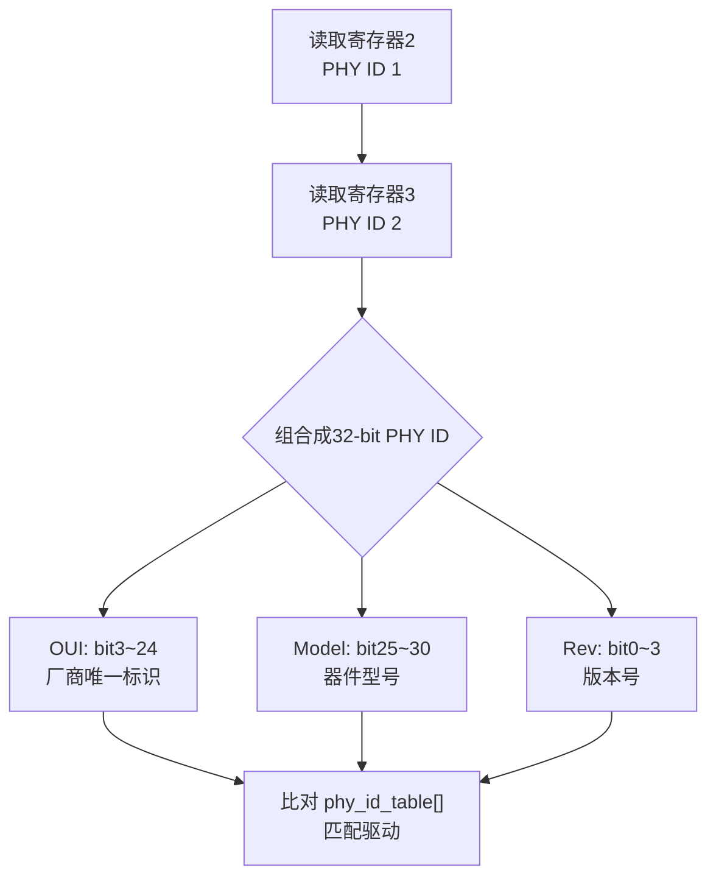
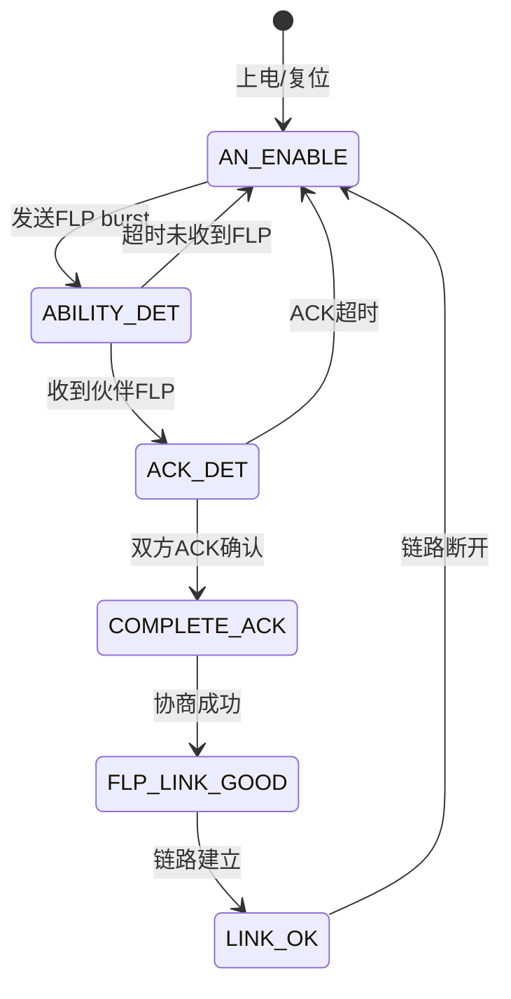

# MDIO寄存器读写与PHY探测 [I]

> **本章学习目标**：
> - 掌握<span class="red">Clause 22</span>和<span class="red">Clause 45</span>的MDIO帧格式与寄存器空间差异
> - 理解<span class="red">PHY ID探测</span>的OUI、型号、版本号解码流程
> - 分析<span class="red">Auto-Negotiation</span>的自协商机制与链路伙伴能力交换过程

---

## Clause 22/45寄存器体系

---

### <strong>IEEE 802.3 MDIO Clause的历史演进</strong>

<span class="red">MDIO（Management Data Input/Output）</span>是IEEE 802.3定义的以太网PHY管理接口，
<br>
用于MAC通过两线串行总线读写PHY内部寄存器。
<br>

<span class="blue">Clause 22发布于1995年，定义了5-bit PHY地址和16-bit寄存器空间。
<br>
随着千兆以太网发展，16个寄存器远远不够，
<br>
2004年发布的Clause 45将地址空间扩展为32-bit，支持MMD（MDIO Manageable Device）子设备。
<br>
</span><br>

**Clause 22 vs Clause 45 核心差异表：**

| 特性 | Clause 22 | Clause 45 |
| --- | --- | --- |
| 发布年份 | 1995 | 2004 |
| PHY地址位宽 | 5-bit（0~31） | 5-bit Port地址 + 5-bit Device地址 |
| 寄存器位宽 | 16-bit | 16-bit |
| 寄存器数量 | 32个（0~31） | 最多65536个（32个MMD × 每MMD 2048寄存器） |
| 帧格式 | 起始+OP+PHYAD+REGAD+TA+DATA | 起始+OP+PHYAD+DEVAD+TA+ADDR/DATA |
| 适用速率 | 10/100/1000BASE-X | 10GBASE-X及以上、SGMII |
| 向后兼容 | — | 支持Clause 22的寄存器映射 |

<span class="orange"><strong>1. Clause 22帧格式</strong></span><br>
标准MDIO帧结构：
<br>
`Preamble(32-bit 1) + Start(01) + OP(2-bit) + PHYAD(5-bit) + REGAD(5-bit) + TA(2-bit) + DATA(16-bit)`
<br>
OP=10为读，OP=01为写。
<br>

<span class="orange"><strong>2. Clause 45帧格式</strong></span><br>
扩展帧结构分地址帧和数据帧：
<br>
地址帧：`Start(00) + OP(00=地址) + PortAD + DevAD + TA + REGADDR(16-bit)`
<br>
数据帧：`Start(00) + OP(10=读/01=写) + PortAD + DevAD + TA + DATA(16-bit)`
<br>
DevAD标识MMD子设备类型（如PMA/PMD=1，PCS=3，PHY XS=4）。
<br>

---

### <strong>Clause 22寄存器0~31定义详解</strong>

<span class="red">Clause 22定义了32个标准寄存器</span>，
<br>
其中寄存器0~15为强制实现，16~31为可选扩展。
<br>

**Clause 22寄存器0~31定义表：**

| 寄存器 | 名称 | R/W | 核心功能 | 关键位 |
| --- | --- | --- | --- | --- |
| 0 | Control | R/W | 软复位、速率选择、自协商使能 | RST(bit15)、ANEG(bit12)、Speed(bit6,13) |
| 1 | Status | RO | 链路状态、能力、自协商完成 | Link(bit2)、ANEG_C(bit5)、ExtCap(bit0) |
| 2 | PHY ID 1 | RO | OUI高16-bit（bit3~18） | OUI[21:6] |
| 3 | PHY ID 2 | RO | OUI低6-bit + 型号 + 版本 | OUI[5:0](bit15:10)、Model(bit9:4)、Rev(bit3:0) |
| 4 | Auto-Neg Adv | R/W | 本机自协商能力公告 | 10BASE-T(bit5)、100BASE-TX(bit8)、Pause(bit10,11) |
| 5 | Auto-Neg Link | RO | 链路伙伴能力 | 伙伴公告的速率/双工/流控能力 |
| 6 | Auto-Neg Exp | RO | 自协商扩展状态 | Page Rx(bit1)、NPR(bit2) |
| 9 | 1000BASE-X Ctrl | R/W | 1000BASE-X控制 | 1000BASE-X使能、自协商 |
| 10 | 1000BASE-X Stat | RO | 1000BASE-X状态 | 伙伴1000BASE-X能力 |
| 17~18 | SGMII/RGMII | R/W | 特定实现 | 接口模式、延迟线调节 |
| 31 | Page Select | R/W | 扩展页选择 | 访问 vendor-specific 页 |

<span class="orange"><strong>1. Control寄存器（寄存器0）</strong></span><br>
<span class="green">bit15 RST</span>：置1触发软复位，复位完成后硬件自动清零。
<br>
<span class="green">bit12 ANEG</span>：自协商使能，1=启用，0=强制模式。
<br>
<span class="green">bit13 Speed[1]</span> + <span class="green">bit6 Speed[0]</span>：速率选择。
<br>
00=10Mbps，01=100Mbps，10=1000Mbps，11=保留。
<br>

<span class="orange"><strong>2. Status寄存器（寄存器1）</strong></span><br>
<span class="green">bit2 Link</span>：链路状态，1=链路建立，0=链路断开。
<br>
该位是latch-low类型，链路断开时锁存，读寄存器后清零。
<br>
<span class="green">bit5 ANEG_C</span>：自协商完成，1=协商成功。
<br>
<span class="green">bit0 ExtCap</span>：扩展寄存器能力，1=支持寄存器16~31。
<br>

---

### <strong>Linux mdio_bus代码实现</strong>

```c
// 文件：mdio_read_write.c
// 功能：Linux内核mdio_bus读写PHY寄存器
#include <linux/mdio.h>
#include <linux/phy.h>

/* 通过mdio_bus读取Clause 22寄存器 */
int mdio_read_clause22(struct mii_bus *bus, int phy_addr, int reg_addr)
{
    /* bus->read() 由具体控制器驱动实现（如stm32mp1, iproc等） */
    return bus->read(bus, phy_addr, reg_addr);
}

int mdio_write_clause22(struct mii_bus *bus, int phy_addr,
                        int reg_addr, u16 val)
{
    return bus->write(bus, phy_addr, reg_addr, val);
}

/* Clause 45地址帧+数据帧操作 */
int mdio_read_clause45(struct mii_bus *bus, int prtad, int devad,
                       int reg_addr)
{
    int ret;
    
    /* 步骤1：发送地址帧，写入目标寄存器地址 */
    ret = bus->write(bus, prtad, devad | MII_ADDR_C45, reg_addr);
    if (ret < 0)
        return ret;
    
    /* 步骤2：发送数据帧，读取寄存器值 */
    return bus->read(bus, prtad, devad | MII_ADDR_C45);
}
```

<span class="blue">Linux mdio_bus的设计：将MDIO底层时序封装在 `struct mii_bus` 中，
<br>
上层PHY驱动通过统一的read/write接口操作，
<br>
无需关心控制器是Clause 22还是Clause 45。
<br>
</span><br>

---

## PHY ID探测链路

---

### <strong>PHY ID寄存器的解码流程</strong>

<span class="red">PHY ID</span>由寄存器2和寄存器3共同构成32-bit唯一标识，
<br>
用于软件识别PHY型号并加载对应驱动。
<br>



**常见PHY厂商OUI对照表：**

| 厂商 | OUI（hex） | 典型型号 | 寄存器2值 | 寄存器3典型值 |
| --- | --- | --- | --- | --- |
| Realtek | 0x001CC8 | RTL8211E | 0x001C | 0xC800~C8FF |
| Micrel/KSZ | 0x000885 | KSZ8081 | 0x0008 | 0x8500~85FF |
| Marvell | 0x000504 | 88E1111 | 0x0005 | 0x0400~04FF |
| Texas Instr. | 0x080028 | DP83848 | 0x0800 | 0x2800~28FF |
| Microchip | 0x0001F0 | LAN8720 | 0x0001 | 0xF000~F0FF |

<span class="orange"><strong>1. PHY ID探测的Linux实现</strong></span><br>

```c
// 文件：phy_id_probe.c
// 功能：Linux PHY ID探测与驱动匹配
#include <linux/phy.h>

/* PHY驱动注册时的ID表 */
static struct phy_device_id rtl8211e_ids[] = {
    { .phy_id = 0x001cc800, .phy_id_mask = 0x001ffff0,
      .name = "RTL8211E" },
    { .phy_id = 0x001cc910, .phy_id_mask = 0x001ffff0,
      .name = "RTL8211E-VB" },
    { } /* 终止符 */
};

static struct phy_driver rtl8211e_driver = {
    .phy_id         = 0x001cc800,
    .phy_id_mask    = 0x001ffff0,
    .name           = "Realtek RTL8211E",
    .features       = PHY_GBIT_FEATURES,
    .config_init    = rtl8211e_config_init,
    .config_aneg    = genphy_config_aneg,
    .read_status    = genphy_read_status,
};

/* 内核探测流程 */
int phy_probe(struct phy_device *phydev)
{
    u32 phy_id;
    
    /* 读取寄存器2和3 */
    phy_id = (mdiobus_read(phydev->bus, phydev->addr, 2) << 16) |
              mdiobus_read(phydev->bus, phydev->addr, 3);
    
    /* 提取OUI */
    phydev->oui = (phy_id >> 10) & 0x3FFFFF;
    /* 提取Model */
    phydev->model = (phy_id >> 4) & 0x3F;
    /* 提取Revision */
    phydev->revision = phy_id & 0xF;
    
    /* 比对phy_id_table匹配驱动 */
    return phy_device_probe(phydev);
}
```

<span class="blue">PHY ID探测的意义：同一MDIO总线上可挂接不同厂商PHY，
<br>
内核通过读取PHY ID自动匹配正确的驱动程序，
<br>
避免手动指定型号的人为错误。
<br>
</span><br>

---

## Auto-Negotiation

---

### <strong>自协商的FLP脉冲与能力交换</strong>

<span class="red">Auto-Negotiation</span>是以太网链路建立的核心机制，
<br>
允许链路两端自动协商速率、双工模式和流控能力。
<br>

<span class="blue">自协商的本质：通过FLP（Fast Link Pulse） burst交换能力码，
<br>
双方选择共同支持的最高能力组合，无需人工配置。
<br>
</span><br>

**自协商能力寄存器bit映射（寄存器4/5/9/10）：**

| bit | 能力 | 寄存器4（10/100） | 寄存器9（1000BASE-X） |
| --- | --- | --- | --- |
| 5 | 10BASE-T半双工 | ✓ | — |
| 6 | 10BASE-T全双工 | ✓ | — |
| 7 | 100BASE-TX半双工 | ✓ | — |
| 8 | 100BASE-TX全双工 | ✓ | — |
| 9 | 100BASE-T4 | ✓ | — |
| 10 | 暂停帧（对称） | ✓ | — |
| 11 | 暂停帧（非对称） | ✓ | — |
| 10 | 1000BASE-X | — | ✓（寄存器9） |
| 11 | 1000BASE-X半双工 | — | ✓（寄存器9） |

<span class="orange"><strong>1. FLP编码原理</strong></span><br>
FLP burst由17~33个脉冲组成，每个脉冲位置编码1-bit信息。
<br>
时钟脉冲固定在偶数位，数据脉冲在奇数位表示1。
<br>
双方通过发送FLP burst并在收到对方FLP后解析能力码。
<br>

<span class="orange"><strong>2. 协商优先级</strong></span><br>
当双方支持多种能力时，按优先级选择：
<br>
1000BASE-T全双工 > 1000BASE-T半双工 > 100BASE-T2全双工 > 100BASE-TX全双工 > 100BASE-T4 > 100BASE-TX半双工 > 10BASE-T全双工 > 10BASE-T半双工。
<br>

---

### <strong>自协商状态机与链路建立时序</strong>



<span class="orange"><strong>1. 强制模式的风险</strong></span><br>
若一端强制100Mbps全双工，另一端自协商，
<br>
自协商端检测到FLP后会回退到100Mbps半双工（无法识别全双工能力），
<br>
导致双工不匹配（一端全双工、一端半双工），产生大量 late collision 丢包。
<br>
这是以太网故障中最隐蔽的问题之一。
<br>

<span class="orange"><strong>2. 千兆自协商的额外机制</strong></span><br>
1000BASE-T自协商在寄存器9和10中交换主从（Master/Slave）角色，
<br>
用于确定哪端提供时钟参考。
<br>
主从协商失败会导致链路无法建立。
<br>

---

## 本章小结

| 概念 | 一句话总结 |
| --- | --- |
| Clause 22 | 5-bit PHY地址+5-bit寄存器地址，32个寄存器，10/100M时代 |
| Clause 45 | 5-bit Port+5-bit Device(MMD)，65536寄存器，千兆以上 |
| 寄存器0 | Control：RST(bit15)、ANEG(bit12)、Speed(bit6,13) |
| 寄存器1 | Status：Link(bit2)、ANEG_C(bit5)、ExtCap(bit0) |
| 寄存器2~3 | PHY ID：OUI(22-bit)+Model(6-bit)+Rev(4-bit) |
| Auto-Neg | FLP burst交换能力码，选择共同最高优先级能力 |
| mii_bus | Linux MDIO总线抽象，read/write操作PHY寄存器 |

---

## 练习

1. 某PHY寄存器2=0x001C，寄存器3=0xC915。请解码OUI、Model和Revision，并判断可能的厂商和型号。
2. 为什么两端都配置为强制100M全双工时链路正常，而一端强制一端自协商时会产生大量丢包？请从自协商FLP机制角度解释。
3. 使用Linux mdio_bus接口编写代码，读取PHY地址0x01的寄存器0~5，并打印链路状态和自协商结果。
