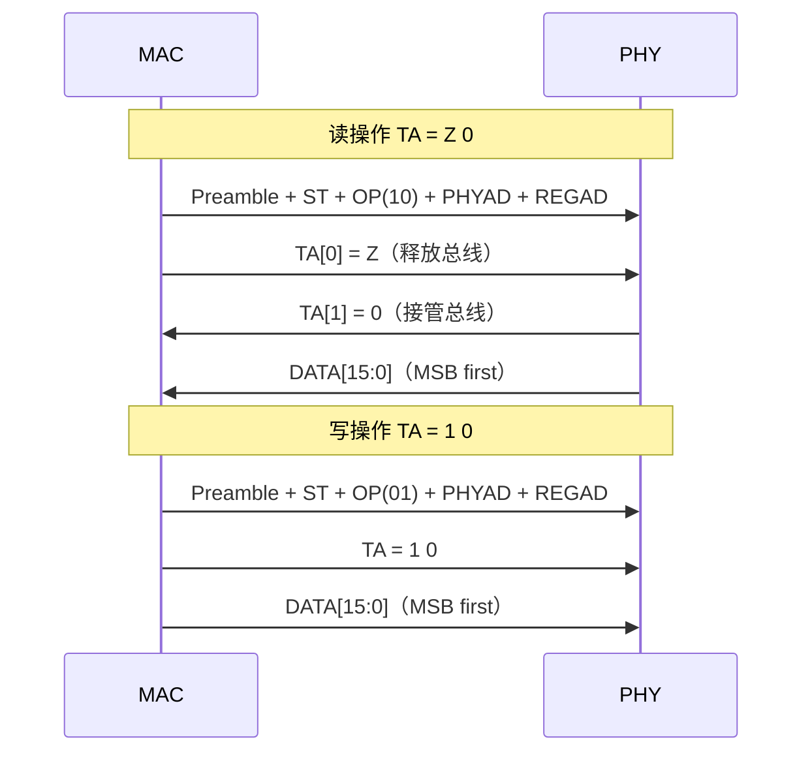
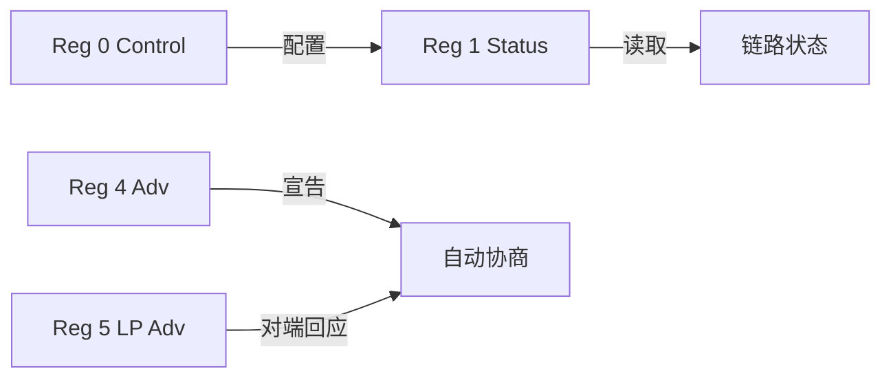
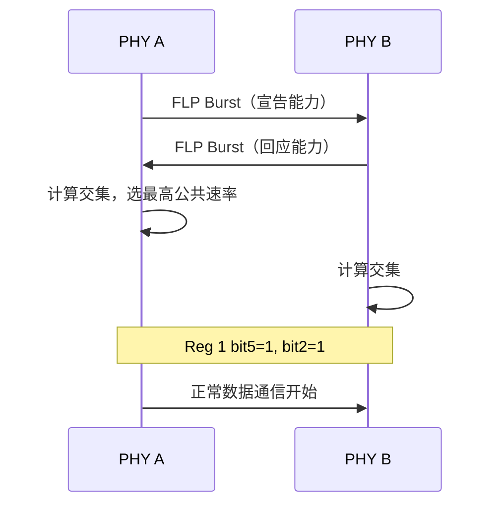

# MDIO怎么做——帧格式、寄存器读写与PHY探测

<span class="badge-b">[B]</span> <span class="badge-i">[I]</span> <span class="badge-e">[E]</span> <span class="badge-m">[M]</span>

<span class="red">MDIO 不是黑盒——每一帧的每一位都有精确含义。</span><br>
Clause 22 的帧格式、读写操作时序差异、标准寄存器定义、自动协商流程，是调试 PHY 的必备工具。<br>
这一章把 MDIO 从"概念"落地到"可操作"。

---

## 核心定义与价值

<span class="red">Clause 22 帧格式精确到 bit：Preamble(32) + ST(2) + OP(2) + PHYAD(5) + REGAD(5) + TA(2) + DATA(16)。</span><br>
<span class="red">PHY 寄存器 0-31 是 IEEE 强标准，跨厂商通用。</span><br>

---

## 核心机制原理解析

### <strong>1. Clause 22 帧格式：bit 级解剖</strong>

<span class="red">完整帧共 64 bit，按顺序发送，MSB 在前。</span>

```
| Preamble | ST  | OP  | PHYAD | REGAD | TA  | DATA  | Idle |
|  32 bit  | 2b  | 2b  |  5b   |  5b   | 2b  | 16b   |  高  |
| 全 1     | 01  |     |       |       |     |       |      |
```

| 字段 | 位宽 | 值 | 含义 |
|------|------|-----|------|
| <span class="green">Preamble</span> | 32 bit | 全 1 | 同步前导，部分 PHY 允许缩减 |
| <span class="green">ST</span>（Start of Frame） | 2 bit | 01 | Clause 22 帧起始标记 |
| <span class="green">OP</span>（Operation） | 2 bit | 10=读, 01=写 | 帧操作类型 |
| <span class="green">PHYAD</span> | 5 bit | 0-31 | PHY 芯片地址 |
| <span class="green">REGAD</span> | 5 bit | 0-31 | 寄存器地址 |
| <span class="green">TA</span>（Turnaround） | 2 bit | 读=Z0, 写=10 | 总线方向切换 |
| <span class="green">DATA</span> | 16 bit | 读写值 | 寄存器内容 |
| <span class="green">Idle</span> | — | 高电平 | 帧间隔，至少 1 MDC 周期 |

<br>

<span class="blue">ST = 01 是 Clause 22 的身份证；Clause 45 的 ST = 00。</span><br>
OP 的编码看似反直觉：01=写、10=读，但这就是标准。<br>

---

### <strong>2. 读操作 vs 写操作：TA 时序差异</strong>

<span class="red">TA（Turnaround）是 MDIO 帧中最容易出错的部分：读和写的 TA 位电平不同。</span><br>

**读操作（OP=10）TA = Z 0：**<br>
- 第 1 bit：MDIO 高阻（Z），由 PHY 接管总线<br>
- 第 2 bit：PHY 驱动为 0<br>
- 随后 PHY 输出 16 bit DATA<br>

**写操作（OP=01）TA = 1 0：**<br>
- 第 1 bit：MAC 驱动为 1<br>
- 第 2 bit：MAC 驱动为 0<br>
- 随后 MAC 输出 16 bit DATA<br>



<span class="blue">读操作时 TA 第 1 bit 必须是高阻——若 MAC 错误驱动为 1，会与 PHY 输出冲突。</span><br>

---

### <strong>3. PHY 标准寄存器：Reg 0 / 1 / 2 / 3</strong>

<span class="red">寄存器 0-31 中，0-15 是 IEEE 强制标准，16-31 厂商自定义。</span>

| 寄存器 | 名称 | 关键位 | 作用 |
|--------|------|--------|------|
| <span class="green">Reg 0</span> | Control | bit12=ANEG Restart, bit9=ANEG Enable, bit11=Duplex | 链路配置控制 |
| <span class="green">Reg 1</span> | Status | bit5=ANEG Complete, bit2=Link Up, bit1=Jabber | 链路状态只读 |
| <span class="green">Reg 2</span> | PHY ID 1 | OUI[15:0] | 厂商标识高 16 bit |
| <span class="green">Reg 3</span> | PHY ID 2 | OUI[5:0] + Model[5:0] + Rev[3:0] | 厂商标识低 10 bit |
| <span class="green">Reg 4</span> | ANEG Adv | 宣告本地能力（10/100/1000、双工） | 自动协商广告 |
| <span class="green">Reg 5</span> | ANEG LP Adv | 对端能力 | 只读 |
| <span class="green">Reg 9</span> | 1000BASE-X Control | 千兆能力宣告 | 扩展协商 |
| <span class="green">Reg 17/18</span> | SGMII/RGMII 控制 | 接口模式、时钟、延迟 | 厂商自定义区 |

<br>



---

### <strong>4. 自动协商（Auto-Negotiation）流程</strong>

<span class="red">自动协商是以太网 PHY 的"握手协议"，两端交换能力后协商出最高公共速率。</span><br>

流程：<br>

1. 上电或链路恢复时，PHY 发送 <span class="green">FLP（Fast Link Pulse）</span>  burst<br>
2. FLP 编码本地能力（10M/100M/1000M、半双工/全双工、流控）<br>
3. 对端收到 FLP 后，比较双方能力表<br>
4. 选择最高公共配置，写入 Reg 5（LP Adv）<br>
5. Reg 1 bit5（ANEG Complete）置 1，bit2（Link Up）置 1<br>
6. MAC 读取 Reg 1 获知链路就绪<br>



<span class="blue">自动协商失败常见原因：一端固定速率（ANEG Disable），另一端自动协商——双方无法握手。</span><br>

---

## 技术教学与实战

### <strong>Linux mdio_bus 驱动结构</strong>

```c
// drivers/net/phy/mdio_bus.c
struct mii_bus {
    const char *name;
    void *priv;
    int (*read)(struct mii_bus *bus, int addr, int regnum);   // 读 Reg
    int (*write)(struct mii_bus *bus, int addr, int regnum, u16 val); // 写 Reg
    int irq[PHY_MAX_ADDR];   // 每 PHY 一个中断
    struct device *parent;
    // ...
};

// 设备树解析
static int mdio_dt_probe(struct platform_device *pdev) {
    struct mii_bus *bus = devm_mdiobus_alloc_size(&pdev->dev, sizeof(...));
    bus->read = &my_mdio_read;
    bus->write = &my_mdio_write;
    return mdiobus_register(bus);
}
```

---

### <strong>thtool 输出解读</strong>

```bash
$ ethtool eth0
Settings for eth0:
    Supported ports: [ TP MII ]
    Supported link modes:   10baseT/Half 10baseT/Full
                            100baseT/Half 100baseT/Full
    Advertised link modes:  100baseT/Full
    Speed: 100Mb/s
    Duplex: Full
    Auto-negotiation: on
    Link detected: yes
```

| 字段 | 来源 | 含义 |
|------|------|------|
| <span class="green">Speed</span> | PHY Reg 0 + Reg 1 | 当前协商速率 |
| <span class="green">Duplex</span> | Reg 0 bit11 | 全双工/半双工 |
| <span class="green">Auto-negotiation</span> | Reg 0 bit12 | 协商状态 |
| <span class="green">Link detected</span> | Reg 1 bit2 | 物理链路存在 |

---

### <strong>mdio-tools 扫描 PHY</strong>

```bash
$ mdio-tool scan eth0
Found PHY at address 0: ID 0x001cc916 (Realtek RTL8211E)
Found PHY at address 1: ID 0x00221611 (Micrel KSZ9031)
```

---

## 嵌入式专属实战场景

### <strong>场景：网口速率协商失败排查</strong>

现象：千兆网口只能跑百兆。<br>

排查：<br>

1. `ethtool eth0` 查看 Advertised vs Speed<br>
2. 若 Advertised 无 1000baseT，检查 Reg 9（1000BASE-X Control）bit9:8<br>
3. 检查对端设备能力：交换机是否支持千兆<br>
4. 检查线缆：Cat5e 以下不支持千兆<br>
5. 强制千兆测试：`ethtool -s eth0 speed 1000 duplex full autoneg off`<br>

---

## 历史演进与前沿

| 年代 | 进展 | 标志 |
|------|------|------|
| 1995 | Clause 22 标准化 | 32 寄存器，百兆 PHY |
| 2000 | 千兆普及 | Reg 9 扩展 1000BASE-X 协商 |
| 2002 | Clause 45 | 万兆+ PHY 管理 |
| 2015 | RGMII 延迟配置 | Reg 17/18 厂商自定义延迟控制 |
| 2020+ | 车载以太网 | 100BASE-T1，MDIO 管理低功耗 PHY |

<span class="purple">扩展阅读：Linux `Documentation/networking/phy.rst` 关于 PHY 子系统的内核文档。</span><br>

---

## 本章小结

| 主题 | 要点 |
|------|------|
| Clause 22 帧 | Preamble(32) + ST(01) + OP(2) + PHYAD(5) + REGAD(5) + TA(2) + DATA(16) |
| 读 TA | Z 0，PHY 接管总线 |
| 写 TA | 1 0，MAC 持续驱动 |
| Reg 0 | Control：ANEG Enable/Restart，Duplex |
| Reg 1 | Status：ANEG Complete，Link Up |
| Reg 2/3 | PHY ID：OUI + Model + Revision |
| 自动协商 | FLP 交换能力 → 交集选择 → Reg 1 置位 |
| 工具 | ethtool 看协商结果，mdio-tools 扫描 PHY |

---

## 练习

1. 写出 Clause 22 读 Reg 1 的完整帧序列（从 Preamble 到 DATA）。
2. 为什么读操作的 TA 第 1 bit 必须是高阻（Z）？若 MAC 驱动为 1 会发生什么？
3. 自动协商中，若一端 ANEG=on、另一端 ANEG=off 且固定 100M，链路会怎样？
4. PHY ID（Reg 2/3）对驱动开发有什么作用？
5. ethtool 输出 "Link detected: no" 时，应优先检查哪个寄存器的哪个 bit？
