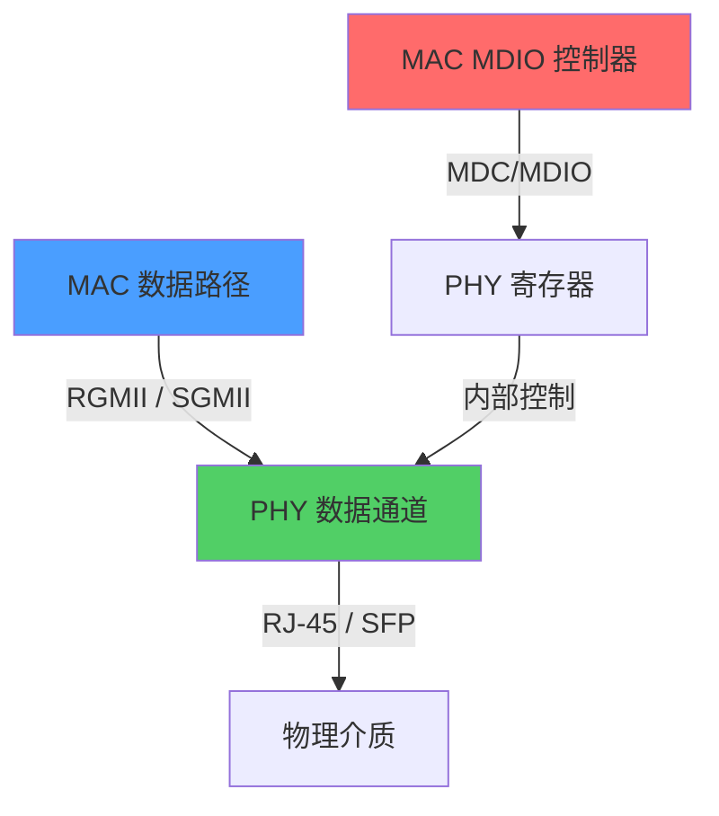

# MDIO为什么慢——设计哲学与实时性分析

<span class="badge-b">[B]</span> <span class="badge-i">[I]</span> <span class="badge-e">[E]</span> <span class="badge-m">[M]</span>

<span class="red">MDC 最高 2.5 MHz，每帧约 26 μs——这在嵌入式总线中算是"龟速"。</span><br>
但慢不是缺陷，是设计选择。<br>
理解"为什么慢"，才能理解 MDIO 在以太网架构中的真正位置。

---

## 核心定义与价值

<span class="red">MDIO 的速度限制（MDC ≤ 2.5 MHz，每帧 ~26 μs）是 IEEE 设计时有意为之：PHY 寄存器访问频率极低，无需高速总线。</span><br>

| 参数 | 值 | 计算 |
|------|-----|------|
| MDC 最高频率 | 2.5 MHz | IEEE 802.3 §22 规定 |
| 每 bit 周期 | 400 ns | 1 / 2.5 MHz |
| 每帧 bit 数 | ~64 | Preamble 32 + ST 2 + OP 2 + PHYAD 5 + REGAD 5 + TA 2 + DATA 16 |
| 每帧时间 | ~25.6 μs | 64 × 400 ns |
| 每秒最多帧数 | ~39000 | 1 / 25.6 μs |

<br>

---

## 核心机制原理解析

### <strong>1. "慢"是设计选择，不是技术限制</strong>

<span class="red">PHY 寄存器的典型访问模式：上电初始化写一次，链路变化时读几次，平时完全空闲。</span><br>

以千兆网口为例，MDIO 访问频率：<br>

| 场景 | MDIO 访问频率 | 数据速率 |
|------|--------------|----------|
| 上电初始化 | 写 10-20 个寄存器 | 约 0.5 ms 总时间 |
| 链路 up/down 事件 | 读 Reg 1，可能重写 Reg 0 | 突发，< 1 ms |
| 正常运行 | 偶尔读 Reg 1 轮询状态 | 每秒 1-10 次 |
| ethtool 查询 | 按需读取 | 用户触发 |

<br>

<span class="blue">对比数据通道：千兆以太网每秒传输 125 MB 数据，MDIO 每秒传输 39000 × 16 bit = 780 kb ≈ 97.5 KB。</span><br>
MDIO 带宽仅占数据通道的 0.08%。<br>
设计一个 100 MHz 的 MDIO 来管理不频繁变更的寄存器，是毫无必要的浪费。<br>

---

### <strong>2. MDIO 与 MAC 数据路径的物理分离</strong>



<br>

<span class="red">MDIO 和 MII/RGMII/SGMII 是两个完全独立的硬件通道。</span><br>
MII 传输以太网帧（4 bit 并行，25 MHz = 100 Mbps）；<br>
MDIO 传输寄存器管理帧（串行，2.5 MHz = 极低速）。<br>
<span class="blue">即使 MDIO 控制器完全卡死，以太网帧转发不受影响。</span><br>

---

### <strong>3. 实时性需求分析</strong>

<span class="red">哪些场景要求 MDIO"足够快"？</span><br>

| 场景 | 时间要求 | MDIO 是否够用 |
|------|----------|---------------|
| 链路 up/down 检测 | < 100 ms 感知 | 读 Reg 1 只需 26 μs，够用 |
| 热插拔（SFP） | < 1 s 响应 | 够用 |
| 速率自适应 | 协商期间频繁读写 | 协商本身耗时数百 ms，MDIO 非瓶颈 |
| 中断聚合统计 | 秒级查询 | 够用 |
| 光模块 DDM（数字诊断） | 秒级温度/电压读取 | 够用 |

<br>

<span class="blue">MDIO 的唯一实时性瓶颈：中断驱动模式下的链路状态通知。</span><br>
若 PHY 无中断引脚（或中断未连接），MAC 只能轮询 Reg 1，增加 CPU 开销。<br>
但轮询频率通常 1 Hz 足够，MDIO 速度完全不是问题。<br>

---

### <strong>4. Clause 45 扩展：为复杂 PHY 铺路</strong>

<span class="red">Clause 45 不是为"提速"而生，是为"扩展地址空间"而生。</span><br>

万兆以上 PHY（10GBASE-T、40G、100G）需要管理：<br>

- PCS/PMA/PMD 多层寄存器<br>
- FEC（前向纠错）状态<br>
- ANEG 扩展（backplane Ethernet）<br>
- 光模块管理（通过 MDIO 间接访问）<br>

Clause 45 帧格式：<br>

```
| Preamble | ST | OP | Port(5) | Device(5) | TA | Address/Data(16) |
|    32    | 00 |    |         |           |    |                  |
```

<span class="green">OP=00</span> 地址周期（写寄存器地址到 Device）<br>
<span class="green">OP=01</span> 写数据<br>
<span class="green">OP=11</span> 读数据（或 post-read-increment-address）<br>

<span class="blue">Clause 45 需要两帧完成一次读写（先写地址，再读写数据），时间翻倍，但管理空间扩展到 2^16。</span><br>

---

## 技术教学与实战

### <strong>计算 MDIO 管理带宽占比</strong>

假设千兆网口全速转发，每秒读取 Reg 1 一次：<br>

```
数据带宽 = 1 Gbps = 125 MB/s
MDIO 带宽 = 1 帧/秒 × 64 bit = 64 bps
占比 = 64 / 10^9 = 0.000000064 = 0.0000064%
```

<span class="blue">MDIO 的管理开销在千兆链路中可忽略不计。</span><br>

---

## 嵌入式专属实战场景

### <strong>场景：PHY 中断 vs 轮询选型</strong>

某工业网关 4 个网口，PHY 支持中断引脚（INTN）。<br>

方案对比：<br>

| 方案 | CPU 占用 | 链路感知延迟 | 硬件复杂度 |
|------|----------|-------------|-----------|
| 中断驱动 | 极低 | < 1 ms | 需 4 个 GPIO |
| MDIO 轮询（1 Hz） | 低 | < 1 s | 无需额外 GPIO |
| MDIO 轮询（10 Hz） | 中等 | < 100 ms | 无需额外 GPIO |

<span class="blue">嵌入式设计中，若 GPIO 紧张且链路变化不频繁，1 Hz MDIO 轮询是务实选择。</span><br>

---

## 历史演进与前沿

| 年代 | 演进 | 意义 |
|------|------|------|
| 1995 | Clause 22，2.5 MHz | 低速够用，简化 PHY 设计 |
| 2002 | Clause 45，地址扩展 | 支持万兆复杂寄存器空间 |
| 2010s | 中断引脚普及 | 减少轮询，降低 CPU 开销 |
| 2020+ | 车载以太网 | 100BASE-T1 PHY 管理，MDIO 保持 |

<span class="purple">扩展阅读：IEEE 802.3-2018 §45 关于 Clause 45 两帧访问模型的完整描述。</span><br>

---

## 本章小结

| 主题 | 要点 |
|------|------|
| MDC 上限 | 2.5 MHz = 设计选择，非技术瓶颈 |
| 每帧时间 | ~26 μs，管理开销可忽略 |
| 与数据分离 | MDIO 卡死不影响以太网帧转发 |
| 实时性 | 链路检测、热插拔、协商均在秒级，MDIO 足够 |
| Clause 45 | 扩展地址空间（16 bit），非提速 |
| 中断 vs 轮询 | GPIO 富余用中断，紧张用 1 Hz 轮询 |

---

## 练习

1. 计算 Clause 22 读一个寄存器需要多少 μs？Clause 45 读一个寄存器需要多少 μs？
2. 为什么说 MDIO "慢"是设计选择而非缺陷？从 PHY 寄存器访问频率论证。
3. 千兆以太网全速转发时，MDIO 轮询 Reg 1 的管理带宽占比是多少？
4. 中断驱动模式下，PHY INTN 引脚通常会在什么事件时触发？
5. Clause 45 的地址扩展机制具体是如何实现的？为什么需要两帧？
