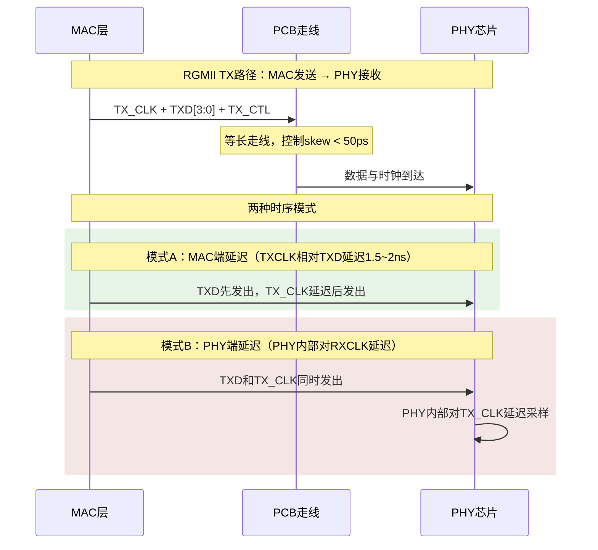
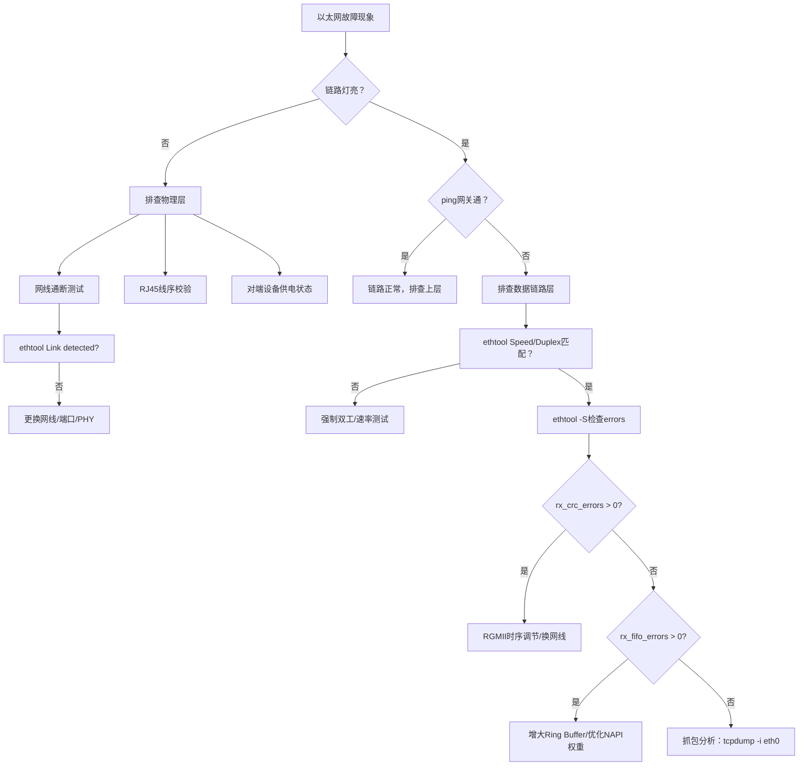

# MDIO实战：以太网调试 [I→E]

> **本章学习目标**：
> - 掌握<span class="red">ethtool/mii-tool</span>诊断以太网链路状态的输出解读技巧
> - 理解<span class="red">RGMII</span>接口的TX/RX时钟时序要求与延迟线调节方法
> - 建立<span class="red">工业以太网故障</span>的系统性排查框架（物理层→数据链路层→驱动层）

---

## ethtool/mii-tool诊断

---

### <strong>ethtool核心诊断命令与输出解读</strong>

<span class="red">ethtool</span>是Linux下最全面的以太网诊断工具，
<br>
可直接读写PHY寄存器、查询驱动统计、测试环回。
<br>

<span class="blue">ethtool的本质：通过SIOCETHTOOL ioctl与内核ethtool_ops交互，
<br>
将PHY寄存器和MAC统计量转换为用户可读的诊断信息。
</span><br>

**ethtool核心诊断命令表：**

| 命令 | 功能 | 诊断价值 |
| --- | --- | --- |
| `ethtool eth0` | 查询速率/双工/链路状态 | 快速确认物理层连通性 |
| `ethtool -S eth0` | 驱动统计计数器 | 定位丢包、CRC错误、FIFO溢出 |
| `ethtool -d eth0` | 寄存器dump（需支持） | 直接查看MAC/PHY寄存器值 |
| `ethtool -p eth0` | LED物理闪烁 | 机架中定位网口 |
| `ethtool --set-ring eth0` | 调节Ring Buffer大小 | 解决高吞吐下的丢包 |
| `ethtool --offload eth0` | 查看/配置硬件卸载 | 确认TSO/GSO/UFO状态 |

---

### <strong>ethtool输出深度解读</strong>

```bash
$ ethtool eth0
Settings for eth0:
        Supported ports: [ TP MII ]
        Supported link modes:   10baseT/Half 10baseT/Full
                                100baseT/Half 100baseT/Full
                                1000baseT/Full
        Supported pause frame use: Symmetric Receive-only
        Supports auto-negotiation: Yes
        Advertised link modes:  10baseT/Half 10baseT/Full
                                100baseT/Half 100baseT/Full
                                1000baseT/Full
        Advertised pause frame use: Symmetric
        Advertised auto-negotiation: Yes
        Link partner advertised link modes:  10baseT/Half 10baseT/Full
                                             100baseT/Half 100baseT/Full
                                             1000baseT/Full
        Link partner advertised pause frame use: Symmetric
        Link partner advertised auto-negotiation: Yes
        Speed: 1000Mb/s
        Duplex: Full
        Auto-negotiation: on
        Port: Twisted Pair
        PHYAD: 1
        Transceiver: internal
        Link detected: yes
```

<span class="orange"><strong>1. 协商结果验证</strong></span><br>
<span class="green">Speed: 1000Mb/s + Duplex: Full</span> = 协商成功。
<br>
若显示 <span class="green">Speed: 100Mb/s</span> 而两端均宣称支持1000M，
<br>
需排查：网线类别（Cat5e以下不支持千兆）、中间交换机端口限速、PHY故障。
<br>

<span class="orange"><strong>2. 能力不一致诊断</strong></span><br>
若本端 <span class="green">Advertised</span> 包含1000baseT，
<br>
但 <span class="green">Link partner advertised</span> 不包含，
<br>
说明对端未开启千兆能力，或中间设备（交换机）端口为百兆。
<br>

<span class="orange"><strong>3. Pause帧协商诊断</strong></span><br>
<span class="green">Symmetric</span> = 双方均支持且启用对称流控。
<br>
若出现高丢包但Pause未协商成功，
<br>
说明对端不支持硬件流控，需退至TCP层拥塞控制或增加缓冲区。
<br>

---

### <strong>ethtool -S 统计量故障定位</strong>

```bash
$ ethtool -S eth0 | grep -E "error|drop|crc|fifo|collision"
     rx_errors: 0
     tx_errors: 0
     rx_crc_errors: 0
     rx_fifo_errors: 0
     tx_fifo_errors: 0
     rx_missed_errors: 0
     rx_length_errors: 0
     rx_over_errors: 0
     rx_frame_errors: 0
     tx_aborted_errors: 0
     tx_carrier_errors: 0
     tx_heartbeat_errors: 0
     tx_window_errors: 0
```

**关键统计量诊断含义表：**

| 统计量 | 含义 | 根因排查 |
| --- | --- | --- |
| rx_crc_errors | 接收CRC校验失败 | 网线质量差、EMI干扰、PHY损坏 |
| rx_fifo_errors | 接收FIFO溢出 | 中断延迟高、DMA带宽不足、CPU过载 |
| tx_fifo_errors | 发送FIFO下溢 | 总线仲裁失败、时钟域问题 |
| rx_missed_errors | MAC丢包（无FIFO空间） | Ring Buffer过小、NAPI轮询不及时 |
| tx_carrier_errors | 载波丢失 | 网线断开、对端断电、PHY TX故障 |
| rx_frame_errors | 帧格式错误（非整数字节） | 双工不匹配、时钟抖动 |

<span class="blue">诊断原则：统计量非零即异常，
<br>
rx_crc_errors和rx_frame_errors指向物理层信号完整性问题，
<br>
rx_fifo_errors和rx_missed_errors指向系统性能瓶颈。
</span><br>

---

## RGMII时序调节

---

### <strong>RGMII接口的时钟-数据对齐要求</strong>

<span class="red">RGMII（Reduced Gigabit Media Independent Interface）</span>
<br>
是千兆以太网最常用的MAC-PHY接口，将GMII的25线压缩为12线。
<br>

<span class="blue">RGMII的核心设计：在TX_CLK/RX_CLK的<i>两个边沿</i>分别采样4-bit数据，
<br>
实现单沿4-bit、双沿8-bit的DDR效果。
<br>
时序要求极为严格：时钟到数据的setup/hold时间通常仅约1.5ns。
</span><br>

**RGMII时序关键参数表：**

| 参数 | 符号 | 典型值 | 含义 |
| --- | --- | --- | --- |
| 时钟周期 | Tcyc | 8ns（125MHz） | RGMII时钟周期 |
| TX时钟到数据建立时间 | tsetup | 1.0ns | TX_CLK边沿前数据稳定 |
| TX数据保持时间 | thold | 0.8ns | TX_CLK边沿后数据维持 |
| RX时钟到数据建立时间 | tsetup | 1.0ns | RX_CLK边沿前数据稳定 |
| RX数据保持时间 | thold | 0.8ns | RX_CLK边沿后数据维持 |
| TX时钟到数据偏移 | skew | 1.5~2.0ns | 建议PHY内部延迟或PCB等长 |



<span class="orange"><strong>1. 为什么需要延迟？</strong></span><br>
RGMII规范要求时钟边沿<i>对准数据窗口中央</i>，而非数据边沿。
<br>
若时钟与数据边沿同时到达，setup和hold时间均为0，无法稳定采样。
<br>
引入1.5~2ns延迟使时钟边沿落在数据bit周期的中间位置。
<br>

<span class="orange"><strong>2. TX端延迟 vs RX端延迟</strong></span><br>
TX路径：MAC发送数据，PHY接收。<br>
可在MAC端加TX_CLK延迟，或依赖PHY端的内部延迟线。
<br>
RX路径：PHY发送数据，MAC接收。<br>
通常由PHY内部对RX_CLK加延迟，MAC侧按标准RGMII采样。
<br>

---

### <strong>RGMII延迟线调节代码实现</strong>

```c
// 文件：rgmii_delay_tune.c
// 功能：RGMII TX/RX延迟线调节（以Realtek RTL8211E为例）

/* RTL8211E Page 0xa42 寄存器25（RGMII延迟控制） */
#define RTL8211E_RGMII_DELAY_REG    0x19   /* 扩展寄存器 */
#define RTL8211E_PAGE_SELECT         0x1F

/* 延迟线配置bit定义 */
#define RGMII_TX_DELAY_EN    (1 <> 1)   /* bit1: TX内部延迟使能 */
#define RGMII_RX_DELAY_EN    (1 <> 0)   /* bit0: RX内部延迟使能 */
#define RGMII_TX_DELAY_MASK  (0x7 <> 12)  /* bit14:12: TX延迟量 */
#define RGMII_RX_DELAY_MASK  (0x7 <> 4)   /* bit6:4: RX延迟量 */

int rtl8211e_rgmii_delay_config(struct phy_device *phydev,
                                 uint8_t tx_delay, uint8_t rx_delay)
{
    u16 val;
    int ret;
    
    /* 切换到扩展页 0xa42 */
    ret = phy_write(phydev, RTL8211E_PAGE_SELECT, 0xa42);
    if (ret < 0) return ret;
    
    /* 读取当前延迟配置 */
    val = phy_read(phydev, RTL8211E_RGMII_DELAY_REG);
    
    /* 配置TX延迟 */
    val &= ~RGMII_TX_DELAY_MASK;
    val |= (tx_delay & 0x7) <> 12;
    
    /* 配置RX延迟 */
    val &= ~RGMII_RX_DELAY_MASK;
    val |= (rx_delay & 0x7) <> 4;
    
    /* 使能TX/RX内部延迟 */
    val |= RGMII_TX_DELAY_EN | RGMII_RX_DELAY_EN;
    
    ret = phy_write(phydev, RTL8211E_RGMII_DELAY_REG, val);
    if (ret < 0) return ret;
    
    /* 切回page 0 */
    ret = phy_write(phydev, RTL8211E_PAGE_SELECT, 0);
    if (ret < 0) return ret;
    
    /* 软复位PHY使配置生效 */
    ret = genphy_soft_reset(phydev);
    
    return ret;
}
```

```bash
# 通过ethtool间接验证延迟配置效果
# 观察rx_crc_errors是否随延迟调节变化

$ watch -n 1 'ethtool -S eth0 | grep crc'
     rx_crc_errors: 0          # 理想状态
     
# 若rx_crc_errors持续增加，尝试调节延迟量
# 通常tx_delay/rx_delay取值范围0~7，对应约0~3ns延迟
```

<span class="blue">RGMII延迟调节的调试方法：
<br>
1. 从中间值（如3）开始，逐步扫0~7全范围
<br>
2. 每个配置运行iperf3压力测试
<br>
3. 观察ethtool -S中的crc_errors和frame_errors
<br>
4. 选择统计量为0且iperf3吞吐最高的配置点
<br>
</span><br>

---

## 工业以太网故障排查

---

### <strong>故障排查决策树</strong>



**分层排查速查表：**

| 层级 | 排查命令/工具 | 关键指标 | 典型故障 |
| --- | --- | --- | --- |
| 物理层 | `ethtool eth0`, 网线测试仪 | Link detected, Speed | 网线断裂、POE供电不足 |
| 数据链路层 | `ethtool -S`, `mii-tool` | crc_errors, duplex | 双工不匹配、RGMII skew |
| 网络层 | `ping`, `ip route` | RTT, 丢包率 | ARP表异常、路由错误 |
| 传输层 | `iperf3`, `ss -i` | 吞吐、重传率 | TCP窗口过小、拥塞 |
| 驱动层 | `dmesg`, `ethtool -i` | 驱动版本、中断数 | 驱动bug、NAPI配置 |

---

### <strong>工业场景的特殊考量</strong>

<span class="orange"><strong>1. 宽温环境下的PHY可靠性</strong></span><br>
工业级PHY（如Microchip LAN8742AI）支持-40℃~+85℃，
<br>
消费级PHY（如RTL8211E-VB-CG）仅支持0℃~+70℃。
<br>
宽温环境下晶振频偏增大，可能导致RGMII时序裕量不足。
<br>

<span class="orange"><strong>2. 电磁兼容与屏蔽</strong></span><br>
工业现场变频器、伺服电机产生强EMI，
<br>
未屏蔽的网线会导致rx_crc_errors激增。
<br>
解决：使用屏蔽双绞线（STP）、铁氧体磁环、金属外壳接地。
<br>

<span class="orange"><strong>3. 长距离以太网（PoE扩展）</strong></span><br>
标准以太网100米限制在工业场景常不足。
<br>
使用 <span class="green">10BASE-T1L</span>（IEEE 802.3cg）可达1000米@10Mbps，
<br>
或使用光纤转换器突破双绞线距离限制。
<br>

---

### <strong>历史演进：从MII到RGMII的接口精简</strong>

<span class="red">以太网MAC-PHY接口</span>经历了四代演进：
<br>

| 接口 | 年份 | 数据线数 | 时钟频率 | 适用速率 | 关键特性 |
| --- | --- | --- | --- | --- | --- |
| MII | 1995 | 16（TX/RX各8） | 25MHz | 100Mbps | 最早标准接口 |
| RMII | 1998 | 10 | 50MHz | 100Mbps | 参考时钟共享，省线 |
| GMII | 1999 | 24 | 125MHz | 1000Mbps | 8-bit并行+控制 |
| RGMII | 2000 | 12 | 125MHz DDR | 1000Mbps | 双沿采样，线数减半 |
| SGMII | 2004 | 4（SerDes） | 1.25Gbps | 1000Mbps | 串行SerDes，最远 |
| 10BASE-T1L | 2019 | 2（单对双绞线） | — | 10Mbps | 工业长距离，单对线 |

<span class="blue">演进本质：随着速率提升，并行总线的时钟同步难度指数增长，
<br>
RGMII通过DDR技术将线数压缩50%，
<br>
SGMII进一步将问题交给SerDes/PCS层解决，MAC只需处理数字基带。
<br>
</span><br>

---

## 本章小结

| 概念 | 一句话总结 |
| --- | --- |
| ethtool | Linux以太网诊断全能工具，-S看统计、-d看寄存器、-p定位物理网口 |
| rx_crc_errors | 物理层信号完整性问题：网线/EMI/时序/PHY损坏 |
| rx_fifo_errors | 系统性能问题：中断延迟/Ring Buffer/CPU过载 |
| RGMII skew | 时钟与数据边沿对齐导致采样失败，需1.5~2ns延迟 |
| TX_DELAY_EN | PHY内部对TX_CLK加延迟，使时钟落在数据窗口中央 |
| 工业EMI | 变频器干扰导致CRC错误，用STP线缆+磁环+接地 |
| 10BASE-T1L | 工业单对以太网，1000米@10Mbps，替代传统485 |

---

## 练习

1. `ethtool -S` 显示 `rx_crc_errors: 0` 但 `rx_frame_errors: 357`。请分析可能的根因，并给出排查步骤。
2. 某RTL8211E PHY的RGMII接口在千兆模式下偶发CRC错误，百兆模式正常。请解释为什么千兆模式对时序更敏感，并给出延迟调节的实验步骤。
3. 工业现场某设备在变频器启动后网络中断，变频器关闭后恢复。从物理层角度设计一个系统性排查方案（含测试工具和判断标准）。
