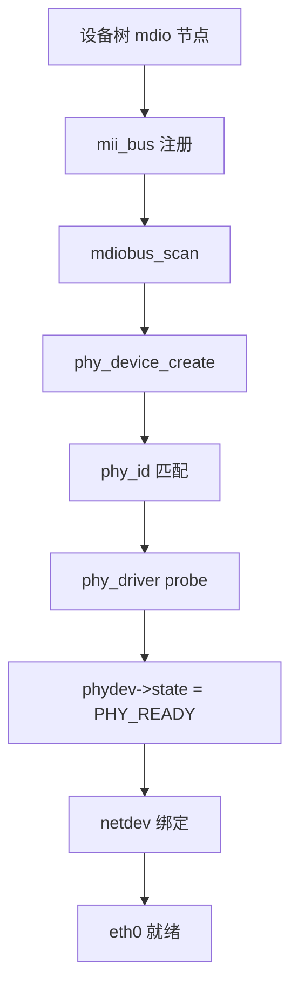
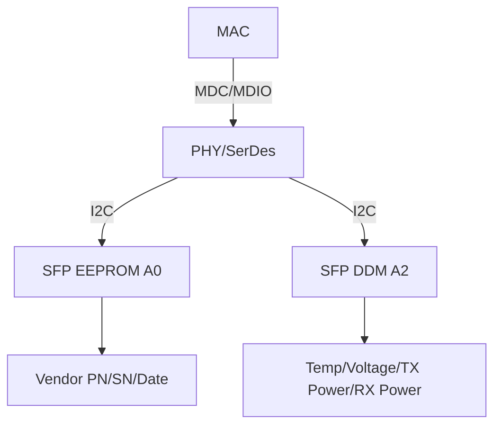
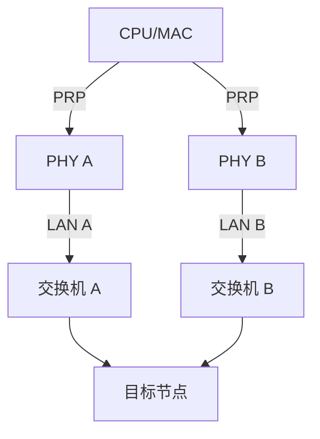

# MDIO往哪去——以太网调试与前沿演进

<span class="badge-b">[B]</span> <span class="badge-i">[I]</span> <span class="badge-e">[E]</span> <span class="badge-m">[M]</span>

<span class="red">MDIO 的战场不在速度，在管理的深度和广度。</span><br>
从 Linux PHY 子系统到光模块诊断，从工业冗余到车载以太网，MDIO 管理的对象越来越复杂。<br>
这一章展示 MDIO 在真实系统和前沿场景中的角色。

---

## 核心定义与价值

<span class="red">MDIO 的演进逻辑：管理对象从简单 PHY 扩展到光模块、SerDes、车载收发器；管理接口从直连到通过 I2C/SPI 间接访问。</span><br>

---

## 核心机制原理解析

### <strong>1. Linux 网络子系统中 PHY 的注册与绑定</strong>



<br>

关键数据结构：<br>

```c
struct phy_device {
    struct mii_bus *bus;       // 所属 MDIO 总线
    int addr;                  // PHYAD
    u32 phy_id;                // Reg 2/3 组合 ID
    struct phy_driver *drv;    // 匹配到的驱动
    enum phy_state state;      // DOWN / UP / RUNNING / etc.
    // ...
};

struct phy_driver {
    u32 phy_id;                // 匹配掩码
    u32 phy_id_mask;
    int (*config_init)(struct phy_device *phydev);
    int (*read_status)(struct phy_device *phydev);
    // ...
};
```

<span class="blue">`phy_id` 是 PHY 驱动的"指纹"：Reg 2 (OUI[15:0]) + Reg 3 (OUI[5:0] + Model + Rev)。</span><br>
Linux `drivers/net/phy/` 目录包含数百个 PHY 驱动（realtek.c、micrel.c、marvell10g.c 等）。<br>

---

### <strong>2. ethtool 高级输出解读</strong>

```bash
$ ethtool -m eth0        # 光模块 DDM（需 PHY/SFP 支持）
Identifier:       0x03 (SFP)
Extended id:      0x04 (GBE CWDM/Copper)
Connector:        0x01 (SC)
Length (SMF,kilometers): 10
Length (50um):    0
Length (62.5um):  0
Length (Copper):  0
Vendor name:      FINISAR CORP.
Vendor PN:        FCLF8521P2BTL
Vendor SN:        URJ0K88
Date code:        200612
Temperature:      35.00 C
Voltage:          3.30 V
Alarms:           None

$ ethtool -p eth0        # 让 PHY LED 闪烁定位物理网口
$ ethtool -S eth0        # 查看 PHY 统计寄存器
```

| 选项 | 读取来源 | 用途 |
|------|----------|------|
| <span class="green">-m</span> | SFP EEPROM / A0 / A2 | 光模块厂商信息、温度、电压、光功率 |
| <span class="green">-p</span> | PHY LED 控制寄存器 | 物理定位（机房找网线） |
| <span class="green">-S</span> | PHY 统计寄存器 | 丢包、CRC 错误、冲突计数 |

---

### <strong>3. SFP/SFP+/QSFP 模块中的 MDIO</strong>

<span class="red">光模块（SFP）的管理不直接走 MDIO，而是通过 I2C 访问模块内部 EEPROM。</span><br>



<br>

| 地址 | 内容 | 协议 |
|------|------|------|
| <span class="green">A0 (0x50)</span> | 基础 ID、连接器、波长、长度 | I2C，256 Byte |
| <span class="green">A2 (0x51)</span> | DDM 阈值、实时监测值 | I2C，256 Byte |

<span class="blue">部分 PHY 芯片（如 Marvell 88E1512）内置 I2C Master，通过 MDIO 间接读写 SFP EEPROM。</span><br>
这是"MDIO 管理 I2C 总线"的典型范例。<br>

---

### <strong>4. 工业以太网中的冗余 PHY（PRP/HSR）</strong>

<span class="red">工业以太网要求零丢包冗余，PRP（Parallel Redundancy Protocol）和 HSR（High-availability Seamless Redundancy）需要双 PHY 同时工作。</span><br>



<br>

PRP 要求两个 PHY 的 MDIO 独立管理：<br>

- 各 PHY 独立链路状态监测<br>
- 各 PHY 独立速率协商<br>
- 故障切换时通过 MDIO 读取对方状态<br>

<span class="blue">冗余 PHY 场景下，MDIO 轮询频率可能提高到 10 Hz，但仍远低于数据带宽。</span><br>

---

### <strong>5. 未来：RGMII/SGMII 中的 MDIO 角色与车载以太网</strong>

| 接口 | 数据通道 | MDIO 角色 |
|------|----------|-----------|
| <span class="green">MII</span> | 4 bit × 25 MHz | 管理独立 100M PHY |
| <span class="green">RGMII</span> | 4 bit × 125 MHz（DDR） | 管理千兆 PHY，延迟控制 |
| <span class="green">SGMII</span> | 1.25 Gbps SerDes | 管理 SerDes PHY，Clause 45 |
| <span class="green">USXGMII</span> | 10 Gbps SerDes | 管理多端口 PHY |
| <span class="green">车载 100BASE-T1</span> | 100 Mbps 单对线 | MDIO 管理低功耗 PHY，唤醒/睡眠 |

<br>

<span class="red">车载以太网（100BASE-T1 / 1000BASE-T1）对 MDIO 提出新要求：睡眠唤醒管理。</span><br>
PHY 需通过 MDIO 配置：<br>

- 睡眠模式（Sleep Mode）：降低功耗至 mW 级<br>
- 唤醒检测（Wake-on-LAN over MDIO）：远程唤醒 ECU<br>
- 诊断寄存器：线缆开路/短路检测（用于线束故障定位）<br>

---

## 技术教学与实战

### <strong>PHY 驱动匹配调试</strong>

```bash
# 查看内核已加载的 PHY 驱动
$ grep 'PHY driver' /sys/kernel/debug/gpio
$ dmesg | grep -i phy

# 若新 PHY 无驱动，读取 ID 后编写 phy_driver
$ mdio-tool read eth0 0 2   # Reg 2 = PHY ID 高
$ mdio-tool read eth0 0 3   # Reg 3 = PHY ID 低
# 组合 phy_id = (Reg2 << 16) | Reg3
```

---

### <strong>SFP DDM 监控脚本</strong>

```bash
#!/bin/bash
while true; do
    ethtool -m eth0 2>/dev/null | grep -E "Temperature|Voltage|TX|RX"
    sleep 60
done
```

---

## 嵌入式专属实战场景

### <strong>场景：4G 路由器双网口冗余设计</strong>

需求：工业 4G 路由器，双网口互为备份。<br>
实现：双 PHY 独立 MDIO 总线，Linux bonding 驱动 + PRP。<br>

设备树：
```dts
mdio0: mdio@0 {
    ethernet-phy@0 { reg = <0>; };
};
mdio1: mdio@1 {
    ethernet-phy@0 { reg = <0>; };
};
```

---

## 历史演进与前沿

| 年代 | 演进 | 标志 |
|------|------|------|
| 1995 | MII + MDIO | 百兆时代 |
| 2000 | RGMII | 千兆缩线，MDIO 保留 |
| 2010 | SGMII / SerDes | PHY 内置 SerDes，MDIO 管理寄存器增加 |
| 2015 | SFP DDM | MDIO 间接管理 I2C EEPROM |
| 2020 | 车载以太网 | 100BASE-T1，MDIO 管理睡眠唤醒 |
| 2025+ | USXGMII | 多端口 10G，Clause 45 必选项 |

<span class="purple">扩展阅读：Linux `drivers/net/phy/` 源码，特别是 `sfp.c` 和 `phy_device.c`。</span><br>

---

## 本章小结

| 主题 | 要点 |
|------|------|
| PHY 注册 | mii_bus → scan → phy_id 匹配 → phy_driver probe |
| ethtool -m | 光模块 DDM：温度、电压、光功率 |
| ethtool -p | PHY LED 闪烁，物理定位网口 |
| ethtool -S | PHY 统计：丢包、CRC、冲突 |
| SFP 管理 | MDIO → I2C → EEPROM A0/A2 |
| 工业冗余 | PRP/HSR 双 PHY，独立 MDIO 管理 |
| 车载以太网 | MDIO 管理睡眠/唤醒/线缆诊断 |
| 未来 | USXGMII、Clause 45 必选 |

---

## 练习

1. 解释 Linux PHY 子系统中 `phy_device` 与 `phy_driver` 的匹配机制。
2. ethtool `-m`、`-p`、`-S` 分别读取什么信息？这些信息存在 PHY 的哪里？
3. SFP 模块为什么不直接用 MDIO 管理，而要加一层 I2C？
4. 车载以太网中，MDIO 相比传统以太网多出哪些管理职责？
5. 设计一个监控脚本：每 60 秒读取光模块温度，超过 70°C 报警。
