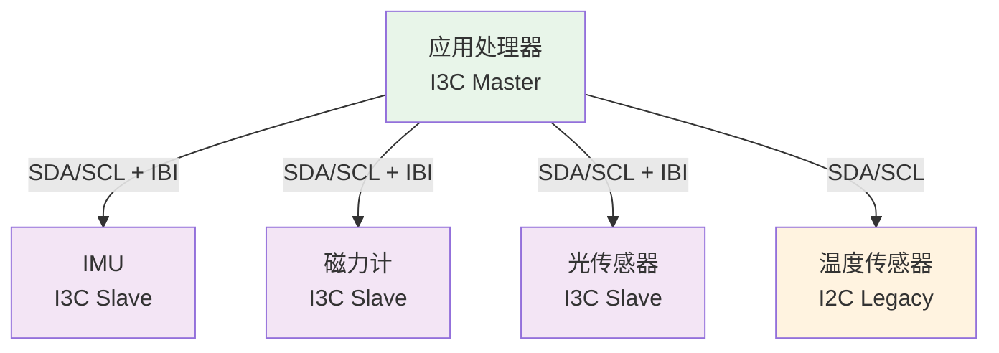
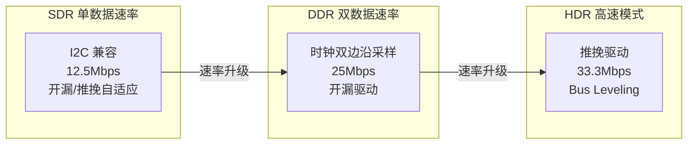

# I3C是什么——I2C的现代化升级与架构

---

## 核心定义

MIPI-I3C（Improved Inter-Integrated Circuit） 是 MIPI Alliance 于 2016 年发布的**两线同步串行总线协议**，在保留 I2C 物理兼容性的基础上，通过动态地址分配、带内中断和推挽高速模式，将速率提升至 12.5MHz SDR / 33.3Mbps HDR。

 

 

**I3C 总线角色定义：**

| 角色 | 功能 | 数量限制 |
|------|------|---------|
| I3C Master | 总线控制器，发起通信 | 1 个（当前主控） |
| I3C Secondary Master | 备用主控，可接管总线 | 0~n 个 |
| I3C Slave | 响应命令，上报数据 | 0~11 个（纯 I3C） |
| I2C Slave | 兼容设备，仅 SDR 模式 | 0~n 个 |
| Legacy Slave | 传统 I2C 设备 | 可混挂 |

 

类比：I3C 如同"智能办公楼"——访客（设备）没有固定门牌号，前台自动分配临时门卡（动态地址）；楼内广播系统（CCC）统一发通知；每间房都有呼叫按钮（IBI 中断），不用额外拉电话线。而 I2C 如同"老式居民楼"——每家固定门牌号，没有呼叫系统，楼道灯常亮。

 

---

## 为什么需要 I3C：I2C 的四大瓶颈

### <strong>1. 四大瓶颈与 I3C 解决方案</strong>

| I2C 瓶颈 | I3C 解决方案 | 效果 |
|---------|-------------|------|
| 静态地址冲突 | 动态地址分配（DA） | 无需手动分配地址，上电即发现 |
| 速度上限 1MHz | HDR 模式 12.5MHz SDR / 33.3Mbps HDR | 带宽提升 12~33 倍 |
| 无内置中断 | 带内中断（IBI） | 省一根物理中断 GPIO |
| 功耗高（持续上拉） | 推挽驱动（HDR 模式） | 功耗降低 50%+ |

 

### <strong>2. 手机传感器阵列的驱动力</strong>

一部旗舰手机通常集成 10~20 个传感器。I2C 在这个场景下同时触顶三个瓶颈：

- **地址空间**：同型号传感器最多 8 个（3 引脚地址），20 个传感器必然冲突
- **中断 GPIO**：每个传感器 1 根中断线 = 20 根 GPIO，PCB 走线 impossible
- **速率**：指纹传感器和 ToF 相机需要 8~16Mbps，I2C 的 1MHz 远远不够

 

I3C 用同一对 SDA/SCL 线同时解决三个问题：动态地址、IBI 中断、HDR 高速。

 

---

## I3C 的三级架构：SDR → DDR → HDR

### <strong>1. 速度阶梯设计</strong>

 

| 模式 | 速率 | 电气特性 | I2C 兼容性 |
|------|------|---------|-----------|
| SDR | 12.5 Mbps | 开漏/推挽自适应 | 可混挂 I2C Slave |
| DDR | 25 Mbps | 开漏，双边沿 | 仅 I3C Slave |
| HDR-TSP | ~16.6 Mbps | 推挽，三态符号 | 仅 I3C Slave |
| HDR-DDR | ~16.6 Mbps | 推挽，双边沿 | 仅 I3C Slave |
| HDR-DBL | ~33.3 Mbps | 推挽 + Bus Leveling | 仅 I3C Slave |

 

### <strong>2. 兼容性策略：SDR 是 I2C 的超集</strong>

I3C 的 SDR 模式在电气上兼容 I2C：

- SCL 频率 ≤ 12.5MHz 时，I2C 设备可以正常响应（只要它能跟得上）
- I3C Master 访问 I2C Slave 时，自动使用开漏驱动和 I2C 时序
- I3C Slave 可以识别 I2C 的起始/停止条件并忽略（等待 I3C 事务）

 

关键设计：I3C 的广播地址 0x7E 是 I2C 保留地址（不会被 I2C 设备响应），因此 I3C Master 发送 CCC 广播时，I2C 设备自动忽略。

 

---

## 历史演进

### <strong>1. 从 I2C 到 I3C 的设计动机</strong>

2010 年前后，智能手机传感器数量爆发式增长。MIPI Alliance 调研发现：

- 2012 年平均 8 个传感器，2016 年平均 15 个，2020 年平均 20+
- 每增加 1 个传感器，传统 I2C 方案需要 1 根中断 GPIO + 1 个静态地址
- 地址冲突、GPIO 耗尽、速率不足成为手机 PCB 设计的三大痛点

 

MIPI Sensor Working Group 于 2014 年启动 I3C 标准制定，2016 年发布 v1.0。

 

### <strong>2. 演进里程碑</strong>

| 年份 | 里程碑 | 意义 |
|------|--------|------|
| 1982 | I2C 诞生 | Philips 两线标准 |
| 2014 | MIPI I3C 立项 | 针对手机传感器痛点 |
| 2016 | I3C v1.0 发布 | 基础规范：SDR + CCC + IBI |
| 2018 | I3C Basic 发布 | 免费授权子集，加速生态 |
| 2020 | I3C v1.1 草案 | HDR-DBL、更低功耗 |
| 2022+ | 汽车/工业扩展 | AEC-Q100 认证，车载传感器 |

 

---

## 本章小结

 

| 概念 | 一句话总结 |
|------|-----------|
| MIPI-I3C | MIPI Alliance 2016 年发布的 I2C 升级版，向后兼容 |
| 动态地址 | 通过 ENTDAA 命令自动分配，48-bit PID 全球唯一 |
| CCC | 通用命令代码，标准化设备控制，广播/定向两类 |
| IBI | 带内中断，省 GPIO，传感器主动上报 |
| HDR | 推挽驱动高速模式，最高 33.3Mbps |
| SDR | 12.5Mbps，开漏/推挽自适应，可混挂 I2C |
| I2C 混挂 | I3C 与 I2C 设备共存，总线速率受 I2C 上限约束 |
| 广播地址 0x7E | I2C 保留地址，I3C 专用广播通道 |
| 手机驱动 | 15~20 传感器同时触顶 I2C 地址/GPIO/速率三瓶颈 |
| I3C Basic | 免费授权子集，降低采用门槛 |

 

---

## 练习

1. 为什么 I3C 能混挂 I2C 设备？混挂时总线速率如何限制？从电气时序和广播地址两个角度分析。

2. 对比 I2C 和 I3C 的上拉电阻要求：为什么 I3C 在 HDR 模式下不需要上拉？从推挽驱动的电气原理推导。

3. 设计一个手机传感器阵列：4 个 I3C 传感器 + 2 个 I2C legacy 传感器，画出总线拓扑并标注角色和速率限制。
