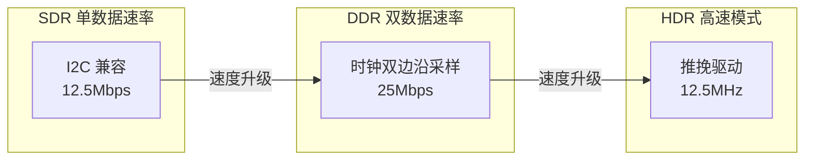
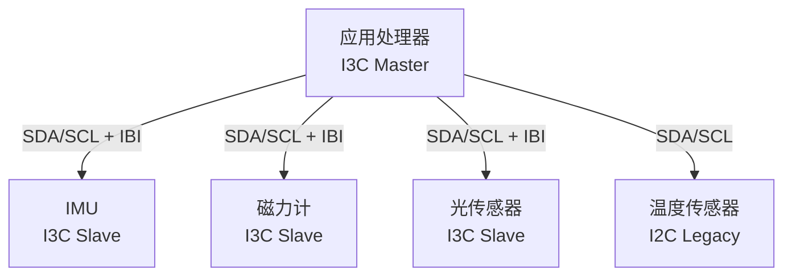

# MIPI-I3C 基础认知与架构 [I→E]

> **本章学习目标**：
> - 理解 MIPI-I3C 作为 I2C 演进版的设计动机
> - 掌握 I3C 的 动态地址分配 与 CCC 命令机制
> - 了解 I3C 在移动设备和汽车电子中的典型应用

---

## I3C 的诞生：I2C 的现代化升级

---

### <strong>为什么需要 I3C：I2C 的四大瓶颈</strong>

MIPI-I3C由 MIPI Alliance在 2016 年发布（v1.0），
 
旨在解决 I2C 在手机传感器阵列中的性能瓶颈。

| I2C 瓶颈 | I3C 解决方案 | 效果 |
| --- | --- | --- |
| 静态地址冲突 | 动态地址分配（DA） | 无需手动分配地址 |
| 速度上限 1MHz | HDR 模式 12.5MHz | 带宽提升 12 倍 |
| 无内置中断 | 带内中断（IBI） | 省一根中断线 |
| 功耗高（持续上拉） | 推挽驱动（HDR） | 功耗降低 50% |

类比：I2C 如同"老式电话总机"——每个设备固定号码，手动接线；I3C 如同"现代交换机"——自动分配号码，支持语音信箱（中断）和高速传真（HDR）。

---

### <strong>I3C 的三级架构：SDR → DDR → HDR</strong>

I3C支持三种传输模式，形成速度阶梯：

| 模式 | 速率 | 电气特性 | 兼容性 |
| --- | --- | --- | --- |
| SDR | 12.5 Mbps | 开漏（I2C 兼容） | 可混挂 I2C Slave |
| DDR | 25 Mbps | 开漏，双边沿 | 仅 I3C Slave |
| HDR-TSP | 33.3 Mbps | 推挽 | 仅 I3C Slave |
| HDR-DDR | 25 Mbps | 推挽，双边沿 | 仅 I3C Slave |

---

### <strong>I3C 的总线拓扑与角色定义</strong>

I3C 总线的角色比 I2C 更丰富：

| 角色 | 功能 | 数量限制 |
| --- | --- | --- |
| I3C Master | 总线控制器，发起通信 | 1 个（当前主控） |
| I3C Secondary Master | 备用主控，可接管总线 | 0~n 个 |
| I3C Slave | 响应命令，上报数据 | 0~11 个（纯 I3C） |
| I2C Slave | 兼容设备，仅 SDR 模式 | 0~n 个 |
| Legacy Slave |  legacy I2C 设备 | 可混挂 |

---

## 本章小结

| 概念 | 一句话总结 |
| --- | --- |
| MIPI-I3C | MIPI Alliance 2016 年发布的 I2C 升级版 |
| 动态地址 | 通过 ENTDAA 命令自动分配地址 |
| CCC | 通用命令代码，标准化设备控制 |
| IBI | 带内中断，省一根物理中断线 |
| HDR | 推挽驱动高速模式，12.5MHz |

---

## 练习

1. 为什么 I3C 能混挂 I2C 设备？混挂时总线速率如何限制？
2. 对比 I2C 和 I3C 的上拉电阻要求：为什么 I3C 在 HDR 模式下不需要上拉？
3. 设计一个手机传感器阵列：4 个 I3C 传感器 + 2 个 I2C legacy 传感器，画出总线拓扑。
