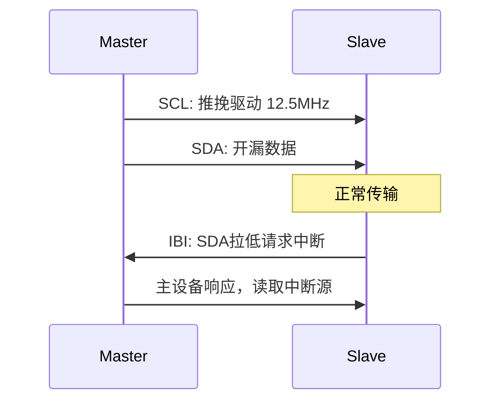
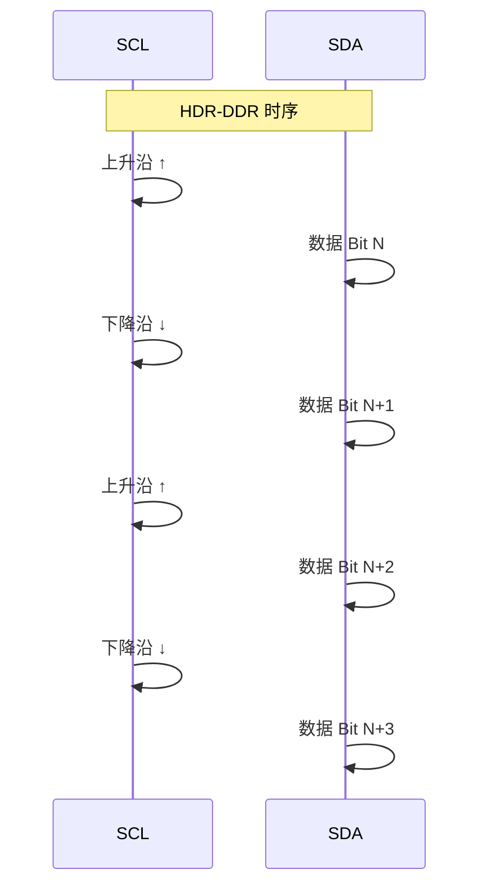
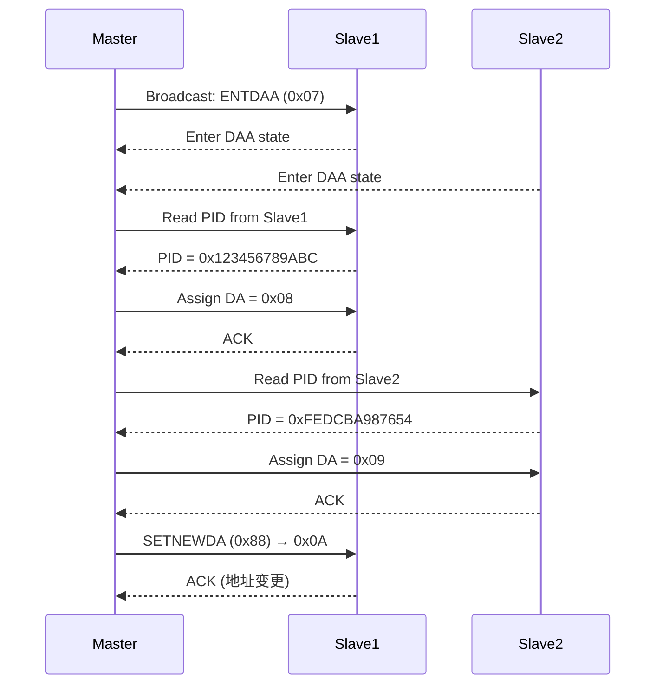

# I3C HDR 模式与高速传输

<span class="badge-i">[I]</span> <span class="badge-e">[E]</span>

---

### SDR 模式

<span class="red">SDR（Single Data Rate，单倍数据速率）</span>是 I3C 的基础模式，
所有 I3C 设备必须支持。
<br>
速率：12.5MHz，是 I2C Fast-mode+（1MHz）的 12.5 倍。
<br>

SDR 关键改进：
<br>
- 时钟推挽驱动（Push-Pull），上升沿由主动驱动而非上拉电阻
<br>
- 数据位仍为开漏，但时钟更干净、抖动更小
<br>
- 支持 In-Band Interrupt（IBI），从设备可在数据间隙拉低 SDA 请求中断
<br>

时序特征：
<br>
| 参数 | SDR 模式 | I2C Fast-mode+ 对比 |
|------|----------|---------------------|
| SCL 频率 | 12.5 MHz | 1 MHz |
| SCL 驱动 | 推挽 | 开漏 |
| SDA 驱动 | 开漏 | 开漏 |
| 数据位/时钟 | 1:1 | 1:1 |
| 中断机制 | IBI（总线内） | 无 |



<span class="blue">关键认知：SDR 就是"更快的 I2C"，电气层升级到推挽时钟，
<br>
协议层加入 IBI 和 DAA。
</span><br>

---

### HDR-DDR 模式

<span class="red">HDR-DDR（Double Data Rate）</span>在 SCL 的上升沿和下降沿都采样数据，
<br>
速率翻倍：理论 25MHz（实际 12.5MHz SCL × 2）。
<br>



进入 HDR-DDR 的流程：
<br>
1. 主设备在 SDR 模式下发送 CCC 命令 `ENTHDR0`（0x20）
<br>
2. 目标从设备确认，切换内部模式到 HDR-DDR
<br>
3. 通信使用 DDR 帧格式：每时钟周期 2 位数据
<br>
4. 退出时发送 HDR Exit Pattern，回到 SDR
<br>

HDR-DDR 帧格式与 SDR 不同：
<br>
- 使用 16 位 CRC 校验（而非 SDR 的 5 位 CRC）
<br>
- 命令码和地址编码方式改变
<br>
- 支持广播和定向两种模式
<br>

<span class="blue">易错点：不是所有 I3C 设备都支持 HDR-DDR，
<br>
需要通过 BCR 寄存器确认设备能力后再发送 ENTHDR0。
</span><br>

---

### HDR-TSP/TSL 模式

<span class="red">HDR-TSP（Ternary Symbol Pure）和 HDR-TSL（Ternary Symbol Legacy）</span>
<br>
是 I3C 的三线编码模式，进一步提升带宽。
<br>

| 模式 | 数据线 | 编码方式 | 速率 |
|------|--------|----------|------|
| HDR-TSP | SDA + SCL 都传数据 | 三态编码（高/低/高阻） | ~33MHz |
| HDR-TSL | 类似 TSP，兼容 I2C 设备 | 三态编码 | ~33MHz |

TSP 的核心思想：利用 SDA 和 SCL 两条线同时传数据，
<br>
组合出 4 种状态，每个符号携带 2 位信息。
<br>

```
状态组合：
  SDA=0, SCL=0 → Symbol 0
  SDA=0, SCL=1 → Symbol 1
  SDA=1, SCL=0 → Symbol 2
  SDA=1, SCL=1 → Symbol 3 (保留/退出码)
```

TSP 比 DDR 更激进，需要设备在物理层支持高速三态切换。
<br>
目前手机传感器集群中 TSP 尚未大规模普及，
<br>
主流仍是 SDR + DDR。
<br>

<span class="purple">扩展：MIPI I3C v1.1 新增了 HDR-BT（Bulk Transport）模式，
<br>
专为摄像头数据流传输优化，理论速率可达 100Mbps+。
</span><br>

---

### 动态地址分配完整流程



步骤详解：
<br>
1. **Enter DAA**：主设备广播 `0x07`，所有从设备响应
<br>
2. **PID 仲裁**：从设备按 PID 排序竞争总线，PID 最小的优先发言
<br>
3. **地址分配**：主设备分配 0x08~0x7F 范围内的动态地址
<br>
4. **确认写入**：从设备将地址写入内部寄存器，后续用该地址响应
<br>
5. **重复直到所有设备分配完毕**
<br>

静态 I2C 设备混合时的特殊处理：
<br>
- I2C 设备不参与 DAA，保持固定地址
<br>
- 主设备通过 `SETDASA`（0x87）把 I2C 静态地址映射为 I3C 动态地址
<br>
- I2C 设备在 I3C 总线上仍以原地址被访问，主设备自动降速到 I2C 模式
<br>

<span class="blue">关键认知：动态地址分配是启动时的"初始化仪式"，
<br>
分配完成后总线进入正常运行状态，与 I2C 的静态寻址体验一致。
</span><br>

---

### 代码：STM32MP1 I3C HAL 配置

STM32MP1 系列的 I3C 控制器支持 SDR 和 DDR 模式。
<br>

```c
#include "stm32mp1xx_hal_i3c.h"

I3C_HandleTypeDef hi3c1;

void I3C1_Init(void) {
    hi3c1.Instance = I3C1;
    
    // 主设备配置
    hi3c1.Mode = HAL_I3C_MODE_CONTROLLER;
    hi3c1.Init.ControllerBusMode = HAL_I3C_BUS_MODE_PURE;
        // PURE = 纯 I3C 设备，MIXED = 兼容 I2C
    
    // 时序配置：SDR 12.5MHz
    hi3c1.Init.ClockFreq = 12500000;
    hi3c1.Init.DataHoldTime = 0;
    hi3c1.Init.DutyCycle = HAL_I3C_DUTYCYCLE_50_50;
    
    // 动态地址分配参数
    hi3c1.Init.MaxReadLength = 256;
    hi3c1.Init.MaxWriteLength = 256;
    
    HAL_I3C_Init(&hi3c1);
}

// 执行动态地址分配
void I3C_DynamicAddressAssignment(void) {
    I3C_CCCInfoTypeDef ccc_info;
    
    // 广播 ENTDAA
    ccc_info.CCC = 0x07;  // ENTDAA
    ccc_info.Direction = I3C_WRITE;
    ccc_info.TargetAddr = 0x7E;  // 广播地址
    HAL_I3C_CCCCommand(&hi3c1, &ccc_info, HAL_MAX_DELAY);
    
    // HAL 层自动处理 PID 读取和地址分配
    // 分配完成后通过回调获取设备列表
}

// SDR 模式下读取从设备寄存器
uint8_t I3C_ReadRegister(uint8_t dev_addr, uint8_t reg) {
    uint8_t tx[1] = {reg};
    uint8_t rx[1];
    
    I3C_ControlTypeDef ctrl;
    ctrl.TargetAddr = dev_addr;
    ctrl.Direction = I3C_WRITE;
    ctrl.TxBuf = tx;
    ctrl.TxSize = 1;
    HAL_I3C_ControlCommand(&hi3c1, &ctrl, HAL_MAX_DELAY);
    
    ctrl.Direction = I3C_READ;
    ctrl.RxBuf = rx;
    ctrl.RxSize = 1;
    HAL_I3C_ControlCommand(&hi3c1, &ctrl, HAL_MAX_DELAY);
    
    return rx[0];
}
```

<span class="blue">关键认知：STM32MP1 的 HAL 把 DAA 封装成自动流程，
<br>
开发者无需手动处理 PID 仲裁和逐设备地址分配。
</span><br>

---

**学习路径提示**：
<br>
- <span class="badge-i">[I]</span> 读者：SDR 是基础，DDR 是翻倍，TSP 是未来。
<br>
  HDR 模式需要确认从设备 BCR 能力位。
<br>
- <span class="badge-e">[E]</span> 读者：STM32MP1 的 HAL I3C 驱动封装了 DAA，
<br>
  但底层寄存器配置仍需理解时序参数的含义。
