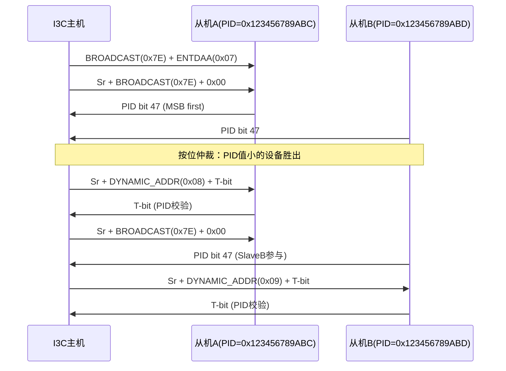
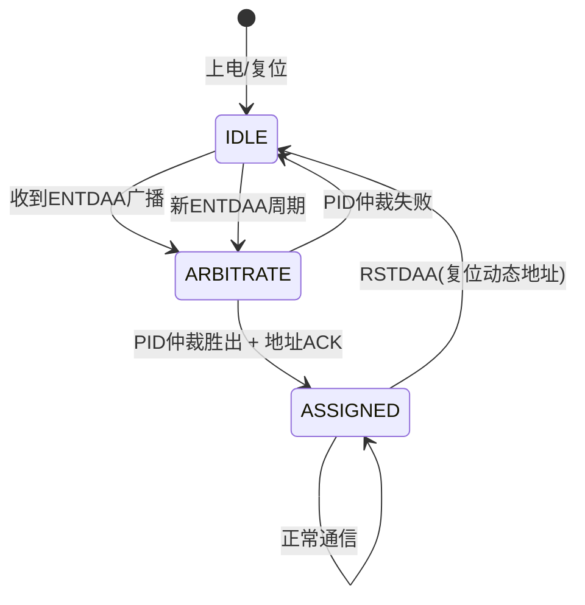
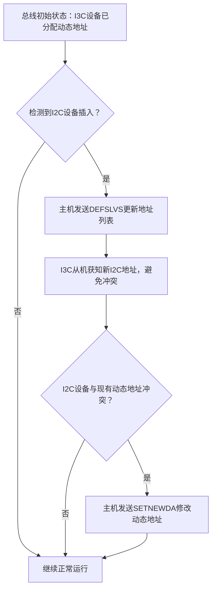

# I3C动态地址与CCC命令 [I→E]

> **本章学习目标**：
> - 理解<span class="red">ENTDAA</span>动态地址分配的广播时序与仲裁机制
> - 掌握<span class="red">CCC（Common Command Codes）</span>命令集的分类与典型用法
> - 分析<span class="red">I2C设备混挂</span>场景下的总线兼容性与速率折衷策略

---

## ENTDAA动态地址分配：从静态到动态的演进

---

### <strong>I3C地址模型的历史演进</strong>

<span class="red">I2C</span>采用静态地址模型，设备地址由外部引脚（A2/A1/A0）硬编码决定。
<br>
这一设计在1980年代简化了硬件实现，但带来了扩展性瓶颈：
<br>
同型号设备数量受引脚限制（最多8个），且地址冲突需人工排查。
<br>

<span class="blue">MIPI-I3C的设计初衷之一，就是解决I2C静态地址的扩展性缺陷。
<br>
通过引入动态地址分配机制，I3C实现了"上电即发现、自动即配置"。</span><br>

**I2C vs I3C 地址模型对比表：**

| 特性 | I2C静态地址 | I3C动态地址 |
| --- | --- | --- |
| 地址来源 | 外部引脚电平 | 主机通过ENTDAA分配 |
| 地址范围 | 7位（0x03~0x77） | 7位动态（0x08~0x77） |
| 冲突处理 | 人工排查 | 自动仲裁，无冲突 |
| 热插拔支持 | 不支持 | 支持（ENTDAA重新枚举） |
| 从机ID | 无唯一标识 | 48-bit Provisional ID |

<span class="orange"><strong>1. I3C从机的两种地址身份</strong></span><br>
每个I3C从机出厂时携带 <span class="green">48-bit Provisional ID</span>，
<br>
由24-bit厂商ID（MIPI分配）+ 16-bit部件ID + 8-bit实例ID组成。
<br>
该ID globally unique，类似于Ethernet MAC地址的分配逻辑。
<br>

<span class="orange"><strong>2. 动态地址分配的核心优势</strong></span><br>
主机通过 <span class="green">ENTDAA</span> 广播命令启动分配流程，
<br>
所有未分配地址的从机按PID优先级竞争响应，
<br>
主机依次赋予唯一动态地址（0x08~0x77范围内）。
<br>

---

### <strong>ENTDAA广播时序与仲裁机制</strong>

<span class="red">ENTDAA（Enter Dynamic Address Assignment）</span>是I3C总线初始化阶段的核心广播命令。
<br>
主机发送ENTDAA后，所有支持I3C的设备进入地址竞争状态。
<br>



<span class="orange"><strong>1. ENTDAA启动序列</strong></span><br>
主机首先发送 <span class="green">Broadcast Address 0x7E</span>（所有I3C设备必响应），
<br>
后紧跟 <span class="green">ENTDAA命令码 0x07</span>（CCC命令）。
<br>
此步骤将总线所有I3C从机置为"待分配"状态。
<br>

<span class="orange"><strong>2. PID逐位仲裁</strong></span><br>
主机发送 <span class="green">Sr + 0x7E + 0x00</span> 后，
<br>
从机开始逐位发送48-bit PID（MSB First）。
<br>
总线本质上是线与（Wired-AND），PID位小的设备拉低SDA时，
<br>
PID位大的设备检测到总线值与自身发送值不一致，自动退出竞争。
<br>

<span class="orange"><strong>3. 动态地址赋值与T-bit校验</strong></span><br>
仲裁胜出者收到主机分配的动态地址（如0x08）。
<br>
从机以 <span class="green">T-bit（Transition Bit）</span> 响应：
<br>
T-bit为从机PID的奇偶校验位，主机验证通过则地址生效。
<br>
若T-bit校验失败，主机重试分配或标记设备异常。
<br>

---

### <strong>动态地址分配状态机</strong>



<span class="blue">状态机关键点：仲裁失败不意味着设备离线，
<br>
从机保持IDLE状态等待下一轮ENTDAA，直到获得有效动态地址。</span><br>

---

## CCC通用命令代码：I3C的控制平面

---

### <strong>CCC命令集的分类体系</strong>

<span class="red">CCC（Common Command Codes）</span>是I3C总线的控制信令层，
<br>
定义了一组所有I3C设备必须支持的标准命令。
<br>

<span class="blue">CCC命令的本质：将I3C从"纯数据传输总线"升级为"带管理平面的智能总线"，
<br>
主机可通过CCC查询设备状态、配置工作模式、发起中断请求。</span><br>

**CCC命令分类与典型命令表：**

| 类别 | 命令码 | 名称 | 功能描述 | 广播/定向 |
| --- | --- | --- | --- | --- |
| 总线管理 | 0x00 | ENEC | 启用事件控制（如中断） | 广播/定向 |
| 总线管理 | 0x01 | DISEC | 禁用事件控制 | 广播/定向 |
| 总线管理 | 0x06 | RSTDAA | 复位动态地址（回IDLE） | 广播 |
| 总线管理 | 0x07 | ENTDAA | 进入动态地址分配 | 广播 |
| 总线管理 | 0x08 | DEFSLVS | 定义从机列表（I2C混挂） | 广播 |
| 状态获取 | 0x90 | GETSTATUS | 获取设备状态字 | 定向 |
| 状态获取 | 0x91 | GETPID | 获取48-bit Provisional ID | 定向 |
| 状态获取 | 0x92 | GETBCR | 获取总线特性寄存器 | 定向 |
| 状态获取 | 0x93 | GETDCR | 获取设备特性寄存器 | 定向 |
| 状态获取 | 0x94 | GETMWL | 获取最大写长度 | 定向 |
| 状态获取 | 0x95 | GETMRL | 获取最大读长度 | 定向 |
| 时序控制 | 0x8A | SETAASA | 将静态地址设为动态地址 | 定向 |
| 时序控制 | 0x8B | SETNEWDA | 修改从机动态地址 | 定向 |

<span class="orange"><strong>1. 广播命令 vs 定向命令</strong></span><br>
<span class="green">广播CCC</span>：使用0x7E广播地址，所有设备接收并执行。
<br>
适用于全局配置（如ENTDAA、RSTDAA）。
<br>
<span class="green">定向CCC</span>：使用目标从机的动态地址，仅该设备响应。
<br>
适用于状态查询（如GETPID、GETSTATUS）。
<br>

<span class="orange"><strong>2. DEFSLVS命令：I2C混挂的关键信令</strong></span><br>
<span class="green">DEFSLVS（0x08）</span>由主机广播，
<br>
向所有I3C从机通告总线上I2C静态设备的地址列表。
<br>
I3C从机据此知道哪些地址需以I2C时序访问，避免冲突。
<br>

---

### <strong>GETSTATUS与设备状态字解析</strong>

<span class="red">GETSTATUS（0x90）</span>是最常用的定向CCC命令，
<br>
用于查询从机的实时运行状态。
<br>

**状态字（16-bit）位域定义：**

| 位域 | 位号 | 含义 |
| --- | --- | --- |
| Pending Interrupt | 15:12 | 待处理中断号（0~15） |
| Protocol Error | 8 | 协议错误标志（1=发生过） |
| Activity Mode | 3:2 | 当前工作模式（SDR/HDR/TBD） |
| HDR Capable | 1 | 是否支持HDR模式 |
| Controller Request | 0 | 从机请求成为主机 |

```c
// 文件：i3c_getstatus.c
// 功能：通过i3c-dev发送GETSTATUS CCC
#include <linux/i3c/dev.h>

int i3c_getstatus(int fd, uint8_t dyn_addr, uint16_t *status)
{
    struct i3c_ccc_cmd cmd = {
        .rnw  = 1,              /* 读操作 */
        .id   = 0x90,           /* GETSTATUS CCC */
        .dest = dyn_addr,
        .ndata = 2,             /* 2字节状态字 */
        .data = status,
    };
    return ioctl(fd, I3C_CCC_CMD, &cmd);
}
```

<span class="blue">GETSTATUS的典型应用场景：
<br>
主机周期性轮询传感器状态字，当Pending Interrupt非零时，
<br>
触发中断驱动的数据读取，替代传统轮询模式以降低功耗。</span><br>

---

## I2C设备混挂：总线兼容性与速率折衷

---

### <strong>I2C混挂的电气与时序约束</strong>

<span class="red">I2C混挂（Mixed Bus）</span>指在同一总线上同时存在I3C和I2C设备。
<br>
这是I3C设计的重要兼容特性，允许渐进式升级。
<br>

<span class="blue">I2C混挂的核心矛盾：I3C支持12.5MHz SDR速率，
<br>
但I2C设备最高仅400kHz，总线速率被限制在"木桶的最短板"。</span><br>

**混挂场景速率限制表：**

| 总线组成 | 最大SCL频率 | 限制因素 |
| --- | --- | --- |
| 纯I3C | 12.5 MHz | I3C SDR物理层上限 |
| I3C + FM+ I2C（1MHz） | 1 MHz | I2C Fast-mode+上限 |
| I3C + FM I2C（400kHz） | 400 kHz | I2C Fast-mode上限 |
| I3C + SM I2C（100kHz） | 100 kHz | I2C Standard-mode上限 |

<span class="orange"><strong>1. I2C设备的静态地址保留</strong></span><br>
I2C设备使用静态地址（0x03~0x77范围内），
<br>
这些地址在I3C动态地址池中同样可用。
<br>
主机通过 <span class="green">DEFSLVS</span> 命令向I3C从机广播I2C地址列表，
<br>
I3C从机避免占用已被I2C设备使用的地址。
<br>

<span class="orange"><strong>2. I3C到I2C的时序自动降级</strong></span><br>
当主机需要访问I2C设备时，
<br>
总线控制器自动将SCL时序切换为I2C Open-Drain模式。
<br>
访问完成后，总线恢复I3C Push-Pull高速模式。
<br>
模式切换由主机在事务边界自动完成，无需软件干预。
<br>

---

### <strong>混挂场景下的热插拔与地址重分配</strong>

<span class="red">I3C支持I2C设备的热插拔</span>，
<br>
但需主机主动发起地址重新枚举。
<br>



<span class="blue">关键设计：I3C主机通过DEFSLVS+SETNEWDA的组合，
<br>
在不停机的情况下完成混挂总线的地址重构。</span><br>

---

### <strong>类比：动态地址分配与酒店入住系统</strong>

<span class="blue">I3C的ENTDAA机制可类比为酒店的前台入住流程：</span><br>

| I3C机制 | 酒店类比 | 核心逻辑 |
| --- | --- | --- |
| 48-bit PID | 身份证号 | 全球唯一身份标识 |
| ENTDAA广播 | "请未入住客人到前台" | 发起分配流程 |
| PID仲裁 | 按身份证号排序发房卡 | 优先级高的先分配 |
| 动态地址 | 房间号 | 入住期间的临时标识 |
| RSTDAA | 退房 | 释放房间号回池 |
| DEFSLVS | 预留房间公告 | 告知其他客人哪些房间已占用 |

<span class="blue">类比要点：动态地址的核心价值在于"临时性"与"可管理性"，
<br>
房间号（动态地址）不绑定客人身份（PID），
<br>
退房后房间号回收，新客人可复用，实现资源动态周转。</span><br>

---

## 本章小结

| 概念 | 一句话总结 |
| --- | --- |
| ENTDAA | I3C动态地址分配广播命令，从机按48-bit PID逐位仲裁 |
| PID | 48-bit全球唯一标识（24-bit厂商ID + 16-bit部件ID + 8-bit实例ID） |
| T-bit | 动态地址分配的奇偶校验响应位，验证PID传输完整性 |
| CCC | I3C通用命令代码，分广播/定向两类，共127个命令码 |
| DEFSLVS | 向I3C从机广播I2C设备地址列表，避免混挂冲突 |
| I2C混挂 | I3C与I2C设备共存，总线速率受I2C设备上限约束 |

---

## 练习

1. 两个I3C从机的PID分别为0x123456789ABC和0x123456789ABD，ENTDAA仲裁时哪个设备先获得动态地址？请逐位分析仲裁过程。
2. 解释为什么DEFSLVS命令对I2C混挂场景不可或缺？如果缺少该命令会出现什么问题？
3. 某I3C总线初始为纯I3C模式（12.5MHz），插入一个I2C Fast-mode设备后总线速率变为多少？主机需执行哪些CCC命令完成混挂适配？
