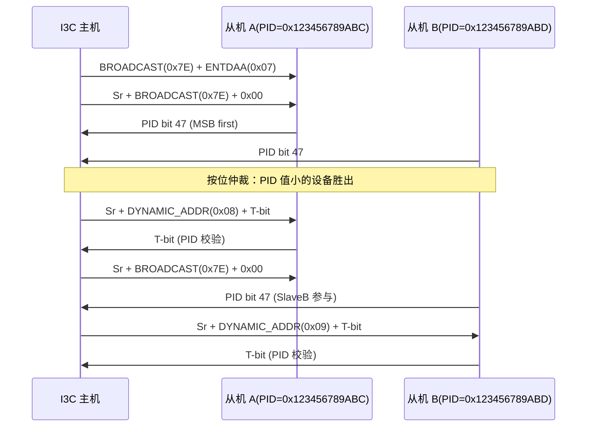
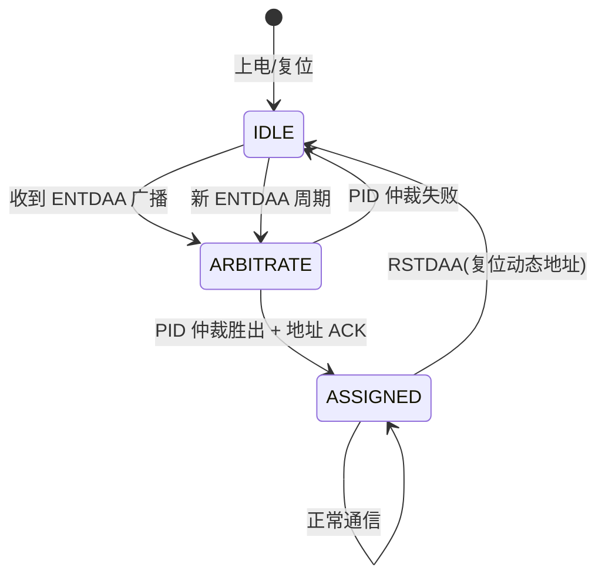
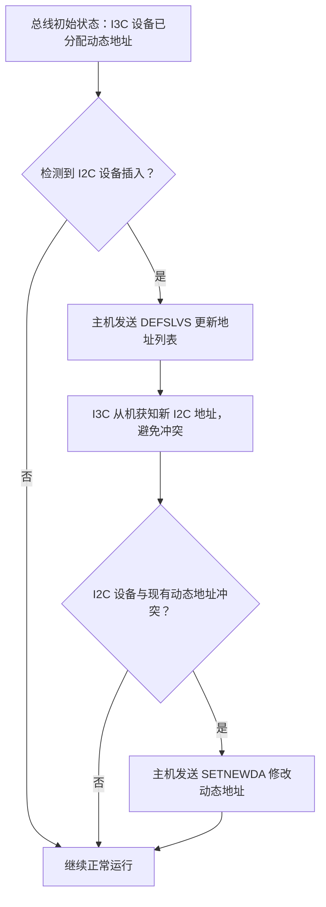

# I3C怎么工作——动态地址分配与CCC命令

---

## ENTDAA：动态地址分配的核心机制

### <span class="orange"><strong>1. 为什么需要动态地址</strong></span>

<span class="red">I2C 的静态地址模型</span>由外部引脚（A2/A1/A0）硬编码决定。

<br>

这一设计在 1980 年代简化了硬件实现，但带来了扩展性瓶颈：同型号设备数量受引脚限制（最多 8 个），且地址冲突需人工排查。

<br>

**I2C vs I3C 地址模型对比：**

| 特性 | I2C 静态地址 | I3C 动态地址 |
|------|------------|-------------|
| 地址来源 | 外部引脚电平 | 主机通过 ENTDAA 分配 |
| 地址范围 | 7 位（0x03~0x77） | 7 位动态（0x08~0x77） |
| 冲突处理 | 人工排查 | 自动仲裁，无冲突 |
| 热插拔支持 | 不支持 | 支持（ENTDAA 重新枚举） |
| 从机唯一标识 | 无 | 48-bit Provisional ID |

<br>

### <span class="orange"><strong>2. 48-bit Provisional ID</strong></span>

每个 I3C 从机出厂时携带 <span class="red">48-bit Provisional ID</span>：

```
Bit 47~24: 24-bit 厂商 ID（MIPI Alliance 分配）
Bit 23~8:  16-bit 部件 ID（厂商自定义）
Bit 7~0:   8-bit 实例 ID（区分同型号多设备）
```

<br>

该 ID 全球唯一，类似于 Ethernet MAC 地址的分配逻辑。主机通过 PID 识别设备类型和实例，分配对应的动态地址。

<br>

### <span class="orange"><strong>3. ENTDAA 广播时序与仲裁</strong></span>

<span class="red">ENTDAA（Enter Dynamic Address Assignment）</span>是 I3C 总线初始化阶段的核心广播命令。

<br>



<br>

**ENTDAA 流程解析：**

- **步骤1**：主机发送广播地址 0x7E + ENTDAA 命令码 0x07，所有未分配地址的从机进入"待分配"状态
- **步骤2**：主机发送 Sr + 0x7E + 0x00，从机开始逐位发送 48-bit PID（MSB First）
- **步骤3**：总线本质上是线与（Wired-AND），PID 位小的设备拉低 SDA 时，PID 位大的设备检测到不一致，自动退出竞争
- **步骤4**：仲裁胜出者收到主机分配的动态地址（如 0x08），以 T-bit（Transition Bit）响应——T-bit 是 PID 的奇偶校验位，主机验证通过则地址生效

<br>

### <span class="orange"><strong>4. 动态地址分配状态机</strong></span>



<br>

<span class="blue">状态机关键点：仲裁失败不意味着设备离线，从机保持 IDLE 状态等待下一轮 ENTDAA，直到获得有效动态地址。</span>

<br>

---

## CCC：通用命令代码

### <span class="orange"><strong>1. CCC 命令集分类</strong></span>

<span class="red">CCC（Common Command Codes）</span>是 I3C 总线的控制信令层，定义了一组所有 I3C 设备必须支持的标准命令。

<br>

**CCC 命令分类与典型命令：**

| 类别 | 命令码 | 名称 | 功能 | 广播/定向 |
|------|--------|------|------|----------|
| 总线管理 | 0x00 | ENEC | 启用事件控制 | 广播/定向 |
| 总线管理 | 0x01 | DISEC | 禁用事件控制 | 广播/定向 |
| 总线管理 | 0x06 | RSTDAA | 复位动态地址 | 广播 |
| 总线管理 | 0x07 | ENTDAA | 进入动态地址分配 | 广播 |
| 总线管理 | 0x08 | DEFSLVS | 定义从机列表 | 广播 |
| 状态获取 | 0x90 | GETSTATUS | 获取设备状态字 | 定向 |
| 状态获取 | 0x91 | GETPID | 获取 48-bit PID | 定向 |
| 状态获取 | 0x92 | GETBCR | 获取总线特性寄存器 | 定向 |
| 状态获取 | 0x93 | GETDCR | 获取设备特性寄存器 | 定向 |
| 状态获取 | 0x94 | GETMWL | 获取最大写长度 | 定向 |
| 状态获取 | 0x95 | GETMRL | 获取最大读长度 | 定向 |
| 地址管理 | 0x8A | SETAASA | 静态地址设为动态地址 | 定向 |
| 地址管理 | 0x8B | SETNEWDA | 修改从机动态地址 | 定向 |

<br>

### <span class="orange"><strong>2. 广播命令 vs 定向命令</strong></span>

- **广播 CCC**：使用 0x7E 广播地址，所有设备接收并执行。适用于全局配置（如 ENTDAA、RSTDAA）
- **定向 CCC**：使用目标从机的动态地址，仅该设备响应。适用于状态查询（如 GETPID、GETSTATUS）

<br>

### <span class="orange"><strong>3. GETSTATUS 状态字解析</strong></span>

<span class="red">GETSTATUS（0x90）</span>是最常用的定向 CCC，返回 16-bit 状态字。

<br>

**状态字位域定义：**

| 位域 | 位号 | 含义 |
|------|------|------|
| Pending Interrupt | 15:12 | 待处理中断号（0~15） |
| Vendor Reserved | 11:9 | 厂商保留 |
| Protocol Error | 8 | 协议错误标志（1=发生过） |
| Reserved | 7:4 | 保留 |
| Activity Mode | 3:2 | 当前工作模式（SDR/HDR/TBD） |
| HDR Capable | 1 | 是否支持 HDR 模式 |
| Controller Request | 0 | 从机请求成为主机 |

<br>

**Linux i3c-dev 接口：**

```c
#include <linux/i3c/dev.h>

int i3c_getstatus(int fd, uint8_t dyn_addr, uint16_t *status)
{
    struct i3c_ccc_cmd cmd = {
        .rnw  = 1,              /* 读操作 */
        .id   = 0x90,           /* GETSTATUS CCC */
        .dest = dyn_addr,
        .ndata = 2,             /* 2 字节状态字 */
        .data = status,
    };
    return ioctl(fd, I3C_CCC_CMD, &cmd);
}
```

<br>

<span class="blue">GETSTATUS 典型应用：主机周期性轮询传感器状态字，当 Pending Interrupt 非零时，触发中断驱动的数据读取，替代传统轮询以降低功耗。</span>

<br>

---

## I2C 混挂：总线兼容性与速率折衷

### <span class="orange"><strong>1. 混挂的电气与时序约束</strong></span>

<span class="red">I2C 混挂（Mixed Bus）</span>指在同一总线上同时存在 I3C 和 I2C 设备。

<br>

**核心矛盾**：I3C 支持 12.5MHz SDR，但 I2C 设备最高仅 400kHz，总线速率被限制在"木桶的最短板"。

<br>

**混挂场景速率限制表：**

| 总线组成 | 最大 SCL 频率 | 限制因素 |
|---------|--------------|---------|
| 纯 I3C | 12.5 MHz | I3C SDR 物理层上限 |
| I3C + FM+ I2C（1MHz） | 1 MHz | I2C Fast-mode+上限 |
| I3C + FM I2C（400kHz） | 400 kHz | I2C Fast-mode 上限 |
| I3C + SM I2C（100kHz） | 100 kHz | I2C Standard-mode 上限 |

<br>

### <span class="orange"><strong>2. DEFSLVS 命令：混挂的关键信令</strong></span>

<span class="red">DEFSLVS（0x08）</span>由主机广播，向所有 I3C 从机通告总线上 I2C 静态设备的地址列表。

<br>

I3C 从机据此知道哪些地址需以 I2C 时序访问，避免占用已被 I2C 设备使用的地址。

<br>

**混挂场景下的热插拔流程：**



<br>

<span class="blue">关键设计：I3C 主机通过 DEFSLVS + SETNEWDA 的组合，在不停机的情况下完成混挂总线的地址重构。</span>

<br>

---

## 类比：酒店入住系统

<span class="blue">I3C 的 ENTDAA 机制可类比为酒店的前台入住流程：</span>

<br>

| I3C 机制 | 酒店类比 | 核心逻辑 |
|---------|---------|---------|
| 48-bit PID | 身份证号 | 全球唯一身份标识 |
| ENTDAA 广播 | "请未入住客人到前台" | 发起分配流程 |
| PID 仲裁 | 按身份证号排序发房卡 | 优先级高的先分配 |
| 动态地址 | 房间号 | 入住期间的临时标识 |
| RSTDAA | 退房 | 释放房间号回池 |
| DEFSLVS | 预留房间公告 | 告知其他客人哪些房间已占用 |
| SETNEWDA | 换房 | 动态调整已分配的地址 |

<br>

<span class="blue">类比要点：动态地址的核心价值在于"临时性"与"可管理性"——房间号（动态地址）不绑定客人身份（PID），退房后房间号回收，新客人可复用，实现资源动态周转。</span>

<br>

---

## 本章小结

<br>

| 概念 | 一句话总结 |
|------|-----------|
| ENTDAA | I3C 动态地址分配广播命令，从机按 48-bit PID 逐位仲裁 |
| PID | 48-bit 全球唯一标识（24-bit 厂商 ID + 16-bit 部件 ID + 8-bit 实例 ID） |
| T-bit | 动态地址分配的奇偶校验响应位，验证 PID 传输完整性 |
| CCC | I3C 通用命令代码，分广播/定向两类，共 127 个命令码 |
| 0x7E | I3C 广播地址，I2C 保留，不会引起 I2C 设备响应 |
| DEFSLVS | 向 I3C 从机广播 I2C 设备地址列表，避免混挂冲突 |
| I2C 混挂 | I3C 与 I2C 设备共存，总线速率受 I2C 设备上限约束 |
| GETSTATUS | 0x90 定向 CCC，返回 16-bit 状态字，含中断/错误/模式信息 |
| SETNEWDA | 0x8B 定向 CCC，修改已分配的动态地址 |
| RSTDAA | 0x06 广播 CCC，强制所有从机释放动态地址 |

<br>

---

## 练习

1. 两个 I3C 从机的 PID 分别为 0x123456789ABC 和 0x123456789ABD，ENTDAA 仲裁时哪个设备先获得动态地址？请逐位分析仲裁过程。

2. 解释为什么 DEFSLVS 命令对 I2C 混挂场景不可或缺？如果缺少该命令会出现什么问题？

3. 某 I3C 总线初始为纯 I3C 模式（12.5MHz），插入一个 I2C Fast-mode 设备后总线速率变为多少？主机需执行哪些 CCC 命令完成混挂适配？

4. 设计一个状态机图：描述 I3C 从机从"上电"到"分配动态地址"到"响应定向 CCC"的完整状态转换。
