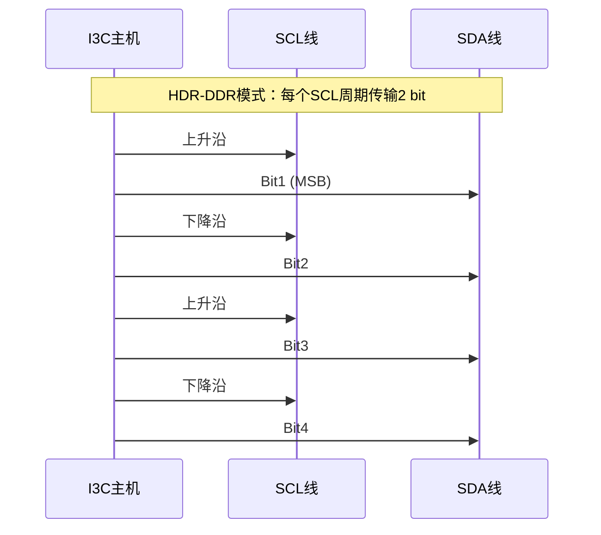
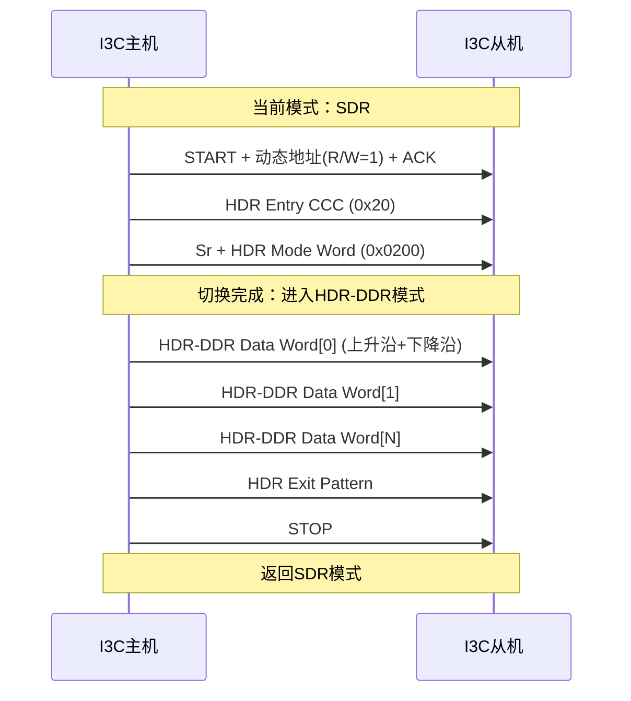

# I3C-HDR模式与高速传输 [E]

> **本章学习目标**：
> - 掌握<span class="red">HDR-TSP/HDR-DDR/HDR-DBL</span>三种高速模式的数据编码原理
> - 对比<span class="red">SDR与HDR</span>在速率、功耗、兼容性上的核心差异
> - 理解高速模式对<span class="red">电气特性</span>（上升沿、终端阻抗、串扰）的严格要求

---

## HDR-TSP/HDR-DDR/HDR-DBL：三种高速编码模式

---

### <strong>HDR模式的设计动机与分类</strong>

<span class="red">HDR（High Data Rate）</span>模式是I3C突破I2C速率瓶颈的核心机制。
<br>
传统I2C的Open-Drain架构限制SCL频率在1MHz以下，
<br>
HDR通过Push-Pull驱动和新型编码协议将有效数据吞吐提升至数十Mbps。
<br>

<span class="blue">HDR的本质创新：用每个SCL周期传输多个数据位，
<br>
而非SDR的"一个SCL边沿对应一个bit"。</span><br>

**I3C三种HDR模式编码对比表：**

| 模式 | 全称 | 编码方式 | 有效速率 | 每SCL周期数据量 | 复杂度 |
| --- | --- | --- | --- | --- | --- |
| HDR-TSP | Ternary Symbol Pure | 三态符号编码 | ~16.6 Mbps | 2 bit | 中 |
| HDR-DDR | Double Data Rate | 双边沿采样 | ~16.6 Mbps | 2 bit | 低 |
| HDR-DBL | Double Data Rate with Bus Leveling | 带均衡的DDR | ~33.3 Mbps | 4 bit | 高 |

<span class="orange"><strong>1. HDR-TSP：三态符号编码</strong></span><br>
<span class="green">TSP</span>利用SDA线的三种电平状态编码信息：
<br>
高电平（H）、低电平（L）、高阻态（Z）。
<br>
每个SCL周期编码2 bit（4种符号组合：HH, HL, LH, LZ等）。
<br>

<span class="orange"><strong>2. HDR-DDR：经典双边沿采样</strong></span><br>
<span class="green">DDR</span>在SCL的上升沿和下降沿均采样SDA，
<br>
每个完整SCL周期传输2 bit数据。
<br>
这是最易实现且兼容性最好的HDR模式，
<br>
被绝大多数I3C主控芯片优先支持。
<br>

<span class="orange"><strong>3. HDR-DBL：带均衡的高吞吐模式</strong></span><br>
<span class="green">DBL</span>在DDR基础上引入Bus Leveling技术，
<br>
通过动态调节终端阻抗抑制高频反射，
<br>
将有效速率提升至DDR的两倍（约33.3 Mbps）。
<br>

---

### <strong>HDR-DDR的详细时序与帧格式</strong>

<span class="red">HDR-DDR</span>是最具工程实用价值的模式，
<br>
其时序与SDR兼容，仅将数据采样点从单边沿改为双边沿。
<br>



**HDR-DDR数据帧结构：**

| 字段 | 长度 | 描述 |
| --- | --- | --- |
| HDR Entry Command | 8 bit | 0x20 (HDR-DDR入口CCC) |
| HDR Mode Indicator | 8 bit | 0x02 (标识DDR模式) |
| Data Word | 16 bit × N | 每Word=Command(8) + Parity(1) + Data(7) |
| CRC-5 | 5 bit | 帧校验 |
| HDR Exit Pattern | 特殊时序 | 返回SDR模式 |

<span class="blue">HDR-DDR帧的关键设计：每16-bit Data Word内含1-bit Parity，
<br>
CRC-5覆盖整个HDR会话，双重校验保障高速传输可靠性。</span><br>

---

## SDR vs HDR对比：速率、功耗与兼容性

---

### <strong>三种工作模式的全维度对比</strong>

<span class="red">SDR（Single Data Rate）</span>是I3C的基础模式，
<br>
向下兼容I2C的Open-Drain时序。
<br>
HDR模式则代表I3C的高速能力上限。
<br>

**SDR vs HDR-DDR vs HDR-DBL 全维度对比表：**

| 对比维度 | SDR模式 | HDR-DDR | HDR-DBL |
| --- | --- | --- | --- |
| SCL最大频率 | 12.5 MHz | 12.5 MHz | 12.5 MHz |
| 有效数据速率 | ~10 Mbps | ~16.6 Mbps | ~33.3 Mbps |
| 驱动方式 | Open-Drain / Push-Pull | Push-Pull | Push-Pull |
| 每周期数据bit | 1 | 2 | 4 |
| I2C兼容性 | 完全兼容 | 不兼容I2C设备 | 不兼容I2C设备 |
| 功耗（动态） | 较低 | 中等 | 较高 |
| 线长容忍 | 较长（Open-Drain边沿缓） | 中等 | 短（需阻抗匹配） |
| 主控芯片支持率 | 100% | ~80% | ~30% |
| 典型应用场景 | 传感器低速轮询 | 图像传感器/显示屏 | 高速SerDes替代 |

<span class="orange"><strong>1. 速率换算公式</strong></span><br>
有效数据速率 = SCL频率 × 每周期bit数 × 编码效率。
<br>
SDR编码效率≈80%（含地址、ACK等开销），
<br>
HDR-DDR编码效率≈66%（含Parity、CRC等开销）。
<br>

<span class="orange"><strong>2. 功耗权衡</strong></span><br>
Push-Pull驱动相比Open-Drain，
<br>
高电平由驱动器主动推送而非上拉电阻维持，
<br>
电容充放电更快，边沿更陡，但动态功耗与CV²f成正比增加。
<br>
HDR模式在提升速率的同时，单位数据能耗反而降低（更高效）。
<br>

---

### <strong>模式切换时序：从SDR进入HDR-DDR</strong>

<span class="red">模式切换</span>是I3C总线状态管理的关键操作，
<br>
必须由主机发起，且所有参与HDR的从机预协商支持。
<br>



<span class="orange"><strong>1. HDR入口序列</strong></span><br>
主机在SDR模式下发送 <span class="green">CCC 0x20</span>（Enter HDR Mode），
<br>
后紧跟 <span class="green">HDR Mode Word 0x0200</span>（标识DDR模式）。
<br>
从机在ACK后切换内部采样逻辑为双边沿模式。
<br>

<span class="orange"><strong>2. HDR会话期间</strong></span><br>
所有数据传输采用DDR时序，
<br>
SCL为Push-Pull方波，SDA在每个边沿翻转。
<br>
期间不允许任何I2C设备介入（I2C设备无法解析DDR时序）。
<br>

<span class="orange"><strong>3. HDR退出序列</strong></span><br>
主机发送特殊退出图案（Exit Pattern），
<br>
随后发送STOP返回SDR模式。
<br>
退出图案由特定时序组合构成，确保所有设备同步回退。
<br>

---

## 高速模式下的电气要求

---

### <strong>Push-Pull驱动的电气特性</strong>

<span class="red">HDR模式强制使用Push-Pull驱动</span>，
<br>
这与I2C的Open-Drain有本质电气差异。
<br>

**Open-Drain vs Push-Pull 电气对比表：**

| 参数 | Open-Drain (I2C/SDR) | Push-Pull (HDR) |
| --- | --- | --- |
| 高电平来源 | 外部上拉电阻 | 驱动器PMOS主动推挽 |
| 上升时间 | 由RC决定（较慢） | 由驱动能力决定（快） |
| 功耗特性 | 静态功耗（上拉电流） | 动态功耗（开关损耗） |
| 线与能力 | 支持多主仲裁 | 不支持（单主控制） |
| 最大频率 | 1 MHz（典型） | 12.5 MHz（理论） |

<span class="orange"><strong>1. 上升沿陡度要求</strong></span><br>
HDR-DDR要求SCL/SDA上升时间 <span class="green">tr ≤ 30ns</span>（12.5MHz时）。
<br>
过缓的边沿会导致双边沿采样窗口收窄，
<br>
从机可能在边沿附近误判数据值。
<br>

<span class="orange"><strong>2. 终端阻抗与反射抑制</strong></span><br>
高速信号在PCB走线上的传播延迟不可忽视。
<br>
当走线长度 > 信号上升沿等效长度的1/6时，
<br>
必须考虑传输线效应和终端匹配。
<br>

```c
// 信号完整性估算：临界走线长度
// tr = 30ns, PCB介电常数 εr ≈ 4.5
// 传播延迟 td = 1.5 ns/inch
// 临界长度 Lc = tr / (6 × td) ≈ 3.3 inch ≈ 8.4 cm
```

<span class="blue">工程准则：HDR模式走线长度超过8cm时，
<br>
建议串联端接（22~33Ω）或加I3C专用缓冲器。</span><br>

---

### <strong>HDR-DBL的Bus Leveling均衡机制</strong>

<span class="red">Bus Leveling</span>是HDR-DBL独有的信号完整性技术，
<br>
用于补偿长走线或多负载场景下的高频衰减。
<br>

<span class="orange"><strong>1. 均衡原理</strong></span><br>
高频分量在传输线上的衰减大于低频分量，
<br>
导致信号眼图闭合。
<br>
Bus Leveling在发射端预加重高频分量，
<br>
或在接收端增强高频补偿，使眼图重新张开。
<br>

<span class="orange"><strong>2. I3C自动均衡流程</strong></span><br>
主机在进入HDR-DBL前发送训练序列，
<br>
从机测量信号质量并反馈均衡参数建议，
<br>
主机据此调节驱动强度。
<br>
此过程无需人工干预，完全自动完成。
<br>

---

### <strong>历史演进：从I2C 100kHz到I3C 33Mbps的电气革命</strong>

<span class="red">I2C总线</span>诞生于1982年，最初设计目标是板内低速控制，
<br>
Philips工程师为简化PCB布线选择了Open-Drain+上拉的电气方案。
<br>
这一设计在100kHz时代完全够用，但成为后续提速的物理瓶颈。
<br>

**嵌入式总线速率演进时间线：**

| 年份 | 技术 | 速率 | 电气架构 | 关键突破 |
| --- | --- | --- | --- | --- |
| 1982 | I2C Standard-mode | 100 kHz | Open-Drain | 两线节省引脚 |
| 1992 | I2C Fast-mode | 400 kHz | Open-Drain | 降额上拉电阻 |
| 2007 | I2C FM+ | 1 MHz | Open-Drain | 更强驱动IC |
| 2017 | I3C SDR | 12.5 MHz | Push-Pull | 放弃Open-Drain |
| 2017 | I3C HDR-DDR | ~16.6 Mbps | Push-Pull+双边沿 | 编码效率提升 |
| 2020 | I3C HDR-DBL | ~33.3 Mbps | Push-Pull+均衡 | 信号完整性补偿 |

<span class="blue">演进本质：总线速率的每次量级提升，
<br>
都伴随电气架构的根本变革——从被动上拉到主动推挽，
<br>
从单端低速到高速差分思想的单端化应用。</span><br>

---

## 本章小结

| 概念 | 一句话总结 |
| --- | --- |
| HDR-TSP | 三态符号编码，每SCL周期2 bit，复杂度中等 |
| HDR-DDR | 双边沿采样，最广泛支持的HDR模式，~16.6 Mbps |
| HDR-DBL | 带Bus Leveling均衡，~33.3 Mbps，需阻抗匹配 |
| HDR Entry | CCC 0x20启动HDR会话，Mode Word标识具体模式 |
| HDR Exit | 特殊时序图案退出，返回SDR兼容I2C设备 |
| Push-Pull | HDR强制电气架构，上升沿<30ns，不支持线与仲裁 |

---

## 练习

1. 计算HDR-DDR模式在12.5MHz SCL下的理论峰值速率，并说明为什么实际有效速率只有约16.6 Mbps而非25 Mbps。
2. 某PCB上I3C总线走线长度为15cm，计划使用HDR-DDR模式。请判断是否需要端接电阻？如果需要，计算建议的串联端阻值。
3. 为什么HDR模式会话期间不允许I2C设备参与？如果I2C从机在HDR会话期间尝试拉低SDA会发生什么？
