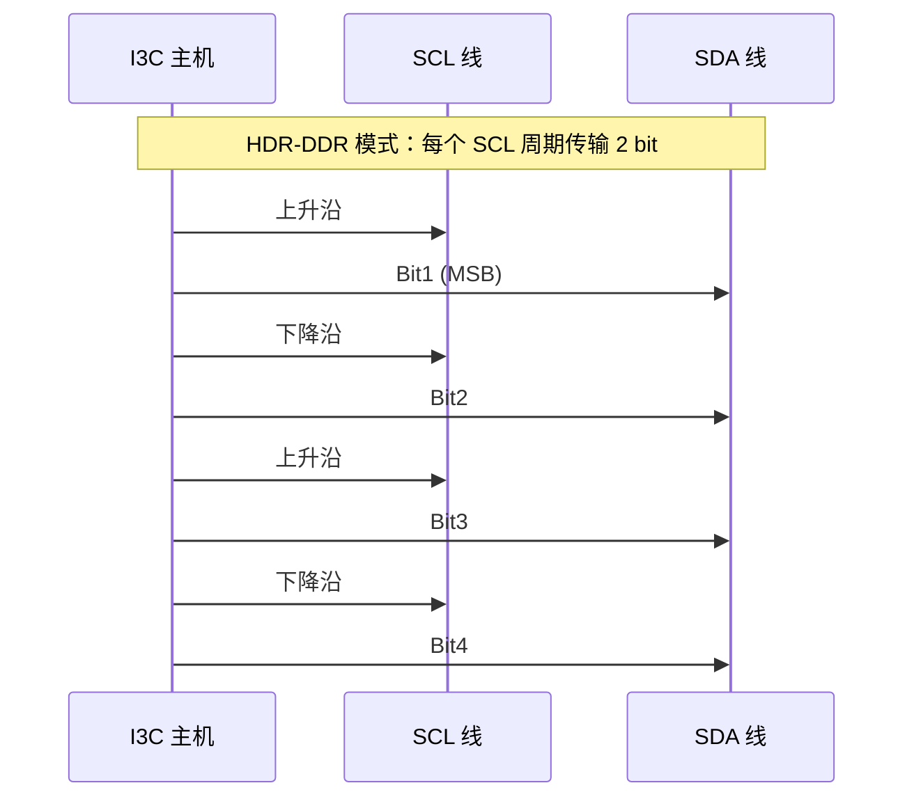
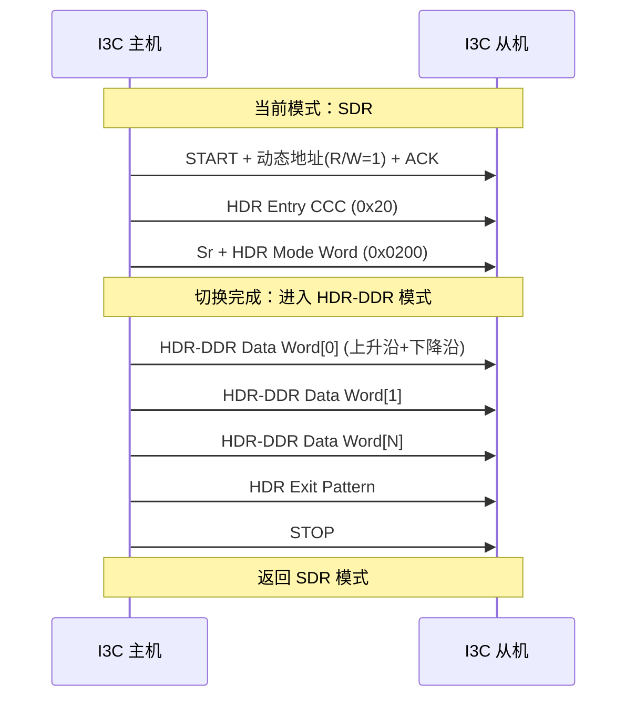

# I3C为什么能高速——HDR模式与推挽驱动

---

## HDR 模式的设计动机

<span class="red">HDR（High Data Rate）</span> 模式是 I3C 突破 I2C 速率瓶颈的核心机制。

<br>

传统 I2C 的 Open-Drain 架构限制 SCL 频率在 1MHz 以下：上拉电阻 + 总线电容形成 RC 网络，上升时间 tr = 0.8473 × Rp × Cb。即使 Rp 降到 500Ω，400pF 总线电容下 tr 仍约 170ns，无法支撑更高频率。

<br>

<span class="blue">HDR 的本质创新：用 Push-Pull 驱动替代 Open-Drain，由驱动器主动推高 SDA/SCL，消除 RC 上升延迟；同时用双边沿采样或三态符号编码，在每个 SCL 周期传输多个数据位。</span>

<br>

---

## 三种 HDR 编码模式

### <span class="orange"><strong>1. HDR-TSP：三态符号编码</strong></span>

<span class="red">HDR-TSP（Ternary Symbol Pure）</span> 利用 SDA 线的三种电平状态编码信息：

- 高电平（H）
- 低电平（L）
- 高阻态（Z）

<br>

每个 SCL 周期编码 2 bit（四种符号组合：HH、HL、LH、LZ 等）。三态编码的复杂度中等，需要接收端精确区分 Z 状态。

<br>

### <span class="orange"><strong>2. HDR-DDR：经典双边沿采样</strong></span>

<span class="red">HDR-DDR</span> 在 SCL 的上升沿和下降沿均采样 SDA，每个完整 SCL 周期传输 2 bit 数据。

<br>



<br>

**HDR-DDR 数据帧结构：**

| 字段 | 长度 | 描述 |
|------|------|------|
| HDR Entry Command | 8 bit | 0x20（HDR-DDR 入口 CCC） |
| HDR Mode Indicator | 8 bit | 0x02（标识 DDR 模式） |
| Data Word | 16 bit × N | 每 Word = Command(8) + Parity(1) + Data(7) |
| CRC-5 | 5 bit | 帧校验 |
| HDR Exit Pattern | 特殊时序 | 返回 SDR 模式 |

<br>

<span class="blue">双重校验设计：每 16-bit Data Word 内含 1-bit Parity，CRC-5 覆盖整个 HDR 会话，保障高速传输可靠性。</span>

<br>

### <span class="orange"><strong>3. HDR-DBL：带均衡的高吞吐模式</strong></span>

<span class="red">HDR-DBL（Double Data Rate with Bus Leveling）</span> 在 DDR 基础上引入 Bus Leveling 技术，通过动态调节终端阻抗抑制高频反射，将有效速率提升至 DDR 的两倍（约 33.3 Mbps）。

<br>

**三种 HDR 模式对比：**

| 模式 | 编码方式 | 有效速率 | 每 SCL 周期数据量 | 复杂度 | 主控支持率 |
|------|---------|---------|------------------|--------|-----------|
| HDR-TSP | 三态符号 | ~16.6 Mbps | 2 bit | 中 | ~40% |
| HDR-DDR | 双边沿采样 | ~16.6 Mbps | 2 bit | 低 | ~80% |
| HDR-DBL | Bus Leveling + DDR | ~33.3 Mbps | 4 bit | 高 | ~30% |

<br>

---

## SDR vs HDR 全维度对比

### <span class="orange"><strong>1. 速率、功耗与兼容性</strong></span>

| 对比维度 | SDR 模式 | HDR-DDR | HDR-DBL |
|---------|---------|---------|---------|
| SCL 最大频率 | 12.5 MHz | 12.5 MHz | 12.5 MHz |
| 有效数据速率 | ~10 Mbps | ~16.6 Mbps | ~33.3 Mbps |
| 驱动方式 | Open-Drain / Push-Pull | Push-Pull | Push-Pull |
| 每周期数据 bit | 1 | 2 | 4 |
| I2C 兼容性 | 完全兼容 | 不兼容 | 不兼容 |
| 功耗（动态） | 较低 | 中等 | 较高 |
| 线长容忍 | 较长（Open-Drain 边沿缓） | 中等 | 短（需阻抗匹配） |
| 典型应用 | 传感器低速轮询 | 图像传感器/指纹 | 高速 SerDes 替代 |

<br>

### <span class="orange"><strong>2. 速率换算公式</strong></span>

```
有效数据速率 = SCL频率 × 每周期bit数 × 编码效率

SDR:   12.5MHz × 1 × 80%  ≈ 10  Mbps  /* 含地址、ACK 开销 */
DDR:   12.5MHz × 2 × 66%  ≈ 16.6Mbps  /* 含 Parity、CRC 开销 */
DBL:   12.5MHz × 4 × 66%  ≈ 33.3Mbps  /* 含均衡训练开销 */
```

<br>

### <span class="orange"><strong>3. 功耗权衡</strong></span>

Push-Pull 驱动相比 Open-Drain：

- 高电平由驱动器主动推送而非上拉电阻维持
- 电容充放电更快，边沿更陡
- 动态功耗与 CV²f 成正比增加
- 但单位数据能耗反而降低（更高效）

<br>

<span class="blue">结论：HDR 模式在提升速率的同时，单位 bit 能耗优于 SDR。适合"少量数据、高速突发"的场景（如指纹传感器一次性传输特征点）。</span>

<br>

---

## 模式切换时序：从 SDR 进入 HDR-DDR

### <span class="orange"><strong>1. HDR 入口序列</strong></span>



<br>

**步骤解析：**

- **步骤1**：SDR 模式下发送 CCC 0x20（Enter HDR Mode），后跟 HDR Mode Word 0x0200（标识 DDR 模式）
- **步骤2**：从机 ACK 后切换内部采样逻辑为双边沿模式
- **步骤3**：HDR 会话期间所有传输采用 DDR 时序，SCL 为 Push-Pull 方波，SDA 在每个边沿翻转
- **步骤4**：主机发送 HDR Exit Pattern 后 STOP，所有设备同步回退到 SDR

<br>

### <span class="orange"><strong>2. I2C 设备在 HDR 会话期间的行为</strong></span>

HDR 会话期间 SCL 为 Push-Pull 方波，频率可达 12.5MHz。I2C 设备：

- 无法识别 Push-Pull 时序（I2C 只支持 Open-Drain）
- 可能被快速翻转的信号误触发
- 因此 HDR 会话期间 I2C 设备必须忽略总线活动

<br>

<span class="blue">关键规则：HDR 入口前主机必须确认参与会话的所有从机都支持该 HDR 模式。HDR 会话期间不允许 I2C 设备介入。</span>

<br>

---

## 高速模式下的电气要求

### <span class="orange"><strong>1. Push-Pull 驱动的电气特性</strong></span>

**Open-Drain vs Push-Pull 电气对比：**

| 参数 | Open-Drain (I2C/SDR) | Push-Pull (HDR) |
|------|---------------------|-----------------|
| 高电平来源 | 外部上拉电阻 | 驱动器 PMOS 主动推挽 |
| 上升时间 | 由 RC 决定（较慢） | 由驱动能力决定（快） |
| 功耗特性 | 静态功耗（上拉电流） | 动态功耗（开关损耗） |
| 线与能力 | 支持多主仲裁 | 不支持（单主控制） |
| 最大频率 | 1 MHz（典型） | 12.5 MHz（理论） |

<br>

### <span class="orange"><strong>2. 上升沿陡度要求</strong></span>

HDR-DDR 要求 SCL/SDA 上升时间 <span class="red">tr ≤ 30ns</span>（12.5MHz 时）。

<br>

过缓的边沿会导致双边沿采样窗口收窄，从机可能在边沿附近误判数据值。

<br>

### <span class="orange"><strong>3. 终端阻抗与反射抑制</strong></span>

高速信号在 PCB 走线上的传播延迟不可忽视。临界走线长度估算：

```
tr = 30ns, PCB 介电常数 εr ≈ 4.5
传播延迟 td = 1.5 ns/inch
临界长度 Lc = tr / (6 × td) ≈ 3.3 inch ≈ 8.4 cm
```

<br>

<span class="blue">工程准则：HDR 模式走线长度超过 8cm 时，建议串联端接（22~33Ω）或加 I3C 专用缓冲器。</span>

<br>

### <span class="orange"><strong>4. HDR-DBL 的 Bus Leveling 均衡机制</strong></span>

<span class="red">Bus Leveling</span> 是 HDR-DBL 独有的信号完整性技术：

- 高频分量在传输线上的衰减大于低频分量，导致信号眼图闭合
- Bus Leveling 在发射端预加重高频分量，或在接收端增强高频补偿
- 主机在进入 HDR-DBL 前发送训练序列，从机测量信号质量并反馈均衡参数
- 完全自动完成，无需人工干预

<br>

---

## 历史演进：从 I2C 100kHz 到 I3C 33Mbps

### <span class="orange"><strong>1. 电气架构的变革</strong></span>

| 年份 | 技术 | 速率 | 电气架构 | 关键突破 |
|------|------|------|---------|---------|
| 1982 | I2C Standard-mode | 100 kHz | Open-Drain | 两线节省引脚 |
| 1992 | I2C Fast-mode | 400 kHz | Open-Drain | 降额上拉电阻 |
| 2007 | I2C FM+ | 1 MHz | Open-Drain | 更强驱动 IC |
| 2017 | I3C SDR | 12.5 MHz | Push-Pull | 放弃 Open-Drain 限速 |
| 2017 | I3C HDR-DDR | ~16.6 Mbps | Push-Pull + 双边沿 | 编码效率提升 |
| 2020 | I3C HDR-DBL | ~33.3 Mbps | Push-Pull + 均衡 | 信号完整性补偿 |

<br>

### <span class="orange"><strong>2. 演进本质</strong></span>

总线速率的每次量级提升，都伴随电气架构的根本变革：

- 从被动上拉到主动推挽
- 从单端低速到高速差分思想的单端化应用
- 从"无需考虑信号完整性"到"必须阻抗匹配和均衡"

<br>

---

## 本章小结

<br>

| 概念 | 一句话总结 |
|------|-----------|
| HDR-TSP | 三态符号编码，每 SCL 周期 2 bit，复杂度中等 |
| HDR-DDR | 双边沿采样，最广泛支持的 HDR 模式，~16.6 Mbps |
| HDR-DBL | 带 Bus Leveling 均衡，~33.3 Mbps，需阻抗匹配 |
| HDR Entry | CCC 0x20 启动 HDR 会话，Mode Word 标识具体模式 |
| HDR Exit | 特殊时序图案退出，返回 SDR 兼容 I2C 设备 |
| Push-Pull | HDR 强制电气架构，上升沿<30ns，不支持线与仲裁 |
| 编码效率 | DDR/DBL 实际效率约 66%（含 Parity/CRC/训练开销） |
| 临界长度 | ~8.4cm，超过需端接电阻或缓冲器 |
| Bus Leveling | HDR-DBL 自动均衡，发射端预加重 + 接收端补偿 |
| I2C 隔离 | HDR 会话期间 I2C 设备必须忽略总线，避免误触发 |

<br>

---

## 练习

1. 计算 HDR-DDR 模式在 12.5MHz SCL 下的理论峰值速率，并说明为什么实际有效速率只有约 16.6 Mbps 而非 25 Mbps。

2. 某 PCB 上 I3C 总线走线长度为 15cm，计划使用 HDR-DDR 模式。请判断是否需要端接电阻？如果需要，计算建议的串联端阻值。

3. 为什么 HDR 模式会话期间不允许 I2C 设备参与？如果 I2C 从机在 HDR 会话期间尝试拉低 SDA 会发生什么？从电气和协议两个角度分析。

4. 对比 I2C Open-Drain 和 I3C HDR Push-Pull 在"相同 3.3V 电压、相同 50pF 负载"条件下的上升时间和动态功耗差异。
