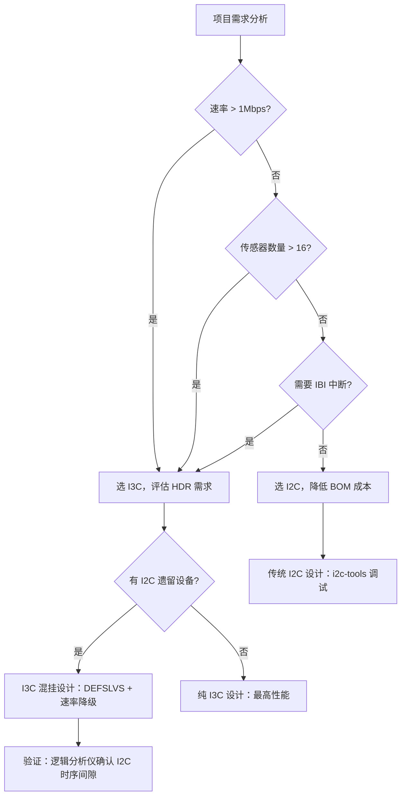

# I3C实战：STM32MP1配置与传感器阵列

---

## STM32MP1 I3C 外设架构

### <span class="orange"><strong>1. 硬件特性概览</strong></span>

<span class="red">STM32MP15x 系列</span>是 ST 首款集成 I3C 外设的 MPU，其 I3C 控制器同时支持 SDR、HDR-DDR 和 CCC 命令。

<br>

**STM32MP1 I3C 硬件特性表：**

| 特性 | 参数 | 说明 |
|------|------|------|
| 总线模式 | SDR / HDR-DDR | 不支持 HDR-TSP/HDR-DBL |
| SCL 频率 | 最高 12.5 MHz | 可配置分频 |
| DMA 支持 | TX/RX 双通道 | 减少 CPU 中断开销 |
| 内置 FIFO | 8 字节 | 缓冲突发传输 |
| CCC 支持 | 广播 + 定向 | 硬件自动 T-bit 校验 |
| 多主支持 | 是 | 基于优先级仲裁 |

<br>

<span class="blue">STM32MP1 的 I3C 外设与 I2C 外设共用部分引脚，但通过不同寄存器组独立控制。开发时需注意引脚复用配置（AF 选择）。</span>

<br>

### <span class="orange"><strong>2. HAL 库初始化与 ENTDAA</strong></span>

**核心结构体：**

```c
#include "stm32mp1xx_hal.h"

I3C_HandleTypeDef hi3c1;

void I3C1_Init(void)
{
    hi3c1.Instance = I3C1;
    
    /* SDR 模式配置：100kHz 起始，ENTDAA 后可达 12.5MHz */
    hi3c1.Init.Mode = HAL_I3C_MODE_CONTROLLER;
    hi3c1.Init.SamplingRate = HAL_I3C_SAMPLE_RATE_100MHZ;
    hi3c1.Init.DutyCycle = HAL_I3C_DUTYCYCLE_50_50;
    
    /* 时钟源来自 ACLK（典型 133MHz），分频至目标 SCL */
    hi3c1.Init.ClockPrescaler = 13;  /* 133MHz / 13 ≈ 10.2MHz SDR */
    
    if (HAL_I3C_Init(&hi3c1) != HAL_OK) {
        Error_Handler();
    }
}
```

<br>

**ENTDAA 动态地址分配：**

```c
/* 执行 ENTDAA 动态地址分配 */
int I3C_Do_ENTDAA(void)
{
    HAL_I3C_CCCTypeDef ccc;
    uint8_t dev_count = 0;
    
    ccc.Mode = HAL_I3C_CCC_BROADCAST;
    ccc.Address = 0x7E;        /* 广播地址 */
    ccc.Payload = NULL;
    ccc.Size = 0;
    
    /* 发送 ENTDAA 命令，硬件自动处理 PID 仲裁 */
    if (HAL_I3C_CCCCommand_IT(&hi3c1, &ccc, HAL_I3C_CCC_ENTDAA) != HAL_OK) {
        return -1;
    }
    
    /* 等待 ENTDAA 完成中断，查询动态地址列表 */
    HAL_I3C_GetDeviceList(&hi3c1, dev_list, &dev_count);
    
    printf("ENTDAA completed: %d device(s) assigned\n", dev_count);
    for (int i = 0; i < dev_count; i++) {
        printf("  Dev%d: PID=0x%012llX, DA=0x%02X\n",
               i, dev_list[i].ProvisionalID, dev_list[i].DynamicAddr);
    }
    return dev_count;
}
```

<br>

<span class="blue">代码关键点：`HAL_I3C_CCCCommand_IT` 启动异步 ENTDAA，HAL 自动处理底层的 PID 逐位仲裁和 T-bit 校验，软件只需等待完成回调并读取设备列表。</span>

<br>

---

## Linux I3C 子系统与驱动

### <span class="orange"><strong>1. i3c-dev 用户态接口</strong></span>

Linux 内核从 4.19 开始引入 I3C 子系统，提供 `/dev/i3c-N` 字符设备和 CCC 命令 ioctl。

<br>

**核心结构体：**

```c
#include <linux/i3c/dev.h>

/* CCC 命令封装 */
struct i3c_ccc_cmd {
    __u8  rnw;       /* 0=写, 1=读 */
    __u8  id;        /* CCC 命令码 */
    __u8  dest;      /* 目标动态地址 */
    __u16 ndata;     /* 数据长度 */
    void *data;      /* 数据缓冲区 */
};

/* ioctl 命令 */
#define I3C_CCC_CMD     _IOWR('i', 0x01, struct i3c_ccc_cmd)
#define I3C_RDWR        _IOWR('i', 0x02, struct i3c_rdwr_data)
```

<br>

**GETPID 命令示例：**

```c
int i3c_getpid(int fd, uint8_t dyn_addr, uint64_t *pid)
{
    uint8_t buf[6] = {0};
    struct i3c_ccc_cmd cmd = {
        .rnw  = 1,
        .id   = 0x91,           /* GETPID CCC */
        .dest = dyn_addr,
        .ndata = 6,             /* 48-bit = 6 bytes */
        .data = buf,
    };
    
    if (ioctl(fd, I3C_CCC_CMD, &cmd) < 0)
        return -1;
    
    *pid = ((uint64_t)buf[0] << 40) | ((uint64_t)buf[1] << 32) |
           ((uint64_t)buf[2] << 24) | ((uint64_t)buf[3] << 16) |
           ((uint64_t)buf[4] << 8)  | buf[5];
    return 0;
}
```

<br>

### <span class="orange"><strong>2. i3c-tools 调试工具</strong></span>

```bash
# 扫描 I3C 总线
$ i3cdetect -y 0
     0  1  2  3  4  5  6  7  8  9  a  b  c  d  e  f
00:          -- -- -- -- -- -- -- -- -- -- -- -- --
10: -- -- -- -- -- -- -- -- -- -- -- -- -- -- -- --
20: -- -- -- -- -- -- -- -- -- -- -- -- -- -- -- --
30: -- -- -- -- -- -- -- -- -- -- -- -- -- -- -- --
40: -- -- -- -- -- -- -- -- 48 -- -- -- -- -- -- --
50: -- -- -- -- -- -- -- -- -- -- -- -- -- -- -- --
60: -- -- -- -- -- -- -- -- -- -- -- -- -- -- -- --
70: -- -- -- -- -- -- 7E

# 发送 CCC GETSTATUS
$ i3cget -y 0 0x48 0x90 w
0x0000

# 发送 CCC GETPID
$ i3cget -y 0 0x48 0x91 c
0x123456789ABC
```

<br>

---

## 手机传感器阵列实战

### <span class="orange"><strong>1. 典型手机传感器总线拓扑</strong></span>

<span class="red">智能手机</span>是 I3C 最典型的应用场景，一部旗舰手机通常集成 10~20 个 I3C 传感器。

<br>

**手机传感器 I3C 总线拓扑表：**

| 传感器 | 功能 | 数据速率需求 | I3C 模式 |
|--------|------|------------|---------|
| 加速度计 | 手势/步态检测 | ~6.4 kbps | SDR |
| 陀螺仪 | 姿态解算 | ~25 kbps | SDR |
| 磁力计 | 电子罗盘 | ~6.4 kbps | SDR |
| 环境光传感器 | 屏幕亮度调节 | ~100 bps | SDR |
| 接近传感器 | 通话熄屏 | ~100 bps | SDR |
| 指纹传感器 | 生物识别 | ~8 Mbps | HDR-DDR |
| ToF 深度相机 | 人脸识别/AR | ~16 Mbps | HDR-DDR |
| 气压计 | GPS 海拔辅助 | ~100 bps | SDR |
| 霍尔传感器 | 翻盖检测 | ~100 bps | SDR |

<br>

**总线设计挑战：**

- 指纹和 ToF 需要 HDR-DDR 高速模式
- 大量低速传感器只需 SDR
- 多主仲裁需处理 AP 和 Sensor Hub 的权限切换

<br>

### <span class="orange"><strong>2. 多主仲裁与 In-Band Interrupt</strong></span>

**多主架构：AP + Sensor Hub**

手机中 <span class="green">Sensor Hub</span>（低功耗 MCU）和 <span class="green">AP</span>（应用处理器）共享同一条 I3C 总线：

- Sensor Hub 在 AP 休眠时接管传感器轮询
- AP 唤醒后通过多主仲裁夺回总线控制权
- I3C 的优先级仲裁机制确保高优先级设备（如紧急中断）优先获得总线

<br>

**In-Band Interrupt（IBI）机制：**

传统 I2C 中传感器中断需额外 GPIO 线连接到 AP。I3C 的 IBI 将中断请求封装在数据帧内：

- 传感器在 SDR 模式下通过特定地址请求发言
- 主机响应后读取中断源寄存器
- 无需额外 GPIO

<br>

```c
void HAL_I3C_IBI_IRQHandler(I3C_HandleTypeDef *hi3c)
{
    uint8_t ibi_addr;
    uint16_t mrl;
    
    /* 获取发起 IBI 的从机动态地址 */
    ibi_addr = HAL_I3C_GetIBIAddress(hi3c);
    
    /* 读取该设备的 MRL（最大读长度） */
    HAL_I3C_CCC_GetMRL(hi3c, ibi_addr, &mrl);
    
    /* 定向读取中断数据 */
    HAL_I3C_Master_Receive(hi3c, ibi_addr, ibi_buf, mrl);
    
    /* 分发到具体传感器驱动 */
    dispatch_sensor_irq(ibi_addr, ibi_buf);
}
```

<br>

<span class="blue">IBI 的核心价值：为 10+ 传感器的手机设计节省 10+ GPIO 引脚，在 PCB 空间寸土寸金的消费电子产品中意义重大。</span>

<br>

---

## I3C vs I2C 选型决策

### <span class="orange"><strong>1. 量化选型对比框架</strong></span>

| 选型维度 | I2C | I3C | 决策权重建议 |
|---------|-----|-----|-------------|
| 器件成本 | 极低（$0.01~$0.05） | 较高（$0.10~$0.50） | 高（BOM 敏感项目优先 I2C） |
| 主控支持 | 100% MCU 支持 | 仅新型 MPU/MCU | 中（选型范围受限） |
| 最大速率 | 1 MHz（FM+） | 12.5 MHz SDR / 33.3 Mbps HDR | 高（速率瓶颈选 I3C） |
| 功耗效率 | 静态上拉功耗 | 动态功耗更低/位 | 中（电池供电需细算） |
| 热插拔 | 不支持 | 支持（ENTDAA 重枚举） | 中（模块化设计需考虑） |
| 中断/IBI | 不支持（需额外 GPIO） | 支持 In-Band Interrupt | 高（省 GPIO 选 I3C） |
| 传感器数量 | 8~16 个（地址冲突） | 理论上无上限（动态地址） | 中（多传感器阵列选 I3C） |
| 调试工具 | i2c-tools 成熟 | i3c-tools 较新 | 低（工具链快速跟进） |
| 标准成熟度 | 40 年积累 | 2017 发布，仍在演进 | 中（保守项目选 I2C） |

<br>

### <span class="orange"><strong>2. 过渡策略：I3C 总线上的 I2C 兼容设计</strong></span>



<br>

<span class="blue">决策树核心逻辑：先判断是否"需要 I3C"，再判断"能否用 I3C"，最后处理混挂兼容性。避免"为用而用"的技术堆叠。</span>

<br>

---

## 本章小结

<br>

| 概念 | 一句话总结 |
|------|-----------|
| STM32MP1 I3C | 硬件自动 ENTDAA+DMA，HAL 接口与 I2C 风格一致 |
| ClockPrescaler | 133MHz ACLK 分频至目标 SCL，如 13 分频≈10.2MHz |
| HDR Entry | CCC 0x20 启动，HAL 自动处理 Exit 序列 |
| i3c-dev | Linux 4.19+ I3C 用户态接口，ioctl + `struct i3c_ccc_cmd` |
| i3cdetect | 扫描动态地址范围，发现 I3C 设备 |
| i3cget | 发送定向 CCC 并读取响应 |
| IBI | In-Band Interrupt，省 GPIO，通过总线内嵌中断请求 |
| 多主仲裁 | Sensor Hub 与 AP 共享总线，休眠时自动切换 |
| 手机传感器 | I3C 典型场景：10~20 传感器，HDR 用于指纹/ToF |
| 选型 I3C | 速率>1Mbps 或传感器>16 个或需 IBI 时优选 I3C |

<br>

---

## 练习

1. 在 STM32MP1 上配置 I3C 为 12.5MHz SDR 模式，如果 ACLK 为 133MHz，请计算 ClockPrescaler 寄存器应写入的值（取整数分频）。

2. 某手机设计有 18 个传感器，其中 2 个需要 4Mbps 数据率，其余为低速。请给出总线方案建议：纯 I3C、I2C+I3C 双总线、还是 I3C 混挂？说明理由。

3. 解释为什么 I3C 的 IBI 机制可以为手机设计节省大量 GPIO？对比传统 I2C 方案下 15 个传感器的中断 GPIO 需求与 I3C 方案的需求差异。

4. 编写一段 C 代码，通过 i3c-dev 发送 GETSTATUS CCC 并解析返回的 16-bit 状态字，打印出 Pending Interrupt 号和 Protocol Error 标志。
