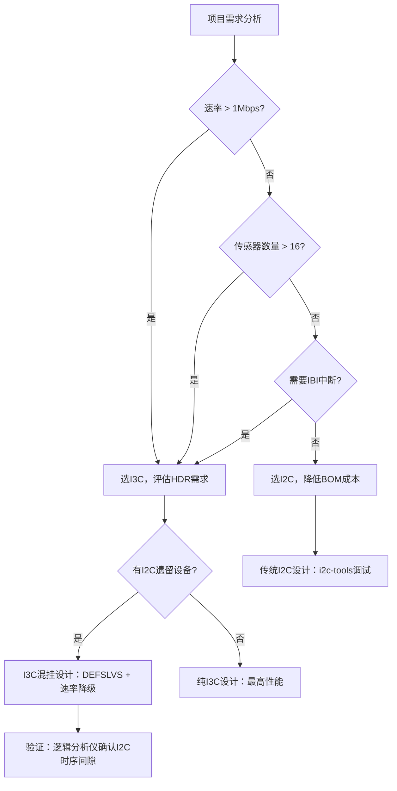

# I3C嵌入式实战与对比I2C [I]

> **本章学习目标**：
> - 掌握<span class="red">STM32MP1</span>的I3C外设配置与HAL驱动调用流程
> - 建立<span class="red">I3C vs I2C</span>选型的量化决策框架
> - 分析<span class="red">手机传感器阵列</span>中I3C的多主仲裁与中断机制

---

## STM32MP1 I3C配置与HAL驱动

---

### <strong>STM32MP15x I3C外设架构概览</strong>

<span class="red">STM32MP15x系列</span>是ST首款集成I3C外设的MPU，
<br>
其I3C控制器同时支持SDR、HDR-DDR和CCC命令。
<br>

<span class="blue">STM32MP1的I3C外设关键特性：
<br>
硬件自动ENTDAA、内置DMA、支持多主仲裁，
<br>
与I2C外设共用部分引脚但通过不同寄存器组独立控制。</span><br>

**STM32MP1 I3C硬件特性表：**

| 特性 | 参数 | 说明 |
| --- | --- | --- |
| 总线模式 | SDR / HDR-DDR | 不支持HDR-TSP/HDR-DBL |
| SCL频率 | 最高12.5 MHz | 可配置分频 |
| DMA支持 | TX/RX双通道 | 减少CPU中断开销 |
| 内置FIFO | 8字节 | 缓冲突发传输 |
| CCC支持 | 广播+定向 | 硬件自动T-bit校验 |
| 多主支持 | 是 | 基于优先级仲裁 |

---

### <strong>HAL库初始化与ENTDAA配置</strong>

<span class="red">STM32 HAL库</span>为I3C提供与I2C类似的API抽象，
<br>
但增加了CCC命令和动态地址管理的专用接口。
<br>

```c
// 文件：stm32mp1_i3c_init.c
// 功能：STM32MP1 I3C外设初始化与ENTDAA
#include "stm32mp1xx_hal.h"

I3C_HandleTypeDef hi3c1;

void I3C1_Init(void)
{
    hi3c1.Instance = I3C1;
    
    /* SDR模式配置：100kHz起始，ENTDAA后可达12.5MHz */
    hi3c1.Init.Mode = HAL_I3C_MODE_CONTROLLER;
    hi3c1.Init.SamplingRate = HAL_I3C_SAMPLE_RATE_100MHZ;
    hi3c1.Init.DutyCycle = HAL_I3C_DUTYCYCLE_50_50;
    
    /* 时钟源来自ACLK（典型133MHz），分频至目标SCL */
    hi3c1.Init.ClockPrescaler = 13;  /* 133MHz / 13 ≈ 10.2MHz SDR */
    
    if (HAL_I3C_Init(&hi3c1) != HAL_OK) {
        Error_Handler();
    }
}

/* 执行ENTDAA动态地址分配 */
int I3C_Do_ENTDAA(void)
{
    HAL_I3C_CCCTypeDef ccc;
    uint8_t dev_count = 0;
    
    ccc.Mode = HAL_I3C_CCC_BROADCAST;
    ccc.Address = 0x7E;        /* 广播地址 */
    ccc.Payload = NULL;
    ccc.Size = 0;
    
    /* 发送ENTDAA命令，硬件自动处理PID仲裁 */
    if (HAL_I3C_CCCCommand_IT(&hi3c1, &ccc, HAL_I3C_CCC_ENTDAA) != HAL_OK) {
        return -1;
    }
    
    /* 等待ENTDAA完成中断，查询动态地址列表 */
    HAL_I3C_GetDeviceList(&hi3c1, dev_list, &dev_count);
    
    printf("ENTDAA completed: %d device(s) assigned\n", dev_count);
    for (int i = 0; i < dev_count; i++) {
        printf("  Dev%d: PID=0x%012llX, DA=0x%02X\n",
               i, dev_list[i].ProvisionalID, dev_list[i].DynamicAddr);
    }
    return dev_count;
}
```

<span class="blue">代码关键点：`HAL_I3C_CCCCommand_IT` 启动异步ENTDAA，
<br>
HAL自动处理底层的PID逐位仲裁和T-bit校验，
<br>
软件只需等待完成回调并读取设备列表。</span><br>

---

### <strong>HDR-DDR模式的数据传输</strong>

```c
// 文件：stm32mp1_i3c_hdr.c
// 功能：通过HDR-DDR模式批量读取传感器数据

/* 进入HDR-DDR模式并读取16字节 */
int I3C_HDR_DDR_Read(uint8_t dyn_addr, uint8_t *buf, uint16_t len)
{
    HAL_I3C_XferTypeDef xfer;
    
    /* 步骤1：发送HDR Entry CCC */
    xfer.Mode = HAL_I3C_MODE_HDR;
    xfer.HdrMode = HAL_I3C_HDR_DDR;
    xfer.TargetAddr = dyn_addr;
    xfer.Direction = HAL_I3C_DIRECTION_READ;
    xfer.Data = buf;
    xfer.Size = len;
    
    if (HAL_I3C_Master_Transmit_DMA(&hi3c1, &xfer) != HAL_OK) {
        return -1;
    }
    
    /* 等待DMA传输完成中断 */
    while (xfer.State != HAL_I3C_STATE_READY);
    
    /* 步骤2：自动发送HDR Exit */
    HAL_I3C_Master_Stop(&hi3c1);
    return 0;
}
```

---

## I3C vs I2C选型决策

---

### <strong>量化选型对比框架</strong>

<span class="red">I3C与I2C的选型</span>不是"新技术一定更好"的简单判断，
<br>
而是需要基于具体场景的量化权衡。
<br>

<span class="blue">选型决策的核心维度：速率需求、功耗预算、成本约束、
<br>
生态成熟度、未来扩展性，五个维度加权评分。</span><br>

**I3C vs I2C 全维度选型对比表：**

| 选型维度 | I2C | I3C | 决策权重建议 |
| --- | --- | --- | --- |
| 器件成本 | 极低（$0.01~$0.05） | 较高（$0.10~$0.50） | 高（BOM敏感项目优先I2C） |
| 主控支持 | 100% MCU支持 | 仅新型MPU/MCU | 中（选型范围受限） |
| 最大速率 | 1 MHz（FM+） | 12.5 MHz SDR / 33.3 Mbps HDR | 高（速率瓶颈选I3C） |
| 功耗效率 | 静态上拉功耗 | 动态功耗更低/位 | 中（电池供电需细算） |
| 热插拔 | 不支持 | 支持（ENTDAA重枚举） | 中（模块化设计需考虑） |
| 中断/IBI | 不支持（需额外GPIO） | 支持In-Band Interrupt | 高（省GPIO选I3C） |
| 传感器数量 | 8~16个（地址冲突） | 理论上无上限（动态地址） | 中（多传感器阵列选I3C） |
| 调试工具 | i2c-tools成熟 | i3c-tools较新 | 低（工具链快速跟进） |
| 标准成熟度 | 40年积累 | 2017发布，仍在演进 | 中（保守项目选I2C） |

<span class="orange"><strong>1. 明确选I2C的场景</strong></span><br>
* 成本极度敏感（ pennies matter）
<br>
* 速率需求 < 100kbps（低速传感器、EEPROM）
<br>
* 主控芯片无I3C外设（大量存量8-bit MCU）
<br>
* 供应链要求传统器件（汽车AEC-Q100认证周期长）
<br>

<span class="orange"><strong>2. 明确选I3C的场景</strong></span><br>
* 速率需求 > 1Mbps（图像传感器、高速ADC）
<br>
* 传感器数量 > 20个（手机、可穿戴设备阵列）
<br>
* 需要In-Band Interrupt节省GPIO
<br>
* 需要热插拔或动态重配置
<br>
* 项目处于早期设计阶段，芯片选型自由
<br>

---

### <strong>过渡策略：I3C总线上的I2C兼容设计</strong>



<span class="blue">决策树核心逻辑：先判断是否"需要I3C"，
<br>
再判断"能否用I3C"，最后处理混挂兼容性。
<br>
避免"为用而用"的技术堆叠。</span><br>

---

## 手机传感器阵列案例

---

### <strong>典型手机传感器总线拓扑</strong>

<span class="red">智能手机</span>是I3C最典型的应用场景之一，
<br>
一部旗舰手机通常集成10~20个I3C传感器。
<br>

**手机传感器I3C总线拓扑表：**

| 传感器 | 功能 | 数据速率需求 | I3C模式 |
| --- | --- | --- | --- |
| 加速度计 | 手势/步态检测 | ~6.4 kbps | SDR |
| 陀螺仪 | 姿态解算 | ~25 kbps | SDR |
| 磁力计 | 电子罗盘 | ~6.4 kbps | SDR |
| 环境光传感器 | 屏幕亮度调节 | ~100 bps | SDR |
| 接近传感器 | 通话熄屏 | ~100 bps | SDR |
| 指纹传感器 | 生物识别 | ~8 Mbps | HDR-DDR |
| ToF深度相机 | 人脸识别/AR | ~16 Mbps | HDR-DDR |
| 气压计 | GPS海拔辅助 | ~100 bps | SDR |
| 霍尔传感器 | 翻盖检测 | ~100 bps | SDR |

<span class="blue">总线设计挑战：指纹和ToF需要HDR-DDR高速模式，
<br>
而大量低速传感器只需SDR，
<br>
多主仲裁需处理AP和Sensor Hub的权限切换。</span><br>

---

### <strong>多主仲裁与In-Band Interrupt实战</strong>

<span class="orange"><strong>1. 多主架构：AP + Sensor Hub</strong></span><br>
手机中<span class="green">Sensor Hub</span>（低功耗MCU）和<span class="green">AP</span>（应用处理器）
<br>
共享同一条I3C总线。
<br>
Sensor Hub在AP休眠时接管传感器轮询，
<br>
AP唤醒后通过多主仲裁夺回总线控制权。
<br>

<span class="orange"><strong>2. In-Band Interrupt（IBI）机制</strong></span><br>
传统I2C中传感器中断需额外GPIO线连接到AP。
<br>
I3C的<span class="green">IBI</span>将中断请求封装在数据帧内，
<br>
传感器在SDR模式下通过特定地址请求发言，
<br>
主机响应后读取中断源寄存器，无需额外GPIO。
<br>

```c
// 文件：i3c_ibi_handler.c
// 功能：IBI中断处理流程

void HAL_I3C_IBI_IRQHandler(I3C_HandleTypeDef *hi3c)
{
    uint8_t ibi_addr;
    uint16_t mrl;
    
    /* 获取发起IBI的从机动态地址 */
    ibi_addr = HAL_I3C_GetIBIAddress(hi3c);
    
    /* 读取该设备的MRL（最大读长度） */
    HAL_I3C_CCC_GetMRL(hi3c, ibi_addr, &mrl);
    
    /* 定向读取中断数据 */
    HAL_I3C_Master_Receive(hi3c, ibi_addr, ibi_buf, mrl);
    
    /* 分发到具体传感器驱动 */
    dispatch_sensor_irq(ibi_addr, ibi_buf);
}
```

<span class="blue">IBI的核心价值：为10+传感器的手机设计节省10+ GPIO引脚，
<br>
在PCB空间寸土寸金的消费电子产品中意义重大。</span><br>

---

### <strong>历史演进：手机传感器总线的三次迭代</strong>

<span class="red">手机传感器总线</span>经历了从GPIO到I2C再到I3C的三代演进：
<br>

**手机传感器总线演进时间线：**

| 时代 | 代表机型 | 总线方案 | 传感器数 | 中断方式 | 瓶颈 |
| --- | --- | --- | --- | --- | --- |
| 2010前 | iPhone 3GS | 独立GPIO+I2C | 3~5 | 每传感器1 GPIO | GPIO耗尽 |
| 2015 | Galaxy S6 | 共享I2C总线 | 8~12 | 中断扩展IC | 速率/地址冲突 |
| 2020 | iPhone 12 | I3C SDR+HDR | 15~20 | IBI（无额外GPIO） | 多主仲裁 |
| 2024 | Galaxy S24 | I3C HDR-DDR | 20+ | IBI + 热插拔 | 功耗优化 |

<span class="blue">演进驱动力：传感器数量线性增长 × 单传感器数据量指数增长，
<br>
传统I2C在地址空间、速率、GPIO三个维度同时触顶，
<br>
I3C以单一总线同时解决三个瓶颈。</span><br>

---

## 本章小结

| 概念 | 一句话总结 |
| --- | --- |
| STM32MP1 I3C | 硬件自动ENTDAA+DMA，HAL接口与I2C风格一致 |
| HDR Entry | CCC 0x20启动，HAL自动处理Exit序列 |
| I3C选型 | 速率>1Mbps或传感器>16个或需IBI时优选I3C |
| IBI | In-Band Interrupt，省GPIO，通过总线内嵌中断请求 |
| 多主仲裁 | Sensor Hub与AP共享总线，休眠时自动切换 |
| 手机传感器 | I3C典型场景：10~20传感器，HDR用于指纹/ToF |

---

## 练习

1. 在STM32MP1上配置I3C为12.5MHz SDR模式，如果ACLK为133MHz，请计算ClockPrescaler寄存器应写入的值（取整数分频）。
2. 某手机设计有18个传感器，其中2个需要4Mbps数据率，其余为低速。请给出总线方案建议：纯I3C、I2C+I3C双总线、还是I3C混挂？说明理由。
3. 解释为什么I3C的IBI机制可以为手机设计节省大量GPIO？对比传统I2C方案下15个传感器的中断GPIO需求与I3C方案的需求差异。
