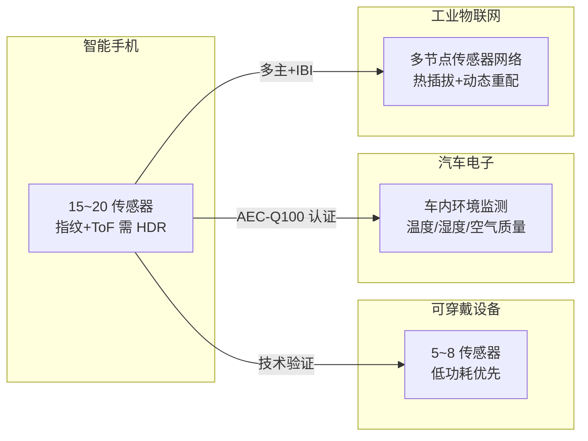

# I3C往哪发展——生态演进与选型决策

---

## 生态演进时间线

### <strong>1. 手机传感器总线的三次迭代</strong>

手机传感器总线经历了从 GPIO 到 I2C 再到 I3C 的三代演进：

 

| 时代 | 代表机型 | 总线方案 | 传感器数 | 中断方式 | 瓶颈 |
|------|---------|---------|---------|---------|------|
| 2010 前 | iPhone 3GS | 独立 GPIO+I2C | 3~5 | 每传感器 1 GPIO | GPIO 耗尽 |
| 2015 | Galaxy S6 | 共享 I2C 总线 | 8~12 | 中断扩展 IC | 速率/地址冲突 |
| 2020 | iPhone 12 | I3C SDR+HDR | 15~20 | IBI（无额外 GPIO） | 多主仲裁 |
| 2024 | Galaxy S24 | I3C HDR-DDR | 20+ | IBI + 热插拔 | 功耗优化 |

 

**演进驱动力：**

传感器数量线性增长 × 单传感器数据量指数增长，传统 I2C 在地址空间、速率、GPIO 三个维度同时触顶，I3C 以单一总线同时解决三个瓶颈。

 

### <strong>2. 从手机到汽车：I3C 的横向扩展</strong>

 

**汽车电子的新需求：**

- AEC-Q100 温度等级认证（-40℃~125℃）
- 功能安全 ASIL-B/D 等级要求
- 长走线（车内分布式传感器）对信号完整性的挑战

 

---

## I3C vs I2C vs SPI 终极选型决策

### <strong>1. 全维度对比表</strong>

| 选型维度 | I2C | I3C | SPI (QSPI) |
|---------|-----|-----|-----------|
| 信号线 | **2** | **2** | 6（SCK + 4IO + CS） |
| 速率 | 1 Mbps | 33.3 Mbps | ≤200 MB/s（Octal DDR） |
| 多主支持 | 支持（线与仲裁） | 支持（优先级仲裁） | 不支持 |
| 带内中断 | 不支持 | **支持** | 不支持 |
| 动态地址 | 无 | **支持** | 无（CS 硬连线） |
| 功耗 | 较高（持续上拉） | **较低**（推挽自适应） | 较高（多线切换） |
| 标准组织 | NXP | MIPI Alliance | 无（事实标准） |
| 器件成本 | **极低** | 较高 | 低 |
| 主控生态 | **100% MCU** | 新型 MPU/MCU | 95% MCU |
| 调试工具 | **i2c-tools 成熟** | i3c-tools 较新 | 逻辑分析仪 |

 

### <strong>2. 场景化选型决策</strong>

| 场景 | 首选协议 | 原因 |
|------|---------|------|
| 大容量 Flash 启动 | **QSPI/Octal SPI** | 带宽需求 >50MB/s |
| 高分辨率显示屏 | **QSPI/RGB 并行** | 刷新率需要高吞吐量 |
| 传感器网络（温度/压力/加速度） | **I3C** | 多设备、低功耗、动态地址 |
| 低速控制（LED、GPIO 扩展） | **I2C/SPI 均可** | 看 PCB 布线便利性 |
| 汽车 ADAS 摄像头 | **MIPI CSI-2** | 专用高速差分协议 |
| 可穿戴多传感器 | **I3C** | GPIO 受限、功耗敏感 |
| 工业现场总线 | **I3C/Modbus/EtherCAT** | 热插拔、远距离 |

 

---

## 前沿趋势

### <strong>1. CXL 与 PCIe 的存储扩展</strong>

CXL（Compute Express Link）基于 PCIe 物理层，将内存语义引入互连协议。未来高端嵌入式系统可能通过 CXL.mem 直接访问远程 SPI/NAND 存储，绕过传统 DMA 路径。

 

### <strong>2. 片上集成趋势</strong>

现代 SoC（如 i.MX RT、STM32H7）将 I3C 控制器直接集成到芯片内部，支持 DMA 传输和 FIFO 缓冲。驱动开发从"位操作 GPIO"转向"配置 DMA 描述符"。

 

### <strong>3. 传感器融合总线</strong>

高端手机中，I3C 总线不仅传输传感器数据，还通过 CCC 命令传输传感器融合算法的配置参数。一条总线同时承载数据平面和控制平面。

 

### <strong>4. I3C v1.1+ 的未来特性</strong>

MIPI Alliance 正在推进的 I3C 演进方向：

- **更低功耗**：优化 SDR 模式的电流消耗，目标可穿戴设备
- **更多 CCC**：标准化传感器融合配置命令集
- **安全扩展**：设备认证和加密传输（应对汽车安全需求）
- **更长距离**：扩展驱动能力，支持 1m+ 走线（车内分布式布局）

 

---

## 本章小结

 

| 概念 | 一句话总结 |
|------|-----------|
| 手机传感器演进 | 2010 前 GPIO → 2015 I2C → 2020 I3C，传感器数 3→20+ |
| IBI 价值 | 为 20 传感器省 20 根 GPIO，手机 PCB 寸土寸金 |
| HDR-DDR | 指纹/ToF 需要 8~16Mbps，I2C 1MHz 远远不够 |
| 汽车扩展 | AEC-Q100 I3C 传感器进入车内环境监测 |
| 工业物联网 | 多节点 + 热插拔 + 动态重配，I3C 天然适配 |
| 片上集成 | SoC 内置 I3C+DMA，驱动开发转向描述符配置 |
| 传感器融合 | I3C 同时承载数据平面和控制平面（CCC 配置） |
| 选型 QSPI | Flash/显示屏带宽 >50MB/s 时不可替代 |
| 选型 I3C | 传感器网络、多设备、低功耗、省 GPIO 时优选 |
| 选型 I2C | 成本敏感、低速、存量 MCU、维护项目时仍适用 |
| I3C v1.1 | 更低功耗、更多 CCC、安全扩展、更长距离 |

 

---

## 练习

1. 对比 SPI、I2C、I3C 在可穿戴设备（电池供电、多个传感器、低功耗）中的选型优劣。从引脚数、功耗、速率、生态四个维度分析。

2. 某汽车电子项目需要在车内分布式部署 12 个环境传感器，走线总长 3 米。分析 I3C 在这个场景下的可行性，并提出信号完整性解决方案。

3. 预测 I3C 在未来 5 年可能取代 I2C 的细分市场，以及 I2C 仍将长期存在的细分市场。从技术成熟度和成本曲线两个角度论证。
