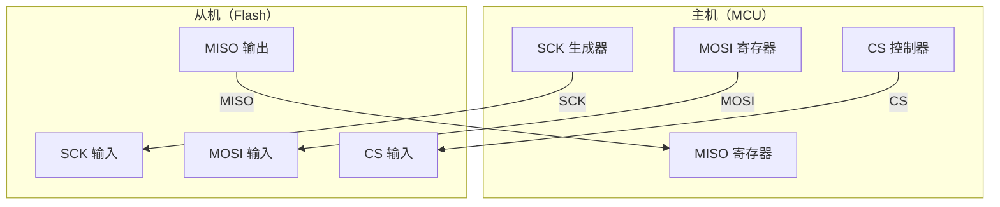

# SPI 基础认知与四线架构 [B]

> **本章学习目标**：
> - 理解 <span class="red">SPI（Serial Peripheral Interface）</span> 的全双工四线设计
> - 掌握 <span class="red">SCK/MOSI/MISO/CS</span> 的信号定义与时钟极性
> - 了解 SPI 在 Flash 存储和显示屏驱动中的典型应用

---

## SPI 的诞生与演进

---

### <strong>为什么需要 SPI：从 I2C 到全双工的速度飞跃</strong>

<span class="red">SPI</span>由 Motorola 公司在<span class="green">1980年代</span>设计，
<br>
定位是<span class="blue">"高速点对点通信"</span>。
<br>

与 I2C 的关键差异：
<br>
* I2C 是半双工（SDA 分时收发），SPI 是<span class="blue">全双工</span>（MOSI/MISO 同时收发）
<br>
* I2C 需要地址仲裁，SPI 用<span class="blue">片选线 CS</span>直接选中设备
<br>
* I2C 最高 1MHz，SPI 可达<span class="blue">100MHz+</span>
<br>

<span class="blue">类比：I2C 如同"对讲机"——半双工、需要报身份；SPI 如同"电话"——全双工、直接拨号。</span>
<br>

---

### <strong>SPI 的信号定义与电气特性</strong>

| 信号名 | 全称 | 方向 | 说明 |
| --- | --- | --- | --- |
| SCK | Serial Clock | Master→Slave | 时钟，由 Master 产生 |
| MOSI | Master Out Slave In | Master→Slave | 主发从收 |
| MISO | Master In Slave Out | Slave→Master | 从发主收 |
| CS/SS | Chip Select | Master→Slave | 片选，低电平有效 |



<span class="blue">SPI 是推挽驱动，不需要上拉电阻，信号完整性比 I2C 更好。</span>
<br>

---

### <strong>SPI 的四时钟模式（CPOL/CPHA）</strong>

<span class="red">SPI 时钟模式</span>由两个位定义：
<br>

| 模式 | CPOL | CPHA | 空闲时钟 | 采样边沿 |
| --- | --- | --- | --- | --- |
| Mode 0 | 0 | 0 | 低电平 | 上升沿采样，下降沿输出 |
| Mode 1 | 0 | 1 | 低电平 | 下降沿采样，上升沿输出 |
| Mode 2 | 1 | 0 | 高电平 | 下降沿采样，上升沿输出 |
| Mode 3 | 1 | 1 | 高电平 | 上升沿采样，下降沿输出 |

<span class="blue">大多数 Flash 芯片使用 Mode 0，大多数显示屏使用 Mode 3。通信前必须确认 Slave 的时钟模式要求。</span>
<br>

```text
Mode 0 时序：

CS:    ─────┐     └──────────────────────
            │     │
SCK:   ─────┼─────┐  ┌──┐  ┌──┐  ┌──┐  ├───
            │     └──┘  └──┘  └──┘  └──┘  │
MOSI:  ─────┼─────╳──D1──╳──D2──╳──D3──╳───
            │     ↑                       │
MISO:  ─────┼─────╳──Q1──╳──Q2──╳──Q3──╳───
                 ↑                        ↑
              上升沿采样              CS变高结束
```

---

## 本章小结

| 概念 | 一句话总结 |
| --- | --- |
| SPI | Motorola 提出的全双工四线串行总线 |
| SCK/MOSI/MISO/CS | 时钟/主出从入/主入从出/片选 |
| CPOL/CPHA | 时钟极性/相位，决定 4 种模式 |
| Mode 0 | 最常用，上升沿采样 |
| 推挽驱动 | 不需要上拉电阻，信号完整性好 |

---

## 练习

1. 为什么 SPI 不需要像 I2C 那样进行地址仲裁？
2. 你的 Flash 芯片要求 Mode 0，但你的 MCU 默认配置为 Mode 3，会发生什么？
3. 计算 SPI 在 50MHz 时钟、8-bit 传输下的理论带宽。
