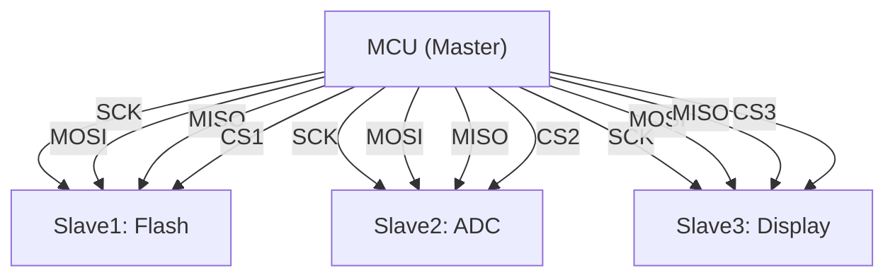

# SPI 基础认知与四线架构

[B] [I]

---

### 为什么需要 SPI

I2C 节省引脚但牺牲了带宽。
 
当外设需要高速流式传输时——Flash 烧录、显示屏刷新、ADC 采样——
 
400kHz 的 I2C 成为瓶颈。
 

SPI（Serial Peripheral Interface，串行外设接口）用 **四根线** 换取 **全双工高速传输**。
 
时钟由主设备单方面驱动，无需等待从设备 ACK，协议开销接近零。
 

类比：I2C 是单车道山路，SPI 是双车道高速——
 
单车道（I2C）能走的车多但每辆慢；双车道（SPI）每辆都很快，但每辆车需要专属入口（CS 线）。
 

---

### 四线信号：SCK/MOSI/MISO/CS

| 信号线 | 全称 | 方向 | 作用 |
|--------|------|------|------|
| SCK | Serial Clock | 主→从 | 同步时钟 |
| MOSI | Master Out Slave In | 主→从 | 主设备发送数据 |
| MISO | Master In Slave Out | 从→主 | 从设备发送数据 |
| CS/SS | Chip Select | 主→从 | 选中目标从设备 |

全双工（Full-Duplex）是 SPI 的灵魂：
 
MOSI 和 MISO 同时工作，每时钟周期双向各传 1 位。
 
发送和接收严格同步——主设备发 1 位的同时必收 1 位。
 

推挽输出（Push-Pull）驱动：
 
- CMOS 电平，驱动能力强，上升沿陡峭
 
- 不需要上拉电阻，功耗低于开漏+上拉方案
 
- 但多从设备的 MISO 线冲突需要三态门解决
 

关键认知：SPI 的 "单主多从" 拓扑中，
 
SCK/MOSI 是广播到所有从设备的，只有被 CS 选中的从设备才响应 MISO。
 

---

### 单主多从架构

SPI 标准定义的是 **单主多从**（Single Master, Multiple Slaves）。
 
总线上只能有一个主设备驱动时钟，所有从设备被动接收。
 

片选（CS/SS）机制：
 
- CS 低电平有效，主设备将目标从设备的 CS 拉低即选中
 
- 未被选中的从设备必须将 MISO 置为高阻态（High-Z）
 
- 同一时刻只能有一个从设备的 CS 为低
 

多从设备接线要点：
 
| 信号 | 连接方式 | 说明 |
|------|----------|------|
| SCK | 并联到所有从设备 | 共享时钟 |
| MOSI | 并联到所有从设备 | 广播数据 |
| MISO | 并联到所有从设备 | 靠三态门避免冲突 |
| CS | 每从设备独立 | 主设备 GPIO 或解码器驱动 |

CS 扩展方案：
 
- 主控 GPIO 直接驱动：适合 ≤4 个从设备
 
- 3-8 解码器（74HC138）：3 根 GPIO 扩展 8 个 CS
 
- GPIO 扩展芯片（MCP23017）：I2C/SPI 转 16 路 GPIO
 

---

### 与 I2C/UART 的选型对比表

| 维度 | SPI | I2C | UART |
|------|-----|-----|------|
| 信号线 | 4+nCS | 2 | 2 |
| 速率 | ~100+ Mbps | ~3.4 Mbps | ~3 Mbps |
| 全双工 | 是 | 否 | 是 |
| 寻址 | 片选线 | 7/10位地址 | 无 |
| 流控 | 无 | Clock stretch | RTS/CTS |
| 多主 | 不支持 | 支持 | 不支持 |
| 协议开销 | 极低（无ACK） | 中（ACK/地址） | 中（起始位/校验） |
| 硬件复杂度 | 简单（推挽） | 简单（开漏） | 简单（异步） |
| 典型场景 | Flash、屏、ADC | 传感器、EEPROM | 调试口、GPS |

选型决策：
 
- 大数据量、高带宽、点对点 → SPI
 
- 多设备、省引脚、低速 → I2C
 
- 异步、远距离、调试 → UART
 

---

### 电气特性：CMOS/TTL 电平与信号完整性

SPI 使用推挽 CMOS 电平，电平容限如下：
 

| 参数 | 3.3V CMOS | 5V CMOS | 说明 |
|------|-----------|---------|------|
| VIH | 2.31V (0.7×VDD) | 3.5V | 输入高电平阈值 |
| VIL | 0.99V (0.3×VDD) | 1.5V | 输入低电平阈值 |
| VOH | 2.64V (0.8×VDD) | 4.5V | 输出高电平保证 |
| VOL | 0.33V (0.1×VDD) | 0.5V | 输出低电平保证 |

上升时间（Tr）与最大频率：
 
- Tr 越短，能达到的频率越高
 
- PCB 走线长度、负载电容、驱动强度共同决定 Tr
 
- 经验法则：Tr ≤ 0.3 × 时钟周期时信号完整
 

例如 50MHz SPI，周期 = 20ns，则 Tr 应 ≤ 6ns。
 
若实际 Tr = 10ns，则最高安全频率约 30MHz。
 

易错点：3.3V 主控接 5V SPI Flash 时，
 
5V 输出到 3.3V 输入可能过压；需要用分压或电平转换芯片。
 

---

**学习路径提示**：
 
- [B] 读者：SPI = "四线全双工高速"，CS 选中谁就和谁通信。
 
- [I] 读者：关注推挽输出的电气特性，以及 CS 线数量对多从设备设计的影响。
