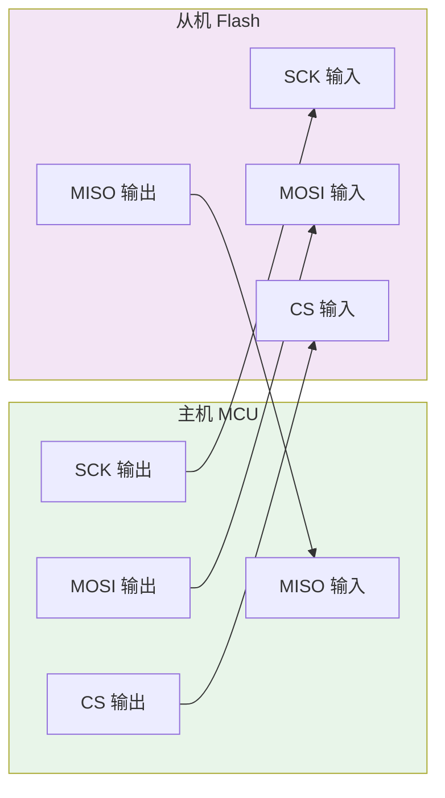

# SPI是什么——基础定义与演进脉络

---

## 核心定义

SPI（Serial Peripheral Interface） 是 Motorola 于 1980 年代推出的同步串行总线协议，采用**全双工四线架构**，以推挽驱动方式实现主机与从机之间的高速点对点通信。

 

### 四线信号定义

| 信号名 | 全称 | 方向 | 功能一句话 |
|--------|------|------|-----------|
| SCK | Serial Clock | Master → Slave | 同步时钟，由主机产生 |
| MOSI | Master Out Slave In | Master → Slave | 主机发送，从机接收 |
| MISO | Master In Slave Out | Slave → Master | 从机发送，主机接收 |
| CS/SS | Chip Select / Slave Select | Master → Slave | 片选，低电平有效 |

 

 

全双工的本质：MOSI 和 MISO 在同一时钟边沿同时活跃——主机在 MOSI 上发送 D7 的同时，从机在 MISO 上回传 Q7。这是 SPI 与 I2C 最根本的差异。

 

---

## 与 I2C 的核心差异

SPI 和 I2C 是嵌入式系统中两种最基础的串行总线，理解它们的差异是正确选型的前提。

 

| 维度 | I2C | SPI |
|------|-----|-----|
| 线数 | 2（SDA + SCL） | 4（SCK + MOSI + MISO + CS） |
| 通信方式 | 半双工（SDA 分时收发） | **全双工**（MOSI/MISO 同时收发） |
| 设备选择 | 地址仲裁（7/10-bit） | **片选线 CS** 直接选中 |
| 驱动方式 | 开漏输出 + 外部上拉 | **推挽输出**，无需上拉 |
| 速率等级 | 100K/400K/1Mbps | **数 Mbps 至百 Mbps** |
| 拓扑 | 多主多从总线 | **一主多从星型** |
| 应答机制 | 每字节 ACK/NACK | **无硬件 ACK**，高层自行校验 |
| 标准维护 | NXP（原 Philips） | **无官方标准组织**，事实标准 |

 

类比：I2C 如同"对讲机"——两人共用一条线，说话时按住 PTT 键，说完松手等对方回应；SPI 如同"专线电话"——说话和听话各占一条线，同时双向传输，拨号直接接通（CS 相当于拨号）。推挽驱动使 SPI 在高频下仍保持清晰的信号边沿，而 I2C 的开漏结构因 RC 延迟在 MHz 以上迅速恶化。

 

---

## 诞生的历史背景

### <strong>1. 从并行到串行的行业转折</strong>

1980 年代的嵌入式系统普遍使用并行总线（如 Intel 8086 的多路复用地址/数据总线）。并行总线的问题是：引脚多、PCB 布线复杂、高速时各数据线 skew 严重。Motorola 在设计 68HC11 微控制器时，需要一种**简单、高速、引脚少**的内部总线来连接 EEPROM、ADC 等外设。

 

SPI 的设计哲学极其简洁：

 

- **同步时钟**：用一根 SCK 解决收发双方的时序同步问题，不需要复杂的波特率协商
- **全双工独立**：MOSI/MISO 各自单向传输，避免了 I2C 那种"谁占用总线"的仲裁逻辑
- **推挽驱动**：直接利用 CMOS 电平，不需要外部上拉电阻，信号更干净
- **无地址**：用 CS 线直接选择设备，协议开销为零

 

### <strong>2. 为什么 Motorola 没有选择 I2C？</strong>

I2C 早在 1982 年已由 Philips 发布。Motorola 放弃 I2C 而选择自研 SPI，核心原因是**性能定位不同**：

 

- I2C 面向"通用控制总线"，强调多主仲裁、热插拔、设备地址自动发现
- SPI 面向"高速数据总线"，强调带宽最大化、协议最小化、硬件实现最简单

 

Motorola 的取舍被历史验证：I2C 在传感器网络中统治地位稳固，SPI 在 Flash 存储和高速数据采集场景中不可替代。

 

### <strong>3. 演进里程碑</strong>

| 年代 | 里程碑 | 意义 |
|------|--------|------|
| 1980s | Motorola 定义 SPI | 四线事实标准诞生 |
| 1990s | 各厂商自行扩展 | TI 的 SSP、Microwire 等变体出现，引脚兼容但时序微调 |
| 2000s | SPI Flash 爆发 | Winbond、Micron 推出大容量 NOR Flash，取代并行 NOR，成为嵌入式启动标配 |
| 2010s | QSPI 标准化 | JEDEC 定义 Quad SPI（4-bit 并行），Winbond W25Q 系列成为事实标准 |
| 2015+ | Octal SPI / XSPI | 8-bit 并行 + DDR，带宽突破 200MB/s，用于高分辨率显示屏和 AI 推理芯片 |
| 2020s | MIPI I3C 竞争 | 2 线替代方案出现，SPI 面临在传感器网络中被替代的压力 |

 

历史结论：SPI 没有官方标准文档（不像 I2C 有 NXP 的完整 spec），它是"活着的事实标准"——各厂商在 Motorola 的原始设计基础上自由扩展，最终由市场选择胜出者（如 Winbond 的 QSPI 命令集）。

 

---

## 本章小结

 

| 概念 | 一句话总结 |
|------|-----------|
| SPI | Motorola 全双工四线同步串行总线，推挽驱动 |
| SCK/MOSI/MISO/CS | 时钟/主出从入/主入从出/片选 |
| 全双工 | MOSI 和 MISO 同时双向传输，区别于 I2C 的半双工 |
| 推挽驱动 | 主动拉高/拉低，无需上拉电阻，边沿陡峭 |
| 无地址 | CS 线直接选择设备，协议开销为零 |
| 1980s 起源 | Motorola 68HC11 内部总线，追求简单高速 |
| 2000s 爆发 | SPI NOR Flash 取代并行 NOR，成为启动标配 |
| 2010s 扩展 | QSPI（4-bit）→ Octal SPI（8-bit），带宽倍增 |
| 2020s 竞争 | MIPI I3C 在传感器网络中挑战 SPI |

 

---

## 练习

1. 为什么 SPI 不需要像 I2C 那样定义设备地址？这种设计在 100MHz 高速传输下有什么优势？
2. 如果某 MCU 有 4 个 SPI 从机需要连接，但 GPIO 有限只剩 2 根线可用，应该选 SPI 还是 I2C？分析引脚数量和速率两个维度。
3. Motorola 设计 SPI 时"无标准组织维护"的决策，对今天 SPI 生态的碎片化（各厂商时序微调）产生了什么影响？这是优势还是劣势？
