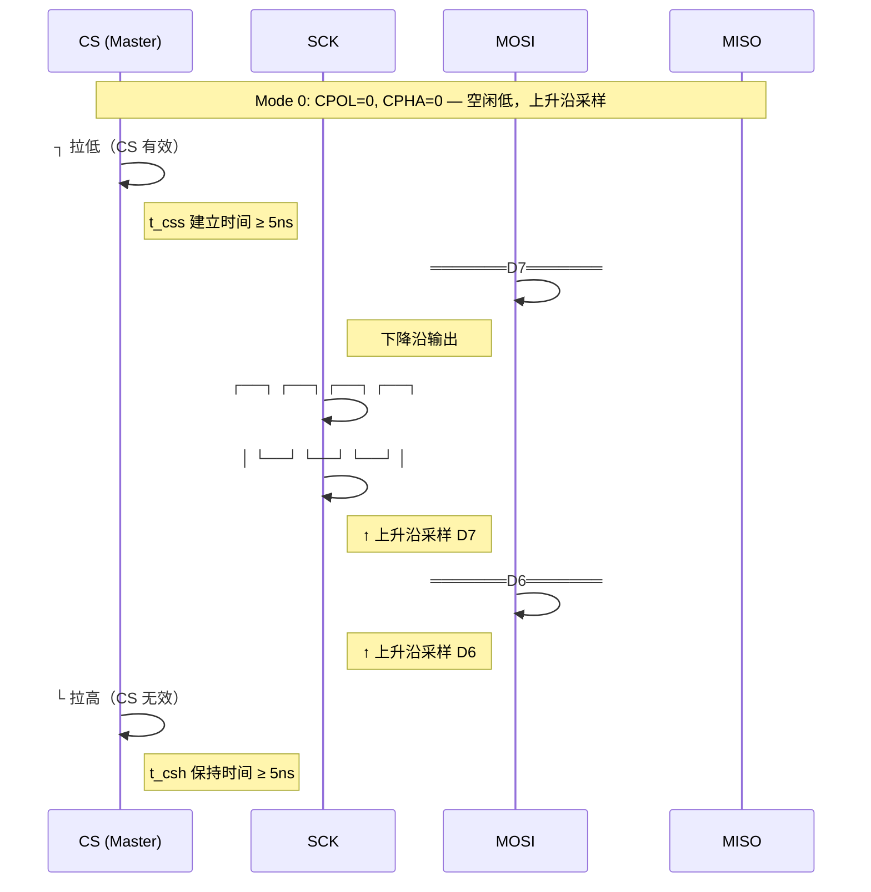

# SPI怎么工作——时钟模式与物理层时序

---

## CPOL/CPHA 的位级语义

SPI 时钟模式由两个配置位共同定义：CPOL（Clock Polarity，时钟极性）决定空闲时钟电平；CPHA（Clock Phase，时钟相位）决定数据采样边沿。两个位产生 4 种合法组合，每种规定了时钟空闲状态、数据输出边沿和采样边沿。

 

| 模式 | CPOL | CPHA | 空闲时钟 | 数据输出边沿 | 数据采样边沿 | 典型应用 |
|------|------|------|----------|--------------|--------------|----------|
| Mode 0 | 0 | 0 | 低电平 | 下降沿 | 上升沿 | Winbond Flash W25Q 系列 |
| Mode 1 | 0 | 1 | 低电平 | 上升沿 | 下降沿 | 部分 ADC/DAC |
| Mode 2 | 1 | 0 | 高电平 | 上升沿 | 下降沿 | 部分显示屏控制器 |
| Mode 3 | 1 | 1 | 高电平 | 下降沿 | 上升沿 | ILI9341 显示屏、SD 卡 |

 

**CPOL 的时序语义：**

 

- **CPOL = 0**：时钟空闲为低电平。第一个有效边沿为上升沿，第二个为下降沿。
- **CPOL = 1**：时钟空闲为高电平。第一个有效边沿为下降沿，第二个为上升沿。

**CPHA 的时序语义：**

 

- **CPHA = 0**：数据在第一个时钟边沿采样。输出端必须在 CS 有效后、第一个边沿到来前完成数据放置。
- **CPHA = 1**：数据在第二个时钟边沿采样。输出端在第一个边沿后改变数据，第二个边沿采样。

 

 

关键区别：Mode 0 与 Mode 3 的采样边沿都是上升沿，但空闲时钟电平不同。某些从机 spec 明确要求空闲时钟电平——若 Master 配置为 Mode 0 而从机期望 Mode 3，CS 有效前的 SCK 低电平可能被从机误识别为半个时钟周期，导致首字节采样错位。

 

---

## 推挽驱动的电气本质

SPI 采用 CMOS 推挽输出——驱动级由上拉 PMOS 和下拉 NMOS 组成，可主动拉高和拉低总线。输出阻抗低（通常 <100Ω），边沿陡峭（ns 级）。

 

### 推挽 vs 开漏的电气对比

| 特性 | SPI 推挽 | I2C 开漏 |
|------|---------|---------|
| 上拉机制 | PMOS 主动拉高 | 外部电阻被动上拉 |
| 下拉机制 | NMOS 主动拉低 | NMOS 主动拉低 |
| 输出阻抗 | 低（~50Ω） | 高（上拉电阻 1K-10K） |
| 边沿速度 | ns 级 | μs 级（RC 决定） |
| 最大速率 | 100MHz+ | 1MHz（Fast Mode+） |
| 总线冲突 | 禁止（可能损坏驱动器） | 允许（线与逻辑） |
| 功耗 | 动态切换功耗 | 静态上拉功耗 |

 

电气核心：SPI 的推挽结构使它在高频下信号完整性远优于 I2C。I2C 的速率瓶颈不是协议，而是物理层——RC 时间常数 τ = R_pullup × C_bus 限制了最大上升沿速度。当 C_bus（总线电容，含 PCB 走线 + 器件引脚）达到 400pF、R_pullup = 1.5KΩ 时，τ = 600ns，这意味着上升沿需要 3-5τ ≈ 2-3μs 才能稳定，1MHz 以上的速率无法可靠工作。

 

---

## 精确时序参数解读

### <strong>1. 以 W25Q128JV Flash 为例的时序表</strong>

时序参数是 SPI 物理层可靠工作的量化保证。以下参数来自 Winbond W25Q128JV 数据手册，在 -40°C ~ +85°C 工业温度范围内有效。

 

| 参数 | 符号 | 最小值 | 最大值 | 单位 | 物理含义 |
|------|------|--------|--------|------|----------|
| 时钟频率 | f_c | — | 104 | MHz | SCK 最高频率 |
| 时钟高电平时间 | t_clh | 4 | — | ns | SCK 高电平持续时间 |
| 时钟低电平时间 | t_cll | 4 | — | ns | SCK 低电平持续时间 |
| CS 建立时间 | t_css | 5 | — | ns | CS 下降沿到第一个 SCK 边沿 |
| CS 保持时间 | t_csh | 5 | — | ns | 最后一个 SCK 边沿到 CS 上升沿 |
| 数据建立时间 | t_ds | 2 | — | ns | MOSI 数据稳定到采样边沿 |
| 数据保持时间 | t_dh | 3 | — | ns | 采样边沿后 MOSI 保持时间 |
| 输出有效时间 | t_clqv | — | 6 | ns | SCK 边沿到 MISO 有效 |
| CS 无效到输出高阻 | t_shqz | — | 8 | ns | CS 上升沿到 MISO 三态 |

 

### <strong>2. 时序参数的物理意义</strong>

 

**t_css（Chip Select Setup）**：CS 必须在 SCK 第一个边沿前至少稳定 5ns。原因是从机内部的 CS 检测电路需要一定时间使能时钟采样器和数据输出缓冲器。

 

**t_csh（Chip Select Hold）**：最后一个 SCK 边沿后，CS 必须保持至少 5ns 再拉高。确保从机内部的状态机完成最后一个比特的采样。

 

**t_ds / t_dh（Data Setup / Hold）**：MOSI 数据必须在采样边沿前后保持稳定的时间窗口。类似触发器的建立/保持时间，违反会导致亚稳态（采样值不确定）。

 

**t_clqv（Clock to Output Valid）**：SCK 边沿后，从机需要最多 6ns 才能将有效数据驱动到 MISO 线上。这是从机内部组合逻辑 + 输出缓冲器的传播延迟。Master 在采样 MISO 时必须确保等待时间 ≥ t_clqv。

 

关键洞察：在 104MHz（周期 9.6ns）时，t_clh + t_cll = 8ns 最小，这意味着占空比必须接近 50% 才能满足。Master 的时钟生成器必须精确控制占空比，不能简单用 GPIO 翻转模拟。

 

---

## 信号完整性基础

### <strong>1. 高频下的 PCB 走线效应</strong>

当 SPI 速率超过 50MHz 时，PCB 走线不再是无延时的理想导线，而表现出传输线特性：

 

- **反射**：阻抗不连续（连接器、过孔、焊盘）导致信号反射，产生振铃（ringing）
- **串扰**：相邻走线之间的电容耦合，使一条线的跳变在邻线上感应噪声
- **衰减**：PCB 介质的介电损耗使高频分量衰减，边沿变缓

 

### <strong>2. 设计准则</strong>

| 速率 | 最大走线长度 | 关键措施 |
|------|-------------|---------|
| ≤10MHz | 无严格限制 | 常规走线 |
| 10-50MHz | ≤30cm | 等长匹配（MOSI/MISO/SCK 等长） |
| 50-100MHz | ≤15cm | 控制阻抗 50Ω、避免过孔、短截线 |
| ≥100MHz | ≤10cm | 差分对、端接电阻、仿真验证 |

 

嵌入式实操：在 4 层板中，SPI 走线应尽量靠近地层（第 2 层），利用回流路径最小化环路面积。SCK 是最关键的信号——它的边沿抖动直接影响所有数据线的采样时刻。

 

---

## 本章小结

 

| 概念 | 一句话总结 |
|------|-----------|
| CPOL | 时钟极性：0=空闲低，1=空闲高 |
| CPHA | 时钟相位：0=第一个边沿采样，1=第二个边沿采样 |
| Mode 0 | CPOL=0,CPHA=0 — 最常用，Winbond Flash 默认 |
| Mode 3 | CPOL=1,CPHA=1 — ILI9341 显示屏默认 |
| 推挽驱动 | PMOS+NMOS 主动驱动，边沿 ns 级，无需上拉 |
| t_css/t_csh | CS 建立/保持时间，确保从机内部同步 |
| t_ds/t_dh | 数据建立/保持时间，防止采样亚稳态 |
| t_clqv | SCK 边沿到 MISO 有效，从机传播延迟 |
| 高频走线 | 50MHz+ 需考虑传输线效应、等长、阻抗 |

 

---

## 练习

1. 某从机要求 CPOL=1、CPHA=1，Master 配置为 CPOL=0、CPHA=1。用 Mode 0 和 Mode 3 的时序图对比，分析首字节采样错位的根本原因。
2. W25Q128JV 的 t_clh = 4ns、t_cll = 4ns。计算它在 104MHz 时钟下的最大允许占空比偏差（假设时钟周期 T = 9.6ns）。
3. 为什么在 SPI 推挽拓扑中"总线冲突"是灾难性的，而 I2C 开漏拓扑中允许冲突？从驱动器结构和功耗两个角度分析。
4. 你的 PCB 上 SCK 走线长 25cm，SPI 速率 80MHz。根据传输线效应，估算信号往返时间（PCB 介电常数 ε_r ≈ 4.5，信号速度 v ≈ c/√ε_r）。是否需要考虑阻抗匹配？
