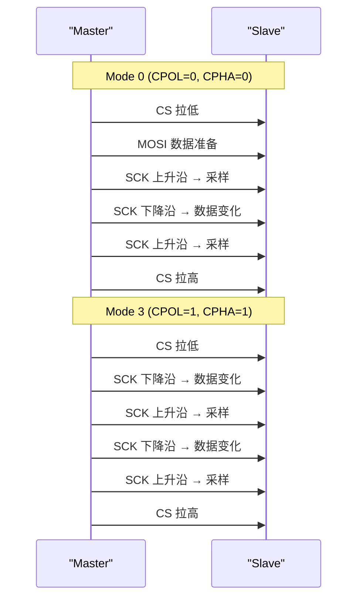
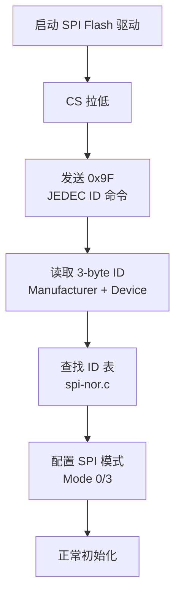

# SPI 时钟极性与模式配置 [B]

> **本章学习目标**：
> - 理解 <span class="red">CPOL（时钟极性）</span> 与 <span class="red">CPHA（时钟相位）</span> 的物理含义
> - 掌握 <span class="red">四种 SPI 模式（Mode 0~3）</span> 的时序差异与选型逻辑
> - 了解如何通过 JEDEC ID 自动探测 Flash 的 SPI 模式要求

---

## SPI 时钟的基础：CPOL 与 CPHA

---

### <strong>为什么需要四种模式：从机时钟要求的多样性</strong>

<span class="red">SPI 标准</span>由 Motorola 在 <span class="green">1980 年代</span>定义，
但标准并未规定唯一的时钟极性和相位。

不同厂商的 SPI 从机对时钟边沿的要求不同：
<br>
* <span class="green">W25Q128 Flash</span>：支持 Mode 0 和 Mode 3
<br>
* <span class="green">ST7789 LCD 控制器</span>：要求 Mode 0
<br>
* <span class="green">ADXL345 加速度计</span>：支持 Mode 3
<br>

<span class="blue">CPOL 和 CPHA 两个二进制位的组合，产生了 4 种 SPI 模式（Mode 0~3）。主机必须配置为从机要求的模式才能正确通信。</span>
<br>

<span class="blue">类比：CPOL 和 CPHA 如同"握手礼仪"——不同国家（厂商）有不同的握手习惯（CPOL=高/低电平空闲，CPHA=上升/下降沿采样）。不了解对方的礼仪，握手就会出错（数据错位）。</span>
<br>

---

### <strong>CPOL：时钟极性决定空闲电平</strong>

<span class="red">CPOL（Clock Polarity）</span>定义时钟在空闲时的电平：

| CPOL | 空闲状态 | 第一个边沿 | 第二个边沿 |
| --- | --- | --- | --- |
| 0 | 低电平 | 上升沿 | 下降沿 |
| 1 | 高电平 | 下降沿 | 上升沿 |

```mermaid
flowchart LR
    subgraph CPOL=0
        C0["SCK: 低电平空闲\n第一个上升沿采样"]
    end
    subgraph CPOL=1
        C1["SCK: 高电平空闲\n第一个下降沿采样"]
    end
```

<span class="blue">CPOL=0 是最常用的配置（W25Q Flash、大多数传感器都支持）。CPOL=1 用于少数特定芯片。</span>
<br>

---

### <strong>CPHA：时钟相位决定采样时刻</strong>

<span class="red">CPHA（Clock Phase）</span>定义数据在时钟的哪个边沿被采样：

| CPHA | 采样边沿 | 数据变化边沿 |
| --- | --- | --- |
| 0 | 第一个边沿 | 第二个边沿 |
| 1 | 第二个边沿 | 第一个边沿 |

<span class="blue">CPHA=0 时，数据在时钟跳变前必须已经稳定（setup 时间）。CPHA=1 时，数据在第一个边沿之后变化，在第二个边沿采样。</span>
<br>

---

### <strong>四种模式时序图：Mode 0/1/2/3</strong>

| 模式 | CPOL | CPHA | 空闲电平 | 采样边沿 | 典型从机 |
| --- | --- | --- | --- | --- | --- |
| Mode 0 | 0 | 0 | 低 | 上升沿 | W25Q128、ST7789 |
| Mode 1 | 0 | 1 | 低 | 下降沿 | 少数 ADC |
| Mode 2 | 1 | 0 | 高 | 下降沿 | 老式 EEPROM |
| Mode 3 | 1 | 1 | 高 | 上升沿 | ADXL345、部分 DAC |



<span class="blue">Mode 0 和 Mode 3 是实际应用中最常见的两种模式。绝大多数 SPI Flash 和显示屏都支持这两者之一。</span>
<br>

---

## 自动探测：用 JEDEC ID 识别 SPI Flash 模式

---

### <strong>为什么需要自动探测：通用驱动的兼容需求</strong>

<span class="red">Linux SPI 驱动</span>需要兼容不同厂商的 Flash 芯片：
<br>
* 不同厂商的 Flash 可能要求不同的 SPI 模式
<br>
* 驱动不能硬编码为某一模式
<br>
* 通过读取 JEDEC ID 可以识别芯片型号和特性
<br>



<span class="blue">JEDEC ID 命令（0x9F）是所有 SPI NOR Flash 都必须支持的。返回的 3 字节中包含厂商 ID 和设备 ID，Linux 内核的 spi-nor 子系统据此查找匹配项并配置正确的 SPI 模式。</span>
<br>

---

## STM32 HAL 配置四种模式

---

### <strong>STM32 SPI 初始化代码示例</strong>

```c
// STM32 HAL 配置 SPI Mode 0
SPI_HandleTypeDef hspi;

hspi.Instance = SPI1;
hspi.Init.Mode = SPI_MODE_MASTER;
hspi.Init.Direction = SPI_DIRECTION_2LINES;
hspi.Init.DataSize = SPI_DATASIZE_8BIT;
hspi.Init.CLKPolarity = SPI_POLARITY_LOW;     // CPOL = 0
hspi.Init.CLKPhase = SPI_PHASE_1EDGE;          // CPHA = 0
hspi.Init.NSS = SPI_NSS_SOFT;                   // 软件 CS
hspi.Init.BaudRatePrescaler = SPI_BAUDRATEPRESCALER_2;
hspi.Init.FirstBit = SPI_FIRSTBIT_MSB;
HAL_SPI_Init(&hspi);
```

| HAL 参数 | Mode 0 | Mode 3 |
| --- | --- | --- |
| CLKPolarity | SPI_POLARITY_LOW | SPI_POLARITY_HIGH |
| CLKPhase | SPI_PHASE_1EDGE | SPI_PHASE_2EDGE |

---

## 本章小结

| 概念 | 一句话总结 |
| --- | --- |
| CPOL | 时钟极性：0=空闲低电平，1=空闲高电平 |
| CPHA | 时钟相位：0=第一个边沿采样，1=第二个边沿采样 |
| Mode 0 | CPOL=0, CPHA=0，最常用，上升沿采样 |
| Mode 3 | CPOL=1, CPHA=1，次常用，上升沿采样 |
| JEDEC ID | 0x9F 命令，识别 Flash 厂商和设备型号 |
| spi-nor | Linux SPI NOR Flash 子系统，自动模式配置 |

---

## 练习

1. W25Q128 支持 Mode 0 和 Mode 3，如果主机配置为 Mode 1 会发生什么？画出错误时序。
2. 用逻辑分析仪抓取一次 SPI Flash 的 JEDEC ID 读取时序，标出 CPOL/CPHA 和采样点。
3. 设计一个自动探测函数：发送 0x9F 读取 JEDEC ID，根据返回的 Manufacturer ID 配置正确的 SPI 模式。
