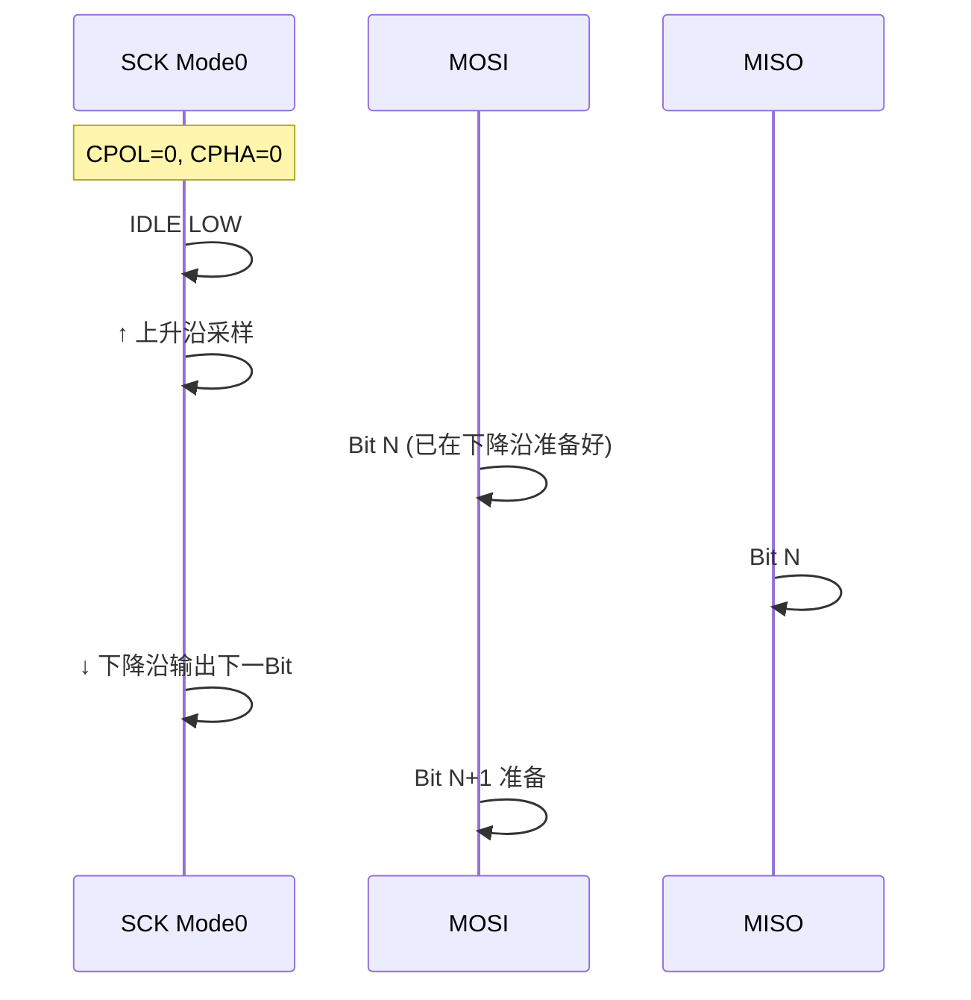
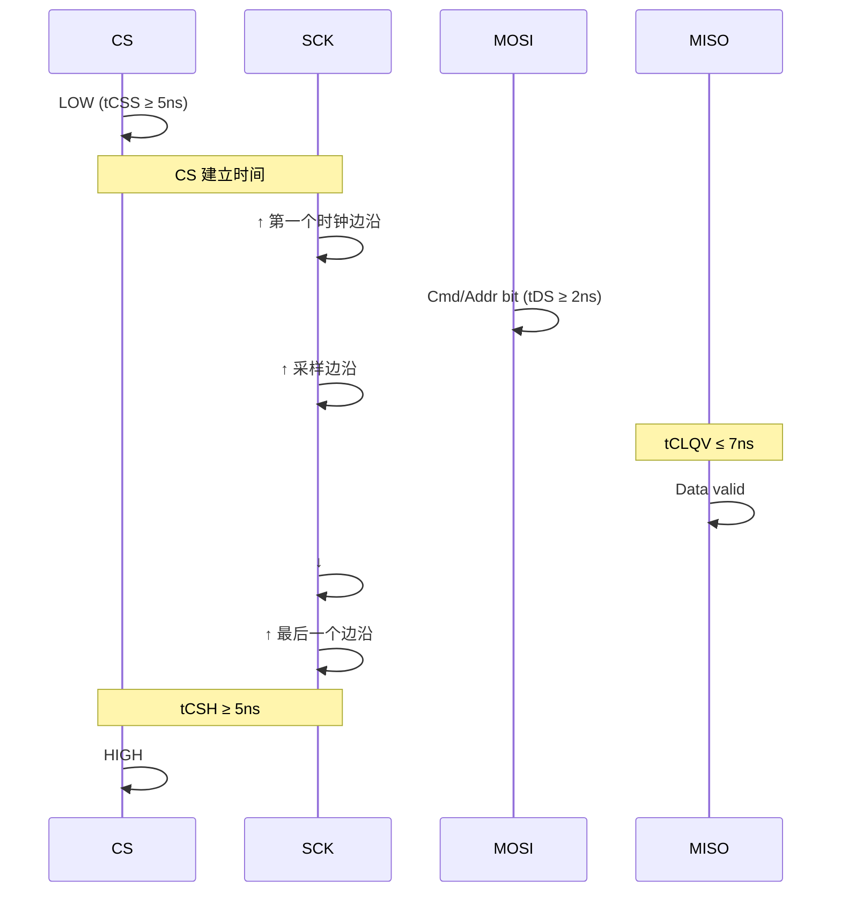

# SPI 时钟模式与配置

<span class="badge-i">[I]</span>

---

### CPOL/CPHA 四种模式

<span class="red">SPI 时钟模式由 CPOL（时钟极性）和 CPHA（时钟相位）组合定义</span>，
主从设备必须配置一致才能正确采样。
<br>

| 模式 | CPOL | CPHA | 空闲时钟 | 采样边沿 |
|------|------|------|----------|----------|
| Mode 0 | 0 | 0 | 低电平 | 上升沿采样，下降沿输出 |
| Mode 1 | 0 | 1 | 低电平 | 下降沿采样，上升沿输出 |
| Mode 2 | 1 | 0 | 高电平 | 下降沿采样，上升沿输出 |
| Mode 3 | 1 | 1 | 高电平 | 上升沿采样，下降沿输出 |



CPOL 决定 SCK 空闲时的电平：
<br>
- CPOL=0：空闲时 SCK=0，第一个边沿是上升沿
<br>
- CPOL=1：空闲时 SCK=1，第一个边沿是下降沿
<br>

CPHA 决定采样时机：
<br>
- CPHA=0：在第一个时钟边沿采样（边沿到来前数据必须准备好）
<br>
- CPHA=1：在第二个时钟边沿采样（第一个边沿用于切换数据）
<br>

常见器件模式偏好：
<br>

| 器件 | 常用模式 | 说明 |
|------|----------|------|
| W25Q128JV Flash | Mode 0 / Mode 3 | 兼容两种 |
| ILI9341 显示屏 | Mode 0 | 上升沿采样 |
| MCP3008 ADC | Mode 0 | 上升沿采样 |
| ADXL345 | Mode 3 | 上升沿采样，空闲高 |

<span class="blue">关键认知：Mode 0 和 Mode 3 是业界最常用，
<br>
大多数 SPI Flash 和显示屏支持这两种。
<br>
主从模式不一致时，数据错位表现为"读取全是 0xFF 或 0x00"。
</span><br>

---

### W25Q128JV 精确时序参数

W25Q128JV 是 128Mbit（16MB）SPI NOR Flash 的代表型号，
<br>
其时序参数是理解 SPI 硬件设计的标杆。
<br>

| 参数 | 符号 | 最小值 | 最大值 | 说明 |
|------|------|--------|--------|------|
| 时钟频率 | fC | - | 104MHz (Fast Read) | 普通读 33MHz |
| CS 建立时间 | tCSS | 5ns | - | CS 变低到第一个 SCK 边沿 |
| CS 保持时间 | tCSH | 5ns | - | 最后一个 SCK 边沿到 CS 变高 |
| 数据建立时间 | tDS | 2ns | - | MOSI 数据稳定到 SCK 采样边沿 |
| 数据保持时间 | tDH | 3ns | - | SCK 采样后 MOSI 保持时间 |
| 时钟低时间 | tCL | 4.5ns | - | SCK 低电平持续时间 |
| 时钟高时间 | tCH | 4.5ns | - | SCK 高电平持续时间 |
| 输出有效时间 | tCLQV | - | 7ns | SCK 边沿到 MISO 有效 |



<span class="blue">关键认知：tCLQV（Clock Low to Output Valid）决定主设备何时能采样 MISO，
<br>
这是 SPI 速率提升的瓶颈——从设备响应越快，总线越快。
</span><br>

---

### 信号完整性：串扰、反射、S 参数基础

高速 SPI（>30MHz）时，PCB 走线不再是理想导线。
<br>

**串扰（Crosstalk）**：
<br>
相邻信号线的电磁耦合导致信号变形。
<br>
MOSI 跳变时会在 MISO 上感应出噪声。
<br>
缓解方法：3W 规则（线间距 ≥ 3 倍线宽）、地线隔离。
<br>

**反射（Reflection）**：
<br>
阻抗不连续导致信号反弹。
<br>
源端阻抗 ≠ 传输线阻抗时，部分能量反射回源端。
<br>
SPI 总线通常短（<30cm），反射不严重；但 QSPI/Octal SPI 长线时需注意。
<br>

**S 参数基础**：
<br>
S11（回波损耗）：反射能量 / 入射能量，越小越好
<br>
S21（插入损耗）：传输能量 / 入射能量，越大越好
<br>
高频 SPI 设计时，PCB 走线需做 50Ω 阻抗控制。
<br>

<span class="purple">扩展：对于超过 20cm 的 SPI 走线，
<br>
建议串联 22~33Ω 源端电阻抑制振铃，降低 EMI。
</span><br>

---

### 代码：SPI 初始化

**裸机 C（STM32 HAL）**：
<br>

```c
#include "stm32f4xx_hal.h"

SPI_HandleTypeDef hspi1;

void SPI1_Init(void) {
    hspi1.Instance = SPI1;
    hspi1.Init.Mode = SPI_MODE_MASTER;       // 主设备
    hspi1.Init.Direction = SPI_DIRECTION_2LINES;  // 全双工
    hspi1.Init.DataSize = SPI_DATASIZE_8BIT; // 8位传输
    hspi1.Init.CLKPolarity = SPI_POLARITY_LOW;   // CPOL=0
    hspi1.Init.CLKPhase = SPI_PHASE_1EDGE;       // CPHA=0 → Mode 0
    hspi1.Init.NSS = SPI_NSS_SOFT;               // 软件CS
    hspi1.Init.BaudRatePrescaler = SPI_BAUDRATEPRESCALER_2; // FCLK/2
    hspi1.Init.FirstBit = SPI_FIRSTBIT_MSB;    // MSB先
    hspi1.Init.TIMode = SPI_TIMODE_DISABLE;
    hspi1.Init.CRCCalculation = SPI_CRCCALCULATION_DISABLE;
    HAL_SPI_Init(&hspi1);
}
```

**Linux spidev**：
<br>

```c
#include <fcntl.h>
#include <unistd.h>
#include <linux/spi/spidev.h>

int spi_open(const char *device) {
    int fd = open(device, O_RDWR);
    uint8_t mode = SPI_MODE_0;           // CPOL=0, CPHA=0
    uint8_t bits = 8;
    uint32_t speed = 500000;             // 500kHz
    
    ioctl(fd, SPI_IOC_WR_MODE, &mode);
    ioctl(fd, SPI_IOC_WR_BITS_PER_WORD, &bits);
    ioctl(fd, SPI_IOC_WR_MAX_SPEED_HZ, &speed);
    return fd;
}
```

<span class="blue">关键认知：SPI 初始化核心就是配置 CPOL/CPHA 和速率，
<br>
其余参数（数据位宽、MSB/LSB）按需设置。
<br>
CS 通常用软件控制 GPIO，硬件 NSS 在多从设备场景不灵活。
</span><br>

---

**学习路径提示**：<br>
- <span class="badge-i">[I]</span> 读者：CPOL/CPHA 是 SPI 最容易配错的参数，
<br>
  遇到"读不到数据"先检查主从模式是否一致。<br>
- W25Q128JV 的时序参数是 Flash 选型的标杆，tCLQV 决定实际能达到的速率。
