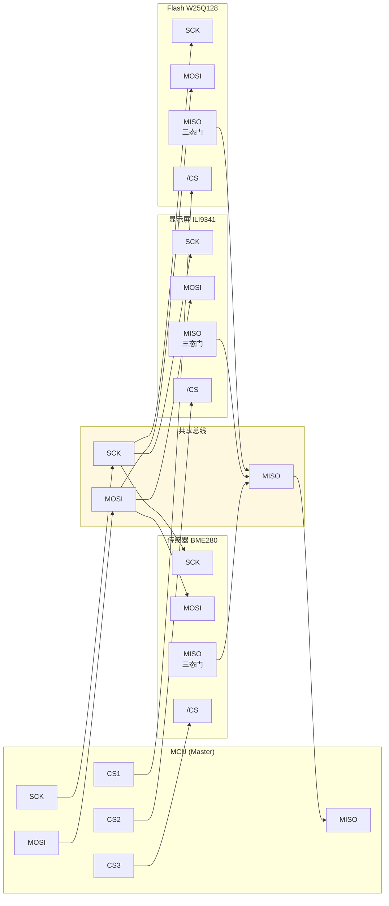
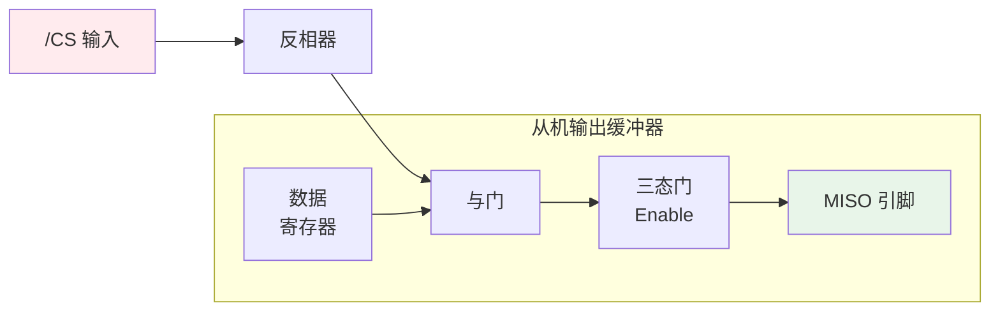
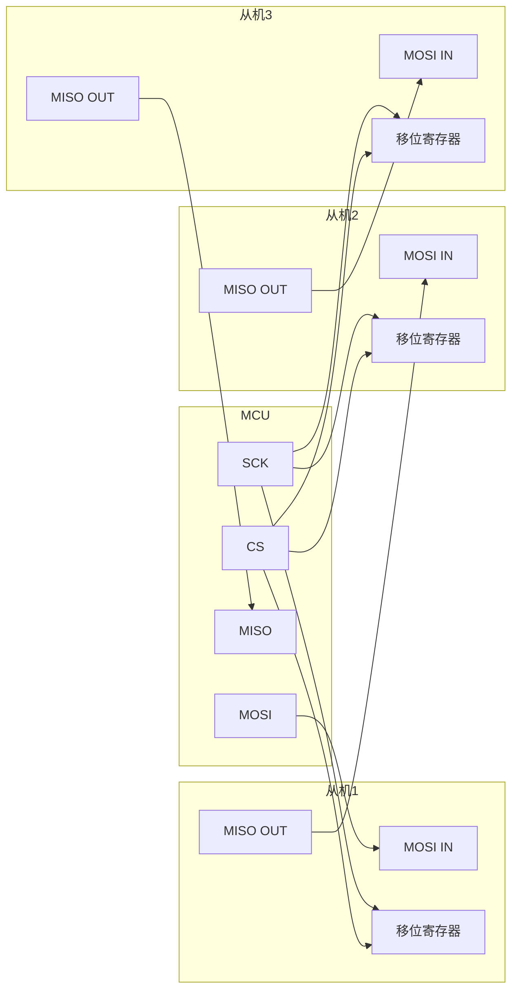

# SPI为什么能连接多设备——拓扑结构与控制策略

---

## 一主多从的星型拓扑

<span class="red">SPI 的一主多从架构</span>通过独立的 CS 线实现星型拓扑。每个从机独占一根 CS 线，所有从机共享 SCK/MOSI/MISO。

<br>



<br>

**拓扑的核心设计决策：**

<br>

- **SCK/MOSI 单向广播**：Master 同时驱动所有从机的 SCK 和 MOSI，只有 CS 有效的从机才会响应
- **MISO 共享总线**：所有从机的 MISO 连接在一起，CS 无效时必须高阻，否则总线冲突
- **CS 独立选择**：Master 通过 GPIO 或专用 CS 控制器管理每根 CS 线

<br>

<span class="blue">类比：星型拓扑如同"会议室电话系统"——主持人（Master）有一条公共广播线路（MOSI）和一条公共听筒线路（MISO），每个参会者（Slave）有独立的"举手发言"按钮（CS）。只有被点名的人（CS 有效）才能说话（驱动 MISO），其他人必须静音（高阻）。</span>

<br>

---

## MISO 三态门：总线冲突的物理根源

### <span class="orange"><strong>1. 为什么必须高阻？</strong></span>

<span class="red">MISO 线在物理上是多设备共享的电气节点</span>。如果两个从机同时驱动 MISO（一个输出高电平、一个输出低电平），会形成低阻抗通路，导致：

<br>

- **逻辑错误**：总线电平处于不确定的中间态
- **过流损坏**：驱动器输出级形成短路电流，可能烧毁芯片
- **信号完整性恶化**：争用导致边沿畸变、振铃

<br>

### <span class="orange"><strong>2. 三态门的实现机制</strong></span>



<br>

- **CS = 1（无效）**：反相器输出 0，与门关闭，三态门高阻（Hi-Z，约 1MΩ+）
- **CS = 0（有效）**：反相器输出 1，与门打开，三态门输出数据寄存器值

<br>

<span class="blue">关键参数：CS 无效到 MISO 进入高阻的时间 t_shqz（W25Q128JV 最大 8ns）。在此窗口期内，如果下一个从机的 CS 立即有效并开始驱动 MISO，两个从机可能短暂冲突。因此 Master 切换 CS 时应有 ≥ t_shqz 的间隔。</span>

<br>

---

## CS 控制策略

### <span class="orange"><strong>1. 硬件 CS vs 软件 GPIO</strong></span>

| 控制方式 | 实现 | 切换速度 | 适用场景 |
|---------|------|---------|---------|
| 硬件 CS | SPI 控制器内置 CS 自动管理 | 快（ns 级，与 SCK 同步） | 单设备高速传输 |
| 软件 GPIO | 独立 GPIO 线手动翻转 | 慢（μs 级，受 OS 调度影响） | 多设备分时复用 |

<br>

**Linux SPI 子系统的 CS 管理：**

<br>

```c
// 关键结构体：spi_device 中的 CS 配置
struct spi_device {
    u8  chip_select;        // CS 编号（对应 spi_master->cs_gpios[]）
    u8  mode;               // SPI_CPHA | SPI_CPOL | SPI_CS_HIGH
    /* ... */
};

// 设备树绑定示例（arch/arm/boot/dts/imx6ull.dtsi）
// ecspi3: ecspi@2010000 {
//     pinctrl-names = "default";
//     pinctrl-0 = <&pinctrl_ecspi3>;
//     cs-gpios = <&gpio4 27 GPIO_ACTIVE_LOW>,  // CS0
//                <&gpio4 26 GPIO_ACTIVE_LOW>;   // CS1
//     status = "okay";
// };
```

<br>

### <span class="orange"><strong>2. CS 切换时序</strong></span>

多设备通信时的正确切换序列：

<br>

```
1. CS1 拉低 → t_css → 传输数据 → t_csh → CS1 拉高
2. 等待 t_shqz（MISO 高阻确认）
3. CS2 拉低 → t_css → 传输数据 → t_csh → CS2 拉高
```

<br>

<span class="blue">常见错误：在 CS1 拉高后立即拉低 CS2，不等待 t_shqz。如果前一台从机的三态门关闭较慢，MISO 上会出现短暂的"双驱冲突"，导致首字节数据错误。</span>

<br>

---

## 菊花链变体：节省 CS 线的代价

### <span class="orange"><strong>1. 菊花链拓扑</strong></span>

<span class="red">菊花链（Daisy Chain）</span>是一种 SPI 变体，所有从机的 MOSI 和 MISO 串行连接，数据像移位寄存器一样流经所有设备。只需要一根 CS 控制所有设备。

<br>



<br>

**工作原理：**

<br>

- 发送 N×8 个时钟周期（N 为从机数量）
- 数据依次流经从机 1 → 从机 2 → 从机 3
- 每个从机在移位过程中捕获属于自己的 8-bit 数据
- 返回数据反向移位：从机 3 → 从机 2 → 从机 1 → Master

<br>

### <span class="orange"><strong>2. 优缺点对比</strong></span>

| 维度 | 星型拓扑 | 菊花链拓扑 |
|------|---------|-----------|
| CS 线数 | N 根（每从机一根） | 1 根 |
| 传输效率 | 单个设备独立，无额外开销 | 所有设备串行，延迟 ×N |
| 灵活性 | 任意时刻访问任意设备 | 必须按固定顺序访问 |
| 典型应用 | Flash、显示屏、传感器 | LED 驱动器（如 TLC5940）、级联 ADC |

<br>

<span class="blue">结论：菊花链仅在"设备数量多、引脚极度受限、数据同步性要求高"的场景使用。通用嵌入式系统首选星型拓扑。</span>

<br>

---

## 为什么 SPI 不支持真正的多主模式？

### <span class="orange"><strong>1. 电气层面的障碍</strong></span>

<span class="red">SPI 的推挽驱动结构从根本上禁止了多主模式</span>：

<br>

- **SCK 冲突**：两个 Master 同时驱动 SCK，一个输出高、一个输出低，形成短路
- **MOSI 冲突**：多个 Master 同时驱动 MOSI，总线电平不确定
- **CS 方向问题**：CS 是 Master→Slave 单向信号，多个 Master 谁控制 CS？

<br>

### <span class="orange"><strong>2. 软件层面的替代方案</strong></span>

虽然 SPI 电气层不支持多主，但可以通过外部逻辑实现"分时多主"：

<br>

- **外部仲裁器**：用 FPGA/CPLD 管理多个 Master 的总线请求，像 DMA 控制器那样分时授权
- **GPIO 握手**：Master A 完成传输后通过 GPIO 通知 Master B 可以开始
- **双端口 RAM**：两个 Master 不直接访问 SPI 设备，而是通过双端口 RAM 交换数据，由专用协处理器管理 SPI

<br>

<span class="blue">关键认知：SPI 的"一主"设计不是缺陷，而是简化。推挽驱动使单主场景下的性能最大化，多主需求应通过上层架构解决，而非修改协议本身。</span>

<br>

---

## 本章小结

<br>

| 概念 | 一句话总结 |
|------|-----------|
| 星型拓扑 | 一主多从，每个从机独占 CS，共享 SCK/MOSI/MISO |
| MISO 三态门 | CS 无效时高阻，避免总线冲突 |
| t_shqz | CS 无效到 MISO 高阻的时间，切换 CS 必须等待 |
| 硬件 CS | SPI 控制器自动管理，速度快 |
| 软件 GPIO | 手动翻转，适合多设备分时 |
| 菊花链 | MOSI/MISO 串接，省 CS 但效率低 |
| 多主限制 | 推挽电气结构从根本上禁止多主 |
| 分时多主 | 通过外部仲裁器或 GPIO 握手实现 |

<br>

---

## 练习

1. 在一主三从 SPI 拓扑中，如果某从机的 MISO 三态门失效（始终输出），描述总线冲突现象及排查方法（从示波器波形和软件读取两个角度）。
2. 菊花链拓扑访问 4 个设备，每个设备传输 8-bit 数据。计算星型拓扑和菊花链拓扑的总时钟周期数差异。
3. 设计一个 GPIO 握手方案让两个 MCU（Master A 和 Master B）分时访问同一个 SPI Flash。画出信号时序图，标注关键时间参数。
4. 某系统有 8 个 SPI 从机，MCU 只有 4 个空闲 GPIO 可用作 CS。分析使用 GPIO 扩展器（如 74HC138 译码器）和菊花链两种方案的优缺点。
