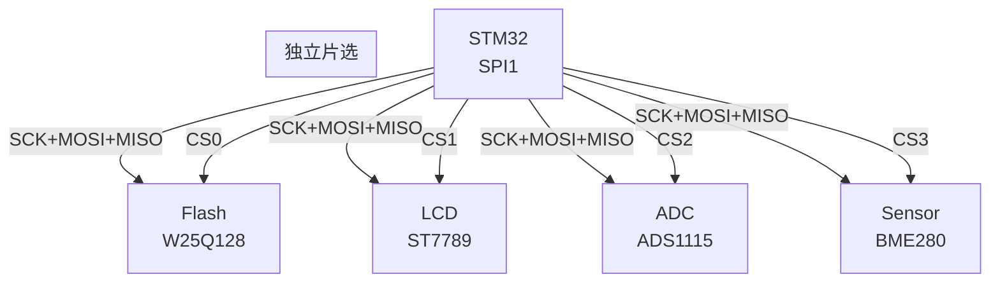
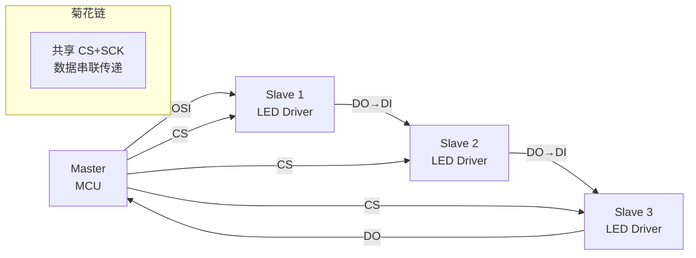

# SPI 片选与多从设备 [I]

> **本章学习目标**：
> - 理解 **软件 CS** 与 **硬件 CS** 的电气差异与适用场景
> - 掌握 **菊花链（Daisy Chain）** 拓扑的时序与控制逻辑
> - 了解 SPI Flash 多从配置的译码器设计与 Verilog 实现

---

## 片选信号的本质：多从机共享总线

---

### **为什么需要片选：SPI 总线的广播特性**

<span class="red">SPI 总线</span>没有地址机制，所有从机共享 MOSI/MISO/SCK 信号。

在多从机场景下，必须解决"谁接收/发送数据"的问题：
<br>
* <span class="green">硬件 CS</span>：每个从机有独立的 CS 引脚，主机控制
<br>
* <span class="green">软件 CS</span>：用 GPIO 模拟 CS 信号，灵活性更高
<br>
* <span class="green">菊花链</span>：从机串联，数据依次流经每个节点
<br>

<span class="blue">CS（Chip Select）低电平有效，拉低时从机激活。多个从机的 CS 不能同时为低，否则总线冲突。</span>
<br>

<span class="blue">类比：CS 如同"会议室的话筒开关"——只有拿到话筒（CS=低）的人才能说话（收发数据），其他人必须静音（CS=高）。</span>
<br>

---

### **软件 CS vs 硬件 CS：选择逻辑**

| 特性 | 硬件 CS | 软件 CS |
| --- | --- | --- |
| 引脚 | SPI 控制器专用 CS | 任意 GPIO |
| 切换速度 | 控制器自动，快 | 软件控制，稍慢 |
| 多从机数量 | 受 CS 引脚限制 | 无限（GPIO 够多） |
| 灵活性 | 低 | 高 |
| 典型场景 | 2~4 个从机 | 4+ 从机、特殊时序 |



<span class="blue">STM32 的 SPI 控制器通常只有 1~2 个硬件 CS 引脚（NSS）。超过 2 个从机时，必须用软件 CS（GPIO）扩展。</span>
<br>

---

## 菊花链：串联拓扑的级联控制

---

### **为什么用菊花链：引脚受限时的解决方案**

<span class="red">菊花链（Daisy Chain）</span>将多个从机的数据输入输出串联：
<br>
* 主机的 MOSI 连接到第一个从机的 DI
<br>
* 第一个从机的 DO 连接到第二个从机的 DI
<br>
* 依此类推，最后一个从机的 DO 连接到主机的 MISO
<br>
* 所有从机共享同一个 CS 和 SCK
<br>



<span class="blue">菊花链的关键：每个从机在 SCK 的驱动下，将 DI 的数据移位到 DO。数据像"击鼓传花"一样依次经过每个从机。</span>
<br>

---

### **菊花链时序：数据经过 N 个时钟周期到达目标**

发送 3 个字节到第 3 个从机：
<br>
* 第 1 个字节：经过从机 1 → 从机 2 → 从机 3（每个 SCK 移位一次）
<br>
* 第 2 个字节：到达从机 2
<br>
* 第 3 个字节：到达从机 1
<br>
* CS 拉高后，3 个从机同时应用各自的配置
<br>

| 时钟周期 | MOSI | 从机1 DI/DO | 从机2 DI/DO | 从机3 DI/DO |
| --- | --- | --- | --- | --- |
| 0 | Byte3 | - | - | - |
| 1~8 | Byte3 | Byte3 | - | - |
| 9~16 | Byte2 | Byte2 | Byte3 | - |
| 17~24 | Byte1 | Byte1 | Byte2 | Byte3 |
| CS↑ | 结束 | 应用 | 应用 | 应用 |

---

## Verilog 3-8 译码器：扩展硬件 CS

---

### **为什么用译码器：GPIO 也不够时的方案**

<span class="red">当从机数量超过 GPIO 数量时</span>，可以用 3-8 译码器扩展：
<br>
* 3 根 GPIO 控制 8 个 CS 输出
<br>
* 节省引脚，适合大规模 SPI 网络
<br>

```verilog
// 3-8 译码器 Verilog
module cs_decoder(
    input  [2:0] sel,    // 3-bit 选择
    output reg [7:0] cs  // 8 个 CS 输出，低有效
);

always @(*) begin
    cs = 8'b1111_1111;  // 默认全部无效
    case(sel)
        3'b000: cs[0] = 1'b0;
        3'b001: cs[1] = 1'b0;
        3'b010: cs[2] = 1'b0;
        3'b011: cs[3] = 1'b0;
        3'b100: cs[4] = 1'b0;
        3'b101: cs[5] = 1'b0;
        3'b110: cs[6] = 1'b0;
        3'b111: cs[7] = 1'b0;
    endcase
end
endmodule
```

<span class="blue">3-8 译码器用 3 根 GPIO 控制 8 个 CS，比直接用 8 个 GPIO 节省 5 个引脚。配合 SPI 总线（SCK+MOSI+MISO），总共只需 6 根线即可控制 8 个从机。</span>
<br>

---

## 本章小结

| 概念 | 一句话总结 |
| --- | --- |
| 硬件 CS | SPI 控制器专用，自动切换，适合 2~4 从机 |
| 软件 CS | GPIO 模拟，灵活，适合 4+ 从机 |
| 菊花链 | 从机串联，共享 CS，数据级联传递 |
| 3-8 译码器 | 3 根 GPIO 控制 8 个 CS，引脚扩展方案 |
| 独立片选 | 每个从机独立 CS，最常用 |

---

## 练习

1. 设计一个 8 从机 SPI 网络：用 3-8 译码器 + 软件 CS 混合方案，画出连接图。
2. 计算菊花链发送 3 字节到第 5 个从机需要多少个 SCK 周期。
3. 为什么菊花链的所有从机必须同时应用配置？如果逐个应用会怎样？
