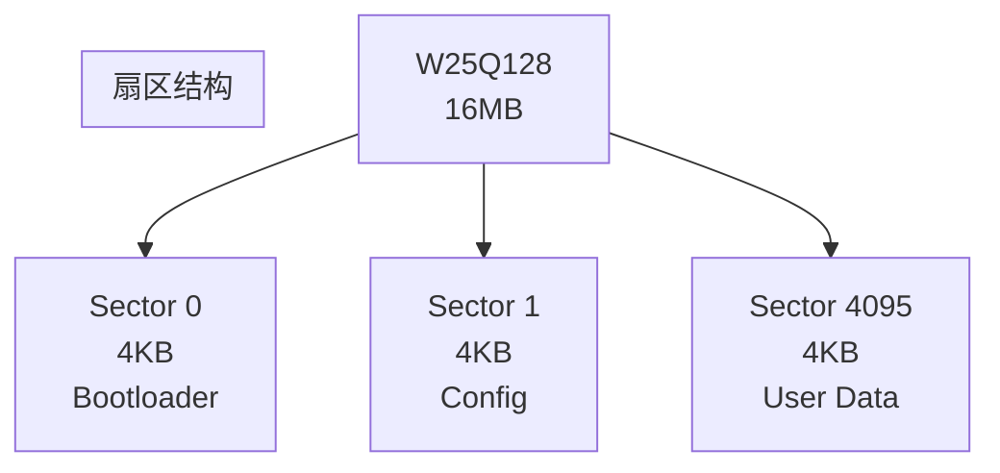
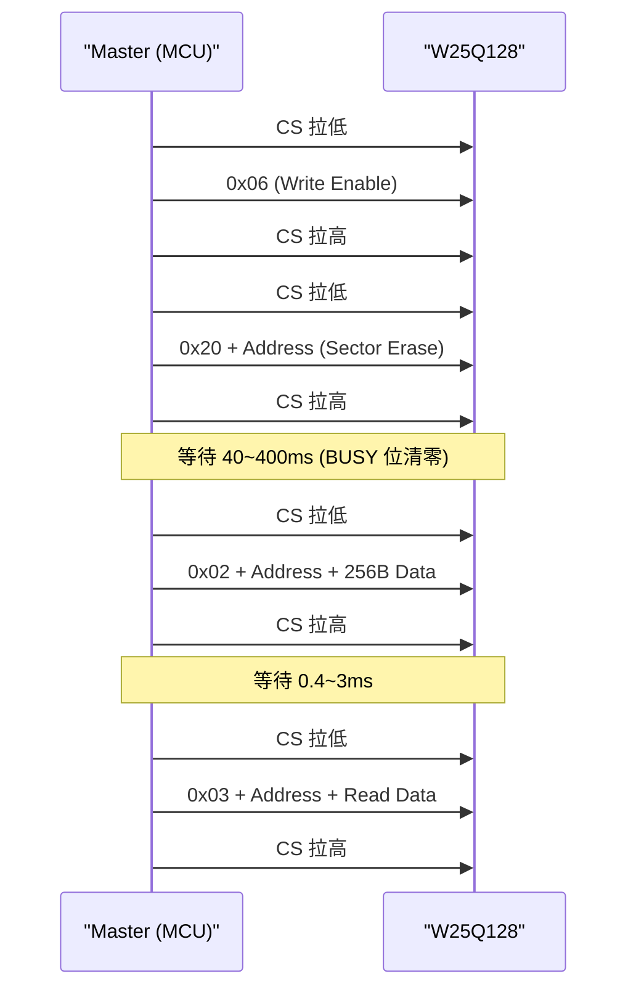
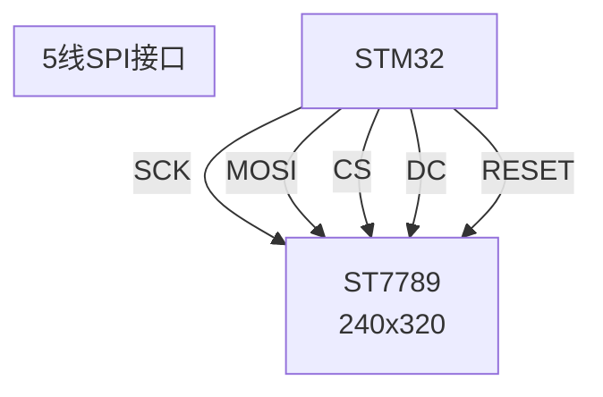

# SPI 实战：Flash 与显示屏 [I]

> **本章学习目标**：
> - 掌握 **W25Q128 SPI NOR Flash** 的擦写时序与扇区管理
> - 理解 **ST7789 LCD 控制器** 的初始化命令序列与显存映射
> - 了解 STM32 HAL SPI DMA 传输的配置与优化

---

## W25Q128 SPI NOR Flash：非易失存储的核心

---

### **为什么需要 SPI Flash：嵌入式系统的"硬盘"**

<span class="red">SPI NOR Flash</span>是嵌入式系统最常用的非易失存储：
<br>
* <span class="green">Bootloader 存储</span>：U-Boot、固件放在 Flash 中
<br>
* <span class="green">配置数据</span>：校准参数、用户设置
<br>
* <span class="green">字库存储</span>：显示屏用的中文字模
<br>

W25Q128 关键参数：
<br>
* 容量：128 Mbit = 16 MB
<br>
* 扇区（Sector）：4KB，擦除最小单位
<br>
* 页（Page）：256B，写入最小单位
<br>
* 擦写寿命：10 万次
<br>



<span class="blue">Flash 的写入特性：只能将 1 写为 0，不能将 0 写为 1。所以写入前必须先擦除（全部变为 1）。擦除按扇区（4KB）进行，写入按页（256B）进行。</span>
<br>

---

### **W25Q128 擦写时序：读→擦→写三步曲**

| 步骤 | 命令 | 说明 | 时间 |
| --- | --- | --- | --- |
| 1. 写使能 | 0x06 | 设置 WEL 位 | 微秒级 |
| 2. 扇区擦除 | 0x20 + 3-byte 地址 | 擦除 4KB | 40~400ms |
| 3. 页编程 | 0x02 + 地址 + 数据 | 写入 256B | 0.4~3ms |
| 4. 读数据 | 0x03 + 地址 | 读取任意长度 | 最高 104MHz |



<span class="blue">扇区擦除是最耗时的操作（40~400ms）。频繁擦写同一扇区会导致寿命快速消耗。实际工程中需用磨损均衡（Wear Leveling）或日志结构（Log-structured）来分散擦写。</span>
<br>

---

## ST7789 SPI LCD：显示屏的初始化与刷新

---

### **为什么用 SPI 接口 LCD：引脚精简**

<span class="red">ST7789</span>是 240×320 分辨率的 TFT LCD 控制器：
<br>
* SPI 接口仅需 4~5 根线（SCK/MOSI/CS/DC/RESET）
<br>
* 比并行 RGB 接口节省 10+ 根引脚
<br>
* 适合引脚受限的 MCU
<br>

| 引脚 | 功能 | 说明 |
| --- | --- | --- |
| SCK | 时钟 | SPI 时钟 |
| MOSI | 数据 | 命令/数据写入 |
| CS | 片选 | 低有效 |
| DC | 命令/数据 | 0=命令，1=数据 |
| RESET | 复位 | 低有效，硬件复位 |



<span class="blue">DC（Data/Command）引脚是 SPI LCD 特有的：DC=0 时 MOSI 发送的是命令（如 0x11=Sleep Out），DC=1 时发送的是数据（如像素值）。</span>
<br>

---

### **ST7789 初始化命令序列**

```text
典型初始化流程：

1. 硬件复位：RESET 拉低 10ms → 拉高 120ms
2. Sleep Out：0x11（退出睡眠模式）
3. 等待 120ms（睡眠唤醒时间）
4. 显示方向：0x36 + 0x00（正常方向）
5. 像素格式：0x3A + 0x55（16-bit RGB565）
6. Porch 设置：0xB2 + ...（ porch 参数）
7. 帧率控制：0xC2 + ...（帧率设置）
8. 电源控制：0xD0 + ...（VCOM/伽马）
9. 显示开：0x29（DISPLAY_ON）
```

| 命令 | 代码 | 功能 |
| --- | --- | --- |
| SWRESET | 0x01 | 软件复位 |
| SLPIN | 0x10 | 进入睡眠 |
| SLPOUT | 0x11 | 退出睡眠 |
| PTLON | 0x12 | 部分显示 |
| NORON | 0x13 | 正常显示 |
| INVOFF | 0x20 | 关闭反色 |
| INVON | 0x21 | 打开反色 |
| DISPON | 0x29 | 显示开启 |
| CASET | 0x2A | 设置列地址 |
| RASET | 0x2B | 设置行地址 |
| RAMWR | 0x2C | 写显存 |

---

## SPI DMA 传输：释放 CPU

---

### **为什么用 DMA：大数据量传输不阻塞 CPU**

<span class="red">SPI DMA</span>在传输大量数据时释放 CPU：
<br>
* LCD 刷新：240×320×2 = 153.6KB 每帧
<br>
* Flash 读取：大块数据读取
<br>
* CPU 可以在 DMA 传输期间执行其他任务
<br>

```c
// STM32 HAL SPI DMA 发送
HAL_SPI_Transmit_DMA(&hspi, framebuffer, 153600);

// 非阻塞，CPU 继续执行
while(HAL_SPI_GetState(&hspi) != HAL_SPI_STATE_READY) {
    // 可以在这里做其他事
}
```

| 传输方式 | 帧刷新时间 | CPU 占用 | 适用场景 |
| --- | --- | --- | --- |
| 轮询 | 高 | 100% | 小数据 |
| 中断 | 中 | 低 | 中数据 |
| DMA | 低 | 极低 | 大数据、LCD |

---

## 本章小结

| 概念 | 一句话总结 |
| --- | --- |
| W25Q128 | 16MB SPI NOR Flash，扇区 4KB，页 256B |
| 扇区擦除 | 4KB 擦除，40~400ms，寿命 10 万次 |
| 页编程 | 256B 写入，0.4~3ms |
| ST7789 | 240×320 SPI TFT 控制器，5 线接口 |
| DC 引脚 | 0=命令，1=数据 |
| DMA | 大数据量传输不阻塞 CPU |

---

## 练习

1. 为什么 Flash 写入前必须先擦除？设计一个 Flash 文件系统如何避免频繁擦写同一扇区？
2. ST7789 的 CASET（0x2A）和 RASET（0x2B）命令如何配合 RAMWR（0x2C）实现局部刷新？
3. 计算 STM32F103（72MHz）用 SPI DMA 刷新 240×320 RGB565 屏幕的理论帧率。
