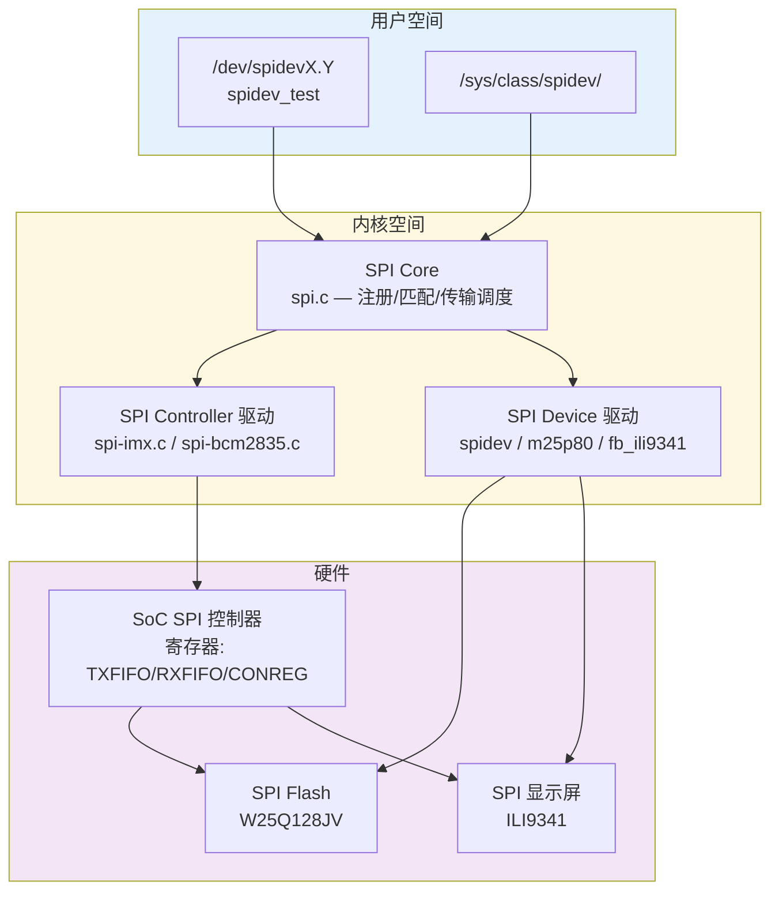

# SPI怎么调试与使用——Linux子系统与工具链

---

## Linux SPI 子系统架构

### <span class="orange"><strong>1. 三层结构</strong></span>

<span class="red">Linux SPI 子系统</span>由 Controller 驱动、Protocol 驱动和 Device 驱动三层组成，与 SPI 硬件的三层（物理层/协议层/应用层）对应。



### <span class="orange"><strong>2. 核心结构体</strong></span>

**spi_master（控制器）：**

```c
struct spi_master {
    struct device   dev;
    int             bus_num;        // 总线号，如 /dev/spidev0.0 中的 0
    u16             num_chipselect; // CS 线数量
    int (*setup)(struct spi_device *spi);
    int (*transfer)(struct spi_device *spi, struct spi_message *mesg);
    /* ... */
};
```

**spi_device（设备实例）：**

```c
struct spi_device {
    struct device       dev;
    struct spi_master   *master;
    u32                 max_speed_hz;  // 设备支持的最大速率
    u8                  chip_select;     // CS 编号
    u8                  mode;            // SPI_MODE_0/1/2/3 + 标志位
    u8                  bits_per_word;   // 通常 8
    /* ... */
};
```

<span class="blue">`mode` 字段是位掩码：`SPI_CPHA`(0x01)、`SPI_CPOL`(0x02)、`SPI_CS_HIGH`(0x04)、`SPI_LSB_FIRST`(0x08)、`SPI_3WIRE`(0x10)、`SPI_LOOP`(0x20)、`SPI_NO_CS`(0x40)。</span>

---

## 设备树绑定

### <span class="orange"><strong>1. 设备树节点示例（i.MX6ULL）</strong></span>

```dts
&ecspi3 {
    pinctrl-names = "default";
    pinctrl-0 = <&pinctrl_ecspi3>;
    cs-gpios = <&gpio4 27 GPIO_ACTIVE_LOW>,  // CS0
               <&gpio4 26 GPIO_ACTIVE_LOW>;   // CS1
    status = "okay";

    flash: w25q128@0 {
        compatible = "jedec,spi-nor";
        reg = <0>;                    // chip_select = 0
        spi-max-frequency = <104000000>; // 104MHz
        spi-mode = <0>;               // Mode 0
        #address-cells = <1>;
        #size-cells = <1>;
        partitions {
            compatible = "fixed-partitions";
            #address-cells = <1>;
            #size-cells = <1>;

            partition@0 {
                label = "uboot";
                reg = <0x0 0x100000>;     // 1MB
            };
            partition@100000 {
                label = "kernel";
                reg = <0x100000 0x500000>; // 5MB
            };
        };
    };
};
```

### <span class="orange"><strong>2. 设备树匹配流程</strong></span>

| 步骤 | 动作 | 输出 |
|------|------|------|
| 1 | 内核解析 DTB，实例化 spi_master | `/sys/class/spi_master/spi0` |
| 2 | 扫描子节点，创建 spi_device | `/sys/bus/spi/devices/spi0.0` |
| 3 | 匹配 compatible → 加载驱动 | `m25p80` 驱动 probe |
| 4 | probe 中调用 spi_setup() | 配置速率/模式/CS |
| 5 | 注册 mtd 分区 | `/dev/mtd0`, `/dev/mtd1` |

---

## spidev 工具实操

### <span class="orange"><strong>1. 设备节点与权限</strong></span>

```bash
$ ls -la /dev/spi*
```

```
crw-rw---- 1 root spi 153, 0 May  3 10:00 /dev/spidev0.0
crw-rw---- 1 root spi 153, 1 May  3 10:00 /dev/spidev0.1
```

<span class="blue">`crw-rw----` = 字符设备；`root spi` = root 和 spi 组可访问；主设备号 153 = spidev 驱动。</span>

### <span class="orange"><strong>2. 回环测试</strong></span>

```bash
$ spidev_test -v -D /dev/spidev0.0
```

```
spi mode: 0x0
bits per word: 8
max speed: 500000 Hz (500 KHz)

TX | FF FF FF FF FF FF 40 00 00 00 00 95 FF FF FF FF FF FF FF FF FF FF FF FF FF FF FF FF FF FF F0 0D
RX | FF FF FF FF FF FF 40 00 00 00 00 95 FF FF FF FF FF FF FF FF FF FF FF FF FF FF FF FF FF FF F0 0D
```

<span class="blue">TX=RX 说明回环通过（MOSI 直连 MISO）。`spi mode: 0x0` = Mode 0；`max speed: 500000` = 默认 500KHz。</span>

### <span class="orange"><strong>3. 指定模式与速率</strong></span>

```bash
$ spidev_test -D /dev/spidev0.0 -s 10000000 -m 3 -v -p "\x9f\x00\x00\x00"
```

```
spi mode: 0x3
bits per word: 8
max speed: 10000000 Hz (10 MHz)

TX | 9F 00 00 00
RX | FF EF 40 18
```

<span class="blue">发送 JEDEC ID 命令 0x9F，返回 `EF 40 18` = Winbond W25Q128JV（MF=0xEF, ID=0x4018）。`-s 10000000` = 10MHz；`-m 3` = Mode 3。</span>

### <span class="orange"><strong>4. sysfs 调试信息</strong></span>

```bash
# 查看设备树路径
$ cat /sys/bus/spi/devices/spi0.0/modalias
spi:w25q128

# 查看驱动绑定
$ cat /sys/bus/spi/devices/spi0.0/driver/uevent
DRIVER=m25p80

# 查看当前速率/模式
$ cat /sys/bus/spi/devices/spi0.0/of_node/spi-max-frequency
104000000

$ cat /sys/bus/spi/devices/spi0.0/of_node/spi-mode
0
```

---

## 驱动开发关键链路

### <span class="orange"><strong>1. probe 函数模板</strong></span>

```c
static int my_spi_probe(struct spi_device *spi)
{
    int ret;
    u8 id[3];
    
    /* 配置 SPI 参数 */
    spi->mode = SPI_MODE_0;
    spi->max_speed_hz = 10000000;    // 10MHz
    spi->bits_per_word = 8;
    ret = spi_setup(spi);
    if (ret < 0)
        return ret;
    
    /* 发送 JEDEC ID 命令 */
    u8 tx[4] = {0x9F, 0x00, 0x00, 0x00};
    u8 rx[4] = {0};
    
    struct spi_transfer t = {
        .tx_buf = tx,
        .rx_buf = rx,
        .len    = 4,
    };
    struct spi_message m;
    
    spi_message_init(&m);
    spi_message_add_tail(&t, &m);
    ret = spi_sync(spi, &m);
    
    if (ret == 0)
        dev_info(&spi->dev, "JEDEC ID: %02X %02X %02X\n",
                 rx[1], rx[2], rx[3]);
    
    return 0;
}
```

<span class="blue">`spi_sync()` = 阻塞同步传输；`spi_message` 可包含多个 `spi_transfer`，实现分段传输（如先命令后数据）。</span>

### <span class="orange"><strong>2. 异步传输（中断/DMA）</strong></span>

```c
static void my_spi_complete(void *arg)
{
    struct completion *done = arg;
    complete(done);
}

static int my_spi_async(struct spi_device *spi, u8 *tx, u8 *rx, int len)
{
    struct completion done;
    struct spi_message m;
    struct spi_transfer t = {
        .tx_buf = tx,
        .rx_buf = rx,
        .len    = len,
    };
    
    init_completion(&done);
    spi_message_init(&m);
    m.complete = my_spi_complete;
    m.context = &done;
    spi_message_add_tail(&t, &m);
    
    spi_async(spi, &m);          // 非阻塞，启动传输
    wait_for_completion(&done);  // 等待完成回调
    
    return 0;
}
```

<span class="blue">`spi_async()` 启动非阻塞传输，适合 DMA 大块数据传输。Controller 驱动自动选择 PIO 或 DMA 模式。</span>

---

## 调试技巧

### <span class="orange"><strong>1. 常见问题诊断</strong></span>

| 现象 | 可能原因 | 排查工具 |
|------|---------|---------|
| 读取全 0xFF | CS 未连接、从机未使能、MISO 悬空 | 示波器抓 CS/SCK/MISO |
| 数据错位 | CPOL/CPHA 不匹配 | `spidev_test -m 0/1/2/3` 逐一测试 |
| 速率不稳定 | 走线过长、阻抗不匹配 | 缩短走线、降速测试 |
| 偶发错误 | t_css/t_csh 不足、信号串扰 | 逻辑分析仪抓时序 |
| 设备未识别 | DTB 配置错误、驱动未加载 | `dmesg | grep spi` |

### <span class="orange"><strong>2. 内核日志追踪</strong></span>

```bash
# 查看 SPI 控制器初始化日志
$ dmesg | grep -i spi
[    1.234567] spi_imx 2010000.ecspi: probed
[    1.235000] spi_imx 2010000.ecspi: DMA channel: tx=..., rx=...
[    1.240000] m25p80 spi0.0: w25q128 (16384 Kbytes)

# 开启动态调试
$ echo 'file drivers/spi/spi.c +p' > /sys/kernel/debug/dynamic_debug/control
$ echo 'file drivers/spi/spi-imx.c +p' >> /sys/kernel/debug/dynamic_debug/control
```

---

## 本章小结

| 概念 | 一句话总结 |
|------|-----------|
| SPI Core | 内核核心层，负责设备注册、匹配、传输调度 |
| spi_master | 代表 SPI 控制器，管理总线时序和 CS |
| spi_device | 代表从机设备，绑定速率/模式/CS |
| spi_driver | 设备驱动，probe/remove 回调 |
| spi_sync() | 阻塞同步传输 |
| spi_async() | 非阻塞异步传输，支持 DMA |
| spidev_test | 用户空间测试工具，回环/命令测试 |
| 设备树 | `spi-max-frequency`、`spi-mode`、`cs-gpios` |
| JEDEC ID | 0x9F 命令读取厂商/设备标识 |

---

## 练习

1. 在设备树中将 `spi-max-frequency` 设为 150MHz，但 W25Q128JV 只支持 104MHz。分析内核行为（是否会自动限制到 104MHz？从 `spi_setup()` 源码逻辑思考）。
2. 用 `spidev_test` 发送 0x03（Read Data）+ 3 字节地址 + 读 256 字节，构造完整命令序列并解读返回数据。
3. 比较 `spi_sync()` 和 `spi_async()` 在传输 4KB 数据时的 CPU 占用差异。为什么大块数据必须用异步 + DMA？
4. 某 SPI 显示屏（ILI9341）在 Linux 下使用 `fb_ili9341` 驱动，但刷新时出现撕裂。分析可能原因（从 CS 切换时序和 spi_sync 阻塞两个角度）。
