# SPI往哪发展——实战应用与前沿演进

---

## W25Q128JV Flash 深度实战

### <span class="orange"><strong>1. 芯片概述</strong></span>

<span class="red">W25Q128JV</span> 是 Winbond 生产的 128Mbit（16MB）NOR Flash，支持标准 SPI（1-bit）和 QSPI（4-bit）模式。它是嵌入式系统中最常见的 SPI Flash，用于存储 Bootloader、内核和设备树。

| 参数 | 数值 |
|------|------|
| 容量 | 128Mbit = 16MB |
| 扇区大小 | 4KB（Sector Erase: 0x20） |
| 块大小 | 64KB（Block Erase: 0xD8） |
| 页大小 | 256 bytes（Page Program: 0x02） |
| 标准 SPI 速率 | ≤104MHz |
| QSPI 速率 | ≤104MHz（4-bit 并行） |

### <span class="orange"><strong>2. 关键操作命令码表</strong></span>

| 命令 | 码 | 操作 | 传输结构 |
|------|-----|------|---------|
| Write Enable | 0x06 | 使能写入/擦除 | 1 TX |
| Write Disable | 0x04 | 禁用写入 | 1 TX |
| Read Status Register-1 | 0x05 | 读忙状态/写使能标志 | 1 TX + 1 RX |
| Read Data | 0x03 | 标准读取（≤50MHz） | 1 TX + 3 TX(地址) + N RX |
| Fast Read | 0x0B | 快速读取（≤104MHz） | 1 TX + 3 TX(地址) + 1 TX(dummy) + N RX |
| Fast Read Dual Output | 0x3B | 2-bit 输出 | 同上，MISO+IO1 同时输出 |
| Fast Read Quad Output | 0x6B | 4-bit 输出 | 同上，4 IO 同时输出 |
| Page Program | 0x02 | 页写入（256 bytes） | 1 TX + 3 TX(地址) + N TX |
| Sector Erase | 0x20 | 4KB 擦除 | 1 TX + 3 TX(地址) |
| Block Erase (64KB) | 0xD8 | 64KB 擦除 | 1 TX + 3 TX(地址) |
| Chip Erase | 0xC7 / 0x60 | 全片擦除 | 1 TX |
| Read JEDEC ID | 0x9F | 读厂商/设备 ID | 1 TX + 3 RX |
| Enter QPI Mode | 0x38 | 切换到 QPI（4-bit 指令） | 1 TX |
| Exit QPI Mode | 0xFF | 退出 QPI 回标准 SPI | 1 TX |

### <span class="orange"><strong>3. 命令序列时序图</strong></span>

**Read JEDEC ID（0x9F）：**

```
CS:    ──────┐                                      └─────────────
             │                                      │
SCK:   ──────┼──────────┬──┐  ┌──┐  ┌──┐  ┌──┐  ├───
             │          │  └──┘  └──┘  └──┘  └──┘  │
MOSI:  ──────┼══════════╪═0x9F════╪══0x00═══╪══0x00═══╪══0x00═══
             │          │  命令    │  空字节  │  空字节  │  空字节
MISO:  ──────┼══════════╪═════════╪═════════╪═0xEF════╪═0x40════
             │          │         │         │ Winbond │ W25Q128
             │          │         │         ↑ 上升沿采样
```

**Fast Read（0x0B）——含 dummy byte：**

```
CS:    ──────┐                                                            └────
             │                                                            │
SCK:   ──────┼──┐  ┌──┐  ┌──┐ ... ┌──┐  ┌──┐  ┌──┐  ┌──┐  ┌──┐  ┌──┐  ├───
             │  └──┘  └──┘  └──┘     └──┘  └──┘  └──┘  └──┘  └──┘  └──┘  │
MOSI:  ─═════╪0x0B╪ A23-A16 ╪ A15-A8 ╪ A7-A0 ╪ Dummy ╪ ═════════════════════
             │ 命令  │ 地址高   │ 地址中  │ 地址低  │ 空字节 │    数据    
MISO:  ─═════╪═════╪═════════╪═════════╪═════════╪═══════╪═D7═════D6═════
             │     │         │         │         │       ↑ 第一个数据字节
```

<span class="blue">dummy byte 的作用：Flash 内部需要 1 个时钟周期将地址译码到存储阵列，dummy 期间 Flash 在准备数据，Master 的 MOSI 发送无效数据（通常 0x00），MISO 在第 9 个时钟边沿开始输出有效数据。</span>

### <span class="orange"><strong>4. 状态寄存器轮询</strong></span>

```c
static int w25q_wait_ready(struct spi_device *spi)
{
    u8 tx = 0x05;          // Read Status Register-1
    u8 status;
    int retries = 10000;
    
    while (retries--) {
        u8 rx[2] = {0};
        struct spi_transfer t = {
            .tx_buf = &tx,
            .rx_buf = rx,
            .len    = 2,
        };
        struct spi_message m;
        spi_message_init(&m);
        spi_message_add_tail(&t, &m);
        spi_sync(spi, &m);
        status = rx[1];
        
        if ((status & 0x01) == 0)       // WIP (Write In Progress) bit = 0
            return 0;
        
        udelay(100);                     // 擦除 4KB 通常 60-400ms
    }
    return -ETIMEDOUT;
}
```

<span class="blue">Status Register-1 位定义：Bit 0 = WIP（忙标志），Bit 1 = WEL（写使能锁存），Bit 6 = QE（QSPI 使能），Bit 7 = SRP（状态寄存器保护）。必须先发送 Write Enable（0x06）使 WEL=1，才能执行 Page Program 或 Erase。</span>

---

## ILI9341 显示屏实战

### <span class="orange"><strong>1. 芯片概述</strong></span>

<span class="red">ILI9341</span> 是 240×320 分辨率 TFT LCD 控制器，支持 SPI（Mode 3）和 8080 并行接口。在嵌入式项目中常以 SPI 模式用于小尺寸彩屏。

### <span class="orange"><strong>2. SPI 模式接线（6 线）</strong></span>

| ILI9341 引脚 | 连接 MCU | 说明 |
|-------------|---------|------|
| SCL | SCK | 时钟，Mode 3 |
| SDA/SDI | MOSI | 数据输入 |
| CS | CS | 片选，低有效 |
| DC/RS | GPIO | **数据/命令选择（需独立 GPIO）** |
| RST | GPIO | 硬件复位 |
| LED | PWM/GPIO | 背光控制 |

<span class="blue">注意：ILI9341 在 SPI 模式下是单向输入（从机只接收命令和数据），不需要 MISO 线。DC 引脚用于区分命令字节（DC=0）和数据字节（DC=1），这是 SPI 显示屏的典型设计——一根额外的 GPIO 线扩展了 SPI 的语义。</span>

### <span class="orange"><strong>3. 初始化命令序列</strong></span>

```c
static const u8 ili9341_init_seq[] = {
    /* 命令,  参数长度,  参数... */
    0x01, 0,              // Software Reset
    0x11, 0,              // Sleep Out
    0x3A, 1, 0x55,        // COLMOD: 16-bit/pixel (RGB565)
    0x36, 1, 0x48,        // MADCTL: Row/Col exchange, RGB order
    0x29, 0,              // Display ON
};

static void ili9341_write_cmd(struct spi_device *spi, u8 cmd)
{
    gpio_set_value(dc_gpio, 0);     // DC = 0: Command
    spi_write(spi, &cmd, 1);
}

static void ili9341_write_data(struct spi_device *spi, u8 *data, int len)
{
    gpio_set_value(dc_gpio, 1);     // DC = 1: Data
    spi_write(spi, data, len);
}
```

<span class="blue">`spi_write()` 是内核封装，内部调用 `spi_sync()` 完成单次传输。DC 引脚在命令和数据之间切换，这个操作不能由 SPI 硬件自动完成，必须由驱动手动控制 GPIO。</span>

---

## 从标准 SPI 到 QSPI / Octal SPI 的演进

```mermaid
flowchart LR
    subgraph Standard["Standard SPI<br>4-wire, ×1 带宽"]
        SCK["SCK"]
        MOSI["MOSI"]
        MISO["MISO"]
        CS["CS"]
    end
    
    subgraph QSPI["Quad SPI<br>6-wire, ×4 带宽"]
        Q_SCK["SCK"]
        Q_IO0["IO0<br>(原MOSI)"]
        Q_IO1["IO1<br>(原MISO)"]
        Q_IO2["IO2<br>(原/WP)"]
        Q_IO3["IO3<br>(原/HOLD)"]
        Q_CS["CS"]
    end
    
    subgraph Octal["Octal SPI<br>10-wire, ×8 带宽"]
        O_SCK["SCK"]
        O_IO0["IO0"]
        O_IO1["IO1"]
        O_IO2["IO2"]
        O_IO3["IO3"]
        O_IO4["IO4"]
        O_IO5["IO5"]
        O_IO6["IO6"]
        O_IO7["IO7"]
        O_CS["CS"]
    end
    
    Standard -->|"带宽×1"| QSPI -->|"带宽×4"| Octal
```

### <span class="orange"><strong>1. 信号扩展路线</strong></span>



### <span class="orange"><strong>2. 带宽演进对比</strong></span>

| 模式 | 数据线数 | 最大速率 | 理论带宽 | 典型应用 |
|------|---------|---------|---------|---------|
| Standard SPI | 1-bit | 104MHz | 13MB/s | 小容量配置存储 |
| Dual SPI | 2-bit | 104MHz | 26MB/s | 中等带宽应用 |
| Quad SPI (QSPI) | 4-bit | 104MHz | 52MB/s | 主流 Flash，Linux 启动 |
| QSPI DDR | 4-bit DDR | 80MHz | 80MB/s | 高分辨率显示屏 |
| Octal SPI | 8-bit | 200MHz | 200MB/s | AI 推理模型加载 |
| Octal SPI DDR | 8-bit DDR | 200MHz | 400MB/s | 高端车载系统 |

<span class="blue">DDR（Double Data Rate）在 SCK 的上升沿和下降沿都采样数据，每个时钟周期传输 2 次，带宽再翻倍。</span>

### <span class="orange"><strong>3. QSPI 命令切换</strong></span>

W25Q128JV 从标准 SPI 切换到 QSPI 输出模式：

```
1. 发送 Write Enable (0x06) — 使能写操作
2. 发送 Write Status Register-2 (0x31, 0x02) — 设置 QE=1（Quad Enable）
3. 此后 Fast Read Quad Output (0x6B) 命令将同时在 IO0-IO3 上输出 4-bit 数据
```

---

## MIPI I3C：SPI 的挑战者

### <span class="orange"><strong>1. 为什么 I3C 能挑战 SPI？</strong></span>

<span class="red">MIPI I3C</span>（Improved Inter-Integrated Circuit）在保留 2 线优势的同时，通过推挽驱动和动态地址将速率提升至 12.5MHz，并支持带内中断。

| 特性 | SPI (QSPI) | MIPI I3C |
|------|-----------|----------|
| 信号线 | 6（SCK + 4IO + CS） | 2（SDA + SCL） |
| 速率 | ≤200MB/s（Octal DDR） | ≤12.5MB/s |
| 多主支持 | 不支持 | 支持 |
| 带内中断 | 不支持（需额外 INT 线） | 支持 |
| 动态地址 | 无（CS 硬连线） | 支持 |
| 功耗 | 较高（多线切换） | 较低（开漏/推挽自适应） |
| 标准组织 | 无（事实标准） | MIPI Alliance |

### <span class="orange"><strong>2. 应用场景分化</strong></span>

| 场景 | 首选协议 | 原因 |
|------|---------|------|
| 大容量 Flash 启动 | **QSPI/Octal SPI** | 带宽需求 >50MB/s |
| 高分辨率显示屏 | **QSPI/RGB 并行** | 刷新率需要高吞吐量 |
| 传感器网络（温度/压力/加速度） | **I3C** | 多设备、低功耗、动态地址 |
| 低速控制（LED、GPIO 扩展） | **I2C/SPI 均可** | 看 PCB 布线便利性 |
| 汽车 ADAS 摄像头 | **MIPI CSI-2** | 专用高速差分协议 |

<span class="blue">结论：SPI 在需要极致带宽（Flash、显示屏）的场景仍将长期存在，但在传感器网络、低速控制等场景正逐步被 I3C 替代。理解 SPI 的物理层原理对调试 QSPI/Octal 扩展至关重要。</span>

---

## 前沿趋势

### <span class="orange"><strong>1. CXL 与 PCIe 的存储扩展</strong></span>

CXL（Compute Express Link）基于 PCIe 物理层，将内存语义引入互连协议。未来高端嵌入式系统可能通过 CXL.mem 直接访问远程 SPI/NAND 存储，绕过传统 DMA 路径。

### <span class="orange"><strong>2. 片上集成趋势</strong></span>

现代 SoC（如 i.MX RT、STM32H7）将 QSPI 控制器直接集成到芯片内部，支持 XIP（Execute In Place）——CPU 直接从 QSPI Flash 取指执行，无需先将代码复制到 RAM。这要求 QSPI 控制器支持指令缓存和预取，是嵌入式启动架构的重大演进。

---

## 本章小结

| 概念 | 一句话总结 |
|------|-----------|
| W25Q128JV | 128Mbit NOR Flash，标准 SPI + QSPI，104MHz |
| 0x9F | JEDEC ID 命令，读取厂商/设备标识 |
| 0x03/0x0B | Read / Fast Read，后者含 dummy byte |
| 0x02/0x20 | Page Program / Sector Erase，必须先 Write Enable |
| Status Register-1 | Bit 0=WIP（忙），Bit 1=WEL（写使能） |
| ILI9341 | 240×320 TFT，SPI Mode 3，需额外 DC GPIO |
| QSPI | 4-bit 并行，带宽 ×4 |
| Octal SPI | 8-bit 并行，带宽 ×8 |
| XIP | Execute In Place，CPU 直接从 QSPI Flash 取指 |
| MIPI I3C | 2 线替代方案，12.5MHz，带内中断，挑战 SPI 传感器市场 |

---

## 练习

1. W25Q128JV 的 Page Program（0x02）要求先发送 Write Enable（0x06）。解释为何 Write Enable 后、Page Program 前 CS 必须拉高再拉低（不能连续发送）。
2. 计算：QSPI 模式（4-bit）下，SCK=80MHz，读取 4KB 数据（含 1 命令 + 3 地址 + 1 dummy + 4096 数据字节）的理论耗时。对比标准 SPI 模式。
3. ILI9341 的 DC 引脚不能由 SPI 硬件自动管理，必须由驱动手动翻转 GPIO。分析如果 DC 控制与 SPI 传输不同步（DC 翻转在 SPI 启动之后）会导致什么显示异常。
4. 某 SoC 支持 XIP 从 QSPI Flash 直接执行代码。分析 XIP 对 QSPI 控制器的特殊要求（从缓存行填充、预取、等待状态三个角度）。
5. 对比 SPI 和 I3C 在可穿戴设备（电池供电、多个传感器、低功耗）中的选型优劣。从引脚数、功耗、速率、生态四个维度分析。
