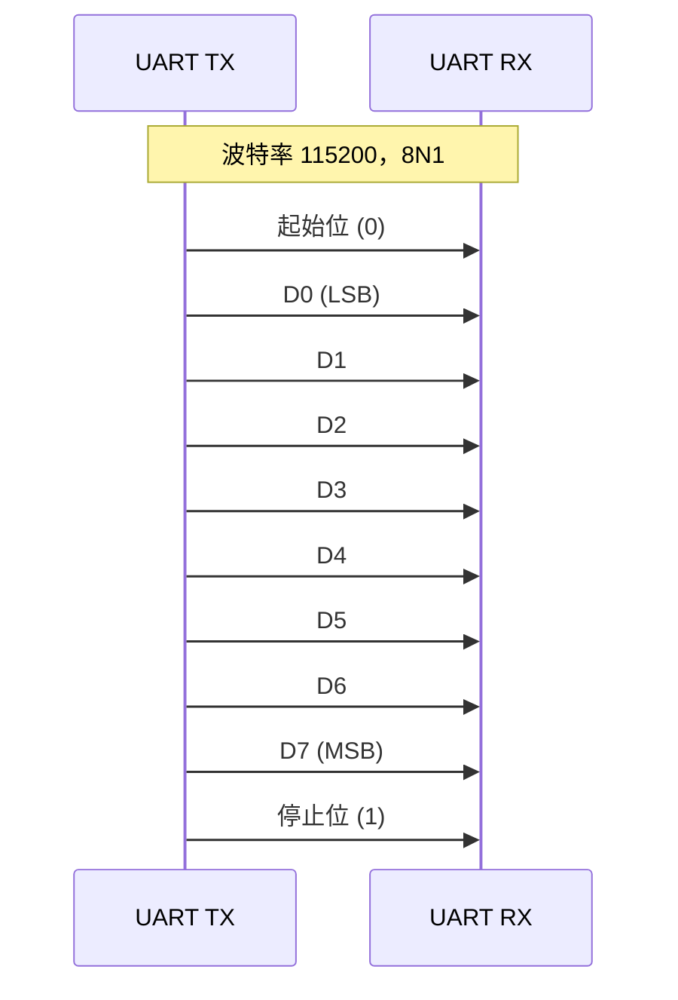

[B][I]

# UART 基础认知与异步通信

异步通信的核心思想是不共享时钟线，发送端和接收端各自独立运行，通过预先约定的波特率（baud rate）实现数据同步。 这种方式大幅减少了物理连线数量，成为嵌入式调试、GPS 模组、蓝牙透传等场景的事实标准。  
类比：对讲机通话不需要双方手表完全一致，只要约定好"每秒说几个字"，就能听懂彼此——UART 正是这个原理的电路级实现。

---

## 为什么需要异步通信

同步总线（如 SPI）需要独立的时钟线 SCK，连线成本高且难以长距离传输。 异步总线省掉时钟线后，仅需 TX、RX 两根信号线即可完成全双工通信。  
对于仅有两根 GPIO 可用的廉价 MCU，异步通信几乎是唯一选择。此外，PC 串口、USB 转串口、蓝牙 BLE 透传模组均采用 UART 作为底层接口，生态极为成熟。

### 同步 vs 异步的连线差异

同步总线中，时钟信号由主设备产生，所有从设备在同一时钟边沿采样数据。SPI 需要 MOSI、MISO、SCK、CS 四根线，I2C 需要 SDA、SCL 两根线但仍然是同步的。UART 将时钟信息编码在数据流内部，接收端通过起始位的下降沿重建本地采样时基。  
这种设计带来的代价是：每帧必须有起始位和停止位作为开销，且波特率误差必须严格控制。

### 异步通信的历史地位

UART（Universal Asynchronous Receiver/Transmitter）是上世纪 70 年代为解决电传打字机通信而设计的接口。Intel 的 8250 芯片是早期 PC 串口卡的核心，后来的 16550A 增加了 FIFO 缓冲区。这些设计沿用至今，成为所有嵌入式和 PC 通信的事实标准。  
扩展：现代 MCU 的 UART 外设通常在 8250/16550 基础上集成 DMA、硬件流控、多机通信模式，但核心帧格式和波特率机制与 50 年前的芯片完全一致。

---

## 帧格式：起始位+数据位+校验位+停止位

UART 帧由起始位拉低电平触发接收端开始采样，随后按约定波特率逐位采样数据位，最后以停止位恢复高电平结束一帧。

### 字段级解析

| 字段 | 位宽 | 电平 | 作用 |
|------|------|------|------|
| 空闲 | - | 高电平 | 无数据传输 |
| 起始位 | 1 bit | 低电平 | 通知接收方"帧开始" |
| 数据位 | 5-9 bit | LSB first | 有效载荷 |
| 校验位 | 0/1 bit | 奇/偶校验 | 检错（非纠错） |
| 停止位 | 1-2 bit | 高电平 | 帧结束，恢复空闲 |

常见配置为 `8N1`：8 位数据、无校验（None）、1 位停止位。  
起始位不可配置，始终为 1 bit 低电平，这是硬件检测帧边界的基础。

### 位序与采样机制

数据位以 LSB first 顺序发送，即 D0 最先出现在总线上。接收端在检测到起始位下降沿后，等待 1.5 个位周期再采样 D0，此后每个位周期采样一次。最后一位置位 D7 采样后，再等待 1 个位周期采样停止位，验证其为高电平。  
若停止位检测为低电平，硬件置位帧错误（FE, Frame Error）标志。

### 校验位详解

| 校验模式 | 校验位取值 | 检测能力 |
|----------|-----------|----------|
| 无校验 | - | 无 |
| 偶校验 | 使总 1 的个数为偶数 | 单比特翻转 |
| 奇校验 | 使总 1 的个数为奇数 | 单比特翻转 |

校验位只能检测奇数个位翻转，无法纠错。现代系统通常使用 CRC（循环冗余校验）替代简单的奇偶校验，或干脆关闭校验位以提升有效带宽。

### 时序图

易错点：接收端在起始位下降沿触发后，等待 1.5 个位周期再采样 D0，此后每个位周期采样一次。 若波特率误差过大，最后一位（D7）会采样到错误电平，导致整帧数据错误。  
易错点：停止位为 2 bit 时，总线保持高电平两个位周期，有助于低速高噪声环境的可靠同步，但吞吐量下降约 10%。

---

## 波特率计算

波特率由 MCU 外设时钟分频得到，公式为 `baud = f_osc / (16 × (UBRR + 1))`，其中 UBRR 为 16 位分频寄存器。  
以 AVR ATmega328P 为例：外部晶振 16 MHz，目标波特率 9600，则 `UBRR = 16000000 / (16 × 9600) - 1 = 103.1667`，取整数 103。  
实际波特率 = 16000000 / (16 × 104) = 9615.38，误差 ≈ 0.16%，在 ±1.5% 容忍范围内。

### 分频误差分析

当系统时钟不是波特率的整数倍时，分频后会产生舍入误差。误差百分比计算公式为：  
`error% = (actual_baud - target_baud) / target_baud × 100%`  
以 STM32F103 为例，APB2 时钟 72 MHz，目标波特率 115200：  
`DIV = 72000000 / (16 × 115200) = 39.0625`，取整数部分 39，小数部分 0.0625 × 16 = 1（即 1/16）。  
实际波特率 = 72000000 / (16 × 39.0625) = 115200，误差恰好为 0。

### 波特率倍增模式

部分 UART 支持 8x 过采样模式（U2X=1），公式变为 `baud = f_osc / (8 × (UBRR + 1))`。此时在相同时钟下可达到更高波特率，但抗噪声能力下降。  
扩展：STM32 的 UART 支持过采样 8 倍和 16 倍两种模式，8 倍模式适合高速场景，16 倍模式适合长距离或噪声环境。

### 常见波特率速查

| 波特率 | 用途 | 误差容忍 |
|--------|------|----------|
| 9600 | 传统设备、GPS | ±1.5% |
| 19200 | 工业仪表 | ±1.5% |
| 38400 | 较高速传感器 | ±1.5% |
| 115200 | 现代调试、Wi-Fi/BLE 模组 | ±1.5% |
| 921600 | 高速下载、SDRAM 调试 | ±1.0% |

UBRR（USART Baud Rate Register） 的取值决定分频比，芯片手册通常提供常见波特率对应的 UBRR 速查表。  
DIV（BRR 寄存器值） 在 STM32 中包含整数部分（高 12 位）和小数部分（低 4 位），支持 1/16 精度的小数分频。

---

## RS-232/RS-485/TTL 电平对比

同一套 UART 协议可以运行在不同电平标准上，区别在于电压范围、传输距离和抗干扰能力。

| 标准 | 逻辑1 | 逻辑0 | 电压范围 | 最大速率 | 传输距离 | 拓扑 |
|------|-------|-------|----------|----------|----------|------|
| TTL | 3.3V/5V | 0V | 0~Vcc | ≤10 Mbps | ≤1m | 点对点 |
| RS-232 | -3V~-15V | +3V~+15V | ±15V | ≤115.2k | ≤15m | 点对点 |
| RS-485 | +2V~+6V | -6V~-2V | ±6V | ≤50 Mbps | ≤1200m | 总线 |

### 电平转换芯片

TTL 与 RS-232 之间必须使用电平转换芯片，常见型号有 MAX3232（3.3V 供电）、MAX232（5V 供电）。RS-485 需要使用收发器如 MAX485、SP3485，芯片内部包含差分驱动器和接收器。  
结论：RS-485 采用差分信号，抗共模干扰能力强，是工业现场总线的首选。 TTL 电平仅限板内通信，不能直接接 RS-232 端口，否则会导致逻辑反转和过压损坏。

### 逻辑电平的反转陷阱

RS-232 标准中，负电压表示逻辑 1（Mark），正电压表示逻辑 0（Space），与 TTL 电平恰好相反。电平转换芯片 MAX3232 内部自动完成极性翻转，但直接用电阻分压连接会收到完全反转的数据。  
易错点：MAX3232 的 C1+/C1-/C2+/C2- 引脚需要外接 4 个 0.1μF 电荷泵电容，漏接会导致无输出或输出幅度不足。

---

## 与 SPI/I2C 的选型对比

UART、SPI、I2C 是嵌入式三大基础总线，选型取决于连线数量、速率需求和主从拓扑。

| 特性 | UART | SPI | I2C |
|------|------|-----|-----|
| 信号线 | 2 (TX/RX) | 4 (MOSI/MISO/SCK/CS) | 2 (SDA/SCL) |
| 时钟 | 异步 | 同步 | 同步 |
| 主从 | 对等 | 主从 | 主从 |
| 寻址 | 无 | CS 片选 | 7/10-bit 地址 |
| 典型速率 | 115.2k | ≤50M | ≤3.4M |
| 多设备 | 困难 | 每设备一根 CS | 总线仲裁 |
| 流控 | 有（RTS/CTS） | 无 | 无 |
| 长距离 | RS-485 可达 1200m | ≤30cm | ≤1m |

类比：UART 像打电话（两人直连，无需"拨号"），SPI 像对讲机系统（主机控制，分机靠频道选择），I2C 像广播（一根线挂多台设备，靠地址区分）。  
选型结论：需要高速短距多设备 → SPI；需要双线多设备 → I2C；需要长距离/调试/AT 指令 → UART。

### 实际选型场景

- **调试串口**：STM32 的 USART1（PA9/PA10）接 USB 转 TTL 模块，波特率 115200，用于 print 调试信息。
- **GPS 模组**：u-blox NEO-6M 默认 9600bps 输出 NMEA 语句，直接连 MCU UART。
- **RS-485 仪表**：工业电表、温控器使用 Modbus-RTU over RS-485，波特率 9600~38400。
- **蓝牙透传**：HC-05/HC-06 模组通过 UART 与 MCU 通信，波特率可 AT 指令配置。

---

## UART 的硬件演进

最早期的 UART 芯片如 8250 仅有一个字节的发送/接收缓冲区，CPU 需要频繁中断处理。后续 16550A 引入 16 字节 FIFO，大幅降低中断频率。现代 MCU 的 UART 集成 DMA、硬件流控、多处理器通信模式，功能远超早期芯片。  
扩展：ARM Cortex-M 系列的 UART 通常支持 9 位数据模式（含奇偶校验扩展位），用于多机通信中的地址/数据帧区分。第 9 位为 1 表示地址帧，为 0 表示数据帧，从机通过地址匹配决定是否接收后续数据。

---

## 小节

- UART 省掉时钟线，用波特率约定替代同步采样，硬件极简。
- 帧格式固定为"起始位+数据位+可选校验+停止位"，接收端在起始沿重新同步。
- RS-232/485/TTL 是同一协议的不同电平实现，不可直接互连。
- 波特率误差必须控制在 ±1.5% 以内，否则会出现采样偏移累积。
- 选型时 UART 胜在连线少、距离远、生态成熟，输在速率和多设备支持。
