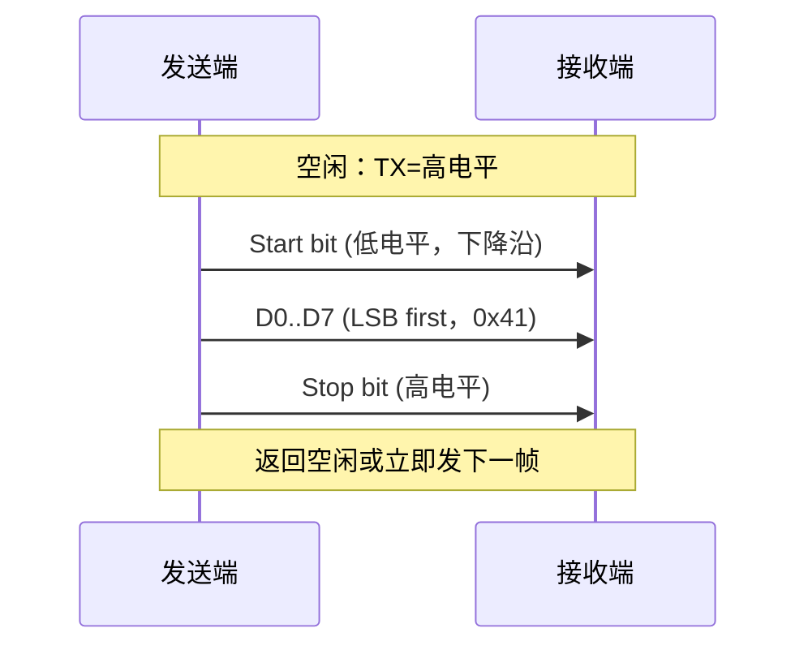

# UART是什么——异步串行通信与帧格式

<span class="badge-b">[B]</span> <span class="badge-i">[I]</span> <span class="badge-e">[E]</span> <span class="badge-m">[M]</span>

<span class="red">UART（Universal Asynchronous Receiver/Transmitter）是嵌入式世界最基础的通信接口。</span><br>
它用两根线完成全双工点对点通信，无需共享时钟，依靠双方预先约定的"拍发速度"来同步。<br>
理解 UART 的帧格式，是读懂调试串口、GPS 模块、蓝牙 HCI 等一切异步通信的钥匙。

---

## 核心定义与价值

<span class="red">UART 的本质定义：异步、全双工、点对点的串行比特流传输协议。</span>

| 属性 | 值 | 含义 |
|------|-----|------|
| 同步方式 | <span class="green">异步</span> | 无时钟线，靠波特率约定同步 |
| 双工模式 | <span class="green">全双工</span> | TX/RX 独立，可同时收发 |
| 拓扑 | <span class="green">点对点</span> | 仅两设备直连，无寻址 |
| 电平标准 | TTL/RS-232/RS-485 | 3.3V/5V → ±3V~±15V → 差分 |
| 数据位宽 | 5~9 bit | 常见 8 bit |
| 校验位 | 0~1 bit | 奇/偶/无校验 |
| 停止位 | 1~2 bit | 常见 1 bit |

<br>

<span class="blue">UART 的价值在于极简：仅需 TX、RX、GND 三根线即可通信。</span><br>
几乎所有 SoC 都内置 UART 控制器，Bootloader 输出、AT 指令、GPS NMEA 语句都依赖它。<br>
它是嵌入式工程师的"第一口呼吸"。

---

### 类比：摩尔斯电码

想象两位电报员用电键发报。<br>
他们事先约定"每分钟拍发多少组"——这就是 <span class="red">波特率</span>。<br>
发报员在每个字母开头敲一声长音（Start bit），告诉对方"我要开始了"。<br>
敲完字母后停一拍（Stop bit），让对方知道"一个字母结束"。<br>
即使两地时钟略有偏差，只要约定速度足够明确，收报员仍能在每拍的"正中间"识别出是点还是划。<br>

<span class="blue">UART 的异步通信，本质就是数字化的摩尔斯电码。</span>

---

## 核心机制原理解析

### <strong>1. UART 帧格式：比特级解剖</strong>

<span class="red">一个标准 UART 帧由以下字段顺序拼接，LSB 先传：</span>

```
| Start | D0 | D1 | D2 | D3 | D4 | D5 | D6 | D7 | [Parity] | Stop |
|  1bit | 1  | 1  | 1  | 1  | 1  | 1  | 1  | 1  | [ 1bit ] | 1bit |
```

| 字段 | 位宽 | 电平 | 作用 |
|------|------|------|------|
| <span class="green">Start bit</span> | 1 bit | 低电平 (0) | 标识帧起始，接收端据此同步 |
| <span class="green">Data bits</span> | 5~9 bit | LSB first | 实际 payload，常见 8 bit |
| <span class="green">Parity bit</span> | 0~1 bit | 依校验规则 | 奇校验：1 的总数为奇；偶校验：为偶 |
| <span class="green">Stop bit(s)</span> | 1~2 bit | 高电平 (1) | 标识帧结束，提供最小帧间隔 |

<br>

<span class="blue">空闲时 TX 保持高电平（Mark）。</span><br>
起始位的下降沿是接收端唯一可信的同步事件。<br>
此后接收端完全依赖内部波特率发生器，在预估的每 bit 中心点采样。<br>

---

### <strong>2. 典型 8N1 帧示例</strong>

<span class="green">8N1 = 8 Data + No Parity + 1 Stop bit</span>，共 10 bit 传输 1 Byte 数据。<br>

传输字符 'A'（ASCII 0x41 = 0b01000001）：

| 顺序 | bit | 说明 |
|------|-----|------|
| 1 | 0 | Start bit（下降沿触发） |
| 2 | 1 | D0（LSB，'A' 的 bit0 = 1） |
| 3 | 0 | D1 |
| 4 | 0 | D2 |
| 5 | 0 | D3 |
| 6 | 0 | D4 |
| 7 | 0 | D5 |
| 8 | 1 | D6 |
| 9 | 0 | D7（MSB，'A' 的 bit7 = 0） |
| 10 | 1 | Stop bit（高电平） |

<br>



---

### <strong>3. UART vs SPI vs I2C 对比</strong>

| 维度 | <span class="green">UART</span> | <span class="green">SPI</span> | <span class="green">I2C</span> |
|------|------|------|------|
| 时钟线 | 无（异步） | SCLK（同步） | SCL（同步） |
| 数据线 | TX + RX（2 根） | MOSI + MISO（2 根） | SDA（1 根，双向） |
| 拓扑 | 点对点 | 一主多从（CS 片选） | 多主多从（地址寻址） |
| 双工 | 全双工 | 全双工 | 半双工 |
| 速率 | 常见 115200 bps | 可达 MHz~百 MHz | 标准 100/400 kHz |
| 距离 | 短（TTL 几米） | 极短（板内） | 短（几米） |
| 硬件成本 | 极低 | 低 | 低 |
| 典型场景 | 调试串口、GPS、蓝牙 | Flash、ADC、传感器 | EEPROM、RTC、PMIC |

<br>

<span class="blue">UART 的核心差异化：没有时钟线 = 布线极简，但速率受限、仅点对点。</span><br>
当你看到 TX/RX 两根信号线时，几乎可以确定是 UART。<br>

---

## 技术教学与实战

### <strong>逻辑分析仪抓取 UART 波形</strong>

使用 Saleae Logic 或 DSView 抓取 TX 线波形：<br>

1. 设置采样率 ≥ 1 MHz（对于 115200 bps，至少 10× 过采样）<br>
2. 设置 UART 解码器：8N1、115200 bps<br>
3. 观察波形是否从"高电平→低电平起始位→8 个数据位→高电平停止位"<br>

<span class="blue">抓取波形时务必接好 GND，否则浮地电平会导致毛刺误判为起始位。</span><br>

---

### <strong>波特率反推技巧</strong>

当设备波特率未知时：<br>

- 用逻辑分析仪测量一个完整 8N1 帧的位宽 T_bit<br>
- <span class="green">Baud = 1 / T_bit</span><br>
- 常见波特率：9600、19200、38400、57600、115200、230400、921600<br>
- 反推值取最接近的标准值即可<br>

---

## 嵌入式专属实战场景

### <strong>场景：Bootloader 串口调试输出</strong>

U-Boot 启动时通过 UART0 输出：<br>

```
U-Boot 2023.04 (Oct 15 2023 - 08:32:10 +0800)

DRAM:  2 GiB
Core:  4 Cortex-A53, 1.2 GHz
MMC:   mmc@ff500000: 0
In:    serial@ff190000
Out:   serial@ff190000
Err:   serial@ff190000
```

<span class="blue">Bootloader 阶段内核尚未加载，UART 是唯一可用的"眼睛"。</span><br>
调试新板卡时，先确认 UART 引脚、电平、波特率三要素。<br>

---

## 历史演进与前沿

### <strong>UART 家族谱系</strong>

| 年代 | 标准 | 关键特征 |
|------|------|----------|
| 1960s | <span class="green">Teletype</span> | 电流环 20mA，50/75/110 baud |
| 1969 | <span class="green">RS-232</span> | EIA 标准，±3V~±15V，DB-9/DB-25 |
| 1987 | <span class="green">16550A</span> | 16 Byte FIFO，解决 8250 数据丢失 |
| 1990s | <span class="green">USB CDC-ACM</span> | 虚拟串口，免驱即插即用 |
| 2000s | <span class="green">TTL UART</span> | 3.3V/5V 电平，嵌入式标配 |
| 2010s | <span class="green">LPUART</span> | 低功耗模式，32.768 kHz 时钟通信 |

<br>

<span class="red">16550A 是 UART 控制器的行业基准。</span><br>
Linux 内核的 `8250` 驱动兼容 16550A 及后续兼容芯片（如 16750、16950）。<br>
几乎所有 x86/ARM SoC 的 UART IP 都兼容 16550A 寄存器接口。<br>

---

## 本章小结

| 主题 | 要点 |
|------|------|
| UART 定义 | 异步、全双工、点对点串行通信 |
| 帧格式 | Start(1) + Data(5-9) + Parity(0-1) + Stop(1-2) |
| 8N1 | 10 bit 传 1 Byte，效率 80%，最常见配置 |
| 与 SPI/I2C | 无时钟线 = 极简，但速率和拓扑受限 |
| 历史 | Teletype → RS-232 → 16550A → TTL UART → USB CDC |
| 调试关键 | 确认波特率、电平、TX/RX 方向 |

---

## 练习

1. 计算 115200 bps 8N1 配置下，传输 1 KB 数据需要多少毫秒？（忽略软件开销）
2. 为什么 UART 帧必须包含起始位和停止位，而 SPI 不需要？
3. 若逻辑分析仪测得一位宽约 8.68 μs，反推波特率最接近哪个标准值？
4. 对比 UART 与 I2C：各用什么机制解决"收发双方时钟不同步"问题？
