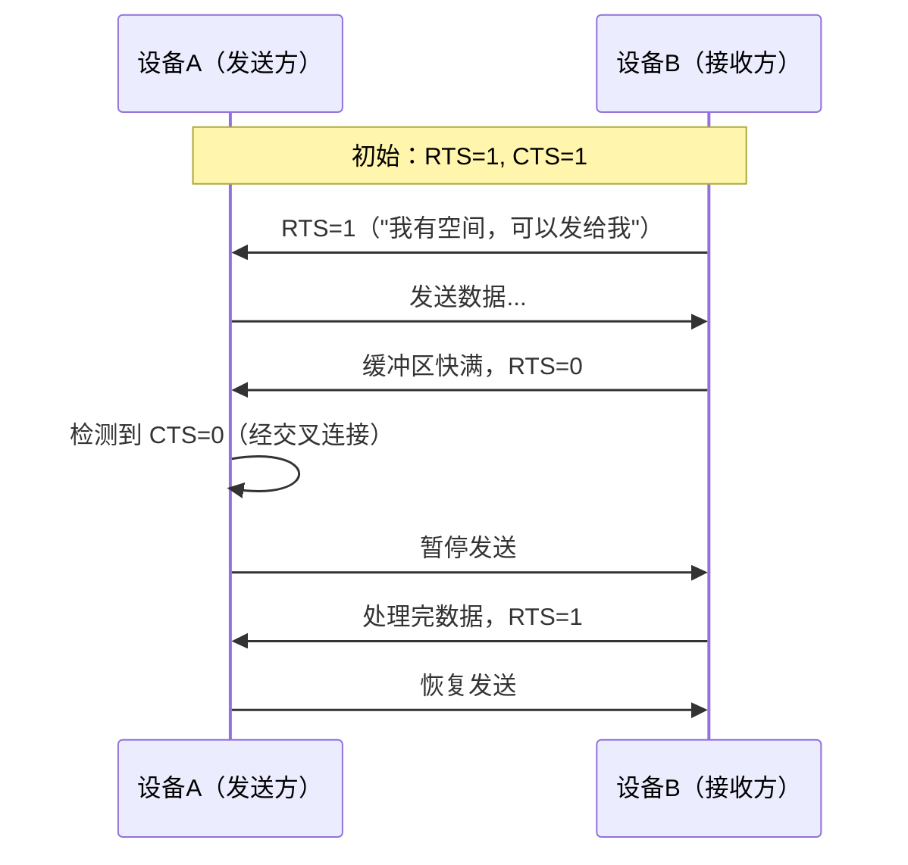

# UART怎么做——波特率计算与流控机制

<span class="badge-b">[B]</span> <span class="badge-i">[I]</span> <span class="badge-e">[E]</span> <span class="badge-m">[M]</span>

<span class="red">知道 UART 传什么之后，必须解决"传多快"和"传不过来怎么办"。</span><br>
波特率决定了每一位的时间宽度，流控决定了缓冲区满时的握手策略。<br>
这两者是 UART 从"能通"到"通得稳"的分水岭。

---

## 核心定义与价值

<span class="red">波特率（Baud Rate）是 UART 每秒传输的符号数；在二进制 UART 中，1 Baud = 1 bps。</span><br>
流控（Flow Control）是收发双方协调数据传输速率的机制，防止接收端缓冲区溢出导致丢数据。<br>

---

## 核心机制原理解析

### <strong>1. 波特率计算：以 16550 为例</strong>

<span class="red">16550A UART 使用分频器（Divisor Latch）从系统时钟产生波特率。</span>

公式：

```
Baud = f_clk / (16 × (DIV + 1))
```

| 符号 | 含义 | 典型值 |
|------|------|--------|
| <span class="green">f_clk</span> | UART 输入时钟 | 1.8432 MHz（经典晶振） |
| <span class="green">16</span> | 过采样系数 | 固定，见下一章详解 |
| <span class="green">DIV</span> | 分频值，16 bit | 写入 DLL（低 8）+ DLM（高 8） |

<br>

示例：f_clk = 1.8432 MHz，目标 Baud = 115200

```
DIV = (1.8432 × 10^6) / (16 × 115200) - 1 = 1
```

<span class="blue">1.8432 MHz 是 UART 的"魔法晶振频率"，因为它能被常见波特率整除得到整数 DIV。</span><br>
现代 SoC 通常用 APB 总线时钟（如 24 MHz、48 MHz），DIV 可能不是整数，产生小数误差。<br>

---

### <strong>2. 波特率误差容忍度</strong>

<span class="red">UART 异步通信允许收发双方波特率存在偏差，但必须在每帧 10 bit 内累积误差不超过 ±2%。</span>

误差分析（每 bit 允许偏移）：

```
每 bit 最大偏移 = 采样窗口宽度 / 2 ≈ 1/16 bit 周期 = 6.25%
```

但误差会累积：第 N 个 bit 的采样点偏移 = N × 误差率。<br>
以 10 bit 帧（8N1）计算：<br>

| 波特率误差 | 第 10 bit 累积偏移 | 结论 |
|------------|-------------------|------|
| ±1% | ±10% | <span class="green">安全</span> |
| ±2% | ±20% | <span class="green">临界可用</span> |
| ±3% | ±30% | <span class="blue">大概率乱码</span> |

<br>

<span class="blue">实际工程中，±2% 是经验红线；跨平台通信时建议双方误差 ≤ 1.5%。</span><br>

---

### <strong>3. 硬件流控：RTS/CTS</strong>

<span class="red">硬件流控用额外的握手线实时通知"我能收"或"我满了"。</span>

| 信号 | 方向 | 含义 |
|------|------|------|
| <span class="green">RTS</span>（Request To Send） | DTE → DCE | 请求发送（实际是"我能接收"） |
| <span class="green">CTS</span>（Clear To Send） | DCE → DTE | 允许发送（实际是"对方能接收"） |

<br>

握手时序：



<br>

<span class="blue">RS-232 中 RTS/CTS 电平是反直觉的：逻辑 1 = 负电压（-3V~-15V），表示"有效"。</span><br>
TTL UART 中则直接：高电平 = 有效。<br>

---

### <strong>4. 软件流控：XON/XOFF</strong>

<span class="red">当没有额外硬件线时，用特殊字符嵌入数据流实现流控。</span>

| 字符 | ASCII | 十六进制 | 作用 |
|------|-------|----------|------|
| <span class="green">XON</span> | DC1 | 0x11 | "恢复发送" |
| <span class="green">XOFF</span> | DC3 | 0x13 | "暂停发送" |

<br>

<span class="blue">软件流控的致命缺陷：不能传输二进制数据。</span><br>
若 payload 中恰好包含 0x13，接收端会误判为 XOFF 暂停流。<br>
因此二进制协议（如蓝牙 HCI、Modbus RTU）<span class="blue">严禁使用 XON/XOFF</span>。<br>

---

### <strong>5. FIFO 缓冲与中断阈值</strong>

<span class="red">16550A 引入 16 Byte 发送/接收 FIFO，解决 8250 每 Byte 中断一次的高 CPU 开销问题。</span>

| FIFO 触发级别 | 接收 FIFO 满度 | 中断频率变化 |
|---------------|----------------|--------------|
| 1 Byte | 每收到 1 Byte | 最高，8250 兼容 |
| 4 Byte | 满 4 Byte | 降至 1/4 |
| 8 Byte | 满 8 Byte | 降至 1/8 |
| 14 Byte | 满 14 Byte | 最低，但延迟增大 |

<br>

Linux 内核通过 `uart_config` 中的 `fifosize` 字段暴露 FIFO 深度：<br>

```c
struct uart_16550A_port {
    unsigned int fifosize;    // 通常为 16
    unsigned char lcr;        // Line Control Register
    unsigned char mcr;        // Modem Control Register
    unsigned char fcr;        // FIFO Control Register
    // ...
};
```

<span class="blue">FIFO 过深会导致接收端响应延迟；过浅则中断频繁。</span><br>
高速场景（> 460800 bps）通常用 DMA 替代中断驱动 FIFO。<br>

---

## 技术教学与实战

### <strong>设备树 UART 配置示例</strong>

```dts
serial@ff190000 {
    compatible = "ns16550a";
    reg = <0xff190000 0x100>;
    clock-frequency = <24000000>;
    interrupts = <GIC_SPI 24 IRQ_TYPE_LEVEL_HIGH>;
    status = "okay";
};
```

<span class="green">clock-frequency</span> 决定 DIV 计算基数。<br>
若设备树配置值与实际晶振不符，波特率将按比例偏差。<br>

---

### <strong>stty 命令完整输出解读</strong>

```bash
$ stty -F /dev/ttyS0
speed 115200 baud; line = 0;
min = 1; time = 0;
-brkint -imaxbel
```

| 字段 | 含义 |
|------|------|
| <span class="green">speed 115200 baud</span> | 当前波特率 |
| <span class="green">line = 0</span> | N_TTY line discipline |
| <span class="green">min = 1; time = 0</span> | 阻塞读至少 1 字符 |
| <span class="green">-brkint</span> | Break 不产生 SIGINT |

---

## 嵌入式专属实战场景

### <strong>场景：GPS 模块波特率不匹配排查</strong>

现象：GPS 输出乱码或全是问号。<br>

排查步骤：<br>

1. `stty -F /dev/ttyUSB0` 查看当前波特率<br>
2. GPS 默认常见波特率：9600 或 115200<br>
3. 用 `screen /dev/ttyUSB0 9600` 逐一尝试<br>
4. 确认后更新设备树或 udev 规则固化配置<br>

<span class="blue">GPS 模块的 NMEA 语句以 '$' 开头、CRLF 结尾，是识别波特率是否正确的视觉锚点。</span><br>

---

## 历史演进与前沿

| 年代 | 进展 | 影响 |
|------|------|------|
| 1970s | 8250 UART | 无 FIFO，每字符中断，CPU 开销大 |
| 1987 | 16550A | 16 Byte FIFO，中断频率降 16× |
| 1995 | 16750 | 64 Byte FIFO + 自动流控 |
| 2000s | SoC 内置 UART | APB 总线挂载，省去独立芯片 |
| 2015+ | DMA UART | 大数据块由 DMA 搬运，零拷贝 |

<span class="purple">扩展阅读：Linux `drivers/tty/serial/8250/` 源码，尤其是 `8250_port.c` 中的 FIFO 配置逻辑。</span><br>

---

## 本章小结

| 主题 | 要点 |
|------|------|
| 波特率公式 | Baud = f_clk / (16 × (DIV + 1)) |
| 误差红线 | ±2%，建议 ±1.5% |
| 硬件流控 | RTS/CTS，实时但需额外 2 线 |
| 软件流控 | XON/XOFF，省线但禁传二进制 |
| FIFO 深度 | 16550A = 16 Byte，可配触发阈值 |
| 调试关键 | stty 查看配置，逻辑分析仪验证波形 |

---

## 练习

1. APB 时钟 48 MHz，目标波特率 115200，计算 DIV 值并评估误差。
2. 若收发双方波特率分别为 115200 和 115340，能否稳定通信？计算累积误差。
3. 硬件流控与软件流控各适用于什么场景？各有什么禁忌？
4. 解释为什么 1.8432 MHz 被称为 UART 的"魔法晶振"。
5. 在高波特率（921600 bps）下，FIFO 触发级别应调高还是调低？为什么？
