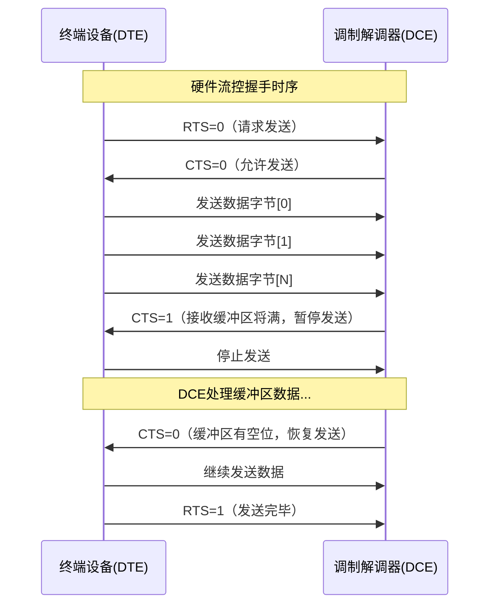

# UART波特率与流控 [B]

> **本章学习目标**：
> - 掌握<span class="red">波特率误差</span>的计算方法及其对通信可靠性的影响阈值
> - 理解<span class="red">RTS/CTS硬件流控</span>的电气握手时序与驱动配置
> - 了解<span class="red">XON/XOFF软件流控</span>的字符注入机制与适用局限

---

## 波特率误差计算与容忍阈值

---

### <strong>波特率的物理定义与分频原理</strong>

<span class="red">波特率（Baud Rate）</span>定义为单位时间内传输的码元数，
<br>
UART中1码元=1bit，故波特率等价于比特率（bps）。
<br>

<span class="blue">UART波特率的本质是“对基准时钟的分频”，
<br>
分频无法做到精确匹配，误差不可避免。
<br>
误差控制在±2%以内是工业通行的可靠通信标准。</span><br>

**常用波特率与分频误差计算表（以16MHz基准时钟为例）：**

| 目标波特率 | 理论分频值 | 实际整数分频 | 实际波特率 | 误差率 | 是否合格 |
| --- | --- | --- | --- | --- | --- |
| 9600 | 1666.67 | 1667 | 9598 | -0.02% | ✓ |
| 19200 | 833.33 | 833 | 19223 | +0.12% | ✓ |
| 38400 | 416.67 | 417 | 38369 | -0.08% | ✓ |
| 57600 | 277.78 | 278 | 57554 | -0.08% | ✓ |
| 115200 | 138.89 | 139 | 115108 | -0.08% | ✓ |
| 230400 | 69.44 | 69 | 231884 | +0.64% | ✓ |
| 460800 | 34.72 | 35 | 457143 | -0.80% | ✓ |
| 921600 | 17.36 | 17 | 941176 | +2.12% | ✗ |

<span class="orange"><strong>1. 波特率误差公式</strong></span><br>
误差率 = |实际波特率 - 目标波特率| / 目标波特率 × 100%。
<br>
对于16MHz时钟，分频寄存器写入N时：
<br>
实际波特率 = 系统时钟 / (16 × N)。
<br>

<span class="orange"><strong>2. 累积误差的临界点</strong></span><br>
单次传输10bit（1起始+8数据+1停止）时，
<br>
每bit ±2%的累积最坏情况下，
<br>
第10bit的采样点偏移可达 ±20% bit周期。
<br>
若偏移超过50% bit周期，采样将落入相邻bit区间导致误判。
<br>

<span class="orange"><strong>3. 高精度波特率的实现策略</strong></span><br>
* 使用波特率友好的系统时钟（如18.432MHz可被常见波特率整除）
<br>
* 启用小数分频器（如STM32的USART_BRR小数位）
<br>
* 选择自适应波特率检测（Linux `setserial` 的auto_irq）
<br>

---

### <strong>Linux设备树波特率配置</strong>

```c
// 设备树节点：UART波特率参数
// 文件：arch/arm/boot/dts/myboard.dts

&uart0 {
    compatible = "ns16550a";
    reg = <0x10000000 0x100>;
    clock-frequency = <18432000>;   /* 18.432MHz = 完美波特率时钟 */
    current-speed = <115200>;
    status = "okay";
};
```

<span class="blue">18.432MHz是UART的经典基准频率，
<br>
可被9600、19200、38400、57600、115230等波特率精确整除，误差为0。
<br>
这是工业通信板卡选用该晶振频率的根本原因。</span><br>

```bash
# 查看当前UART波特率与分频
$ stty -F /dev/ttyS0
speed 115200 baud; line = 0;

# 计算实际分频值（基于系统时钟）
$ cat /sys/kernel/debug/clk/clk_summary | grep uart
```

---

## 硬件流控RTS/CTS

---

### <strong>RTS/CTS的电气握手原理</strong>

<span class="red">RTS/CTS（Request To Send / Clear To Send）</span>是UART的硬件流控机制，
<br>
通过额外的两根信号线实现收发双方的速率匹配。
<br>

<span class="blue">RTS/CTS的本质：接收方通过CTS通知发送方"我可以接收"，
<br>
发送方在RTS有效时才开始发送数据。
<br>
这是跨时钟域数据流控的经典握手机制。</span><br>

**RTS/CTS引脚定义与方向：**

| 信号 | 全称 | 方向（DTE视角） | 有效电平 | 功能 |
| --- | --- | --- | --- | --- |
| RTS | Request To Send | 输出 | 低有效 | DTE请求发送数据 |
| CTS | Clear To Send | 输入 | 低有效 | DCE允许DTE发送 |
| DTR | Data Terminal Ready | 输出 | 低有效 | DTE已就绪 |
| DSR | Data Set Ready | 输入 | 低有效 | DCE已就绪 |



<span class="orange"><strong>1. RTS信号的产生逻辑</strong></span><br>
DTE的RTS由本地接收缓冲区余量决定。
<br>
当接收FIFO空闲空间 > 阈值（如64字节）时，RTS=0（有效）。
<br>
当接收FIFO空闲空间 < 阈值时，RTS=1（无效）。
<br>

<span class="orange"><strong>2. CTS信号的响应延迟</strong></span><br>
CTS从低变高（请求暂停）到发送方实际停止，存在传播延迟。
<br>
典型UART FIFO深度为16字节，
<br>
115200bps下16字节传输时间约1.4ms，
<br>
若CTS延迟 > 1.4ms，FIFO可能溢出。
<br>

---

### <strong>Linux串口硬件流控配置</strong>

```bash
# 启用RTS/CTS硬件流控
$ stty -F /dev/ttyS0 crtscts

# 验证当前流控状态
$ stty -F /dev/ttyS0 -a | grep crtscts
speed 115200 baud; crtscts

# 编程方式启用（termios）
```

```c
// 文件：uart_hwflow.c
// 功能：启用RTS/CTS硬件流控
#include <termios.h>
#include <fcntl.h>

int uart_enable_hwflow(int fd)
{
    struct termios tty;
    tcgetattr(fd, &tty);
    
    /* 启用CRTSCTS硬件流控 */
    tty.c_cflag |= CRTSCTS;
    
    /* 同时保证CLOCAL和CREAD */
    tty.c_cflag |= CLOCAL | CREAD;
    
    tcsetattr(fd, TCSANOW, &tty);
    return 0;
}
```

<span class="blue">硬件流控的适用边界：仅当收发双方物理连接RTS/CTS线时有效，
<br>
三线制UART（TX/RX/GND）无法使用硬件流控，必须退至软件流控或应用层协商。</span><br>

---

## 软件流控XON/XOFF

---

### <strong>XON/XOFF的字符级流控机制</strong>

<span class="red">XON/XOFF</span>是无需额外引脚的软件流控方案，
<br>
通过发送特殊控制字符实现暂停/恢复通知。
<br>

**XON/XOFF控制字符定义：**

| 字符 | ASCII码 | 十六进制 | 功能 | 发送时机 |
| --- | --- | --- | --- | --- |
| XON | DC1 | 0x11 | 恢复发送 | 接收缓冲区有足够空间 |
| XOFF | DC3 | 0x13 | 暂停发送 | 接收缓冲区即将溢出 |

<span class="orange"><strong>1. XOFF触发阈值</strong></span><br>
当接收FIFO占用率 > 高水位（典型75%）时，发送XOFF。
<br>
发送方收到XOFF后必须立即停止发送（通常在1~2字节内）。
<br>

<span class="orange"><strong>2. XON恢复阈值</strong></span><br>
当接收FIFO占用率 < 低水位（典型25%）时，发送XON。
<br>
发送方收到XON后恢复数据传输。
<br>

<span class="orange"><strong>3. 透明传输冲突</strong></span><br>
若用户数据本身包含0x11或0x13，
<br>
会被误识别为流控字符导致传输中断。
<br>
解决方式：二进制数据传输禁用XON/XOFF，
<br>
或采用SLIP/PPP等帧封装协议转义控制字符。
<br>

---

### <strong>软件流控的Linux配置与局限</strong>

```bash
# 启用XON/XOFF软件流控
$ stty -F /dev/ttyS0 ixon ixoff

# 禁用（默认状态）
$ stty -F /dev/ttyS0 -ixon -ixoff
```

```c
// 文件：uart_swflow.c
// 功能：termios配置软件流控

int uart_enable_swflow(int fd)
{
    struct termios tty;
    tcgetattr(fd, &tty);
    
    /* 启用输入/输出软件流控 */
    tty.c_iflag |= IXON | IXOFF;
    
    /* 设置XON/XOFF字符（通常用默认值DC1/DC3） */
    tty.c_cc[VSTART] = 0x11;    /* XON */
    tty.c_cc[VSTOP]  = 0x13;    /* XOFF */
    
    tcsetattr(fd, TCSANOW, &tty);
    return 0;
}
```

**硬件流控 vs 软件流控对比表：**

| 对比维度 | 硬件流控RTS/CTS | 软件流控XON/XOFF |
| --- | --- | --- |
| 额外引脚 | 需RTS/CTS线 | 无需 |
| 响应速度 | 快（电平变化，μs级） | 慢（需接收+解析字符，ms级） |
| 二进制兼容 | 完全兼容 | 0x11/0x13需转义 |
| 传输距离 | 受RS-232电平限制（~15m） | 同受距离限制 |
| 全双工支持 | 是 | 是（但单向控制） |
| 典型应用 | 工业串口、调制解调器 | 终端仿真、低速文本传输 |

---

### <strong>历史演进：从机械电报到UART流控</strong>

<span class="red">UART流控机制</span>的起源可追溯至19世纪的电报系统：
<br>

| 年代 | 技术 | 流控方式 | 关键特征 |
| --- | --- | --- | --- |
| 1840s | 机械电报 | 人工拍发间隔 | 操作员目视对方接收速度 |
| 1960s | 电传打字机 | XON/XOFF | 电子缓冲区+DC1/DC3控制 |
| 1970s | RS-232标准 | RTS/CTS/DTR/DSR | 四线全握手 |
| 1990s | 现代UART | 硬件/软件/无流控 | 由应用场景决定 |
| 2010s | USB CDC-ACM | 虚拟流控 | 通过USB协议内嵌 |

<span class="blue">演进本质：流控从"人的判断"到"电平的自动握手"，
<br>
最终到"协议层的流量整形"，
<br>
核心目标始终是防止接收端缓冲区溢出导致数据丢失。</span><br>

---

## 本章小结

| 概念 | 一句话总结 |
| --- | --- |
| 波特率误差 | 系统时钟分频的舍入误差，±2%是可靠通信红线 |
| 18.432MHz | UART完美基准时钟，可被标准波特率精确整除 |
| RTS | DTE输出请求发送，低有效 |
| CTS | DCE输入允许发送，低有效，缓冲区将满时拉高 |
| XOFF | 0x13（DC3），接收方请求发送方暂停 |
| XON | 0x11（DC1），接收方通知发送方恢复 |
| 透明传输 | 二进制数据中若含0x11/0x13，禁用XON/XOFF |

---

## 练习

1. 某MCU系统时钟为12MHz，目标波特率为115200。请计算理论分频值、实际整数分频值和误差率，并判断是否满足可靠通信要求。
2. 在RTS/CTS硬件流控中，接收方FIFO深度为64字节，波特率921600bps。请计算从CTS拉高到发送方实际停止的最大安全传播延迟（假设发送方在收到CTS后最多再发2字节）。
3. 为什么二进制数据传输场景（如固件烧录）不能使用XON/XOFF流控？若强制启用会出现什么现象？
