# UART为什么不需要时钟——异步采样与过采样原理

<span class="badge-b">[B]</span> <span class="badge-i">[I]</span> <span class="badge-e">[E]</span> <span class="badge-m">[M]</span>

<span class="red">UART 没有时钟线，却能可靠传输——这不是魔法，是过采样与状态机的精密配合。</span><br>
理解"为什么不需要时钟"，是理解异步通信本质的分水岭。<br>
这一章从电子层面揭示：一根 TX 线如何承载精确的比特同步。

---

## 核心定义与价值

<span class="red">过采样（Oversampling）是接收端以远高于波特率的频率采样输入信号，在预估的 bit 中心点做判决。</span><br>
UART 通常采用 <span class="green">16× 过采样</span>：每位周期被切成 16 份，在第 8 份（中间点）采样，最大化远离边沿抖动。<br>

---

## 核心机制原理解析

```mermaid
gantt
    title 16× 过采样采样点示意
    dateFormat X
    axisFormat %s
    section Start bit
    下降沿检测        :a1, 0, 1s
    采样点 8          :crit, a2, 7, 1s
    section Data bit
    采样点 8 (D0)     :crit, b1, 15, 1s
    采样点 8 (D1)     :crit, b2, 23, 1s
    采样点 8 (D2)     :crit, b3, 31, 1s
```

### <strong>1. 16× 过采样原理</strong>

假设波特率 = 115200 bps，则 bit 周期 T_bit = 8.68 μs。<br>
16× 过采样时钟 = 16 × 115200 = 1.8432 MHz，采样周期 T_sample = 0.543 μs。<br>



<br>

<span class="blue">采样点选在每位正中间，距离两侧边沿各 8 个采样周期 = 最大抗抖动裕量。</span><br>
若起始位检测存在 ±1 采样周期误差，后续每位采样点偏移 = ±T_sample = ±0.543 μs。<br>
每 bit 允许偏移比例 = 0.543 / 8.68 = 6.25%，与上一章 ±2% 全局约束兼容。<br>

---

### <strong>2. UART 接收器状态机</strong>

<span class="red">接收器用有限状态机（FSM）管理整个帧解析流程。</span>

```
IDLE ──(检测下降沿)──> START_VERIFY ──(确认低电平)──> DATA[0]
  ↑                                                              |
  └────── STOP ──(验证高电平)─── PARITY ──(校验) ── DATA[7] <──┘
```

| 状态 | 动作 | 退出条件 |
|------|------|----------|
| <span class="green">IDLE</span> | 等待高电平 | 检测到下降沿 |
| <span class="green">START_VERIFY</span> | 等待半个 bit，确认仍为低 | 确认成功 → 进入 DATA[0] |
| <span class="green">DATA[i]</span> | 等待 1 bit，在第 8 采样点锁存 | 逐位推进到 DATA[7] |
| <span class="green">PARITY</span> | 采样校验位，计算比对 | 校验失败可置 Frame Error |
| <span class="green">STOP</span> | 采样停止位，应为高电平 | 为低则置 Frame Error，返回 IDLE |

<br>

```c
// 概念性伪代码：接收器状态机核心
enum { IDLE, START, DATA, PARITY, STOP } state = IDLE;
uint8_t bit_count = 0, rx_data = 0;

void uart_rx_tick(void) {  // 每 1/16 bit 调用一次
    switch (state) {
    case IDLE:
        if (rx_pin == 0) { state = START; sample_counter = 0; }
        break;
    case START:
        if (++sample_counter == 8) {  // 半个 bit 后确认
            if (rx_pin == 0) { state = DATA; bit_count = 0; }
            else { state = IDLE; }  // 毛刺，回到空闲
        }
        break;
    case DATA:
        if (++sample_counter == 16) {
            rx_data |= (rx_pin << bit_count);  // LSB first
            sample_counter = 0;
            if (++bit_count == 8) state = PARITY;
        }
        break;
    // ... PARITY, STOP 类似
    }
}
```

---

### <strong>3. 起始位检测：抗抖动设计</strong>

<span class="red">起始位检测不是"一见到低电平就开始"，而是需要过采样确认。</span><br>

典型实现：<br>

1. 连续检测到低电平（如 2~3 个采样周期）才认为是真实起始位<br>
2. 进入 START_VERIFY 后，再等 8 个采样周期（半个 bit）<br>
3. 若此时仍为低电平 → 确认是起始位；若变高 → 认为是噪声毛刺，回 IDLE<br>

<span class="blue">这个"二次确认"机制滤除了大多数亚稳态和毛刺干扰。</span><br>

---

### <strong>4. 波特率误差累积分析</strong>

以 16× 过采样、8N1 帧、±2% 波特率误差为例：<br>

| bit 序号 | 理想采样点 | 实际采样点（+2%） | 偏移 |
|----------|-----------|-------------------|------|
| Start | 8 | 8.16 | +0.16 T_sample |
| D0 | 24 | 24.48 | +0.48 T_sample |
| D1 | 40 | 40.80 | +0.80 T_sample |
| ... | ... | ... | ... |
| D7 | 136 | 138.72 | +2.72 T_sample |
| Stop | 152 | 155.04 | +3.04 T_sample |

<br>

<span class="blue">偏移 < 8 T_sample 时采样点仍在 bit 有效区间内；超过则落入下一位。</span><br>
以 +2% 误差计算，Stop bit 采样点偏移 3.04/16 = 19% bit 周期，仍在安全区。<br>
若误差达到 +4%，Stop bit 偏移 6.08/16 = 38%，已接近临界。<br>

---

### <strong>5. 与 SPI 同步时钟的根本差异</strong>

| 维度 | <span class="green">UART（异步）</span> | <span class="green">SPI（同步）</span> |
|------|--------------------------------------|--------------------------------------|
| 同步源 | 收发双方各自时钟 | 主设备 SCLK 统一驱动 |
| 精度要求 | ±2% 相对误差 | 无累积误差（边沿触发） |
| 布线 | TX+RX+GND，极简 | SCLK+MOSI+MISO+CS，较复杂 |
| 速率上限 | 过采样限制，通常 < 4 Mbps | 仅受 PCB 走线限制，可达百 MHz |
| 时钟恢复 | 每帧起始位重新同步 | 每个 SCLK 边沿即时同步 |

<br>

<span class="red">SPI 用物理时钟线消除全部不确定性；UART 用状态机 + 过采样在每帧开头重新对齐。</span><br>
UART 的代价是速率受限，收益是少一根线、多一种拓扑自由。<br>

---

## 技术教学与实战

### <strong>逻辑分析仪验证过采样</strong>

抓取 115200 bps TX 波形，设置解码器为 8N1：<br>

1. 测量起始位宽度：应为 8.68 μs ± 1%<br>
2. 检查每位电平是否在中间稳定，边沿是否有振铃<br>
3. 若边沿上升/下降时间 > 0.5 μs，检查线缆阻抗和终端电阻<br>

---

### <strong>波特率误差测量方法</strong>

```bash
# 发送固定模式 0x55 = 0b01010101（每位翻转）
$ echo -n -e '\x55\x55\x55\x55' > /dev/ttyS0

# 逻辑分析仪测量 10 个完整周期的总时间
# 理论值：10 × 10 bit × 8.68 μs = 868 μs
# 实测偏差 = (实测 - 868) / 868 × 100%
```

---

## 嵌入式专属实战场景

### <strong>场景：蓝牙 HCI UART 速率不匹配</strong>

蓝牙控制器通过 UART 与主机通信（HCI 协议）。<br>
控制器上电默认 115200，但固件加载后可切到 921600 或 3000000。<br>

问题：主机波特率切换后，控制器未及时响应 → 通信中断。<br>

解决：严格遵循 HCI Vendor 命令的应答时序，切换后等待 > 100 ms 再发下一帧。<br>

<span class="blue">高速模式下过采样比下降（如 4× 或 8×），抗抖动裕量减小，PCB 走线质量更关键。</span><br>

---

## 历史演进与前沿

| 年代 | 进展 | 技术要点 |
|------|------|----------|
| 1970s | 8250 无过采样 | 简单边沿检测，易受噪声干扰 |
| 1987 | 16550A 16× | 标准过采样，业界沿用至今 |
| 2000s | 可配置过采样比 | 部分芯片支持 4×/8×/16× 切换 |
| 2015+ | 数字时钟恢复 | 高级 UART IP 支持自适应波特率检测 |

<span class="purple">扩展阅读：STM32 USART 的 `OVER8` 位（CR1 寄存器 bit15），1=8× 过采样，0=16×。</span><br>

---

## 本章小结

| 主题 | 要点 |
|------|------|
| 过采样 | 16× 标准，采样点选 bit 中心 |
| 状态机 | IDLE → START → DATA → PARITY → STOP |
| 起始位确认 | 下降沿 + 半 bit 后二次确认，抗毛刺 |
| 误差累积 | 每 bit 偏移 = N × 误差率，10 bit 帧 ±2% 为红线 |
| 与 SPI 差异 | UART 无时钟线 = 省线，但速率受限；SPI 有 SCLK = 精确但布线复杂 |
| 前沿 | 自适应波特率检测、可配置过采样比 |

---

## 练习

1. 16× 过采样时，采样点距最近边沿有几个采样周期？这对抗噪声有什么意义？
2. 若接收端波特率比发送端慢 3%，10 bit 帧的 Stop bit 采样点偏移多少？是否安全？
3. 为什么 UART 每帧都需要起始位重新同步，而不是像 SPI 那样持续同步？
4. 解释 START_VERIFY 状态中"再等 8 个采样周期"的设计意图。
5. 现代芯片支持 4× 过采样的利弊各是什么？
