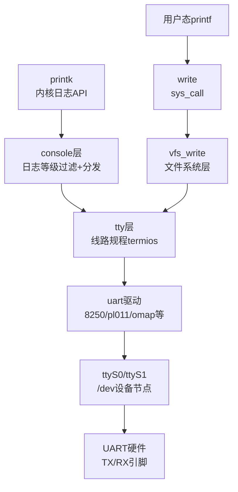
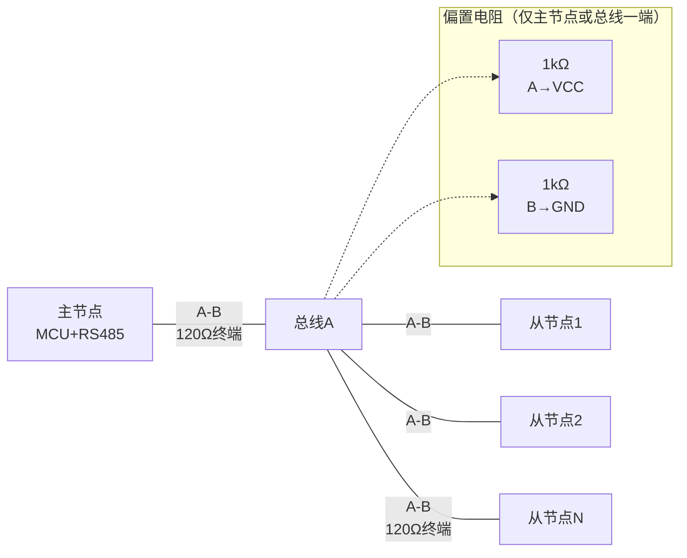

# UART调试与Linux终端 [B→I]

> **本章学习目标**：
> - 理解<span class="red">printk/console/ttyS</span>在Linux内核中的层次映射关系
> - 掌握Linux<span class="red">串口终端</span>的termios配置与getty自启动配置
> - 实现<span class="red">RS-485半双工</span>的方向控制与Linux内核驱动适配

---

## printk/console/ttyS的层次映射

---

### <strong>Linux内核日志输出的三级映射</strong>

<span class="red">Linux串口输出体系</span>由三层抽象组成：
<br>
<span class="green">printk</span> → <span class="green">console</span> → <span class="green">ttyS</span>。
<br>

<span class="blue">printk是内核日志API，console是日志分发层，ttyS是物理UART字符设备。
<br>
三者构成"应用程序→内核子系统→硬件外设"的标准Linux分层模型。</span><br>



**printk → console → ttyS 映射关系表：**

| 层级 | 功能实体 | 核心职责 | 配置方式 |
| --- | --- | --- | --- |
| 应用层 | `printf` / `printk` | 格式化输出 | 代码中调用 |
| 内核层 | `console` 子系统 | 日志等级过滤、多consoles分发 | `console=ttyS0,115200` |
| 核心层 | `tty` 核心 | 线路规程（termios）、缓冲管理 | `struct termios` |
| 驱动层 | `uart` 驱动 | UART寄存器操作、中断/DMA | 设备树/平台数据 |
| 设备层 | `/dev/ttyS0` | 用户态访问接口 | `mknod` / `udev` |
| 硬件层 | UART IP核 | TX/RX移位寄存器、波特率发生器 | 硬件设计固定 |

<span class="orange"><strong>1. printk的日志等级</strong></span><br>
<span class="green">printk</span>支持8个日志等级（0~7），数值越低越紧急。
<br>
`console_loglevel` 决定哪些等级的消息被输出到控制台。
<br>

```bash
# 查看/修改当前控制台日志级别
$ cat /proc/sys/kernel/printk
4       4       1       7
# 含义：当前级别/默认级别/最小级别/引导级别

# 临时提高日志级别（输出所有消息）
$ echo 8 > /proc/sys/kernel/printk
```

<span class="orange"><strong>2. console参数与早期输出</strong></span><br>
内核启动参数 `console=ttyS0,115200n8` 指定：
<br>
* 输出设备：`ttyS0`
<br>
* 波特率：115200
<br>
* 校验：无（n）
<br>
* 数据位：8
<br>
这是嵌入式Linux开发中最关键的启动参数之一。
<br>

---

### <strong>Linux设备树串口节点配置</strong>

```dts
// 文件：arch/arm/boot/dts/myboard.dts
// 功能：UART设备树节点与控制台映射

/ {
    chosen {
        stdout-path = "serial0:115200n8";   /* 指定默认控制台 */
    };
};

/* UART0：调试串口 */
&uart0 {
    compatible = "ns16550a";
    reg = <0x10000000 0x100>;
    interrupts = <GIC_SPI 24 IRQ_TYPE_LEVEL_HIGH>;
    clock-frequency = <18432000>;
    
    /* 当前速度，由驱动在初始化时解析 */
    current-speed = <115200>;
    
    /* 可选：指定为boot console */
    linux,stdout-path = &uart0;
    
    status = "okay";
};

/* UART1：RS-485通信 */
&uart1 {
    compatible = "ns16550a";
    reg = <0x10001000 0x100>;
    interrupts = <GIC_SPI 25 IRQ_TYPE_LEVEL_HIGH>;
    clock-frequency = <18432000>;
    current-speed = <9600>;
    
    /* RS-485方向控制GPIO */
    rs485-rts-delay = <0 0>;    /* 收发切换延迟：发送前0ns，发送后0ns */
    rts-gpios = <&gpio0 15 GPIO_ACTIVE_HIGH>;  /* GPIO0_15控制方向 */
    
    status = "okay";
};
```

<span class="blue">设备树关键点：<br>
`chosen/stdout-path` 决定内核早期printk输出目标，<br>
`clock-frequency` 必须与PCB实际晶振一致，否则波特率计算错误。</span><br>

---

## 串口终端配置与getty自启动

---

### <strong>termios配置详解</strong>

<span class="red">termios</span>是POSIX标准定义的终端I/O接口，
<br>
控制串口的波特率、数据格式、流控、规范模式等全部参数。
<br>

```c
// 文件：uart_termios_config.c
// 功能：完整termios配置示例
#include <termios.h>
#include <fcntl.h>
#include <unistd.h>

int uart_configure(int fd, int baudrate)
{
    struct termios tty;
    
    /* 获取当前配置 */
    if (tcgetattr(fd, &tty) != 0) {
        perror("tcgetattr");
        return -1;
    }
    
    /* 输入模式：原始模式，不处理特殊字符 */
    tty.c_iflag &= ~(IXON | IXOFF | IXANY | ICRNL | INLCR | IGNCR);
    
    /* 输出模式：原始模式 */
    tty.c_oflag &= ~(OPOST | ONLCR);
    
    /* 本地模式：禁用规范模式、回显、信号 */
    tty.c_lflag &= ~(ICANON | ECHO | ECHOE | ISIG);
    
    /* 控制模式：8N1，使能接收 */
    tty.c_cflag = CS8 | CREAD | CLOCAL;
    
    /* 波特率设置 */
    cfsetospeed(&tty, baudrate);   /* 输出波特率 */
    cfsetispeed(&tty, baudrate);   /* 输入波特率 */
    
    /* 读取超时：VMIN=0, VTIME=5 → 阻塞0.5秒或收到至少0字节 */
    tty.c_cc[VMIN]  = 0;
    tty.c_cc[VTIME] = 5;    /* 0.5秒超时 */
    
    /* 立即生效 */
    tcsetattr(fd, TCSANOW, &tty);
    return 0;
}
```

**termios标志位速查表：**

| 标志位 | 所属 | 置位含义 | 清零含义 |
| --- | --- | --- | --- |
| ICANON | c_lflag | 规范模式（行缓冲） | 原始模式（字节缓冲） |
| ECHO | c_lflag | 回显输入字符 | 不回显 |
| ISIG | c_lflag | 响应INTR/QUIT信号 | 忽略信号字符 |
| IXON/IXOFF | c_iflag | 启用XON/XOFF | 禁用 |
| CRTSCTS | c_cflag | 启用RTS/CTS | 禁用 |
| CLOCAL | c_cflag | 忽略调制解调器状态 | 检测CD信号 |
| CREAD | c_cflag | 启用接收器 | 禁用接收 |

---

### <strong>getty/login自启动配置</strong>

<span class="red">getty</span>（get a tty）负责打开串口设备、设置termios、
<br>
输出登录提示符并启动login程序。
<br>

```bash
# systemd方式：/etc/systemd/system/serial-getty@ttyS0.service
# 该服务由systemd自动生成模板

# 传统init方式：/etc/inittab（已淘汰）
# T0:23:respawn:/sbin/getty -L ttyS0 115200 vt100

# 现代systemd方式启用：
$ systemctl enable serial-getty@ttyS0.service
$ systemctl start serial-getty@ttyS0.service
```

<span class="blue">getty的工作流程：
<br>
1. 打开 /dev/ttyS0
<br>
2. 设置波特率115200 8N1
<br>
3. 输出 "login: " 提示
<br>
4. 读取用户名，启动 /bin/login
<br>
5. 验证密码后启动用户shell</span><br>

---

## RS-485半双工：方向控制与驱动适配

---

### <strong>RS-485的电气特性与半双工约束</strong>

<span class="red">RS-485</span>是工业场景最常用的差分串行总线，
<br>
支持半双工（两线）和全双工（四线）两种拓扑。
<br>

<span class="blue">RS-485与RS-232的核心差异：差分信号、多点总线、方向受控。
<br>
RS-232点对点全双工无需方向控制，RS-485半双工必须手动切换收发方向。</span><br>

**RS-485 vs RS-232 对比表：**

| 参数 | RS-232 | RS-485（半双工） |
| --- | --- | --- |
| 信号方式 | 单端（对地） | 差分（A-B） |
| 逻辑电平 | ±3V~±15V | +200mV~-200mV（差分） |
| 最大设备数 | 1发1收 | 32/128/256节点 |
| 方向控制 | 无（全双工独立线） | 需DE/RE引脚切换 |
| 传输距离 | ~15m | ~1200m |
| 拓扑 | 点对点 | 总线型 |
| 终端电阻 | 无 | 120Ω（总线两端） |

---

### <strong>RS-485方向控制代码实现</strong>

<span class="red">RS-485收发方向</span>由DE（Driver Enable）和RE（Receiver Enable）引脚控制。
<br>
半双工模式下DE和RE通常短接，由同一GPIO控制。

```mermaid
sequenceDiagram
    participant MCU as MCU/SoC
    participant GPIO as DE/RE GPIO
    participant Transceiver as RS-485收发器
    participant Bus as RS-485总线
    
    Note over MCU,Bus: 发送数据阶段
    MCU->>GPIO: DE=1, RE=0（驱动器使能，接收器禁用）
    GPIO->>Transceiver: 切换至发送模式
    MCU->>Transceiver: TX数据 → 驱动器 → 总线
    Transceiver->>Bus: 差分信号(A-B)
    
    Note over MCU,Bus: 发送完毕切换接收
    MCU->>GPIO: DE=0, RE=1（驱动器禁用，接收器使能）
    GPIO->>Transceiver: 切换至接收模式
    Bus->>Transceiver: 总线数据 → 接收器 → RX
    Transceiver->>MCU: RX数据
```

<br>



```c
// 文件：rs485_direction.c
// 功能：RS-485半双工方向控制
#include <linux/gpio.h>
#include <linux/serial.h>
#include <sys/ioctl.h>

#define RS485_DE_GPIO   15

/* 方式1：GPIO手动控制（裸机/RTOS） */
void rs485_set_tx(struct gpio_desc *de_gpio)
{
    gpiod_set_value(de_gpio, 1);    /* DE=1: 驱动器使能 */
    udelay(1);                       /* 收发器建立时间 */
}

void rs485_set_rx(struct gpio_desc *de_gpio)
{
    /* 等待最后1字节完全发送 */
    while (!uart_tx_complete());     /* 查询UART状态寄存器 */
    gpiod_set_value(de_gpio, 0);    /* DE=0: 驱动器禁用，接收器使能 */
}

/* 方式2：Linux内核RS-485模式（推荐） */
int rs485_enable_linux(int fd)
{
    struct serial_rs485 rs485conf = {0};
    
    /* 启用RS-485模式 */
    rs485conf.flags = SER_RS485_ENABLED;
    
    /* 发送前自动拉高RTS（映射到DE） */
    rs485conf.flags |= SER_RS485_RTS_ON_SEND;
    
    /* 发送完成后自动拉低RTS */
    rs485conf.flags |= SER_RS485_RTS_AFTER_SEND;
    
    /* 收发切换延迟（微秒） */
    rs485conf.delay_rts_before_send = 0;
    rs485conf.delay_rts_after_send  = 1;
    
    if (ioctl(fd, TIOCSRS485, &rs485conf) < 0) {
        perror("TIOCSRS485");
        return -1;
    }
    return 0;
}
```

<span class="blue">Linux RS-485模式的核心价值：
<br>
内核自动在发送前后切换DE/RE引脚，
<br>
用户态程序无需关心方向控制，代码与RS-232完全一致。</span><br>

---

### <strong>RS-485总线终端与偏置电阻</strong>

<span class="orange"><strong>1. 终端电阻的作用</strong></span><br>
RS-485总线两端各接120Ω终端电阻，
<br>
用于吸收差分信号在总线末端的反射，
<br>
防止驻波造成信号振铃和误判。
<br>

<span class="orange"><strong>2. 偏置电阻的必要性</strong></span><br>
当总线上所有收发器都处于接收模式时，
<br>
A/B线处于高阻态，差分电压可能因噪声浮动在阈值附近。
<br>
偏置电阻（典型1kΩ上拉A到VCC，1kΩ下拉B到GND）
<br>
确保总线空闲时差分电压 > +200mV，避免误触发接收。
<br>

**RS-485总线拓扑与电阻配置图：**



<span class="blue">关键规则：终端电阻必须且只能接在总线物理两端，
<br>
中间节点加终端电阻会导致信号衰减和驱动过载。</span><br>

---

## 本章小结

| 概念 | 一句话总结 |
| --- | --- |
| printk | 内核日志API，8级日志等级，经console分发到各终端 |
| console=ttyS0 | 内核启动参数，指定早期调试输出目标串口 |
| stdout-path | 设备树chosen节点属性，关联默认串口终端 |
| termios | POSIX终端配置结构体，控制波特率/格式/流控/模式 |
| getty | 串口登录守护进程，管理终端open/termios/login流程 |
| RS-485 DE/RE | 驱动器/接收器使能，半双工必须收发方向切换 |
| TIOCSRS485 | Linux ioctl，启用内核自动方向控制 |
| 终端电阻 | 120Ω，仅接总线物理两端，消除信号反射 |

---

## 练习

1. 某嵌入式板卡printk输出到ttyS0，但用户态printf输出到tty1（显示屏）。解释两者映射路径的差异，并给出统一输出到串口的配置方法。
2. RS-485总线有3个节点，某工程师在所有节点都接了120Ω终端电阻。请计算总线等效负载电阻，并分析对驱动器电流要求的后果。
3. 使用termios配置ttyS0为115200 8N1原始模式，读取50字节数据并设置1秒超时。若超时未收到50字节，函数应返回实际读取的字节数。
