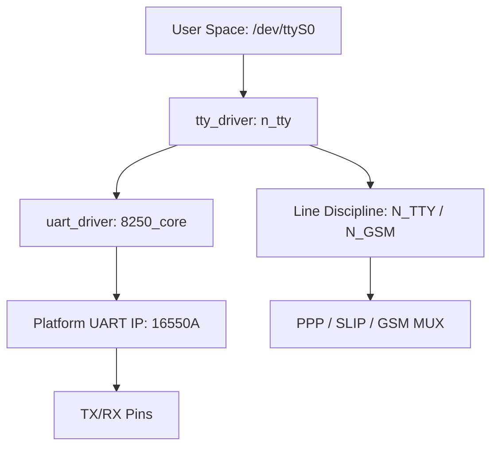

# UART怎么调——Linux终端、设备树与调试工具

<span class="badge-b">[B]</span> <span class="badge-i">[I]</span> <span class="badge-e">[E]</span> <span class="badge-m">[M]</span>

<span class="red">UART 通了是运气，调通了是本事。</span><br>
Linux 下 UART 调试涉及 TTY 子系统、设备树绑定、终端工具链和硬件排查四个层面。<br>
这一章把"怎么调"拆解成可复现的标准动作。

---

## 核心定义与价值

<span class="red">Linux TTY 子系统是分层的：uart_driver → tty_driver → line discipline → user space。</span><br>
设备树（Device Tree）描述硬件 UART 控制器的寄存器地址、中断、时钟等静态信息。<br>
调试工具链（stty、screen、minicom、逻辑分析仪）覆盖软件配置到硬件波形全链路。<br>

---

## 核心机制原理解析

### <strong>1. Linux TTY 子系统分层</strong>



<br>

| 层级 | 内核组件 | 作用 |
|------|----------|------|
| <span class="green">uart_driver</span> | `8250_core.c` | 寄存器操作、波特率配置、FIFO 管理 |
| <span class="green">tty_driver</span> | `tty_io.c` | 字符设备接口、read/write/ioctl |
| <span class="green">line discipline</span> | `n_tty.c` | 回显、行缓冲、特殊字符处理（Ctrl+C） |

<br>

<span class="blue">line discipline 是常被忽视的关键层。</span><br>
默认 `N_TTY` 把 UART 变成"终端"——有回显、有行编辑、Ctrl+C 发 SIGINT。<br>
原始模式（raw mode）绕过 line discipline，适合二进制协议传输。<br>

---

### <strong>2. 设备树绑定：serial@ff190000</strong>

```dts
serial@ff190000 {
    compatible = "ns16550a";
    reg = <0xff190000 0x100>;
    clock-frequency = <24000000>;
    interrupts = <GIC_SPI 24 IRQ_TYPE_LEVEL_HIGH>;
    status = "okay";
};
```

| 属性 | 含义 | 调试要点 |
|------|------|----------|
| <span class="green">compatible</span> | 驱动匹配键 | 必须是 `ns16550a` 或 SoC 专用字符串 |
| <span class="green">reg</span> | 寄存器基址 + 大小 | 与 SoC datasheet 核对，错一位全错 |
| <span class="green">clock-frequency</span> | UART 输入时钟 | 决定波特率精度，与晶振标称值核对 |
| <span class="green">interrupts</span> | GIC 中断号 + 触发类型 | 确认是 SPI 还是 PPI，电平还是边沿 |

<br>

<span class="blue">设备树错误是 UART 调试中最隐蔽的陷阱。</span><br>
`clock-frequency` 若写成 48 MHz 而实际是 24 MHz，波特率会翻倍，输出全乱码。<br>

---

### <strong>3. stty 完整输出解读</strong>

```bash
$ stty -F /dev/ttyS0 -a
speed 115200 baud; rows 0; columns 0; line = 0;
intr = ^C; quit = ^\\; erase = ^?; kill = ^U;
cflag = cs8 -cstopb -parenb -cread clocal -crtscts
iflag = -ignbrk -brkint -ignpar -parmrk -inpck -istrip -inlcr
        -igncr -icrnl -ixon -ixoff -iuclc -ixany -imaxbel
oflag = -opost -olcuc -ocrnl -onlcr -onocr -onlret -ofill
lflag = -isig -icanon -iexten -echo -echoe -echok -echoctl
        -echoke
```

| 字段组 | 关键项 | 含义 |
|--------|--------|------|
| <span class="green">cflag</span> | `cs8` | 8 数据位 |
| | `-parenb` | 无校验 |
| | `-cstopb` | 1 停止位（`cstopb` = 2 位） |
| | `-crtscts` | 无硬件流控 |
| | `clocal` | 忽略调制解调器状态 |
| <span class="green">iflag</span> | `-ixon -ixoff` | 无软件流控 |
| | `-icrnl` | 不将 CR 转 NL |
| <span class="green">lflag</span> | `-icanon` | 非规范模式（原始） |
| | `-echo` | 不回显 |

<br>

<span class="blue">配置原始模式的标准命令：</span><br>

```bash
stty -F /dev/ttyS0 115200 cs8 -cstopb -parenb -echo raw
```

---

### <strong>4. 终端工具链：screen / minicom / picocom</strong>

| 工具 | 启动命令 | 特点 |
|------|----------|------|
| <span class="green">screen</span> | `screen /dev/ttyUSB0 115200` | 极简，Ctrl+A K 退出 |
| <span class="green">minicom</span> | `minicom -D /dev/ttyUSB0 -b 115200` | 菜单配置，支持日志捕获 |
| <span class="green">picocom</span> | `picocom -b 115200 /dev/ttyUSB0` | 无 curses 依赖，嵌入式友好 |

<br>

minicom 配置文件 `~/.minirc.dfl` 示例：<br>

```
pu port             /dev/ttyUSB0
pu baudrate         115200
pu bits             8
pu parity           N
pu stopbits         1
pu rtscts           No
pu xonxoff          No
```

---

## 技术教学与实战

### <strong>排查矩阵：症状 → 根因 → 动作</strong>

| 症状 | 根因 | 排查动作 |
|------|------|----------|
| 全是乱码 | 波特率不匹配 | `stty` 查看，逐一尝试 9600/115200/921600 |
| 丢数据 | FIFO 溢出或 CTS 未连接 | 检查硬件流控线，降低波特率 |
| 无输出 | TX/RX 反接或电平不兼容 | 万用表测 TX 空闲高电平，确认 3.3V/5V |
| 只收不发 | 设备树 `status = "disabled"` | `dmesg | grep tty` 查看probe结果 |
| 偶发错字 | 线缆过长/阻抗不匹配 | 缩短线缆或降低波特率 |

---

### <strong>dmesg 排查 UART 设备</strong>

```bash
$ dmesg | grep -i tty
[    0.000000] console [ttyS0] enabled
[    1.234567]  ff190000.serial: ttyS0 at MMIO 0xff190000
[    1.234890]  ff190000.serial: irq = 24
```

<span class="blue">若 `dmesg` 无任何 tty 相关输出，说明设备树未匹配或驱动 probe 失败。</span><br>
加 `printk` 或 `dev_dbg` 到 `serial8250_probe()` 追踪。<br>

---

## 嵌入式专属实战场景

### <strong>场景：调试新板卡 UART 控制台</strong>

新板卡上电无输出，排查清单：<br>

1. 硬件：确认 UART 引脚与调试器 TX/RX 对应（注意：调试器 TX 接板卡 RX）<br>
2. 电平：确认同为 3.3V TTL，RS-232 ±12V 不能直接接 MCU<br>
3. 波特率：查看 Bootloader 源码或设备树默认值<br>
4. 设备树：`status = "okay"`，`reg` 地址与 SoC TRM 一致<br>
5. 内核：确认 `CONFIG_SERIAL_8250` 已编译进内核<br>
6. 逻辑分析仪：直接抓 TX 线波形，确认有数据输出<br>

---

## 历史演进与前沿

| 年代 | 工具/机制 | 演进 |
|------|-----------|------|
| 1990s | `cu` / `tip` | Unix 经典串口工具 |
| 2000s | `minicom` | Linux 终端标配 |
| 2010s | `screen` / `picocom` | 极简替代方案 |
| 2020s | `tio` | 现代 Rust 实现，自动重连 |

<span class="purple">扩展阅读：Linux `Documentation/devicetree/bindings/serial/8250.yaml` 官方绑定规范。</span><br>

---

## 本章小结

| 主题 | 要点 |
|------|------|
| TTY 分层 | uart_driver → tty_driver → line discipline |
| 设备树 | `compatible = "ns16550a"`，`clock-frequency` 必须准确 |
| stty | `cs8 -parenb -cstopb` = 8N1，`-echo raw` = 原始模式 |
| 工具 | screen 极简，minicom 功能全，picocom 嵌入式友好 |
| 排查 | 乱码→波特率，丢数据→FIFO/流控，无输出→TX/RX反接/电平 |
| 前沿 | tio 现代工具，自动重连 |

---

## 练习

1. 解释为什么调试器 TX 要接板卡 RX，而不是 TX-TX。
2. 写出配置 `/dev/ttyS0` 为 115200 8N1 原始模式的完整 stty 命令。
3. `dmesg | grep tty` 无输出，可能有哪些原因？列出排查优先级。
4. 为什么二进制协议传输时要把 line discipline 切到 raw 模式？
5. 设备树中 `clock-frequency` 写错会对 UART 通信产生什么具体影响？
