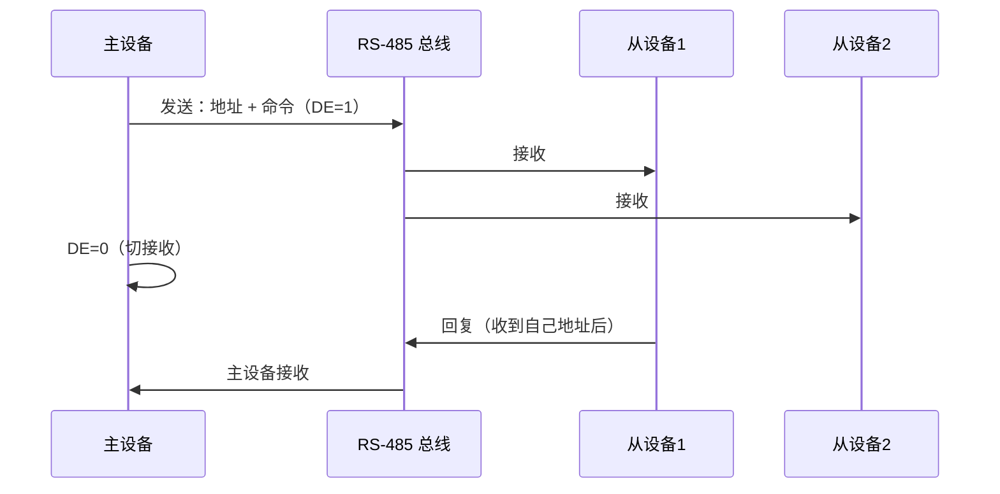

# UART往哪去——RS-485、USB CDC与前沿演进

<span class="badge-b">[B]</span> <span class="badge-i">[I]</span> <span class="badge-e">[E]</span> <span class="badge-m">[M]</span>

<span class="red">TTL UART 是起点，不是终点。</span><br>
在工业现场、长距离通信、低功耗物联网等场景中，UART 的物理形态和协议封装不断演进。<br>
RS-485、USB CDC-ACM、蓝牙 HCI、LoRa AT——它们共享 UART 的帧格式灵魂，换了一身物理层的衣裳。

---

## 核心定义与价值

<span class="red">UART 的演进逻辑：帧格式不变，物理层和协议封装按需升级。</span><br>

| 演进方向 | 技术 | 解决什么问题 |
|----------|------|-------------|
| 距离 | <span class="green">RS-485</span> | TTL 几米 → 差分 1200 m |
| 拓扑 | <span class="green">RS-485</span> | 点对点 → 总线型多节点 |
| 接口 | <span class="green">USB CDC-ACM</span> | 物理串口 → 虚拟串口 |
| 功耗 | <span class="green">LPUART</span> | 高频时钟 → 32 kHz 时钟 |
| 无线 | <span class="green">蓝牙 HCI / LoRa</span> | 有线 → 无线桥接 |

---

## 核心机制原理解析

### <strong>1. RS-485：差分总线的电气革命</strong>

<span class="red">RS-485 用差分对（A/B）替代单端信号，将共模噪声抵消，实现远距离、多节点通信。</span>

| 参数 | TTL UART | RS-485 |
|------|----------|--------|
| 信号方式 | 单端（TX/RX 各一根） | 差分（A/B 一对） |
| 驱动能力 | 点对点 | 总线型，32/128 节点 |
| 最大距离 | ~15 m @ 115200 | 1200 m @ 100 kbps |
| 最大速率 | ~1 Mbps | 10 Mbps（短距离） |
| 双工模式 | 全双工 | 半双工（1 对差分线） |
| 电平 | 3.3V/5V | -7V ~ +12V（差分） |

<br>

<span class="blue">RS-485 半双工的本质：同一对差分线分时收发。</span><br>
需要方向控制信号（DE/RE）切换收发器状态，典型芯片如 MAX485、SP3485。<br>



---

### <strong>2. USB CDC-ACM：虚拟串口</strong>

<span class="red">USB CDC-ACM（Communication Device Class - Abstract Control Model）让 USB 设备在系统中呈现为 /dev/ttyACM* 串口。</span><br>

内核路径：`drivers/usb/serial/cp210x.c`、`drivers/usb/serial/ch341.c` 等芯片驱动。<br>
应用层无感知：打开 `/dev/ttyACM0` 与 `/dev/ttyS0` 使用完全相同的 API。<br>

| 层 | 组件 |
|----|------|
| User Space | `/dev/ttyACM0` |
| TTY | `tty_driver` |
| USB Serial | `usb_serial_driver` |
| USB Core | `usbcore` |
| Host Controller | xHCI / EHCI |

<span class="blue">CDC-ACM 的优势：即插即用，无需额外驱动（Linux 内核自带）。</span><br>
劣势：依赖 USB 协议栈，实时性不如原生 UART；热插拔时设备号可能漂移。<br>

---

### <strong>3. 蓝牙 UART（HCI）与 LoRa AT</strong>

蓝牙主机控制器接口（HCI）使用 UART 传输 HCI 命令/事件/ACL 数据。<br>
典型配置：8N1、115200 或 921600，无流控或 RTS/CTS。<br>

LoRa 模块（如 SX1276 + MCU）通过 UART AT 指令配置：<br>

```
AT+BAND=868000000\r\n    # 设置频段
AT+POWER=14\r\n         # 设置发射功率
AT+SEND=Hello\r\n       # 发送数据
```

---

### <strong>4. 低功耗 UART：STM32 LPUART</strong>

<span class="red">LPUART 在 32.768 kHz 低速时钟下仍可维持 9600 bps，功耗降至 μA 级。</span><br>

| 模式 | 时钟源 | 波特率 | 典型功耗 |
|------|--------|--------|----------|
| 常规 UART | 72 MHz PCLK | 115200 | ~mA |
| LPUART | 32.768 kHz LSE | 9600 | ~μA |

<br>

<span class="blue">LPUART 的实现关键：过采样比可降至 4× 或更低，配合低功耗时钟。</span><br>
代价：抗噪声能力下降，仅适用于短距离板内通信。<br>

---

## 技术教学与实战

### <strong>Modbus RTU 帧结构（基于 RS-485）</strong>

```
| 地址(1B) | 功能码(1B) | 数据(NB) | CRC(2B) |
```

帧间隔规则：3.5 字符时间无声（即总线空闲）标识新帧开始。<br>
以 9600 bps 计算：3.5 × 11 bit / 9600 ≈ 4.0 ms。<br>

---

### <strong>RS-485 方向控制代码片段</strong>

```c
// 半双工 RS-485 方向切换（Linux GPIO 控制 DE）
static void rs485_start_tx(struct uart_port *port) {
    gpiod_set_value(port->rs485_de_gpio, 1);  // DE=高，使能发送
}

static void rs485_stop_tx(struct uart_port *port) {
    // 等待发送 FIFO 空 + shift register 空
    while (!(readl(port->membase + UART_LSR) & UART_LSR_TEMT))
        cpu_relax();
    gpiod_set_value(port->rs485_de_gpio, 0);  // DE=低，切接收
}
```

---

## 嵌入式专属实战场景

### <strong>场景：工业传感器网络（RS-485 + Modbus）</strong>

某工厂部署 20 个温湿度传感器，距离主控 300 m。<br>
选型：RS-485 总线 + Modbus RTU 协议 + 9600 bps。<br>

布线要点：<br>

- 双绞屏蔽线，A/B 成对绞合<br>
- 总线两端 120 Ω 终端电阻<br>
- 中间节点避免星型分支<br>
- 上拉/下拉电阻（如 680 Ω / 680 Ω）保证空闲时总线确定电平<br>

---

## 历史演进与前沿

| 年代 | 演进 | 标志 |
|------|------|------|
| 1969 | RS-232 | ±12V，15 m，点对点 |
| 1983 | RS-485 | 差分，1200 m，32 节点 |
| 1998 | USB 1.1 CDC | 虚拟串口，12 Mbps |
| 2010s | USB 3.0 CDC | 5 Gbps，向下兼容 |
| 2015+ | LPUART | 32 kHz，μA 级 |
| 2020+ | 单线半双工 | 部分芯片支持单线 UART（类似 1-Wire 思路） |

<span class="purple">扩展阅读：Linux `Documentation/serial/rs485.txt` 关于 RS-485 半双工方向控制的内核 API。</span><br>

---

## 本章小结

| 主题 | 要点 |
|------|------|
| RS-485 | 差分、半双工、1200 m、32 节点、需 DE 方向控制 |
| USB CDC-ACM | 虚拟串口、即插即用、实时性弱于原生 UART |
| 蓝牙 HCI | UART 承载 HCI 帧，典型 115200/921600 |
| LoRa AT | UART 指令配置无线参数 |
| LPUART | 32.768 kHz 时钟下 9600 bps，μA 级功耗 |
| Modbus RTU | RS-485 物理层 + 3.5 字符帧间隔协议 |

---

## 练习

1. RS-485 为什么要用差分信号？计算 1200 m 距离时的信号延迟（铜缆传播速度 ≈ 200 m/μs）。
2. USB CDC-ACM 与原生 UART 在应用层 API 上有何异同？热插拔时设备号漂移怎么解决？
3. LPUART 的功耗优势来自哪里？代价是什么？
4. Modbus RTU 的 3.5 字符时间间隔在不同波特率下分别是多少？
5. 为什么 RS-485 总线两端必须加 120 Ω 终端电阻？不加会怎样？
