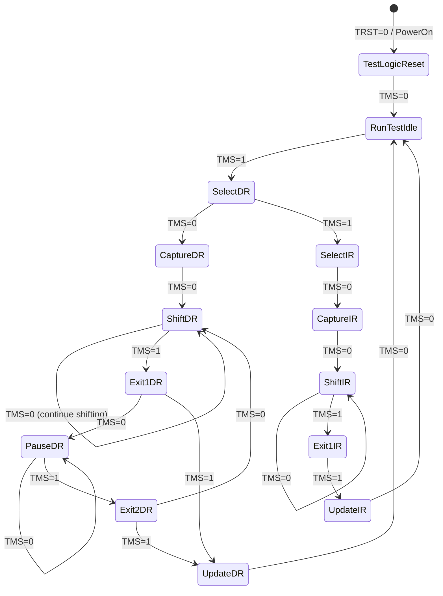

# JTAG 基础认知与 TAP 状态机 [I→E]

> **本章学习目标**：
> - 理解 JTAG（Joint Test Action Group） 从边界扫描到通用调试的演进
> - 掌握 TAP（Test Access Port）状态机 的 16 状态转换
> - 了解 IR/DR 扫描链与边界扫描寄存器（BSR）

---

## JTAG 的诞生：从板级测试到芯片调试

---

### <strong>为什么需要 JTAG：测试芯片引脚的"背门"</strong>

JTAG由 IEEE 1149.1标准定义，
1990 年正式发布。

在 JTAG 之前，测试 IC 引脚连通性非常困难：
 
* IC 封装越来越密：QFP、BGA 的引脚无法逐一探测
 
* 多层 PCB：内层走线无法用探针接触
 
* 自动化测试：需要标准化的测试访问方法
 

JTAG 的核心创新：在芯片内部嵌入"边界扫描寄存器"（BSR），每个引脚对应一个寄存器位。通过 JTAG 接口，可以读取/控制每个引脚的状态，实现无需物理探针的板级测试。
 

类比：JTAG 如同"大楼的消防检修通道"——平时不用，但紧急时刻（测试/调试）可以从内部访问每个房间（引脚）的状态。
 

---

### <strong>JTAG 的物理层：5 线接口</strong>

JTAG使用 5 根信号线（通常 4 根必需）：

| 信号 | 方向 | 说明 |
| --- | --- | --- |
| TCK | 主机→目标 | 测试时钟（10~50MHz） |
| TMS | 主机→目标 | 测试模式选择，控制 TAP 状态机 |
| TDI | 主机→目标 | 测试数据输入 |
| TDO | 目标→主机 | 测试数据输出 |
| TRST | 主机→目标 | 测试复位（可选，低电平复位） |

---

### <strong>IR 与 DR：指令寄存器和数据寄存器</strong>

TAP 状态机操作两类寄存器：

| 寄存器 | 长度 | 用途 |
| --- | --- | --- |
| IR（Instruction Register） | 可变（通常 4~16 bit） | 选择要操作的 DR |
| DR（Data Register） | 可变 | 边界扫描、Bypass、设备 ID 等 |

常用 JTAG 指令：
 
* BYPASS：1-bit 旁路，加速链上其他设备访问
 
* EXTEST：外部测试，控制引脚输出/采样输入
 
* SAMPLE/PRELOAD：采样引脚状态，不干扰正常运行
 
* IDCODE：读取设备 32-bit ID
 

---

## 本章小结

| 概念 | 一句话总结 |
| --- | --- |
| JTAG | IEEE 1149.1，边界扫描测试标准 |
| TAP | 测试访问端口，16 状态状态机 |
| TCK/TMS/TDI/TDO | 4 根必需信号线 |
| IR | 指令寄存器，选择 DR |
| DR | 数据寄存器，边界扫描/设备 ID |
| BYPASS | 1-bit 旁路指令 |

---

## 练习

1. 画出 TMS=1,1,1,1,1 序列下 TAP 状态机的完整转换路径。
2. 为什么 JTAG 链上多个设备时，BYPASS 指令能加速访问目标设备？
3. 在 JTAG 边界扫描中，EXTEST 和 SAMPLE 指令的区别是什么？
