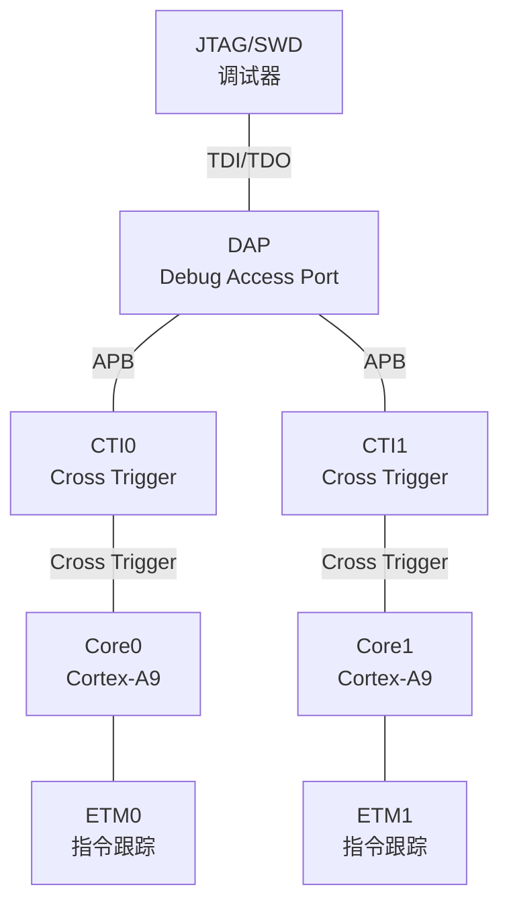
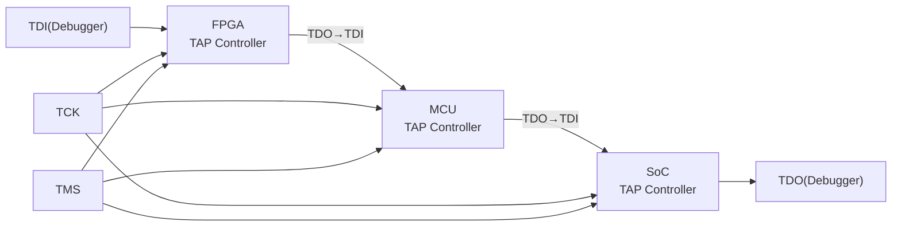

# JTAG 嵌入式实战 [I]

> **本章学习目标**：
> - 理解 ARM Cortex-A 调试的 CoreSight 组件与调试流程
> - 掌握 JTAG 链的菊花链接线与信号完整性设计
> - 了解调试信号的电气参数与高速 PCB 走线要求

---

## ARM Cortex-A 调试

---

### <strong>CoreSight 调试架构</strong>

I 
ARM Cortex-A 系列处理器集成 CoreSight 调试组件，包括 DAP（Debug Access Port）、ETM（Embedded Trace Macrocell）与 ITM（Instrumentation Trace Macrocell）。 

CoreSight 如同调试系统的"神经中枢"——DAP 是脊髓（连接外部），CTI 是交叉神经（核心间同步），ETM 是运动记录仪（指令追踪）。 

<strong>1. DAP 结构</strong> 
* DP（Debug Port）：JTAG-DP 或 SWJ-DP，连接外部调试器。 
* AP（Access Port）：MEM-AP 访问系统总线，APB-AP 访问调试组件。 

<strong>2. 调试流程</strong> 
* 连接调试器 → 扫描 JTAG 链识别 DAP → 通过 DAP 访问 ROM Table → 发现核心与组件。 
* 设置断点/观察点 → 执行程序 → 触发断点 → 读取寄存器与内存。 

---

## JTAG 链配置

---

### <strong>菊花链拓扑与信号走线</strong>

I 
JTAG 链 采用菊花链拓扑，多个芯片的 TMS/TCK 并联，TDI/TDO 串联。 

**表 4-1：JTAG 链信号参数**

| 参数 | 建议值 | 说明 |
| --- | --- | --- |
| TCK 频率 | ≤ 20 MHz | 受限于链中最慢 TAP |
| TCK 上升时间 | ≤ 5 ns | 过缓导致时序 violation |
| TDI/TDO 延迟 | ≤ 1/2 TCK 周期 | 保证建立时间 |
| TMS 建立时间 | ≥ 5 ns | 相对 TCK 上升沿 |
| 链上 TAP 数 | ≤ 8 | 过多增加延迟与功耗 |

<strong>3. BYPASS 指令优化</strong> 
* 访问链中某芯片时，其他芯片加载 BYPASS 指令（IR=全1），TDI→TDO 仅经过1位移位寄存器。 
* 显著减少链延迟，提高 TCK 频率。 

---

## 信号完整性

---

### <strong>高速 JTAG 信号设计</strong>

I 
JTAG 信号完整性 在高速调试场景（>10 MHz）中至关重要，需关注反射、串扰与地弹。 

**表 4-2：信号完整性参数**

| 参数 | 要求 | 设计建议 |
| --- | --- | --- |
| 阻抗匹配 | 50 Ω ± 10% | 串联端接电阻 22~33 Ω |
| 走线长度 | TCK ≤ 150 mm | 过短可 accept，过长需仿真 |
| TCK-TMS 延迟差 | ≤ 2 mm | 等长布线 |
| 串扰隔离 | ≥ 3W | W 为走线宽度 |
| 地孔密度 | 每 10 mm 一个过孔 | 减少地弹 |

<strong>4. 端接电阻设计</strong> 
* 串联端接：驱动端串 22~33 Ω 电阻，匹配走线阻抗。 
* 并联端接：接收端并 50 Ω 到地，功耗大，一般不推荐。 
* TCK 端接尤为重要，反射会导致时钟抖动。 

<strong>5. 调试连接器选型</strong> 

| 连接器 | 引脚数 | 适用场景 | 优点 |
| --- | --- | --- | --- |
| IDC 10-pin | 10 | 低速/开发板 | 成本低 |
| ARM 20-pin Cortex | 20 | Cortex-M/A | 紧凑，含 SWO/TRACE |
| MIPI 60-pin | 60 | 多核+TRACE | 全功能 |
| Tag-Connect | 6 | 量产烧录 | 弹簧针，省空间 |

---

## 本章小结

| 小节 | 核心要点 |
| --- | --- |
| ARM Cortex-A 调试 | DAP+CTI+ETM CoreSight 组件，APB 总线访问调试寄存器 |
| JTAG 链配置 | 菊花链拓扑，TCK/TMS 并联，TDI/TDO 串联，BYPASS 优化延迟 |
| 信号完整性 | 50Ω阻抗匹配，TCK≤150mm，串联端接22~33Ω，地孔密度 |

---

## 练习

1. **链设计**：设计一个包含 FPGA（IR=10bit）、MCU（IR=5bit）、SoC（IR=4bit）的 JTAG 菊花链。计算访问 SoC 所需的最小 Shift-IR 时钟周期数。

2. **端接计算**：某 TCK 走线 100 mm，特性阻抗 60 Ω，驱动端输出阻抗 20 Ω。计算串联端接电阻的合理取值。

3. **信号分析**：某 JTAG 调试在 16 MHz 下偶发误识别 IR 值。列出 3 个可能的信号完整性原因及排查方法。
