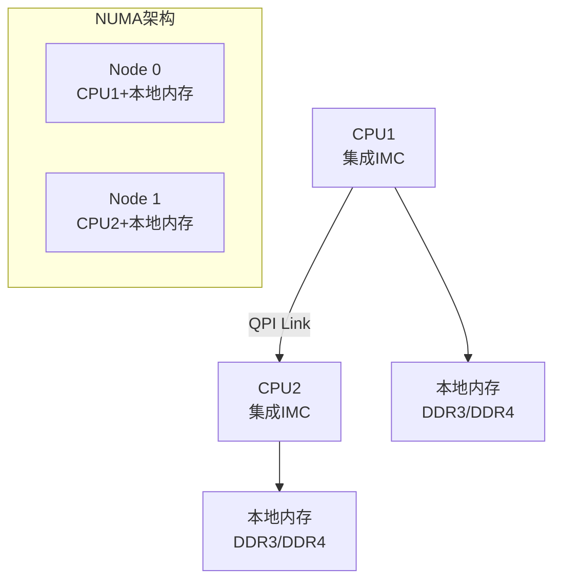

# QPI 与 OPI 基础认知与互联 [M]

> **本章学习目标**：
> - 理解 QPI（QuickPath Interconnect） 从 FSB 演进的动机
> - 掌握 OPI（On-Package Interconnect） 的片外内存扩展原理
> - 了解 Intel UPI/AMD Infinity Fabric 的现代演进

---

## QPI 的诞生：FSB 的终结

---

### <strong>为什么需要 QPI：FSB 的带宽瓶颈</strong>

QPI由 Intel 在 2008 年发布，
随 Nehalem 架构（Core i7）一同推出。

在 QPI 之前，Intel 使用 FSB（Front Side Bus）：
 
* CPU 和北桥（MCH）共享一条总线
 
* 所有内存访问都通过 FSB
 
* 多核 CPU 共享 FSB 带宽，成为瓶颈
 

QPI 将内存控制器集成到 CPU 内部，CPU 之间通过 QPI 互联，每个 CPU 直连本地内存，彻底消除 FSB 瓶颈。
 

类比：FSB 如同"单行道连接市中心和郊区"——所有车辆（数据）都必须经过这条路；QPI 如同"城市快速路网络"——每个区（CPU）有自己的主干道（本地内存），区与区之间有专用高架桥（QPI）连接。
 

---

### <strong>QPI 的物理层：20 对差分线</strong>

QPI每个端口使用 20 对差分线：

| 信号组 | 对数 | 方向 | 说明 |
| --- | --- | --- | --- |
| TX | 20 | 发送 | 16 数据 + 4 控制 |
| RX | 20 | 接收 | 16 数据 + 4 控制 |
| 总计 | 40 | 全双工 | 单端口 84 引脚 |

QPI 采用 NUMA（Non-Uniform Memory Access）架构：访问本地内存快，访问远程内存需通过 QPI 跳转，延迟更高。
 

---

### <strong>从 QPI 到 UPI：Intel 的迭代演进</strong>

| 版本 | 年份 | 速率 | 关键改进 |
| --- | --- | --- | --- |
| QPI 1.0 | 2008 | 4.8 GT/s | 替代 FSB |
| QPI 1.1 | 2010 | 6.4 GT/s | 缓存一致性优化 |
| QPI 2.0 | 2013 | 8.0 GT/s | 支持更多核心 |
| UPI | 2017 | 10.4 GT/s | 替代 QPI，Skylake-SP |

UPI（Ultra Path Interconnect）是 QPI 的后继者，用于 Skylake-SP 及之后的 Xeon 处理器，速率更高，协议更优化。
 

---

## OPI：片外内存的低成本扩展

---

### <strong>OPI 的定位：引脚受限时的内存方案</strong>

OPI（On-Package Interconnect）是 Intel 为低功耗平台设计的内存接口：
 
* 用于 Atom/Celeron 等低成本处理器
 
* 引脚数比 DDR 少，封装成本更低
 
* 支持 LPDDR 和宽 I/O DRAM
 

| 接口 | 引脚数 | 速率 | 应用场景 |
| --- | --- | --- | --- |
| DDR4 | 288 | 25.6 GB/s | 桌面/服务器 |
| LPDDR4 | 200 | 34.1 GB/s | 笔记本/平板 |
| OPI | 100 | 4.8 GB/s | 嵌入式/IoT |
| Wide I/O | 300+ | 12.8 GB/s | 3D 堆叠 |

---

## 本章小结

| 概念 | 一句话总结 |
| --- | --- |
| QPI | Intel 2008 年推出的 CPU 互联总线，替代 FSB |
| UPI | QPI 的后继者，Skylake-SP 使用，速率更高 |
| NUMA | 非均匀内存访问，本地内存快，远程内存慢 |
| OPI | Intel 低成本片外内存接口，引脚少 |
| Infinity Fabric | AMD 的 CPU/GPU 互联方案，类似 QPI |

---

## 练习

1. 为什么 QPI 采用 NUMA 架构而不是统一的共享内存？画出对比拓扑。
2. QPI 的 20 对差分线中，16 对数据 + 4 对控制分别传输什么？
3. 在嵌入式 SoC 中，OPI 相比标准 DDR 接口的优势和劣势各是什么？
